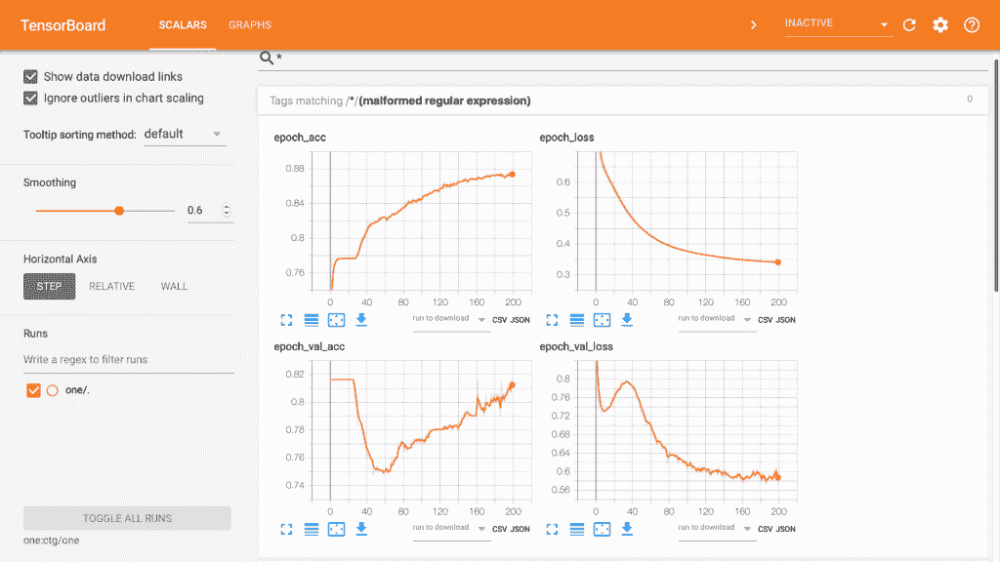
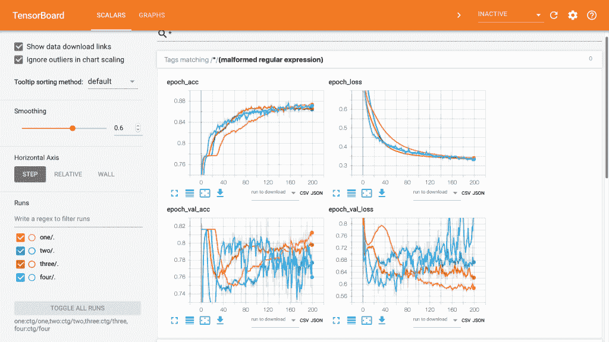
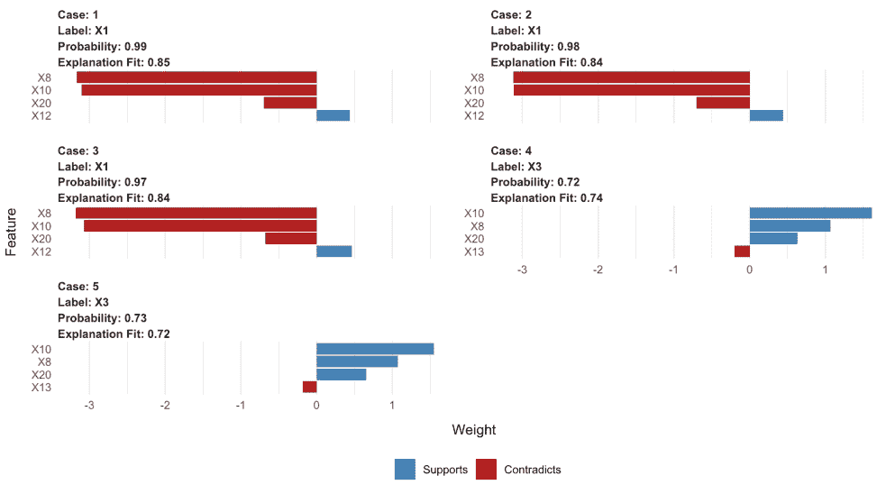
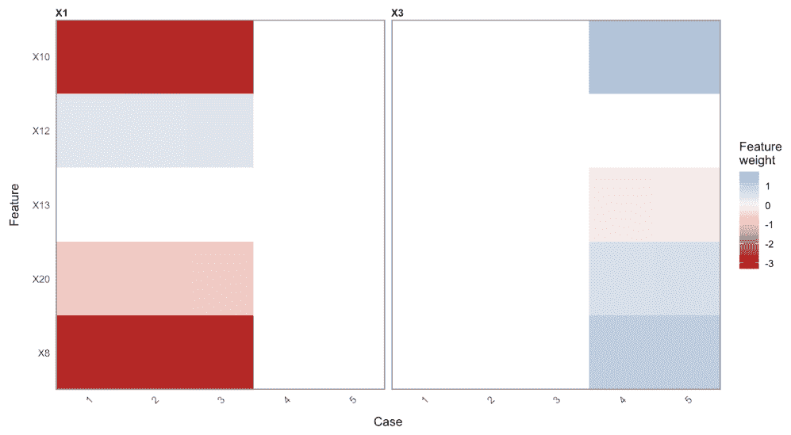
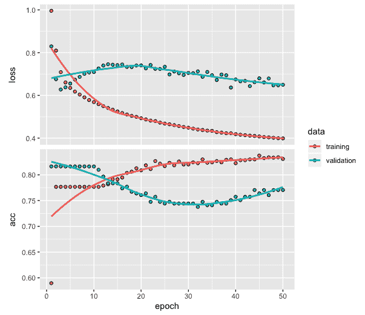
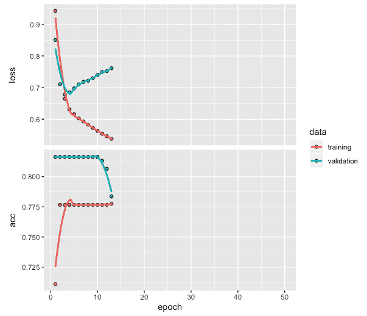

# 提示、技巧与前进的道路

在本书中，我们介绍了如何应用各种深度学习网络来开发预测和分类模型。我们所介绍的一些技巧和方法是针对特定应用领域的，并帮助我们在开发的模型中实现更好的预测或分类性能。

在本章中，我们将介绍一些技巧和方法，这些方法在你将这些方法应用于新数据和不同问题时将非常有用。我们将涵盖四个主题。请注意，这些方法在之前的章节中没有介绍，但我们将利用其中的一些示例来说明它们的使用。

在本章中，我们将涵盖以下主题：

+   用于训练性能可视化的 TensorBoard

+   使用 LIME 可视化深度网络模型

+   使用 tfruns 可视化模型训练

+   网络训练的提前停止

# 用于训练性能可视化的 TensorBoard

对于可视化深度网络训练性能，TensorBoard 是一个有用的工具，作为 TensorFlow 包的一部分提供。我们将重新运行在第二章，*多类分类的深度神经网络*中使用的深度网络模型，在那里我们使用 CTG 数据开发了一个用于患者的多类分类模型。有关数据处理、模型架构以及编译模型的代码，请参考第二章，*多类分类的深度神经网络*。

以下是来自第二章，*多类分类的深度神经网络*的 `model_one` 代码：

```py
# Fitting model and TensorBoard
setwd("~/Desktop/")
model_one <- model %>% fit(training, 
                         trainLabels, 
                         epochs = 200,  
                         batch_size = 32,
                         validation_split = 0.2,
                         callbacks = callback_tensorboard('ctg/one'))
tensorboard('ctg/one')
```

从前面的代码中，我们可以观察到以下内容：

+   我们已经设置了一个工作目录，这将是存储训练模型结果并在 TensorBoard 上进行可视化的桌面。

+   该模型使用额外的特征回调进行拟合，我们使用 `callback_tensorboard` 函数将数据存储在桌面的 `ctg/one` 文件夹中，以便稍后进行可视化。

+   请注意，`ctg` 目录在模型拟合时会自动创建。

+   最后，`tensorboard` 函数用于可视化存储在 `ctg/one` 文件夹中的数据。

以下截图是 TensorBoard 的内容：



上面的截图显示了训练和验证数据在 200 个周期中的损失和准确率图。这用于训练模型。TensorBoard 上的这个可视化是交互式的，为用户提供了额外的选项，使他们可以在训练过程中探索和理解模型的表现。

正如我们在本书的所有章节中所看到的，所有介绍了各种深度学习方法的章节，都表明提高分类或预测模型的性能需要广泛的实验。为了帮助这种实验，一个使用 TensorBoard 的关键好处是，它允许通过交互式可视化非常轻松地比较模型的性能。

我们从第二章“*多类分类的深度神经网络*”中运行了三个模型，并将模型训练数据存储在`ctg`文件夹的`two`、`three`和`four`子文件夹中。运行以下代码以进行 TensorBoard 可视化：

```py
# TensorBoard visualization for multiple models
tensorboard(c('ctg/one', 'ctg/two', 'ctg/three', 'ctg/four'))
```

上述代码为所有四个模型创建了 TensorBoard 可视化。以下是生成的 TensorBoard 页面的截图：



上述可视化展示了所有四个模型的训练和验证数据的损失值和准确率。以下是我们可以从该图表中得出的几点观察：

+   运行的四个模型的结果以不同的颜色呈现，便于我们快速识别并进行比较。

+   基于验证数据的损失和准确率值比训练数据所显示的结果变化更大。

+   还提供了下载任何图表或相关数据的选项。

可视化具有不同参数值的不同模型，在我们选择深度网络的架构类型、训练轮次、批次大小以及其他感兴趣的模型相关属性时非常有用。它还可以在需要时为我们提供进一步实验的方向，并帮助我们比较当前与过去的结果。

# 使用 LIME 进行深度网络模型可视化

在我们目前为止在本书中提供的应用示例中，开发分类或预测深度网络模型后，我们进行可视化以查看模型的整体表现。这些评估是使用训练数据和测试数据进行的。这种评估的主要目的是获得对模型表现的整体或全局理解。然而，有时我们希望获得更深入的理解，甚至是针对特定预测的解释。例如，我们可能会对理解哪些主要特征或变量影响了测试数据中的特定预测感兴趣。这样的“局部”解释是**局部可解释模型无关解释**（**LIME**）包的重点。LIME 可以帮助我们深入了解每个预测。

用于在 Keras 中进行 LIME 可视化的代码如下：

```py
# LIME package
library(lime)

# Using LIME with keras
model_type.keras.engine.sequential.Sequential <- 
function(x, ...) {"classification"}
predict_model.keras.engine.sequential.Sequential <- 
  function(x,newdata,type, ...) {p <- predict_proba(object=x, x=as.matrix(newdata))
         data.frame(p)}

# Create explainer using lime
explainer <- lime(x = data.frame(training), 
             model = model, 
             bin_continuous = FALSE)

# Create explanation
explanation <- explain(data.frame(test)[1:5,],  
                  explainer    = explainer, 
                  n_labels     = 1,  
                  n_features   = 4,  
                  kernel_width = 0.5)
testtarget[1:5]
[1] 0 0 0 2 2
```

如前面的代码所示，我们使用两个函数以便能在 Keras 模型中使用 LIME。在第一个函数中，我们指明将处理的是分类模型。第二个函数用于获取预测概率。在这一部分，我们将使用第二章中的`model_one`，*深度神经网络与多分类问题*。然后，我们将使用`lime`函数与训练数据、模型（即`model_one`），并指定连续变量的分箱为`FALSE`。生成的解释器将与`explain`函数一起使用，在这里我们将指定使用一个标签，并指定每个病例使用四个最重要的特征。我们将核宽度指定为 0.5。我们还可以看到，测试数据中的前三位患者被标记为 0 类，表示他们属于正常患者类别。同样，测试数据中的第 4 和第 5 位患者被标记为 2 类，表示他们属于病理患者类别。

我们通过`plot_features(explanation)`获得了以下图表：



上面的图表提供了测试数据中前五位患者的个别图表。以下是从这个图表中可以做出的一些观察：

+   所有五位患者都已被正确分类。

+   前三位患者被归类为 0 类，代表正常患者。

+   剩余的两位患者被归类为 2 类，代表病理患者。

+   前三例的预测概率为 0.97 或更高，而第 4 和第 5 位患者的预测概率为 0.72 或更高。

+   该图表显示了对每位患者具体分类起到关键作用的四个最重要特征。

+   具有蓝色条形的特征支持模型的结论，而具有红色条形的特征则与模型的结论相矛盾。

+   X8、X10 和 X20 变量的较高值似乎对患者被分类为病理性具有更大的影响。

+   X12 变量的较高值似乎影响患者被分类为正常。

以下热图可以通过`plot_explanations(explanation)`获得：



我们可以从之前的热图中做出以下观察：

+   热图使得比较每位患者的不同变量变得更容易，从而有助于理解。

+   它总结了病例、特征和标签组合的结果，并不像前面的图那样提供详细信息。

+   对于 X1 类，或标记为正常的患者（1、2 和 3），所有四个特征（X8、X10、X12 和 X20）具有非常相似的权重。

+   对于 X3 类，或标记为病理的患者（第 4 和第 5 位），所有四个特征（X8、X10、X13 和 X20）具有大致相似的权重。

# 使用`tfruns`可视化模型训练

当我们使用 Keras 运行深度网络模型时，可以使用`tfruns`来可视化损失和准确度图表，以及其他与模型相关的总结。尽管我们也可以在需要时获得图表和相关总结，但使用`tfruns`的主要优势在于我们可以将它们都集中在一个地方。我们可以使用以下代码来实现这一点：

```py
library(tfruns)
training_run("mlp_ctg.R")
```

在前面的代码中，引用的`R`文件包含了从第二章运行`model_one`的代码，*深度神经网络与多类分类*。当我们运行代码时，`mlp_ctg.R`文件可能会存储在计算机中。代码运行后，以下交互式屏幕会自动显示：


在前述屏幕截图中显示的页面提供了以下内容：

+   训练和验证数据的损失值和准确度值的交互式图表

+   基于模型架构的模型总结

+   关于运行的信息，包括完成所有纪元所需的时间

+   基于训练和验证数据的准确度和损失值的数字总结

+   使用的样本、指定的纪元数以及批处理大小

# 提前停止网络训练

在训练网络时，我们事先指定所需的纪元数，而不知道实际需要多少纪元。如果我们指定的纪元数少于实际所需的纪元数，可能需要通过指定更多的纪元来重新训练网络。另一方面，如果我们指定的纪元数远超过实际需要的数目，则可能会导致过拟合情况，我们可能需要通过减少纪元数来重新训练网络。这种试错法对于每个纪元需要较长时间才能完成的应用来说可能非常耗时。在这种情况下，我们可以使用回调函数，帮助在合适的时机停止网络训练。

为了说明这个问题，让我们使用以下代码，基于第二章中的 CTG 数据，*深度神经网络与多类分类*，开发一个分类模型：

```py
# Training network for classification with CTG data (chapter-2)
model <- keras_model_sequential()
model %>% 
  layer_dense(units = 25, activation = 'relu', input_shape = c(21)) %>%
  layer_dense(units = 3, activation = 'softmax') 
model %>% compile(loss = 'categorical_crossentropy', 
                  optimizer = 'adam',
                  metrics = 'accuracy')
history <- model %>% fit(training, 
                         trainLabels, 
                         epochs = 50,  
                         batch_size = 32,
                         validation_split = 0.2)
plot(history)
```

在前面的代码中，我们已将纪元数指定为 50。训练过程完成后，我们可以绘制训练和验证数据的损失值和准确度值，如下所示：



从前面的图表中，我们可以观察到以下内容：

+   我们可以观察到，验证数据的损失值最初在前几个纪元中下降，然后开始增加。

+   图表还显示，在前几个纪元后，训练和验证数据的损失值开始出现分歧，并趋向于相反的方向。

+   如果我们希望提前停止训练过程，而不是等待 50 个训练周期完成，我们可以使用 Keras 提供的回调功能。

以下代码在训练网络时包含了回调特性，位于 `fit` 函数中：

```py
# Training network with callback
model <- keras_model_sequential()
model %>% 
  layer_dense(units = 25, activation = 'relu', input_shape = c(21)) %>%
  layer_dense(units = 3, activation = 'softmax') 
model %>% compile(loss = 'categorical_crossentropy', 
                  optimizer = 'adam',
                  metrics = 'accuracy')
history <- model %>% fit(training, 
                         trainLabels, 
                         epochs = 50,  
                         batch_size = 32,
                         validation_split = 0.2,
                         callbacks = callback_early_stopping(monitor = "val_loss", 
                                                   patience = 10))
plot(history)
```

在之前的代码中，回调函数已包括在内，用于实现早期停止：

+   我们用于监控的度量标准是验证损失值。另一种可以尝试的度量标准是验证准确率，因为我们正在开发一个分类模型。

+   我们已将耐心值设定为 10，这意味着在 10 个训练周期没有改进时，训练过程将自动停止。

损失值和准确率的图表同样有助于我们决定合适的耐心值。以下是损失值和准确率的图表：



正如我们所看到的，这次训练过程并没有运行完所有 50 个训练周期，而是在损失值连续 10 个周期没有改进时停止了。

# 总结

使用深度学习网络开发分类和预测模型涉及大量实验，以获得高质量的性能模型。为了帮助这个过程，有多种方法非常有助于可视化和控制网络训练。在本章中，我们介绍了四种非常有用的方法。我们看到，TensorBoard 提供了一个工具，可以在训练网络时通过不同的架构和其他模型变化来评估和比较模型的性能。使用 TensorBoard 的优势在于它能够将所有必要的信息以用户友好的方式集中展示在一个地方。有时我们还希望了解在使用分类或预测模型时，特定预测中主要特征或变量是如何受到影响的。在这种情况下，我们可以使用 LIME 来可视化主要特征的影响。

本章中我们介绍的另一个有用技巧是通过 tfruns 实现可视化。在开发深度网络模型时，我们会遇到与特定模型相关的各种图表和摘要。使用 tfruns，我们可以借助互动界面将所有信息可视化地展示在一个地方。另一个在接下来的旅程中非常有用的技巧是使用回调函数，当开发出合适的分类或预测模型时，自动停止训练过程。本章中讨论的所有方法对于接下来的工作都非常有帮助，特别是在你处理复杂且具有挑战性的问题时。
