# 12

# 深度卷积 Q 学习

现在你已经了解了**人工神经网络**（**ANNs**）是如何工作的，你可以开始学习一个非常有用的工具，它主要用于处理图像——**卷积神经网络**（**CNNs**）。简单来说，CNN 使得你的 AI 可以像有眼睛一样实时“看到”图像。

我们将通过以下步骤来处理它们：

1.  CNN 的应用是什么？

1.  CNN 是如何工作的？

1.  卷积

1.  最大池化

1.  扁平化

1.  完全连接

一旦你理解了这些步骤，你就能理解 CNN，以及它们如何在深度卷积 Q 学习中发挥作用。

## CNN 的应用是什么？

CNN 主要用于图像或视频，有时也用于处理文本以解决**自然语言处理**（**NLP**）问题。它们通常用于物体识别，例如预测一张图片或视频中是猫还是狗。它们还经常与深度 Q 学习一起使用（我们稍后将讨论），当环境返回自身的二维状态时，例如当我们尝试构建一个可以读取周围摄像头输出的自动驾驶汽车时。

记得在*第九章*，“使用人工大脑走向专业——深度 Q 学习”中，我们预测了房价。作为输入，我们有定义房子的所有值（面积、年龄、卧室数量等），作为输出，我们有房子的价格。在 CNN 的情况下，事情非常相似。例如，如果我们想用 CNN 解决同样的问题，我们将以房子的图像作为输入，房价作为输出。

这个图应该能说明我的意思：

图 1：输入图像 – CNN – 输出标签

如你所见，输入的是一张图像，图像流经 CNN 并作为输出产生结果。在这个图中，输出是与图像对应的类别。什么是类别？例如，如果我们想预测输入的图像是笑脸还是悲伤的面孔，那么一个类别就是*笑脸*，另一个类别就是*悲伤面孔*。我们的输出应该能够正确判断输入图像对应的类别。

说到快乐和悲伤的面孔，这里有一个更详细的图示：

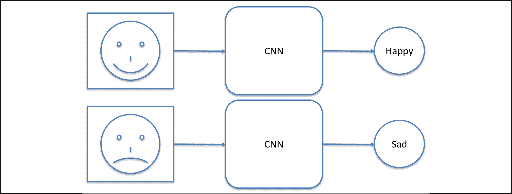

图 2：两个不同的类别预测（快乐或悲伤）

在前面的例子中，我们通过 CNN 处理了两张图像。第一张是笑脸，另一张是悲伤的面孔。正如我之前提到的，我们的网络预测图像是快乐面孔还是悲伤面孔。

我能想象你现在在想什么：这一切是怎么运作的？我们所说的这个黑盒子——CNN，里面到底是什么？我将在接下来的章节中回答这些问题。

## CNN 是如何工作的？

在我们深入探讨 CNN 的结构之前，我们需要理解几个要点。我将通过一个问题引导你了解第一个要点：一个彩色 RGB 图像有多少个维度？

答案可能会让你吃惊：是 3！

为什么？因为每个 RGB 图像实际上由三张 2D 图像表示，每张图像对应 RGB 结构中的一个颜色。因此，红色对应一张图像，绿色对应一张图像，蓝色对应一张图像。灰度图像只有 2D，因为它们只由一个灰度值表示，没有颜色。下面的图示应该能让这一点更加清晰：

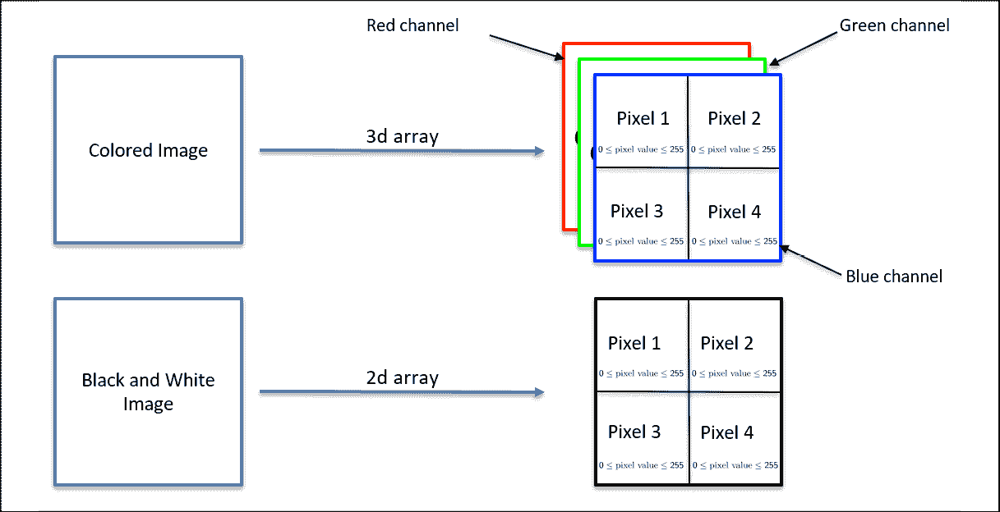

图 3：RGB 图像与黑白图像的对比

正如你所看到的，一张彩色图像由 3D 数组表示。每种颜色在图像中有自己的层，这层被称为**通道**。而灰度（黑白）图像只有一个通道，因此它是一个 2D 数组。

正如你所知，图像是由像素组成的。每个像素都由一个介于 0 到 255 之间的数值表示，其中 0 表示关闭的像素，255 表示完全亮起的像素。理解这一点很重要：当我们说一个像素的值是（255，255，0）时，这意味着这个像素在红色和绿色通道上完全亮起，而在蓝色通道上是关闭的。

从现在起，为了更好地理解一切，我们将处理非常简单的图像。实际上，我们的图像将是灰度图像（1 个通道，2D），像素将是完全亮起的或关闭的。为了让图像更容易读取，我们将关闭的像素（黑色）赋值为 1，完全亮起的像素（白色）赋值为 0。

回到悲伤和快乐面孔的例子，这就是我们用 2D 数组表示的快乐面孔的样子：

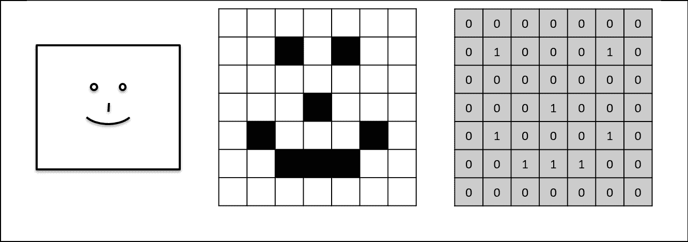

图 4：像素表示

正如你所看到的，我们有一个数组，其中**0**表示白色像素，**1**表示黑色像素。右边的图片是我们用数组表示的笑脸。

现在我们已经理解了基础知识，并且简化了问题，我们准备好迎接卷积神经网络（CNN）的挑战了。为了完全理解它们，我们需要将学习内容分为组成 CNN 的四个步骤：

1.  卷积

1.  最大池化

1.  扁平化

1.  全连接

现在，我们将逐一了解这四个步骤。

### 步骤 1 – 卷积

这是每个卷积神经网络（CNN）中的第一个关键步骤。在卷积操作中，我们将一种叫做**特征检测器**的东西应用于输入的图像。为什么我们要这么做呢？因为所有图像都包含一些特定的特征，这些特征定义了图像中的内容。例如，要识别哪个面部表情是悲伤的，哪个是快乐的，我们需要理解嘴巴的形状，这就是图像中的一个特征。从图示中理解这个更为清晰：

图 5：步骤 1 – 卷积（1/5）

在上面的图中，我们应用了一个特征检测器，也就是一个滤波器，作用于我们输入的笑脸图像。如你所见，滤波器是一个包含一些值的二维数组。当我们将这个特征检测器应用到图像上时，它覆盖了（在这个例子中是 3 x 3 网格）。我们检查图像的这一部分有多少像素与滤波器的像素匹配。然后，我们把这个数字放入一个新的二维数组，称为**特征图**。换句话说，图像的某一部分与特征检测器匹配得越多，我们就将越高的数字放入特征图中。

接下来，我们*滑动*特征检测器遍历整张图像。在下一次迭代中，会发生这样的情况：

图 6：步骤 1 – 卷积（2/5）

如你所见，我们将滤波器向右滑动了一格。这次，滤波器和图像中的这一部分有一个像素匹配。这就是为什么我们在特征图中放置**1**的原因。

你觉得当我们碰到这张图像的边界时会发生什么？你会怎么做？我将通过这两个图示给你展示：

图 7：步骤 1 – 卷积（3/5）

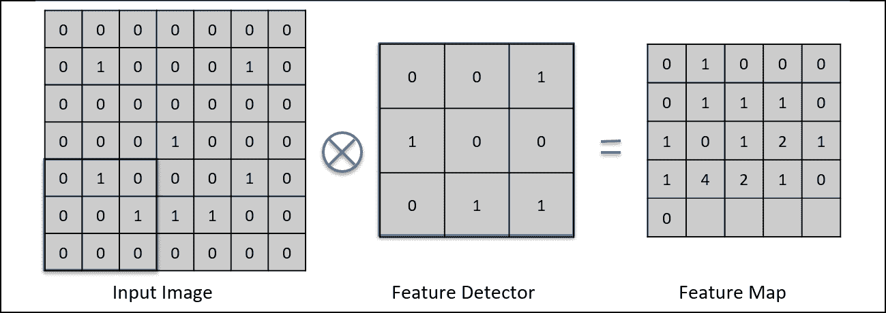

图 8：步骤 1 – 卷积（4/5）

这里，我们正好遇到了这种情况：在第一张图像中，我们的滤波器碰到了边界。结果我们的特征检测器会直接*跳跃*到下一行。

如果我们只有一个滤波器，卷积的所有魔法都无法奏效。实际上，我们使用多个滤波器，产生多个不同的特征图。这组特征图被称为**卷积层**，或者**卷积神经层**。下面是一个总结图：

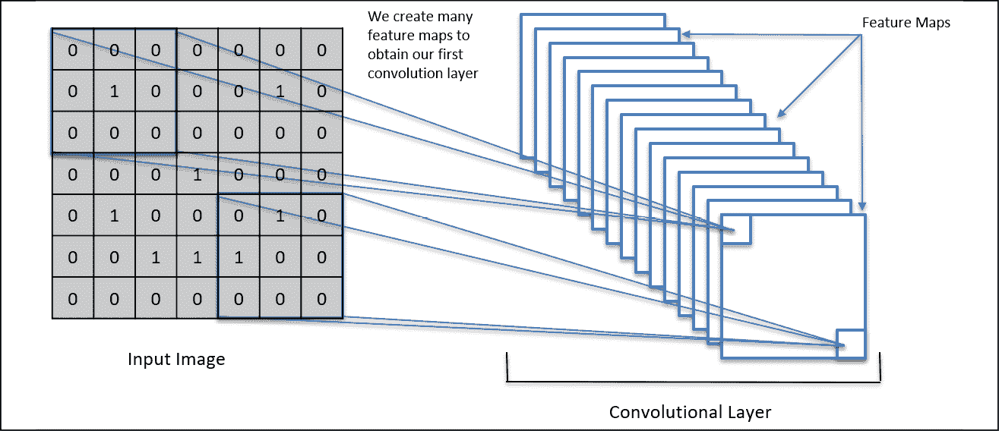

图 9：步骤 1 – 卷积（5/5）

这里，我们可以看到一张输入图像，已经应用了多个滤波器。所有这些滤波器一起创建了一个卷积层，由多个特征图组成。这是构建卷积神经网络（CNN）的第一步。

现在我们理解了卷积操作，我们可以继续进行另一个重要的步骤——最大池化。

### 步骤 2 – 最大池化

在卷积神经网络（CNN）中，这一步骤负责降低每个特征图的大小。在处理神经网络时，我们不希望输入数据过多，否则我们的网络由于复杂性过高，无法正常学习。因此，需要引入一种叫做**最大池化**的尺寸缩减方法。它让我们在不丢失重要特征的情况下减少大小，并且使特征对位移（平移和旋转）具有部分不变性。

从技术上讲，最大池化算法也基于一个数组滑动整个特征图。在这种情况下，我们不是在寻找任何特征，而是寻找特征图中特定区域的最大值。

让我通过这个图形给你展示我是什么意思：

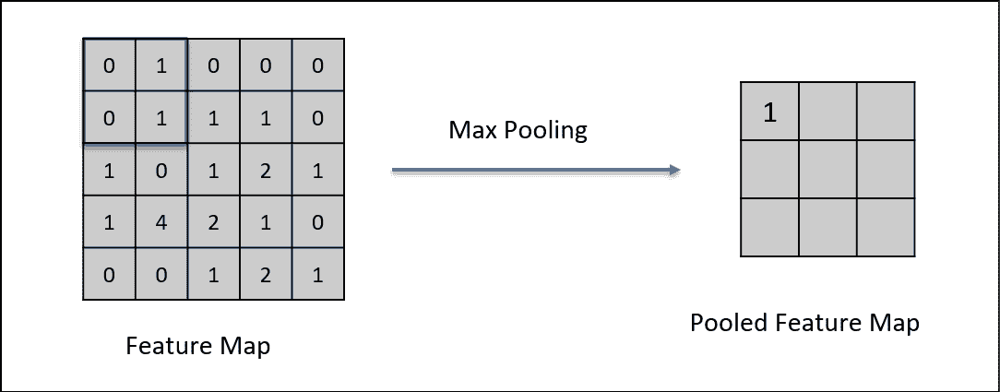

图 10：步骤 2 – 最大池化（1/5）

在这个例子中，我们正在使用之前卷积步骤得到的特征图，然后通过最大池化进行处理。正如你所看到的，我们有一个大小为 2 x 2 的窗口，寻找它覆盖部分特征图中的最大值。在这个例子中，最大值是 1。

你能预测下一次迭代会发生什么吗？

正如你可能已经猜到的，这个窗口将滑动到右边，尽管方式与之前稍有不同。它的移动方式如下：

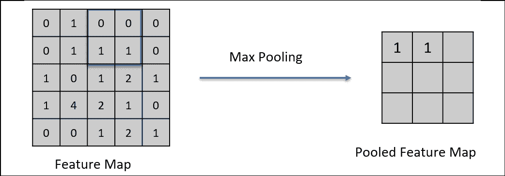

图 11：步骤 2 – 最大池化（2/5）

这个窗口*跳跃*到右边，我希望你记得，这与卷积步骤不同，在卷积步骤中，特征检测器一次滑动一个单元格。在这个例子中，最大值也是 1，因此我们在**池化特征图**中写下**1**。

这次当我们碰到特征图的边界时，会发生什么呢？事情再次看起来与之前有所不同。发生的情况是：

图 12：步骤 2 – 最大池化（3/5）

窗口穿越边界，寻找特征图中仍然在最大池化窗口内的部分的最大值。再次地，最大值是 1。

那现在会发生什么呢？毕竟，右边已经没有空间可走了。而且底部左侧只有一行可以进行最大池化。算法会这样做：

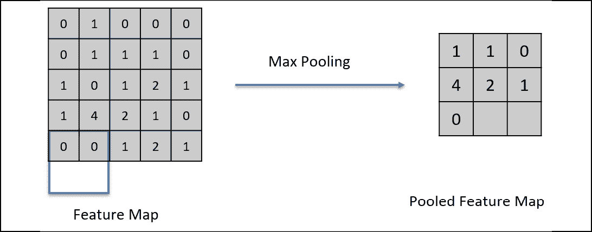

图 13：步骤 2 – 最大池化（4/5）

如我们所见，它再次穿越边界，寻找窗口内部的最大值。在这个例子中，最大值是 0。这个过程会一直重复，直到窗口碰到特征图的右下角。为了回顾一下我们目前的卷积神经网络长什么样，可以看看以下的图示：

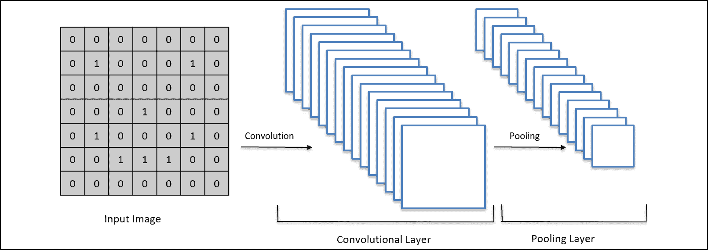

图 14：步骤 2 – 最大池化（5/5）

我们输入了一个笑脸，然后通过卷积获得了许多特征图，这些图被称为卷积层。现在我们已经将所有特征图通过最大池化处理，并获得了许多池化特征图，这些图合起来被称为**池化层**。

现在我们可以继续进行下一步，这将让我们将池化层输入神经网络。这个步骤叫做**扁平化**。

### 步骤 3 – 扁平化

这是一个非常简短的步骤。正如名字所示，我们将所有池化后的特征图从二维数组转换为一维数组。正如我之前提到的，这样做能让我们轻松地将图像输入神经网络。那么，我们到底是如何实现这一点的呢？以下图示应该能帮助你理解：

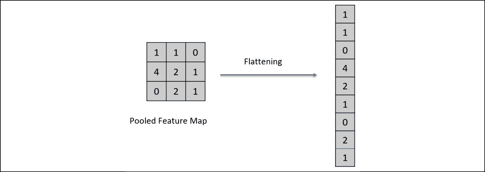

图 15：步骤 3 – 扁平化（1/3）

现在我们回到之前得到的池化特征图。为了扁平化它，我们从左上角开始获取像素值，一直到右下角。像这样的操作会返回一个一维数组，包含与我们最初的二维数组相同的值。

但记住，我们并不是只有一个池化特征图，而是有一整层池化特征图。你认为我们应该怎么处理这些呢？

答案很简单：我们将整个层压缩成一个单一的 1D 扁平数组，一个接一个地放入池化特征图。为什么必须是 1D？因为人工神经网络（ANNs）只接受 1D 数组作为输入。传统神经网络的所有层都是 1D 的，这意味着输入也必须是 1D。因此，我们将所有池化特征图扁平化，像这样：

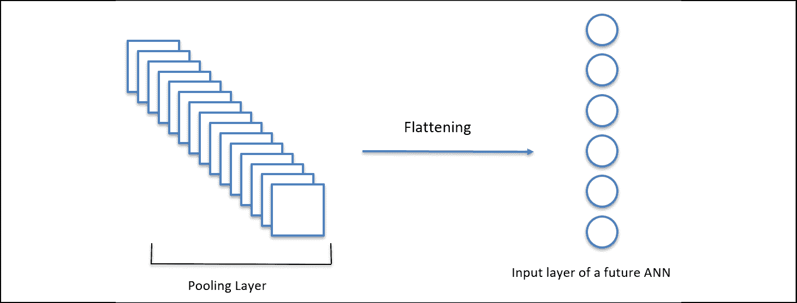

图 16：步骤 3 – 扁平化 (2/3)

我们已经将整个层转换为一个单一的扁平化 1D 数组。我们将很快把这个数组用作传统神经网络的输入。

首先，让我们回顾一下当前模型的结构：

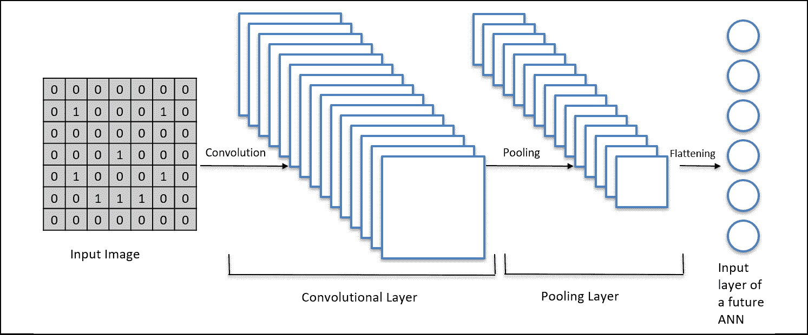

图 17：步骤 3 – 扁平化 (3/3)

所以，我们有一个卷积层、池化层，以及一个新添加的扁平化 1D 层。现在我们可以回到经典的人工神经网络（ANN），即全连接神经网络，并将这个最后的层视为该网络的输入。这引领我们进入最后一步，即**全连接**。

### 步骤 4 – 全连接

创建 CNN 的最后一步是将其连接到经典的全连接神经网络。记住，我们已经有了一个 1D 数组，简明地告诉我们图像的外观，那么为什么不直接将它作为输入传递给全连接神经网络呢？毕竟，是后者能够进行预测。

这正是我们接下来要做的，就像这样：

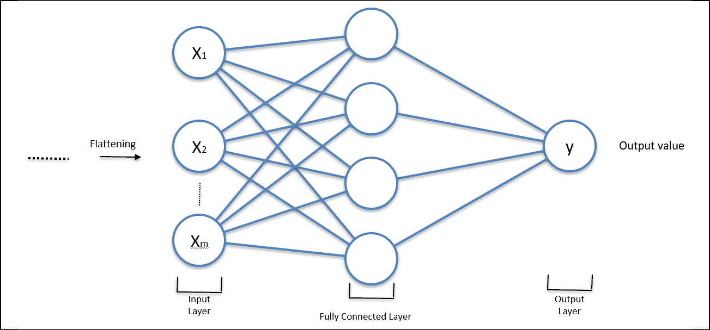

图 18：步骤 4 – 全连接

扁平化后，我们将这些返回的值直接输入到全连接神经网络中，然后得到预测值——输出值。

你可能会想，现在反向传播阶段是如何工作的。在 CNN 中，反向传播不仅更新全连接神经网络中的权重，还更新卷积步骤中使用的滤波器。最大池化和扁平化步骤保持不变，因为那里没有需要更新的内容。

总之，CNN 会寻找一些特定的特征。这也是它们主要在处理图像时使用的原因，因为在图像处理中，特征的搜索至关重要。例如，当尝试识别一个悲伤和一个开心的面孔时，CNN 需要理解哪个嘴巴的形状表示悲伤面孔，哪个表示开心面孔。为了得到输出，CNN 必须执行以下步骤：

1.  **卷积** – 将滤波器应用于输入图像。这个操作将会找到我们 CNN 所需的特征，并将它们保存在特征图中。

1.  **最大池化** – 通过在给定区域内取最大值，来降低特征图的大小，并将这些值保存在一个新的数组中，称为池化特征图。

1.  **扁平化** – 将整个池化层（所有池化特征图）转换为 1D 向量。这将允许我们将这个向量输入到神经网络中。

1.  **全连接** – 创建一个神经网络，它将扁平化的池化层作为输入，并返回我们想要预测的值。这个最后的步骤使我们能够进行预测。

## 深度卷积 Q 学习

在深度 Q 学习（*第九章*，*人工大脑进阶——深度 Q 学习*）的章节中，我们的输入是定义环境状态的编码值的向量。当处理图像或视频时，编码向量并不是描述状态（输入帧）的最佳输入方式，因为编码向量不能保留图像的空间结构。空间结构非常重要，因为它为我们提供更多信息，帮助预测下一个状态，而预测下一个状态对于 AI 学习正确的下一步至关重要。

因此，我们需要保留空间结构。为了做到这一点，我们的输入必须是 3D 图像（对于像素数组来说是 2D，再加上一个额外的维度来表示颜色，正如本章开头所示）。例如，如果我们训练一个 AI 来玩电子游戏，那么输入就是游戏屏幕本身的图像，完全就是人类玩游戏时所看到的内容。

按照这个类比，AI 就像是拥有了人类的眼睛；它在玩游戏时观察屏幕上的输入图像。这些输入图像进入一个 CNN（人类的眼睛），它检测每一幅图像的状态。然后，它们通过池化层进行前向传播，在池化层中应用最大池化。接着，池化层会被展平为 1D 向量，作为我们深度 Q 学习网络的输入（与*第九章*，*人工大脑进阶——深度 Q 学习*中的网络完全相同）。最终，执行相同的深度 Q 学习过程。

以下图示展示了深度卷积 Q 学习在著名游戏《毁灭战士》中的应用：

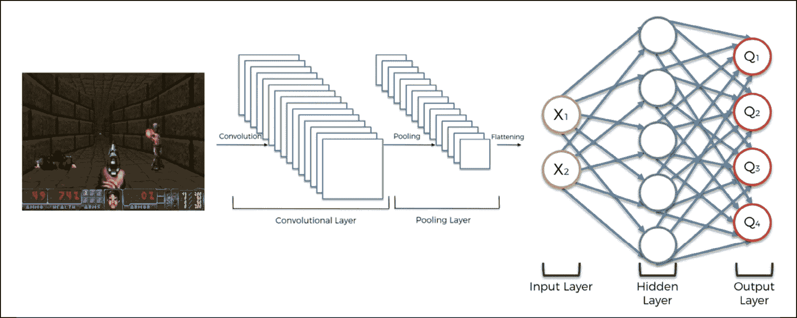

图 19：深度卷积 Q 学习用于《毁灭战士》

总结来说，深度卷积 Q 学习与深度 Q 学习相同，唯一的不同是输入现在是图像，并且在完全连接的深度 Q 学习网络的开始部分加入了 CNN，用于检测这些图像的状态。

## 总结

你已经了解了另一种类型的神经网络——卷积神经网络。

我们已经确定，这个网络主要用于图像，并在这些图像中搜索特定的特征。它使用了三步是 ANNs 没有的额外步骤：卷积，用于搜索特征；最大池化，用于缩小图像大小；以及展平，将 2D 图像展平为 1D 向量，以便将其输入到神经网络中。

在下一章，你将构建一个深度卷积 Q 学习模型，来解决一个经典的游戏问题：贪吃蛇。
