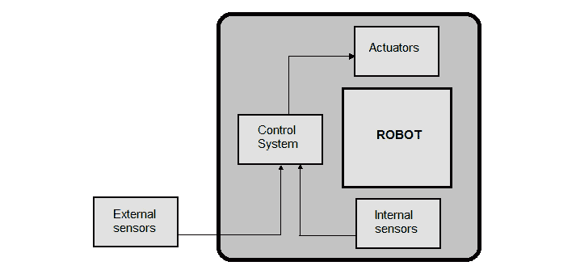
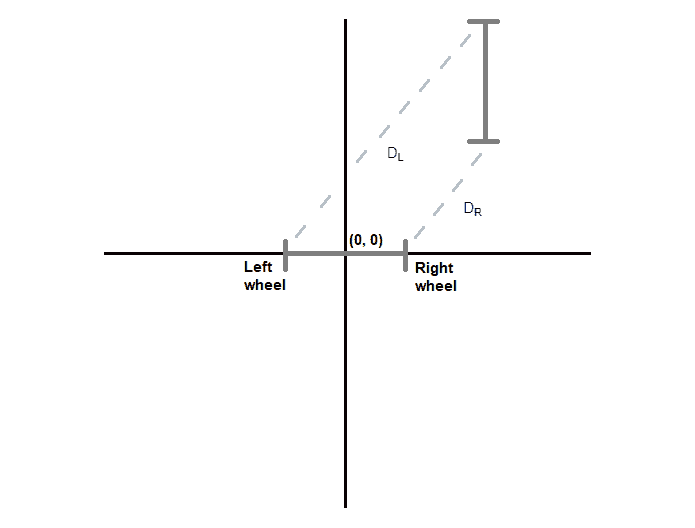
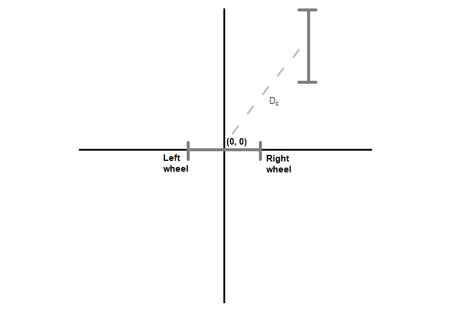
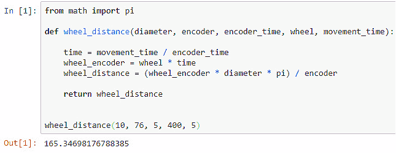
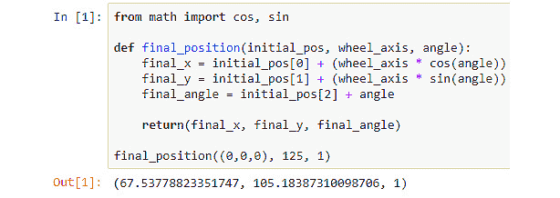

# *第一章*

# 机器人学基础

## 学习目标

在本章结束时，你将能够：

+   描述机器人学历史中的重要事件

+   解释使用人工智能、人工视觉和自然语言处理的重要性

+   根据目标或功能对机器人进行分类

+   识别机器人的各个部分

+   使用里程计估算机器人的位置

本章概述了机器人学的简短历史，分类了不同类型的机器人及其硬件，并解释了如何使用里程计来找到机器人的位置。

## 介绍

机器人学领域代表着人类的现在和未来。目前，工业部门、研究实验室、大学，甚至我们的家庭中都存在机器人。机器人学学科正在不断发展，这也是它值得学习的原因之一。每个机器人都需要有人为其编程。即使是基于人工智能和自我学习的机器人，也需要设置初始目标。发生故障的机器人需要技术人员进行维护，基于人工智能的系统也需要持续的数据输入和监控才能有效运作。

在本书中，你将学习和实践许多有趣的技术，重点是人工计算机视觉、自然语言处理，以及与机器人和模拟器的互动。这将为你在机器人学的一些前沿领域打下坚实的基础。

## 机器人学的历史

机器人学源于创造智能机器以执行人类难以完成的任务的需求。但最初并没有被称为“机器人学”。“机器人”这一术语由捷克作家卡雷尔·恰佩克在他的作品**R.U.R.**（**罗索姆的万能机器人**）中创造。它源自捷克语单词**robota**，意为奴役，指的是强迫劳动。

Čapek 的作品在全球广为人知，"机器人"一词也因此变得家喻户晓，以至于著名的教师和作家艾萨克·阿西莫夫在他的作品中也使用了这个术语；他将机器人学定义为研究机器人及其特征的科学。

这里你可以看到塑造机器人历史的重要事件的时间线：


###### 图 1.1：机器人历史


###### 图 1.2：机器人历史（续）

图 1.1 和 1.2 提供了一个有用的时间线，展示了机器人学的起源和发展。

## 人工智能

**人工智能**指的是一系列旨在赋予机器与人类相同能力的算法。它使机器人能够做出自己的决策、与人类互动，并识别物体。这种智能不仅存在于机器人中，还广泛应用于许多其他领域和系统中（尽管人们可能并未察觉到它）。

已经有许多现实世界中的产品正在使用这种技术。这里列出了一些示例，展示了你可以构建的有趣应用程序：

+   **Siri**：这是由苹果公司创建的语音助手，内置于他们的手机和平板电脑中。Siri 非常实用，因为它连接到互联网，可以即时查找数据、发送信息、查看天气等，功能非常丰富。

+   **Netflix**：Netflix 是一个在线视频影视服务。它基于用户观看历史，通过 AI 开发的非常准确的推荐系统向用户推荐电影。例如，如果用户通常观看浪漫电影，系统将推荐浪漫剧集和电影。

+   **Spotify**：Spotify 是一个类似于 Netflix 的在线音乐服务。它使用推荐系统，根据用户的听歌历史和库中添加的音乐类型，向用户精准推荐歌曲。

+   **特斯拉的自动驾驶汽车**：这些汽车使用 AI 技术，能够检测障碍物、人类以及交通信号，以确保乘客安全出行。

+   **Pacman**：像几乎所有其他视频游戏一样，Pacman 的敌人是通过 AI 编程的。它们使用一种特定的技术，不断计算碰撞距离，考虑到墙壁边界，并试图困住 Pacman。由于这是一个非常简单的游戏，算法并不复杂，但它很好地展示了 AI 在娱乐中的重要性。

### 自然语言处理

**自然语言处理**（**NLP**）是人工智能的一个专业领域，涉及研究使人类与机器之间实现沟通的各种方式。它是唯一能够使机器人理解和再现人类语言的技术。

如果用户使用的是一款本应具备交流能力的应用程序，用户便会期望该应用能进行类人对话。如果类人机器人使用语句不规范或没有给出与问题相关的答案，用户体验将不佳，机器人也不会成为吸引人的购买选项。因此，理解并充分利用自然语言处理（NLP）在机器人学中的重要性不言而喻。

让我们来看看一些使用自然语言处理的现实应用：

+   **Siri**：苹果的语音助手 Siri 使用自然语言处理来理解用户的语音，并给出有意义的回应。

+   **Cortana**：这是微软创建的另一个语音助手，集成在 Windows 10 操作系统中。它的工作方式与 Siri 相似。

+   **Bixby**：Bixby 是三星公司的一部分，集成在最新的三星手机中，用户体验与使用 Siri 或 Cortana 类似。

    #### 注意事项

    你可能会问这三者中哪个最好；然而，这取决于每个用户的喜好和需求。

+   **电话客服**：如今，客户服务电话通常由自动语音应答系统接听。这些系统大多数是通过接收关键词输入的电话运营商。现代的电话运营商大多使用自然语言处理技术，能够与客户进行更真实的电话对话。

+   **Google Home**：Google 的虚拟家居助手使用自然语言处理技术来回答用户的问题并执行指定的任务。

### 计算机视觉

**计算机视觉**是机器人技术中常用的一种技术，它可以使用不同的摄像头模拟人眼的生物力学三维运动。可以定义为一套用于获取、分析和处理图像的方法，并将其转化为计算机可以处理的有价值信息。这意味着收集到的信息会转化为数字数据，以便计算机可以进行处理。这将在接下来的章节中介绍。

这里列出了一些使用计算机视觉的现实世界例子：

+   **自动驾驶汽车**：自动驾驶汽车使用计算机视觉来获取交通和环境信息，并根据这些信息决定接下来的行动。例如，如果汽车的摄像头捕捉到行人穿过，它就会停车。

+   **手机相机应用**：许多手机上的相机应用程序包括能修改拍摄照片的效果。例如，**Instagram**允许用户在实时中使用滤镜，通过将用户的面部与滤镜映射来修改图像。

+   **网球鹰眼**：这是一种基于计算机的视觉系统，用于网球比赛中追踪球的轨迹，并在场地上显示其最可能的路径。它被用来检查球是否在场地边界内弹跳。

### 机器人的类型

讨论人工智能和自然语言处理时，了解现实世界中的机器人非常重要，因为这些机器人可以给你一个关于现有模型发展和改进的清晰印象。但首先，让我们来讨论一下我们能找到的不同类型的机器人。通常，它们可以分为工业机器人和服务机器人，我们将在接下来的章节中进行讨论。

### 工业机器人

工业机器人用于制造过程，通常没有人形。一般来说，它们看起来很像其他机器。这是因为它们的设计目的是执行特定的工业任务。

### 服务机器人

服务机器人以部分或完全自主的方式工作，执行对人类有用的任务。这些机器人还可以进一步分为两类：

+   **个人机器人**：这些机器人通常用于繁琐的家务清洁任务，或娱乐行业。这是人们在讨论机器人时常常想象的那种机器，它们通常被想象成具有类人特征的机器人。

+   **田间机器人**：这些机器人负责军事和探索任务。它们使用耐用材料建造，因为它们必须承受严酷的阳光和其他外部天气因素。

在这里你可以看到一些现实世界中个人机器人的例子：

+   **Sophia**：这是由汉森机器人公司创造的人形机器人。它的设计目的是与人类共同生活并向他们学习。

+   **Roomba**：这是由 iRobot 公司生产的清洁机器人。它由一个带轮子的圆形底座组成，可以在房子里移动，同时计算出最有效的方式来覆盖整个区域。

+   **Pepper**：Pepper 是由 SoftBank Robotics 设计的社交机器人。虽然它具有人形，但并不像人类那样双足行走。它还配备有一个轮式底座，提供良好的移动性。

### 机器人硬件和软件

就像任何其他计算机系统一样，机器人由硬件和软件组成。机器人所使用的硬件和软件将取决于机器人的用途和设计它的开发者。然而，有一些硬件组件是多个机器人中较为常见的，我们将在本章中讨论这些组件。

首先，让我们来看一下每个机器人都有的三种组件：

+   **控制系统**：控制系统是机器人的核心组件，负责连接所有需要控制的其他组件。它通常是一个微控制器或微处理器，其性能取决于机器人本身。

+   **执行器**：执行器是机器人一部分，使其能够改变外部环境，例如用于移动整个机器人或机器人某部分的电机，或者用于发出声音的扬声器。

+   **传感器**：这些组件负责获取信息，使机器人能够根据这些信息产生期望的输出。这些信息可以与机器人的内部状态或外部环境有关。基于此，传感器分为以下几种类型：

+   **内部传感器**：其中大多数用于测量机器人的位置，因此你通常会在这些机器人身体内部找到它们。以下是一些机器人可以使用的内部传感器：

    **光电传感器**：这些是能够检测任何穿越传感器内部凹槽物体的传感器。

    **编码器**：编码器是一种可以将微小运动转化为电信号的传感器。这个信号随后被控制系统用来执行多种操作。例如，电梯中的编码器可以通知控制系统电梯是否到达正确楼层。通过计数编码器自转的次数，可以知道编码器提供的功率。这是将运动转化为一定能量的过程。

    **信标和 GPS 系统**：信标和 GPS 系统是用于估算物体位置的传感器。GPS 系统能够成功完成此任务，得益于它们从卫星获得的信息。

+   **外部传感器**：这些传感器用于获取机器人周围环境的数据。它们包括接近传感器、接触传感器、光线传感器、颜色传感器、反射传感器和红外传感器。

    以下图示展示了机器人内部结构的图示：



###### 图 1.3：机器人部件示意图

为了更好地理解前面的示意图，我们将看到每个组件在模拟情况下是如何工作的。假设一个机器人接到命令，从 A 点移动到 B 点：


###### 图 1.4：机器人从 A 点开始移动

机器人使用**内部传感器**GPS，不断检查自身的位置，并检查是否已到达目标点。GPS 计算坐标并将其发送到**控制系统**，控制系统将处理这些数据。如果机器人尚未到达 B 点，**控制系统**会指示**执行器**继续前进。这个过程在下图中表示：


###### 图 1.5：机器人正在完成从 A 到 B 的路径

另一方面，如果 GPS 发送到**控制系统**的坐标与 B 点匹配，**控制系统**将指示**执行器**完成过程，之后机器人将停止移动：


###### 图 1.6：路径结束！机器人到达 B 点

## 机器人定位

通过使用前面一节提到的内部传感器之一，我们可以计算机器人在一定位移后的位置。这种计算叫做**里程计**，可以通过编码器及其提供的信息来完成。讨论这一技术时，需要记住主要的优点和缺点：

+   优点：它可以在没有外部传感器的情况下计算机器人的位置，这样可以使机器人的设计成本大大降低。

+   缺点：最终的位置计算并不完全准确，因为它依赖于地面和轮子的状态。

现在，让我们一步一步地看一下如何进行这种计算。假设我们有一台两轮移动的机器人，我们将按如下步骤进行：

1.  首先，我们需要计算轮子行驶的距离，这可以通过使用从发动机的编码器中提取的信息来完成。在一个两轮机器人中，一个简单的示意图可能是这样的：

    ###### 图 1.7：两轮机器人运动的示意图

    左轮行驶的距离是图 1.6 中标记为 DL 的虚线，而 DR 代表右轮。

1.  为了计算轮轴中心点的线性位移，我们需要第一步中计算的信息。使用相同的简单示意图，Dc 将是距离：

    #### 注意

    如果你在使用多轴轮时，首先应该研究轴的分布，然后计算每个轴的行驶距离。

    

    ###### 图 1.8：两轮机器人运动示意图 (2)

1.  要计算机器人的旋转角度，我们需要在第一步中获得的最终计算结果。这里我们所指的角度是 α：

    ###### 图 1.9：两轮机器人运动示意图 (3)

    如图所示，在这种情况下，α 将是 90º，这意味着机器人已经旋转了一定的角度。

1.  一旦你获得了所有信息，就可以进行一系列的计算（将在下一节中讨论）来得到最终位置的坐标。

### 练习 1：计算机器人的位置

在这个练习中，我们使用之前的过程来计算两轮机器人在运动一定时间后的位置信息。首先，让我们考虑以下数据：

+   轮径 = 10 cm

+   机器人底座长度 = 80 cm

+   每圈编码器计数 = 76

+   每 5 秒钟左编码器的计数 = 600

+   每 5 秒钟右编码器的计数 = 900

+   初始位置 = (0, 0, 0)

+   移动时间 = 5 秒

    #### 注意

    每圈编码器计数是我们用来计算编码器每圈在其轴上完成一次旋转所产生的能量的单位。例如，在上面提供的信息中，左编码器在 5 秒内完成 600 次计数。我们也知道，编码器完成一圈需要 76 次计数。因此，我们可以推断，在 5 秒内，编码器将完成 7 圈（600/76）。这样，如果我们知道 1 圈所产生的能量，就可以计算出 5 秒内所产生的能量。

对于初始位置，第一个和第二个数字表示 X 和 Y 坐标，最后一个数字表示机器人的旋转角度。这些数据是相对的，你需要想象坐标轴的起点。

现在，让我们按照以下步骤进行：

1.  让我们计算每个车轮的完成距离。我们首先计算每个编码器在运动过程中执行的计数次数。这可以通过将总运动距离除以给定的编码器时间，并乘以每个编码器的计数次数来轻松计算：

    (移动时间 / 编码器时间) * 左编码器计数：

    (5 / 5) * 600 = 600 次计数

    (移动时间 / 编码器时间) * 右编码器计数：

    (5 / 5) * 900 = 900 次计数

    计算出这个值后，我们可以利用这些数据来获取总距离。由于车轮是圆形的，我们可以通过以下方式计算每个车轮的已完成距离：

    [2πr / 每圈编码器计数] * 总左编码器计数：

    (10π/76) * 600 = 248.02 cm

    [2πr / 每圈编码器计数] * 总右编码器计数：

    (10π/76) * 900 = 372.03 cm

1.  现在计算轮轴中心点的线性位移。这可以通过一个简单的计算来完成：

    (左轮距离 + 右轮距离) / 2：

    (248.02 + 372.03) / 2 = 310.03 cm

1.  计算机器人的旋转角度。为此，你可以计算每个轮子完成的距离差，并将其除以底盘长度：

    （右轮距离 - 左轮距离）/ 底盘长度：

    (372.03 - 248.02) / 80 = 1.55 弧度

1.  最后，我们可以通过分别计算每个组件来得出最终位置。以下是计算每个组件所需使用的公式：

    最终 x 位置 = 初始 x 位置 + （轮子轴位移 * 旋转角度余弦）：

    0 + (310.03 * cos (1.55)) = 6.45

    最终 y 位置 = 初始 y 位置 + （轮子轴位移 * 旋转角度余弦）：

    0 + (310.03 * sin (1.55)) = 309.96

    机器人最终旋转 = 初始机器人旋转 + 机器人旋转角度：

    0 + 1.55 = 1.55

所以，在这个过程之后，我们可以得出结论，机器人从 (0, 0, 0) 移动到了 (6.45, 309.96, 1.55)。

### 如何与机器人合作

就像任何其他软件开发一样，为机器人实现应用程序和程序的过程有许多不同的方法。

在接下来的章节中，我们将使用一些框架和技术，使我们能够抽象出具体问题，并开发出一个容易适应各种机器人和设备的解决方案。在本书中，我们将使用**机器人操作系统**（**ROS**）来实现这一目标。

在我们开始与机器人合作之前，另一个需要考虑的问题是使用哪种编程语言。你肯定知道并且已经使用过一些编程语言，那么哪种语言最合适呢？这个问题的真实答案是没有特定的语言；它总是取决于眼前的问题。但是在我们的书中，由于我们将要进行的活动类型，我们将使用 Python。正如你可能知道的，它是一种解释型、高级、通用的编程语言，广泛用于 AI 和机器人技术。

通过使用 Python，就像其他编程语言一样，你可以开发你希望机器人具备的任何功能。例如，你可以给机器人编程，让它在检测到人时进行简单的问候。你也可以编程一个更复杂的功能，比如当机器人“听到”音乐时跳舞。

现在我们将通过一些练习和活动，向你介绍 Python 在机器人中的应用，如果你之前没有使用过它的话。

### 练习 2：使用 Python 计算轮子行驶的距离

在本练习中，我们将实现一个简单的 Python 函数，用于计算轮子行驶的距离，使用我们在*练习 1*中执行的相同过程，*计算机器人的位置*。以下是需要遵循的步骤：

1.  导入所需资源。在本例中，我们将使用 π（圆周率）：

    ```py
    from math import pi
    ```

1.  创建带有参数的函数。为了计算这个距离，我们需要以下内容：

    轮子的直径（以厘米为单位）

    每圈的编码器计数

    用来测量编码器计数的秒数

    给定时间内的轮子编码器计数

    总的移动时间

    这是函数定义：

    ```py
    def wheel_distance(diameter, encoder, encoder_time, wheel, movement_time):
    ```

1.  从函数的实现开始。首先，计算编码器测量的距离：

    ```py
    time = movement_time / encoder_time
    wheel_encoder = wheel * time
    ```

1.  将上面获得的距离转换为我们预期的距离，即轮子行驶的距离：

    ```py
    wheel_distance = (wheel_encoder * diameter * pi) / encoder
    ```

1.  返回最终值：

    ```py
    return wheel_distance
    ```

1.  最后，你可以通过向函数传递值并进行相应的手动计算来检查函数是否正确实现：

    ```py
    wheel_distance(10, 76, 5, 400, 5)
    ```

    这个函数调用应该返回 `165.34698176788385`。

你的笔记本中的输出应该像这样：



###### 图 1.10：轮子最终覆盖的距离

### 练习 3：使用 Python 计算最终位置

在本练习中，我们使用 Python 来计算机器人最终位置，给定机器人的初始位置、轴完成的距离和旋转角度。你可以按照以下过程来实现：

1.  导入正弦和余弦函数：

    ```py
    from math import cos, sin
    ```

1.  使用所需的参数定义该函数：

    机器人初始位置（坐标）

    机器人中央轴完成的距离

    从初始点的角度变化：

    ```py
    def final_position(initial_pos, wheel_axis, angle):
    ```

    通过编写 *练习 1：计算机器人的位置* 中使用的公式来设置一个函数。

    它们可以像这样编码：

    ```py
    final_x = initial_pos[0] + (wheel_axis * cos(angle))
    final_y = initial_pos[1] + (wheel_axis * sin(angle))
    final_angle = initial_pos[2] + angle
    ```

    #### 注意

    ```py
    return(final_x, final_y, final_angle)
    ```

1.  再次，你可以通过传入所有参数并手动计算结果来测试该函数：

    ```py
    final_position((0,0,0), 125, 1)
    ```

    上面的代码返回以下结果：

    ```py
    (67.53778823351747, 105.18387310098706, 1)
    ```

    在这里，你可以看到整个实现过程以及一个函数调用的示例：



###### 图 1.11：计算出的机器人最终位置

### 活动 1：使用 Python 进行机器人定位（里程计法）

你正在创建一个系统，检测机器人在移动一定时间后的位置。开发一个 Python 函数，给定以下数据后返回机器人最终位置：

+   轮子直径（厘米） = 10 厘米

+   机器人底盘长度 = 80 厘米

+   每圈的编码器计数 = 76

+   用于测量编码器计数的秒数 = 600

+   给定秒数内的左右编码器计数 = 900

+   初始位置 = (0, 0, 0)

+   移动持续时间（秒） = 5 秒

    #### 注意

    之前练习中实现的函数可以帮助你完成本活动。你可以按照以下步骤继续进行此活动。

按照以下步骤将帮助你完成练习：

1.  首先，你需要计算每个轮子完成的距离。

1.  要继续，你需要计算轴所完成的距离。

1.  现在计算机器人的旋转角度。

1.  然后计算机器人的最终位置。

输出应该像这样：


###### 图 1.11：通过活动的 Python 函数计算的机器人最终位置

#### 注意：

本活动的解决方案可以在第 300 页找到。

## 总结

在本章中，你已了解了机器人技术的世界。你学习了如自然语言处理（NLP）和计算机视觉等先进技术，并将其与机器人技术结合使用。在本章中，你还使用了 Python，而在接下来的章节中你将继续使用它。

此外，你已经利用了里程计来计算机器人在没有外部传感器的情况下的位置。如你所见，如果所需数据可用，计算机器人的位置并不难。请注意，尽管里程计是一项不错的技术，但在未来的章节中，我们将使用其他方法，这些方法将使我们能够使用传感器，并且在结果的准确性上可能更优。

在接下来的章节中，我们将探讨计算机视觉，并处理一些更实际的主题。例如，你将学习机器学习、决策树和人工神经网络，并以应用它们于计算机视觉为目标。在接下来的章节中，你将会使用到这些技术，并且你肯定会有机会将它们应用于个人或职业用途。
