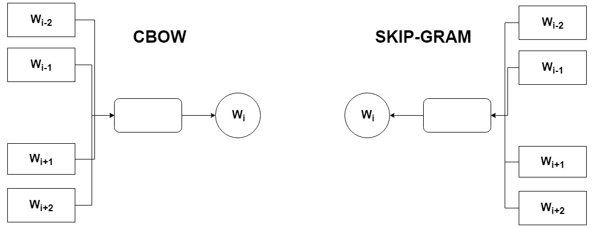
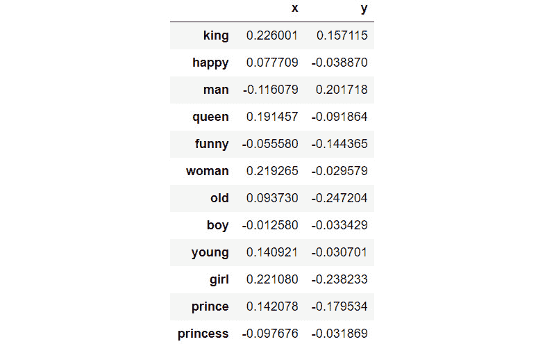
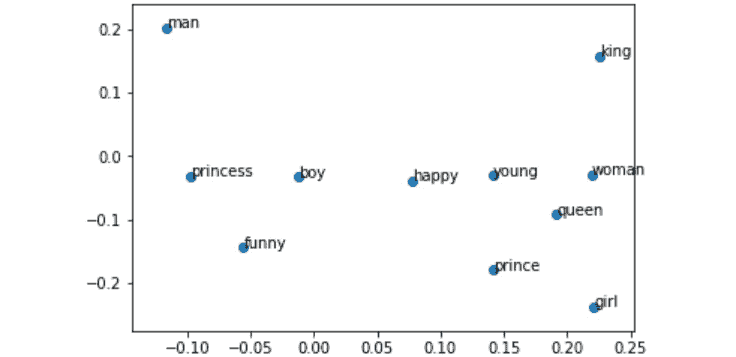
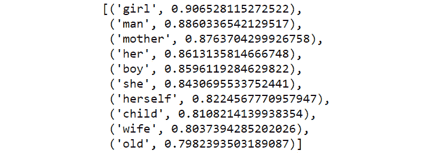
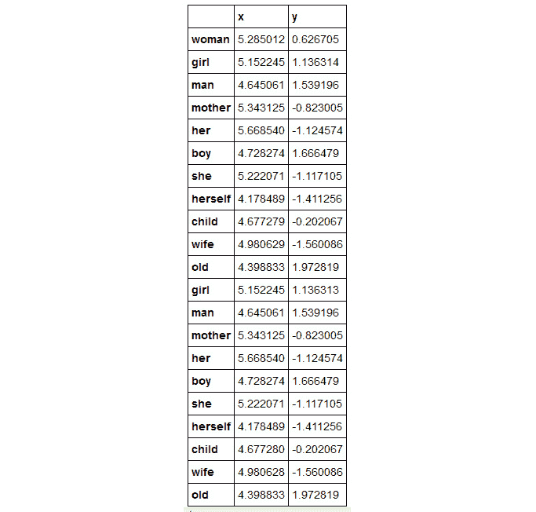
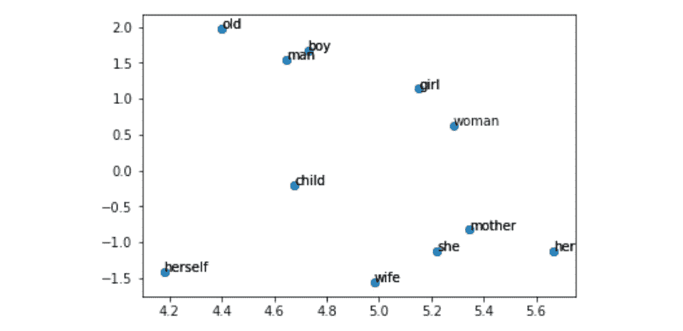
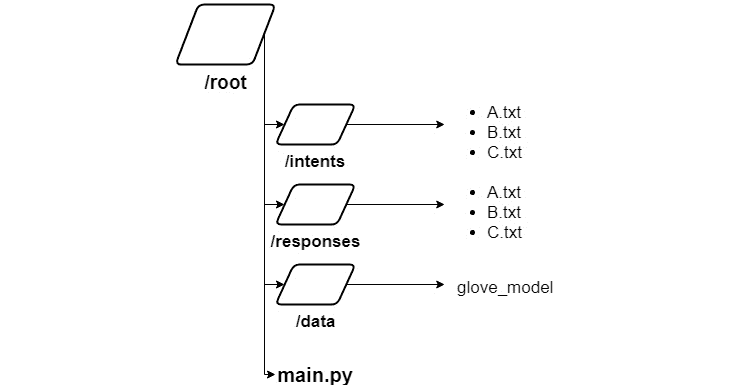
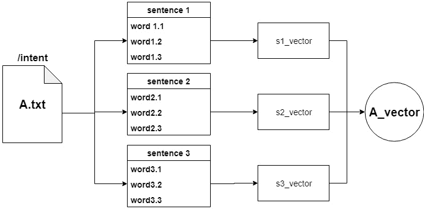
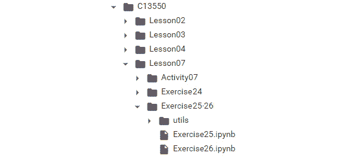
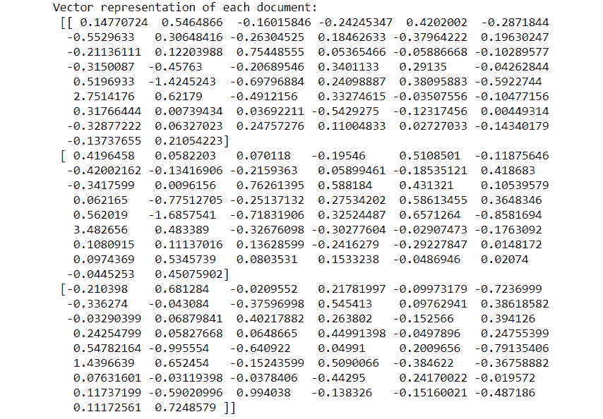

# *第七章*

# 构建基于文本的对话系统（聊天机器人）

## 学习目标

在本章结束时，您将能够：

+   定义 GloVe、Word2Vec 和嵌入的术语

+   开发你自己的 Word2Vec

+   选择工具来创建对话代理

+   预测对话的意图

+   创建一个对话代理

本章介绍了 GloVe、Word2Vec、嵌入等术语以及将帮助你创建对话代理的工具。

## 介绍

深度自然语言处理（NLP）中的最新趋势之一是创建对话代理，也叫聊天机器人。聊天机器人是一个**基于文本的对话系统**，它能够理解人类语言，并能够与人进行真实的对话。许多公司使用这些系统与客户互动，获取信息和反馈，例如，对新产品发布的意见。

聊天机器人被用作助手，例如，Siri、Alexa 和 Google Home。这些助手可以提供实时的天气或交通信息。

目前的问题是，机器人如何理解我们？在前几章中，我们回顾了语言模型及其工作原理。然而，在语言模型（LMs）中，最重要的事情是单词在句子中的位置。每个单词在句子中出现的概率是有一定的，取决于句子中已经出现的单词。但概率分布方法并不适用于这个任务。在这种情况下，我们需要理解单词的意义，而不是预测下一个单词，之后模型将能够理解给定语料库中单词的意义。

一个单词本身没有意义，除非它被放在一个上下文或语料库中。理解一个句子的意义是很重要的，而这由句子的结构决定（也就是单词在句子中的位置）。模型将通过查看哪些单词接近它来预测单词的意义。但首先，如何用数学方式来表示这个呢？

在*第四章*《*神经网络与自然语言处理*》中，我们讨论了如何使用一个 one-hot 编码向量来表示一个单词，这个向量由 1 和 0 组成。然而，这种表示方式并没有提供单词的实际含义。我们来看一个例子：

+   狗  [1,0,0,0,0,0]

+   猫  [0,0,0,0,1,0]

狗和猫是动物，但它们在 1 和 0 中的表示并没有提供任何关于这些单词含义的信息。

但是，如果这些向量根据单词的含义为我们提供了两个单词之间的相似性会发生什么呢？具有相似含义的两个单词将被放置在平面上彼此靠近，而没有任何关系的单词则不会。例如，一个国家的名称和它的首都是相关的。

通过这种方法，一组句子可以与对话意图或特定主题相关联（也称为意图，这个术语将在本章中反复使用）。使用这种系统，我们将能够与人类进行合理的对话交流。

对话的意图是对话的主题。例如，如果你正在谈论皇家马德里与巴塞罗那的比赛，那么对话的意图就是足球。

在本章稍后，我们将回顾将单词表示为向量的基本概念，以及如何创建这样的向量并用它们来识别对话的意图。

## 向量空间中的词表示

本节将介绍从语料库中计算单词的连续向量表示的不同架构。这些表示将取决于单词在意义上的相似性。此外，还将介绍一个新的 Python 库 (**Gensim**) 来完成这项任务。

### 词嵌入

词嵌入是一种将语料库中的单词和句子映射并输出为向量或实数的技术和方法的集合。词嵌入通过表示单词出现的上下文来生成每个单词的表示。词嵌入的主要任务是将每个单词的空间维度从一个维度降到一个连续的向量空间。

为了更好地理解这是什么意思，让我们看一个例子。假设我们有两句话，它们相似，例如：

+   我很好。

+   我很好。

现在，将这些句子编码为独热向量，我们得到类似这样的表示：

+   我  [1,0,0,0]

+   Am  [0,1,0,0]

+   Good  [0,0,1,0]

+   Great  [0,0,0,1]

我们知道前两个句子是相似的（在意义上），因为“great”和“good”有相似的意思。但我们如何衡量这两个单词的相似度呢？我们有两个向量表示这两个单词，那么让我们计算余弦相似度。

### 余弦相似度

余弦相似度衡量两个向量之间的相似度。顾名思义，这种方法将表示两个句子之间角度的余弦值。其公式如下：


###### 图 7.1：余弦相似度公式

图 7.1 展示了余弦相似度的公式。A 和 B 是向量。按照之前的示例，如果我们计算“good”和“great”之间的相似度，结果是 0。这是因为独热编码向量是独立的，并且在相同的维度上没有投影（这意味着某一维度上只有一个 1，其余是 0）。

图 7.2 解释了这个概念：


###### 图 7.2：无投影维度

词嵌入解决了这个问题。有许多技术可以表示词嵌入。但所有这些技术都属于无监督学习算法。其中最著名的方法之一是 Word2Vec 模型，接下来将进行解释。

### Word2Vec

Word2Vec 的主要目标是生成词嵌入。它处理语料库，然后为语料库中的每个唯一单词分配一个向量。然而，这个向量不像 one-hot 向量方法那样工作。例如，如果我们的语料库中有 10,000 个单词，我们的 one-hot 编码向量就会有 10,000 个维度，但 Word2Vec 可以进行降维，通常降到几百维。

Word2Vec 的核心思想是一个单词的含义由经常出现在它附近的单词来表示。当一个单词出现在句子中时，它的上下文由它附近的单词集构成。这些单词集位于一个固定大小的窗口内：


###### 图 7.3：*wx* 的上下文词

图 7.3 显示了 *wx* 的上下文词的示例。

Word2Vec 的概念由 Tomas Mikolov 在 2013 年提出。他提出了一个学习词向量的框架。该方法通过遍历语料库来工作，取出一组包含中心词（在图 7.3 中为 *wx*）和上下文词（在图 7.3 中，黑色矩形框内显示的词）的一组单词。这些词的向量会不断更新，直到语料库结束。

有两种执行 Word2Vec 的方法：

+   **Skip-Gram 模型**：在此模型中，输入是放置在中心的单词，之后预测其上下文词。

+   **CBOW 模型**：该模型的输入是上下文词的向量，输出是中心词。



###### 图 7.4：CBOW 和 Skip-gram 模型表示

这两种模型都能产生不错的结果，但 Skip-gram 模型在数据量较小的情况下表现较好。我们不会深入讨论这些模型如何生成我们的 Word2Vec，但我们会使用 Gensim 库，本章将介绍它。

### Word2Vec 的问题

Word2Vec 在将单词表示为向量空间中的点时有许多优点。它提高了任务的性能，并能够捕捉复杂的单词含义。但它并不完美，存在一些问题：

+   低效地使用统计数据：它一次捕捉单词的共现。这里的问题是，那些在训练语料库中没有共同出现的单词往往会在平面上变得更接近（这可能会导致歧义），因为没有办法表示它们之间的关系。

+   需要修改模型的参数，即当语料库的大小发生变化时，模型需要重新训练，而这会消耗大量的时间。

在深入探讨如何用 Word2Vec 解决这些问题之前，我们将介绍 Gensim，这是一个用于创建 Word2Vec 模型的库。

### Gensim

Gensim 是一个 Python 库，提供了不同的 NLP 方法。它不同于 NLTK 或 spaCy；那些库侧重于数据的预处理和分析，而 Gensim 提供了处理原始文本（即无结构文本）的方法。

Gensim 的优点如下：

+   Gensim 可以用于超大语料库。它具有内存独立性，这意味着语料库不需要存储在计算机的 RAM 中。同时，它具有内存共享功能来存储训练好的模型。

+   它可以提供高效的向量空间算法，如 Word2Vec、Doc2Vec、LSI、LSA 等。

+   它的 API 易于学习。

这些是 Gensim 的缺点：

+   它没有提供文本预处理的方法，必须与 NLTK 或 spaCy 一起使用，以获得完整的自然语言处理管道。

### 练习 24：创建词嵌入

在本次练习中，我们将使用一个小语料库和 Gensim 创建我们的词嵌入。一旦模型训练完成，我们将把它打印在一个二维图表上，以检查单词的分布情况。

Gensim 提供了更改一些参数的可能性，以便在我们的数据上进行良好的训练。一些有用的参数如下：

+   `Num_features`：表示向量的维度（更多维度意味着更高的准确性，但计算成本更高）。在我们的例子中，我们将此参数设置为**2**（2 维向量）。

+   `Window_size`：表示固定窗口的大小，用于包含词语的上下文。在我们的例子中，语料库较小，所以此处大小设置为**1**。

+   `Min_word_count`：最小的词频阈值。

+   `Workers`：计算机并行运行的线程。在我们的例子中，一个工作线程对于语料库的大小就足够了。

让我们从练习开始：

1.  导入库。我们将使用 Gensim 模型，Word2Vec：

    ```py
    import nltk
    import gensim.models.word2vec as w2v
    import sklearn.manifold
    import numpy as np
    import matplotlib.pyplot as plt
    import pandas as pd
    ```

1.  定义一个小的随机语料库：

    ```py
    corpus = ['king is a happy man', 
              'queen is a funny woman',
              'queen is an old woman',
              'king is an old man', 
              'boy is a young man',
              'girl is a young woman',
              'prince is a young king',
              'princess is a young queen',
              'man is happy, 
              'woman is funny,
              'prince is a boy will be king',
              'princess is a girl will be queen']
    ```

1.  现在我们将使用`spaCy`对每个句子进行分词。`spaCy`的概念在*第三章*，*自然语言处理基础*中有讲解：

    ```py
    import spacy
    import en_core_web_sm
    nlp = en_core_web_sm.load()
    def corpus_tokenizer(corpus):
        sentences = []
        for c in corpus:
            doc = nlp(c)
            tokens = []
            for t in doc:
                if t.is_stop == False:
                    tokens.append(t.text)
            sentences.append(tokens)
        return sentences
    sentences = corpus_tokenizer(corpus)
    sentences
    ```

1.  现在让我们定义一些变量来创建 Word2Vec 模型：

    ```py
    num_features=2
    window_size=1
    workers=1
    min_word_count=1
    ```

1.  使用 Word2Vec 方法创建模型，种子为 0（这个种子只是用来初始化模型的权重；推荐使用相同的种子以获得相同的结果）：

    ```py
    model = w2v.Word2Vec(size=num_features, window=window_size,workers=workers,min_count=min_word_count,seed=0)
    ```

1.  现在，我们将从语料库中构建词汇表。首先，我们需要一个词汇表来训练模型：

    ```py
    model.build_vocab(sentences)
    ```

1.  训练模型。这里的参数是语料库的句子：总词数和训练轮次（在此案例中，1 轮训练就足够）：

    ```py
    model.train(sentences,total_words=model.corpus_count,epochs=1)
    ```

1.  现在，我们可以看到当计算两个词语的相似度时，模型是如何工作的：

    ```py
    model.wv['king']
    model.wv.similarity('boy', 'prince')
    ```

    

    ###### 图 7.5：计算结果，表示两个词语的相似度

1.  现在，为了打印模型，定义一个包含我们语料库中单词的变量，并定义一个数组来存储每个单词的向量：

    ```py
    vocab = list(model.wv.vocab)
    X = model.wv[vocab]
    ```

1.  使用 pandas 创建一个包含此数据的`DataFrame`：

    ```py
    df = pd.DataFrame(X, index=vocab, columns=['x', 'y'])
    df
    ```

    

    ###### 图 7.6：我们的向量坐标

1.  创建一个图形，表示每个单词在平面中的位置：

    ```py
    fig = plt.figure()
    ax = fig.add_subplot(1, 1, 1)
    for word, pos in df.iterrows():
        ax.annotate(word, pos)
    ax.scatter(df['x'], df['y'])
    plt.show()
    ```



###### 图 7.7：我们 Word2Vec 模型中项目的位置

如图 7.7 所示，词语可以在二维空间中表示。如果你有一个较小的语料库，要了解两个词在意义上的相似性，只需要测量这两个词的距离。

现在你知道如何训练自己的 Word2Vec 模型了！

### Global Vectors (GloVe)

Global Vectors 是一个词表示模型。它的工作方式和 Word2Vec 模型类似，但增加了一些新特性，使其更加高效。

在开始使用这个模型之前，思考其他创建词向量的方法是很有益的。

语料库中词语出现的统计数据是我们可以用来在无监督算法中利用的第一手信息，因此可以直接捕捉共现计数。为了获得这些信息，我们不需要经过处理的方法；只要有文本数据就足够了。

创建一个共现矩阵 X，并且设置一个固定大小的窗口，我们可以得到词语的新表示。例如，假设这个语料库：

+   我是 Charles。

+   我很棒。

+   我喜欢苹果。

基于窗口的共现矩阵如下所示：


###### 图 7.8: 基于窗口的共现矩阵

共现矩阵很容易理解，它统计了一个词在语料库中与另一个词相邻出现的次数。

例如，在第一行，词语"I"的情况下，词语"am"的值为 2，因为"I am"出现了两次。

这种表示方式改进了独热编码，并能捕捉语义和句法信息，但也存在一些问题，比如模型的大小、词汇的稀疏性，并且模型的整体鲁棒性较差。

但在这种情况下，可以通过使用**SVD**（在*第三章*，*自然语言处理基础*中解释）来减少矩阵的维度，解决这些问题，公式如下：

+   A = USVT

这样做的结果是好的，词的表示确实有意义，但对于大规模语料库而言，仍然会有问题。

GloVe 方法通过以下方式解决了 Word2Vec 模型的问题：

+   如果语料库发生变化，训练模型所需的总体时间将减少。

+   统计数据得到了高效使用。它在处理语料库中不常出现的词语时表现更好。这是 Word2Vec 中的一个问题，即不常见的词语具有相似的向量。

GloVe 结合了前两种方法，以实现快速训练。它能够扩展到庞大的语料库，并且可以用小向量实现更好的性能。

#### 注意

该模型由斯坦福大学创建，是一个开源项目。你可以在[`github.com/PacktPublishing/Artificial-Vision-and-Language-Processing-for-Robotics/tree/master/Lesson07/Exercise25-26/utils`](https://github.com/PacktPublishing/Artificial-Vision-and-Language-Processing-for-Robotics/tree/master/Lesson07/Exercise25-26/utils)找到更多文档。

在下一个练习中，您将学习如何使用 GloVe。

### 练习 25：使用预训练的 GloVe 查看平面中词语的分布

在本练习中，您将学习如何使用 GloVe 以及如何绘制模型的区域。我们将再次使用 Gensim 库：

#### 注意

要获取模型，您需要从 GitHub 上的`utils`文件夹下载文件（这是 50 维的模型）：

[`github.com/TrainingByPackt/Artificial-Vision-and-Language-Processing-for-Robotics/tree/master/Chapter%207/utils`](https://github.com/TrainingByPackt/Artificial-Vision-and-Language-Processing-for-Robotics/tree/master/Chapter%207/utils)

1.  打开您的 Google Colab 界面。

1.  为本书创建一个文件夹，从 GitHub 下载`utils`文件夹并将其上传到该文件夹中。

1.  导入驱动器并按如下方式挂载：

    ```py
    from google.colab import drive
    drive.mount('/content/drive')
    ```

1.  一旦您第一次挂载了您的驱动器，您需要通过点击 Google 提供的 URL 并按下键盘上的**Enter**键来输入授权码：

    ###### 图 7.9：显示 Google Colab 授权步骤的图片

1.  现在您已经挂载了驱动器，您需要设置目录的路径：

    ```py
    cd /content/drive/My Drive/C13550/Lesson07/Exercise25/
    ```

    #### 注意

    第 5 步中提到的路径可能会根据您在 Google Drive 上的文件夹设置而有所不同。然而，该路径始终以`cd /content/drive/My Drive/`开头。

    `utils`文件夹必须出现在您正在设置的路径中。

1.  导入库：

    ```py
    from gensim.scripts.glove2word2vec import glove2word2vec
    from gensim.models import KeyedVectors
    import numpy as np
    import pandas as pd
    ```

1.  使用 Gensim 提供的`glove2word2vec`函数创建`word2vec`模型：

    ```py
    glove_input_file = 'utils/glove.6B.50d.txt'
    word2vec_output_file = 'utils/glove.6B.50d.txt.word2vec'
    glove2word2vec(glove_input_file, word2vec_output_file)
    ```

    #### 注意

    在本例中，`glove.6B.50d.txt`文件已被放置在`utils`文件夹中。如果您选择将其放在其他地方，路径将相应变化。

1.  使用`glove2word2vec`函数生成的文件初始化模型：

    ```py
    filename = 'utils/glove.6B.50d.txt.word2vec'
    model = KeyedVectors.load_word2vec_format(filename, binary=False)
    ```

1.  使用 GloVe，您可以衡量一对词语的相似度。通过计算两个词语之间的相似度并打印出词向量来检查模型是否有效：

    ```py
    model.similarity('woman', 'queen')
    ```

    

    ###### 图 7.10：woman 和 queen 的相似度

1.  在*练习 24*，*创建词嵌入*中，我们创建了自己的向量，但在这里，向量已经被创建。要查看一个词的表示向量，我们只需要做以下操作：

    ```py
    model['woman']
    ```

    

    ###### 图 7.11：“Woman”向量表示（50 维）

1.  我们还可以看到与其他词语最相似的词语。正如在步骤 4 和 5 中所示，GloVe 有许多与词表示相关的功能：

    ```py
    model.similar_by_word(woman)
    ```

    

    ###### 图 7.12：与 woman 最相似的词语

1.  现在，我们将使用奇异值分解（SVD）来可视化高维数据，以绘制与 woman 最相似的词语。导入必要的库：

    ```py
    from sklearn.decomposition import TruncatedSVD
    import pandas as pd
    import matplotlib.pyplot as plt
    ```

1.  初始化一个 50 维的数组并附加“woman”向量。为了进行这种维度缩减，我们将创建一个矩阵，其行将是每个单词的向量：

    ```py
    close_words=model.similar_by_word('woman')

    arr = np.empty((0,50), dtype='f')
    labels = ['woman']
    #Array with the vectors of the closest words
    arr = np.append(arr, np.array([model['woman']]), axis=0)
    print("Matrix with the word 'woman':\n", arr)
    ```

    

    ###### 图 7.13：包含“woman”单词的矩阵值

1.  现在，我们在矩阵中有了`dog`这个单词，我们需要附加每个相似单词的向量。将其余的向量添加到矩阵中：

    ```py
    for w in close_words:
        w_vector = model[w[0]]
        labels.append(w[0])
        arr = np.append(arr, np.array([w_vector]), axis=0)
    arr
    ```

    这个矩阵大致如下所示：

    

    ###### 图 7.14：包含与“woman”向量最相似的矩阵

1.  一旦我们拥有了矩阵中的所有向量，就让我们初始化 TSNE 方法。它是 Sklearn 的一个函数；

    ```py
    svd = TruncatedSVD(n_components=2, n_iter=7, random_state=42)
    svdvals = svd.fit_transform(arr)
    ```

1.  将矩阵转换为二维向量，并使用 pandas 创建一个 DataFrame 来存储它们：

    ```py
    df = pd.DataFrame(svdvals, index=labels, columns=['x', 'y'])
    df
    ```

    

    ###### 图 7.15：我们向量在二维中的坐标

1.  创建一个图表来查看平面上的单词：

    ```py
    fig = plt.figure()
    ax = fig.add_subplot(1, 1, 1)
    for word, pos in df.iterrows():
        ax.annotate(word, pos)
    ax.scatter(df['x'], df['y'])
    plt.show()
    ```



###### 图 7.16：与“woman”最相似的单词分布

在这里，我们通过降低向量的维度，将其输出为二维图形。在此，我们可以看到单词之间的相似关系。

你已经完成了第 25 号练习！现在你可以选择使用自己的 word2vec 模型或 GloVe 模型。

## 对话系统

正如我们之前提到的，聊天机器人正变得越来越流行。它们可以帮助人类 24/7，解答问题或进行对话。对话系统能够理解话题，给出合理的回答，并在与人类的对话中检测情感（如积极、消极或中立情感）。这些系统的主要目标是通过模仿人类来进行自然对话。这种像人类一样思考或行为的能力是确保对话中良好用户体验的一个重要因素。洛布纳奖是一个聊天机器人竞赛，参赛的聊天机器人需要接受多种不同句子和问题的测试，最像人类的系统获胜。最受欢迎的对话代理之一是 Mitsuku 聊天机器人（[`www.pandorabots.com/mitsuku/`](https://www.pandorabots.com/mitsuku/)）。

聊天机器人通常作为文本服务为用户提供信息。例如，在西班牙，最受欢迎的对话代理之一是 Lola，它可以为你提供星座信息（[`1millionbot.com/chatbot-lola/`](https://1millionbot.com/chatbot-lola/)）。你只需发送一条消息，等待几秒钟即可收到数据。但在 2011 年，苹果公司开发了 Siri，一款能理解语音的虚拟助手，现在我们也有了亚马逊的 Alexa 和谷歌助手。根据系统的输入类型，它们可以分为两类：**语音对话系统**和**基于文本的对话系统**，这些将在本章后面进行解释。

这不是唯一的对话代理分类方式。根据它们所拥有的知识类型，它们可以分为面向目标和开放领域两类。我们将在本章后面回顾这些分类。

事实上，有许多工具可以在几分钟内创建你自己的聊天机器人。但在本章中，你将学习如何从零开始创建所需的系统知识。

### 开发聊天机器人的工具

聊天机器人对许多新兴公司帮助巨大。但是，创建聊天机器人时，你是否需要具备深度 NLP 的知识？幸运的是，借助这些工具，即使没有任何 NLP 知识的人，也可以在几个小时内创建一个聊天机器人：

+   **Dialogflow**: 它可以轻松创建自然语言对话。Dialogflow 是由 Google 拥有的开发工具，提供语音和对话界面。该系统利用 Google 的机器学习技术来找出与用户对话中的适当意图，并且部署在 Google Cloud Platform 上。它支持 14 种以上的语言和多个平台。

+   **IBM Watson**: Watson Assistant 提供了一个用户友好的界面来创建对话代理。它的工作原理与 Dialogflow 类似，但它部署在 IBM Cloud 上，并且由 IBM Watson 知识库支持。Watson 还提供了多个工具来分析对话生成的数据。

+   **LUIS**: 语言理解（LUIS）是微软基于机器学习的服务，用于构建自然语言应用程序。这个机器人框架托管在 Azure 云上，并使用微软的知识库。

上述工具是一个复杂的 NLP 系统。在本章中，我们将介绍一种使用预训练的 GloVe 来识别消息意图的基本方法。最新的聊天机器人趋势是语音助手。这些工具使你能够实现一个由语音控制的聊天机器人。有许多方法可以对话代理进行分类。

### 对话代理的类型

对话代理可以根据输入输出数据类型和知识限制进行多种分组。当一家公司委托创建聊天机器人时，第一步是分析其沟通渠道（文本或语音）以及对话的主题（有限知识或无限制）。

现在，我们将解释许多类型的分组及其各自的特点。

### 按输入输出数据类型分类

语音控制的虚拟助手不同于基础聊天机器人，我们使用文本进行沟通。根据输入输出类型，我们可以将它们分为两类：

+   **语音对话系统 (SDS)**: 这些模型旨在通过语音控制，而没有聊天界面或键盘，而是通过麦克风和扬声器来工作。这些系统比普通聊天机器人更难处理，因为它们由不同的模块组成：


###### 图 7.17：SDS 模型结构

+   图 7.17 显示了 SDS 的模块。由于语音到文本系统需要将人类的语音转换为文本，因此 SDS 的错误概率较高，这可能会失败。一旦语音被转换为文本，对话代理会识别对话的意图并返回响应。在代理返回响应之前，答案会被转换成语音。

+   **基于文本的对话系统**：与 SDS（语音对话系统）相比，基于文本的对话系统是基于聊天界面，用户通过键盘和屏幕与聊天机器人进行交互。在本章中，我们将创建一个基于文本的对话聊天机器人。

### 按系统知识分类

如果聊天机器人能够利用其知识成功地响应每种类型的信息，或者它仅限于一组特定问题，这些对话代理可以按以下方式进行分类：

+   **封闭领域或目标导向（GO）**：该模型已被训练来识别一组意图。聊天机器人只会理解与这些主题相关的句子。如果对话代理无法识别意图（意图在本章介绍中已解释），它将返回预定义的句子。

+   **开放领域**：并非所有聊天机器人都有一组定义的意图。如果系统能够利用 NLG 技术和其他数据源回答各种类型的句子，则被归类为开放领域模型。这些系统的架构比 GO 模型更难构建。

+   还有第三类对话代理，基于其知识，称为**混合领域**。它是前述模型的组合，因此，根据句子的不同，聊天机器人将有预定义的响应（与多种响应关联的意图）或没有。

### 创建基于文本的对话系统

到目前为止，我们已经了解了不同类别的对话代理以及它们如何选择或生成响应。还有许多其他方法可以构建对话代理，NLP 提供了多种不同的方法来实现这一目标。例如，**seq2seq**（序列到序列）模型能够在给定问题时找到答案。此外，深度语言模型可以基于语料库生成响应，也就是说，如果聊天机器人有一个对话语料库，它可以跟随对话进行。

在本章中，我们将使用斯坦福大学的 GloVe 构建一个聊天机器人。在*练习 26*中，*创建你的第一个对话代理*，你将找到我们将要使用的技术的简要介绍，在活动中，我们将创建一个对话代理来控制机器人。

**范围定义和意图创建**

我们的对话代理将是一个基于文本的对话系统，并且是目标导向的。因此，我们将通过键盘与聊天机器人进行交互，它只会理解与我们创建的意图相关的句子。

在开始创建意图之前，我们需要明确聊天机器人的主要目标是什么（维持一般对话、控制设备、获取信息）以及用户可能提出的不同类型的句子。

一旦我们分析了聊天机器人的可能对话，我们就可以创建意图。每个意图将是一个包含多条训练句子的文本文件。这些训练句子是用户与聊天机器人可能进行的互动。定义这些句子非常重要，因为如果有两个相似的句子具有不同的意图，聊天机器人可能会匹配错误的意图。

#### 注释

对聊天机器人的可能对话进行良好的前期分析将使意图定义变得更加容易。显然，聊天机器人无法理解用户可能说出的所有句子，但它必须能够识别与我们意图相关的句子的含义。

系统还将有一个与意图文件同名的文件，但它将包含与意图相关的响应，而不是训练句子：


###### 图 7.18：系统的文件夹结构

在图 7.18 中，我们可以看到聊天机器人的结构。意图和响应文件的扩展名是`.txt`，但也可以将它们保存为`.json`。

**GloVe 用于意图检测**

在本章的开始，我们回顾了词嵌入、词到向量和全局向量的基础知识。GloVe 使用实数向量表示每个单词，这些向量可以作为各种应用的特征。但在本案例中——构建对话代理——我们将使用完整的句子来训练我们的聊天机器人，而不仅仅是单词。

聊天机器人需要理解一个完整的句子是由一组词语作为向量表示的。将一个序列表示为向量的这种方式称为**seq2vec**。在内部，对话代理将比较用户的句子与每个意图训练短语，以找到最相似的意思。

此时，已经有了表示序列的向量，这些序列存储在与某个意图相关的文件中。如果使用之前提到的相同过程将所有序列向量合并为一个，那么我们将得到意图的表示。主要思想不仅仅是表示一个句子，而是将整个文档表示为一个向量，这称为**Doc2vec**。通过这种方法，当用户与聊天机器人互动时，机器人将找到用户短语的意图。

我们系统的最终结构将如下图 7.19 所示：



###### 图 7.19：最终文件夹结构

名为`main.py`的文件将包含使用位于`/data`中的 GloVe 模型分析输入句子的不同方法，创建文档向量，以便执行用户句子与意图之间的匹配：



###### 图 7.20：Doc2Vec 转换

图 7.20 显示了将一组句子转换为向量的过程，表示一个文档。在此示例中，**A.txt** 文件是一个包含三句话的意图，每个句子有三个单词，因此每个句子有三个向量。通过合并这些向量，我们获得了每组单词的表示，之后，我们得到了文档向量。

将句子转换为向量的方法可以方便地在文档向量中比较一系列向量。当用户与聊天机器人互动时，用户的短语将被转换为 `seq2vec`，然后与每个文档向量进行比较，以找到最相似的一个。

### 练习 26：创建你的第一个对话代理

#### 注意

在你执行练习 25 的同一文件夹中执行练习 26。

在此练习中，你将创建一个聊天机器人来理解基本对话。此练习将涵盖意图和回复的定义、将单词转换为表示文档的向量，并将用户的句子与意图进行匹配。

在开始练习之前，请查看 Google Colab 中的文件夹结构，如图 7.21 所示：



###### 图 7.21：练习 26 的结构

`Exercise26.ipynb` 文件是我们之前遇到过的 `main.py` 文件，在 `utils` 文件夹中，你将找到在上一练习中提到的文件夹结构：


###### 图 7.22：练习 26 的结构 (2)

文件夹中的回复文件包含聊天机器人在用户互动时可以输出的短语。训练部分定义了每个句子的意图。为了获得每个单词的向量，我们将使用斯坦福的 GloVe，并采用五维：

1.  首先，我们需要为每个意图定义意图和回复。由于这是一个入门练习，我们将定义三个意图：welcome、how-are-you 和 farewell，并创建一些相关句子（用逗号分隔）。

    “Welcome” 训练句子：Hi friend, Hello, Hi, Welcome.

    “Farewell” 训练句子：Bye, Goodbye, See you, Farewell, Have a good day.

    “How are you” 训练句子：How are you? What is going on? Are you okay?

1.  一旦我们创建了意图，就需要创建回复。为每个意图文件创建三个具有相同名称的文件，并添加回复。

    “Welcome” 回复：Hello! Hi.

    “How are you?” 回复：I’m good! Very good my friend :)

    “Farewell” 回复：See you! Goodbye!

1.  以如下方式导入并挂载驱动：

    ```py
    from google.colab import drive
    drive.mount('/content/drive')
    ```

1.  一旦你首次挂载了驱动，你需要点击 Google 提供的 URL 并按下键盘上的 **Enter** 键以输入授权码：

    ###### 图 7.23：Google Colab 授权步骤

1.  现在你已经挂载了驱动器，接下来需要设置目录的路径：

    ```py
    /content/drive/My Drive/C13550/Lesson07/Exercise25-26
    ```

1.  导入必要的库：

    ```py
    from gensim.scripts.glove2word2vec import glove2word2vec
    from gensim.models import KeyedVectors
    import numpy as np
    from os import listdir
    ```

1.  使用 spaCy，我们将对句子进行分词并删除标点符号。现在，创建一个函数，能够对文档中的每个句子进行分词。在这个练习中，我们将通过将所有词向量组合成一个，创建 Doc2vec。因此，我们将对整个文档进行分词，返回一个包含所有词元的数组。去除停用词是个好习惯，但在本练习中不需要。这个函数的输入是一个句子数组：

    ```py
    import spacy
    import en_core_web_sm
    nlp = en_core_web_sm.load()
    # return a list of tokens without punctuation marks
    def pre_processing(sentences):
        tokens = []
        for s in sentences:
            doc = nlp(s)
            for t in doc:
                if t.is_punct == False:
                    tokens.append(t.lower_)
        return tokens
    ```

1.  加载 GloVe 模型：

    ```py
    filename = 'utils/glove.6B.50d.txt.word2vec'
    model = KeyedVectors.load_word2vec_format(filename, binary=False)
    ```

1.  创建两个列表，分别存储意图文件和响应文件的名称：

    ```py
    intent_route = 'utils/training/'
    response_route = 'utils/responses/'
    intents = listdir(intent_route)
    responses = listdir(response_route)
    ```

1.  创建一个函数，返回一个表示文档的 100 维向量。这个函数的输入是一个文档的词元列表。我们需要初始化一个空的 100 维向量。这个函数的工作是将每个单词的向量相加，然后除以分词文档的长度：

    ```py
    def doc_vector(tokens):
        feature_vec = np.zeros((50,), dtype="float32")
        for t in tokens:
             feature_vec = np.add(feature_vec, model[t])
        return np.array([np.divide(feature_vec,len(tokens))])
    ```

1.  现在，我们准备好读取每个意图文件（位于训练文件夹中），对它们进行分词，并创建一个包含每个文档向量的数组：

    ```py
    doc_vectors = np.empty((0,50), dtype='f')
    for i in intents:
        with open(intent_route + i) as f:
            sentences = f.readlines()
        sentences = [x.strip() for x in sentences]
        sentences = pre_processing(sentences)
        # adding the document vector to the array doc_vectors
        doc_vectors=np.append(doc_vectors,doc_vector(sentences),axis=0)
    print("Vector representation of each document:\n",doc_vectors)
    ```

    

    ###### 图 7.24：作为向量表示的文档

1.  使用`sklearn`中的`cosine_similarity`函数，创建一个函数，通过比较句子向量与每个文档向量，找到最相似的意图：

    ```py
    from sklearn.metrics.pairwise import cosine_similarity
    def select_intent(sent_vector, doc_vector):
        index = -1
        similarity = -1 #cosine_similarity is in the range of -1 to 1
        for idx,v in zip(range(len(doc_vector)),doc_vector):
            v = v.reshape(1,-1)
            sent_vector = sent_vector.reshape(1,-1)
            aux = cosine_similarity(sent_vector, v).reshape(1,)
            if aux[0] > similarity:
                index = idx
                similarity = aux
        return index
    ```

1.  让我们测试一下我们的聊天机器人。对用户的输入进行分词，并使用最后一个函数（`select_intent`）来获取相关的意图：

    ```py
    user_sentence = "How are you"
    user_sentence = pre_processing([user_sentence])
    user_vector = doc_vector(user_sentence).reshape(50,)
    intent = intents[select_intent(user_vector, doc_vectors)]
    intent
    ```

    

    ###### 图 7.25：预测的文档意图

1.  创建一个函数来回应用户：

    ```py
    def send_response(intent_name):
        with open(response_route + intent_name) as f:
            sentences = f.readlines()
        sentences = [x.strip() for x in sentences]
        return sentences[np.random.randint(low=0, high=len(sentences)-1)]
    send_response(intent)
    ```

1.  检查测试句子的输出：

    ```py
    send_response(intent)
    ```

    输出将如下所示：

    

    ###### 图 7.26：意图 how_are_you 的响应

1.  检查系统是否能处理多条测试句子。

你已经完成了练习 26！你已经准备好构建一个对话代理来控制我们的虚拟机器人。正如你在练习 26 中看到的（第 2 步），你需要对意图进行良好的定义。如果你试图将相同的句子添加到两个不同的意图中，系统可能会失败。

### 活动 7：创建一个对话代理控制机器人

在这个活动中，我们将创建一个拥有多种意图的聊天机器人。为了完成这个任务，我们将使用斯坦福的 GloVe，正如*练习 26*中所示，*创建你的第一个对话代理*。我们将学习如何创建一个程序，等待用户输入句子，当用户与聊天机器人互动时，它将返回一个响应。

场景：你在一家开发安全系统的公司工作。这个安全系统将是一个配备有摄像头的机器人，能够查看环境，并且具有前进或后退的轮子。这个机器人将通过文本控制，你可以输入指令，机器人将执行不同的动作。

1.  机器人可以执行以下操作：

    向前走。

    向后走。

    旋转：

    向右转 45º。

    向左转 45º。

1.  识别机器人可以看到的内容。这个活动与*练习 26*、*创建你的第一个对话代理*中的操作方法相同。为了避免重复编写代码，`chatbot_intro.py` 文件包含了四个基本方法：

    `Pre_processing`：对句子进行分词

    `Doc_vector`：创建文档向量

    `Select_intent`：找到句子中最相似的意图

    `Send_response`：发送位于响应文件夹中的句子

    知道了这些方法，核心工作就完成了，所以最重要的是意图的设计。

1.  我们需要开发四个不同的活动，但旋转活动有两种不同类型。我们将定义五个意图，每个动作一个（旋转有两个）。你可以使用这些句子，但你也可以自由地添加更多的训练句子或动作：

    **向后**：

    向后移动

    向后走

    向后走

    返回

    向后移动

    **环境**：

    你能看到什么？

    环境信息

    拍照

    告诉我你看到的是什么？

    你面前有什么？

    **向前**：

    前进

    向前走

    向前走

    开始移动

    向前

    **左侧**：

    向左转

    向左走

    向左看

    向左转

    左侧

    **向右**：

    向右转

    向右走

    向右看

    向右转

    向右

    你可以在活动/训练文件夹中找到这些文件：


###### 图 7.27：训练句子文件

#### 注意

本活动的解决方案可在第 323 页找到。

## 总结

对话代理，也称为聊天机器人，是一种基于文本的对话系统，能够理解人类语言并与人类进行“真实”的对话。为了有效理解人类所说的话，聊天机器人需要将对话分类为不同的意图，即一组表达特定含义的句子。对话代理可以根据输入输出数据的类型和知识限制分为几类。表示意义并不容易。为了为聊天机器人提供有力的支持，需依赖大量的语料库。找到表示一个单词的最佳方式是一个挑战，而独热编码是无效的。独热编码的主要问题是编码向量的大小。如果我们有一个包含 88,000 个单词的语料库，那么编码向量的大小将为 88,000，而且这些单词之间没有任何关系。这里就引入了词嵌入的概念。

词嵌入是将语料库中的单词和句子映射为向量或实数的一系列技术和方法。词嵌入生成每个单词的表示，基于该单词出现的上下文。为了生成词嵌入，我们可以使用 Word2Vec。Word2Vec 处理语料库，并为语料库中的每个唯一单词分配一个向量，并且它可以进行维度减少，通常是几百个维度。

Word2Vec 的核心思想是，一个词的意义由其附近经常出现的词语所决定。当一个词出现在句子中时，它的上下文是由其附近的词语集合形成的。Word2Vec 可以通过两种算法实现：skip-gram 和 CBOW。Word2Vec 的思想是表示词语，这是有用的，但在效率方面存在问题。GloVe 将 Word2Vec 和语料库的统计信息结合起来。GloVe 将这两种方法结合，达到快速训练、可扩展到大规模语料库，并通过小向量实现更好的性能。通过 GloVe，我们能够为聊天机器人提供知识，并结合定义我们意图集的训练句子。

*第八章*，*使用 CNN 进行物体识别以引导机器人*，将向你介绍如何使用不同的预训练模型进行物体识别。此外，它还将探讨计算机视觉中的最新趋势——通过框架识别图片中每个部分的物体。
