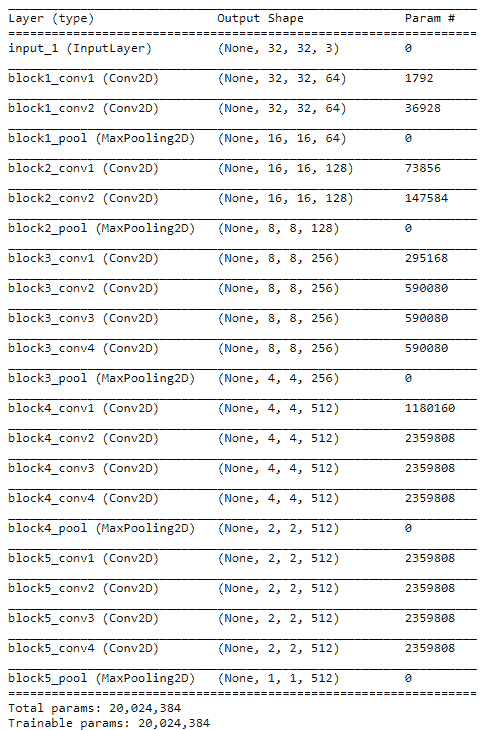
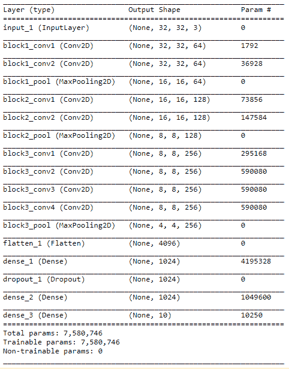

# 思考当前与未来的发展

在本书的过程中，我们有幸共同探讨了一个引人入胜的概念，这个概念充斥并目前主导着**人工智能**（**AI**）领域：**人工神经网络**（**ANNs**）。在我们的旅程中，我们有机会详细了解神经模型的运作，包括前馈神经网络、卷积神经网络和递归神经网络，从而深入理解**长短期记忆**（**LSTM**）。我们继续深入探索自监督学习方法，包括具有深度 Q 网络的**强化学习**（**RL**），以及自编码器。我们最终通过回顾生成模型的直觉，完成了这次探险。

在本章中，我们将涵盖以下主题：

+   使用迁移学习共享表示

+   在 Keras 上进行迁移学习

+   总结我们的实验

+   学习表示

+   当前神经网络的局限

+   鼓励稀疏表示学习

+   调整超参数

+   自动优化和进化算法

+   多网络预测与集成模型

+   AI 和神经网络的未来

+   前方的道路

+   经典计算的难题

+   量子计算的到来

+   量子神经网络

+   技术与社会

+   思考未来

# 使用迁移学习共享表示

我们尚未讨论的一个强大范式是**迁移学习**的概念。在我们的探索过程中，我们看到了各种方法和技术，使神经网络能够从它们所见的数据中推导出强大而准确的表示。

然而，如果我们想将这些学习到的表示迁移到其他网络上呢？如果我们面临的任务预先没有大量的训练数据，这种迁移将非常有用。基本上，迁移学习旨在利用不同学习任务之间的共性，这些任务可能具有相似的统计特征。考虑以下情况：你是一个放射科医生，想使用**卷积神经网络**（**CNN**）来分类不同的肺部疾病，使用的是胸部 X 光片的图像。唯一的问题是，你只有大约一百张标记过的胸部 X 光图像。由于你不能随便为任何不知情的病人订购 X 光片来扩充数据集，因此你需要发挥创造力。也许你有不同的图像，表示相同的现象（例如 MRI 和 CT 扫描），或者你有来自不同身体部位的大量 X 光图像。那么，为什么不利用这些呢？

既然我们知道 CNN 的前层学习的是相同的低级特征（如边缘、线段和曲率），那为什么不直接重用这些从不同任务中学到的特征，并将模型微调以适应我们的新学习任务呢？与从零开始训练网络相比，迁移学习在许多情况下能够节省大量时间，是你深度学习工具库中的一个非常有用的工具。秉持这种精神，让我们探索最后一个实践示例：在 Keras 上实现一个简单的迁移学习工作流程。

# Keras 上的迁移学习

在这一部分，我们将探讨 Keras 中一种非常简化的迁移学习方法。其背后的理念很简单：为什么要浪费宝贵的计算资源去学习几乎所有图像中常见的低级特征？

我们将使用著名的`CIFAR10`数据集来说明我们的实现，任务是对数据集中任何一个图像类别进行分类。然而，我们将通过使用预训练网络的层并将其添加到我们自己的网络中，来增强我们的学习体验。为了做到这一点，我们将导入一个非常深的卷积神经网络（CNN），它已经在昂贵的**图形处理单元**（**GPU**）上训练了数百个小时，我们只需对其进行微调以适应我们的用例。我们将使用的模型正是我们在[第四章](https://cdp.packtpub.com/hands_on_neural_networks_with_keras/wp-admin/post.php?post=655&action=edit)中使用过的**VGG 网络**，*卷积神经网络*，用来可视化神经网络如何识别猎豹。

然而这一次，我们将“解剖”它，挑选出一些中间层，将它们拼接到我们自己的模型中，从而将其学到的知识转移到一个新的任务中。我们将首先进行一些导入：

```py
 "import numpy as np\n",
 "import matplotlib.pyplot as plt\n",
 "% matplotlib inline\n",
 "\n",
 "\n",
 "from keras import applications\n",
 "from keras import optimizers\n",
 "from keras.models import Sequential, Model \n",
 "from keras.layers import Dropout, Flatten, Dense, GlobalAveragePooling2D, Input\n",
 "from keras import backend as k \n",
 "from keras.datasets import cifar10\n",
 "from keras import utils"
```

# 加载预训练模型

我们定义图像的维度，并加载已经在**ImageNet**分类任务（ILSVRC）上训练的 VGG16 模型，去掉它的输入层。这样做是因为我们将训练的图像与其原始训练图像在尺寸上有所不同。在下面的代码块中，我们可以直观地总结我们加载的模型对象：

```py
img_width, img_height = 32, 32
model = applications.VGG19(weights = "imagenet", include_top=False, input_shape = (img_width, img_height, 3))
model.summary()
```

输出结果如下：



这是一个相当大的模型。事实上，它大约有 2000 万个可训练的参数！

# 从模型中获取中间层

得益于 Keras 像乐高积木一样的模块化接口，我们可以做一些非常酷的事情，比如拆分上述模型，并将其层重用到另一个网络中。这将是我们的下一步，而且可以通过功能性 API 很容易地实现：

```py
model2= Model(inputs=model.input, outputs=   
              model.get_layer('block3_pool').output) 
model2.summary()
```

得到的结果将如下所示：


请注意，我们所做的只是使用功能性 API 初始化一个模型对象，并将 VGG 网络的前 12 层传递给它。这是通过在 VGG 模型对象上使用`.get_layer()`方法并传递层名称来实现的。请回忆，单个层的名称可以通过在给定模型对象上使用`.summary()`方法来验证。

# 向模型中添加层

现在我们已经从 VGG 网络中提取了预训练的中间层。接下来，我们可以将更多的顺序层连接到这些预训练层上。这样做的思路是利用预训练层学到的表示，并在其基础上进行构建，从而通过来自不同学习任务的知识来增强分类任务：

```py
 #Adding custom Layers
 num_classes = 10

 x = model2.output
 x = Flatten()(x)
 x = Dense(1024, activation="relu")(x)
 x = Dropout(0.5)(x)
 x = Dense(1024, activation="relu")(x)
 predictions = Dense(num_classes, activation="softmax")(x)
```

为了向我们的模型中添加更多层，我们将再次使用功能性 API 语法创建一个简单的前馈网络，它将从选定的 VGG 网络层中获取输出值，并将其展平为二维数组，然后将这些数据传递到包含 1,024 个神经元的全连接层。这一层接着连接到一个大规模丢弃层，在训练过程中会忽略上一层一半的神经连接。

接下来，我们在到达最终输出层之前，再添加一个包含 1,024 个神经元的全连接层。输出层配备了 10 个神经元，代表我们训练数据中的类别数，并且具有一个 softmax 激活函数，它将为网络看到的每个观测生成一个 10 维的概率得分。

现在我们已经定义了希望添加到网络中的层，我们可以再次使用功能性 API 语法将这两个独立的模型合并在一起：

```py
# creating the final model
model_final = Model(input = model2.input, output = predictions)
model_final.summary()
```

你将得到如下输出：



最重要的是，我们必须冻结 VGG 模型的层权重，以便利用它在之前的训练过程中（在那些昂贵的 GPU 上）编码的表示。

在这里，我们只选择冻结前四层，并决定让其余部分的架构在这个新的学习任务上重新训练：

```py
# Freeze the layers that dont need to train
for layer in model2.layers[:4]:
    layer.trainable = False
```

其他方法可能会选择保持整个模型架构冻结，只重新初始化模型最后一层的权重。我们建议你尝试冻结不同数量的层，并通过可视化损失收敛等方式探索这如何改变网络的学习体验。

直观地说，不同的学习任务可能需要不同的方式。这自然取决于多种因素，例如任务之间的相似性、训练数据之间的相似性等等。

如果目标学习任务的数据非常少，通常的经验法则是仅重新初始化最后一层的权重。相反，如果目标任务的数据很多，甚至可以在训练期间重新初始化整个网络的权重。在这种情况下，您只需使用预训练模型，并为不同的用例重新实施它。与深度学习一样，答案在于实验。

# 加载和预处理数据

接下来，我们预处理 CIFAR10 图像并向量化标签，就像我们在本书的整个过程中一直在做的那样。这里没有什么特别需要注意的地方：

```py
(x_train, y_train),(x_test, y_test)=cifar10.load_data() 
x_train = x_train.astype('float32')
x_test = x_test.astype('float32')
x_train /= 255
x_test /= 255
y_train = utils.to_categorical(y_train, num_classes)
y_test = utils.to_categorical(y_test, num_classes)
```

我们首先在第一个代码块中加载图像。在第二个块中，我们将像素值归一化为介于`0`和`1`之间的浮点值。最后，在最后一个块中，我们对标签进行独热编码。现在，我们的网络已准备好进行编译和训练。

# 训练网络

接下来，我们编译我们的模型，使用分类交叉熵`loss`函数和`Adam`优化器。然后，我们可以启动训练会话，如下所示：

```py
# compile the model
model_final.compile(loss = "categorical_crossentropy", optimizer =  
      optimizers.Adam(lr=0.0001), metrics=["accuracy"])
```

下面将获得以下输出：


该模型以 128 张图像的批次进行了 10 个 epoch 的训练。实现的验证准确率约为 85%，比从头开始训练的同一模型要好得多。您可以自己尝试这一点，在训练模型之前解冻我们冻结的层。现在您已在 Keras 中实现了迁移学习工作流程，并能够重用神经网络用于需要预训练或微调的用例。

# 练习

1.  通过从预训练的 VGG 网络中检索更多块来尝试不同的模型深度。使用更深的模型，准确率是否会显著提高？可以改变选择层的位置。

1.  改变可训练层数量；这如何影响`loss`的收敛性？

1.  尝试在`keras.applications`中的 10 个预训练模型中选择一个不同的模型来构建一个分类器，使用迁移学习的概念。

1.  听安德鲁·吴（Andrew Ng）讲解迁移学习：[`www.youtube.com/watch?v=yofjFQddwHE`](https://www.youtube.com/watch?v=yofjFQddwHE)。

# 结论我们的实验

这些讨论标志着我们对各种神经网络架构的探索与实验的结束。然而，仍然有许多内容需要讨论和发现。毕竟，虽然我们的共同旅程接近尾声，你的旅程才刚刚开始！还有无数更多的使用案例、架构变体和实现细节等着我们去探索，但这样做将偏离我们最初对这项工作的目标。我们的目标是深入理解神经网络到底做了什么、它们是如何运作的，以及在什么情况下它们可能被使用。此外，我们还希望培养对这些网络内部实际发生的事情的直觉，并理解这些架构为何如此有效。本章剩余部分将致力于巩固这一概念，使你能更好地理解表示学习的基本思想，并将这一概念应用于任何你未来可能希望使用神经网络解决的案例。最后，我们还将借此机会探讨人工神经网络领域的一些最新进展，以及各个商业和机构如何利用这一技术创造价值。最后，我们还将尝试展望未来，推测未来的发展如何影响科学、经济和社会格局，尤其是在大数据等现象的兴起以及量子计算等潜在技术突破的背景下。

# 学习表示

虽然我们在[第一章](https://cdp.packtpub.com/hands_on_neural_networks_with_keras/wp-admin/post.php?post=24&action=edit)《神经网络概述》中讨论了表示的话题以及这如何影响学习任务，但现在，在我们执行过的一些实践示例基础上，我们可以进一步加深讨论。

到目前为止，我们都清楚任何**机器学习**（**ML**）算法（包括神经网络等深度学习算法）的成功，直接依赖于我们选择如何表示它所展示的数据。这背后到底有什么问题？

为了展示表示的重要性及其对信息处理的影响，回想一下在本书早些时候我们看到的一个简洁的例子。我们使用罗马数字进行长除法等数学运算，揭示了使用不理想的表示方法进行此类任务的困难。事实上，我们选择如何表示信息直接影响我们处理信息的方式、我们能够进行的操作类型以及我们可能得到的理解。

# DNA 与技术

再考虑一个例子：DNA 分子。**脱氧核糖核酸**（**DNA**）是一种由两条相互缠绕的链状结构组成的分子，称为**双螺旋结构**。该分子可以被分解为**更简单的单体单位**（或**核苷酸**），形成由四种以氮为基础的构建块组成的碱基对（分别是**腺嘌呤**（**A**）、**鸟嘌呤**（**G**）、**胸腺嘧啶**（**T**）和**胞嘧啶**（**C**））。

现在，很多人可能会想，“*这和当前的主题有什么关系？*”事实上，正如它所显示的，这种分子结构包含了地球上所有生命形式的蓝图。该分子决定了细胞如何分裂，如何变得更复杂，直到地球上的植物和动物的偏好和行为。

不用说，这种表示信息的四元制系统找到了编码和复制指令的方式，从而产生了我们周围所有看到的生命！到目前为止，人类所设计的任何表示格式都无法接近模拟我们所知的宏大生命领域。事实上，我们至今仍在努力模拟逼真的沉浸式游戏环境，以供娱乐之用。有趣的是，根据许多估计，DNA 分子本身可以用我们自己的二进制系统表示，约为 1.5GB 的数据。想一想，1.5GB 的数据，或者一张单独的蓝光光盘，足以存储生命本身的所有指令。但这就是我们目前能做的一切了。我们不能指示蓝光光盘不停地复制自己，进而形成我们每天看到的复杂性。撇开硬件问题不谈，我们不能以这种方式复制生命运作的一个根本原因是数据本身的表示方式！因此，我们如何表示数据，对我们可以执行的变换方式有着深远的影响，导致越来越复杂的信息处理系统。

# 当前神经网络的局限性

类似地，在机器学习（ML）中，有人假设数据的不同表示可以捕捉到其中不同的解释性变异因素。我们看到的神经网络在从输入值中诱导出高效表示并利用这些表示进行各种学习任务方面表现出色。然而，这些输入值本身必须经过大量的预处理考虑，将原始数据转化为更适合网络的格式。

当前，神经网络的不足之处在于它们对这样的预处理和特征工程的高度依赖，从给定数据中学习有用的表示。仅凭其自身，它们无法从原始输入值中提取和分类出具有区分性的元素。通常，在每一个神经网络背后，都有一个人类的身影。

我们仍然需要运用我们的创造力、领域知识和好奇心来克服这一缺陷。然而，最终，我们将努力设计出需要最少人工干预（例如特征工程）的系统，并真正理解世界上存在的原始数据。设计这样的系统是人工智能领域的首要目标之一，也是我们希望你能帮助推动的方向。

然而，暂时我们将介绍一些有用的概念，它们使我们能够从原始数据中设计出更好的表示，从而为我们的人工对手设计更好的学习体验。

# 为机器工程化表示

表示学习的话题正是解决这个问题的。直观地说，我们问自己：*我们如何使机器更容易从数据中提取有用的信息？* 这一概念与世界上存在某些通用假设密切相关，这些假设可以应用于更好地解读和综合可用的原始数据。这些通用假设与实验技术结合，使我们能够设计出好的表示并剔除不好的表示。它们作为实验原则，用于设计神经网络等学习算法的预处理工作流。

# 一个好的表示应该是什么样的？

直观来说，一个好的表示应该能够解开引起事件发生的主要变异因素。因此，一种方法可能是通过增强分析工作流，使机器更容易识别这些变异因素。

多年来，研究人员积累了一套适用于深度学习领域的启发式假设，使我们能够做到这一点。接下来，我们将复述一部分这样的启发式规则或正则化策略，这些策略已知能增强深度神经网络的学习体验。

若要全面了解表示学习中涉及的所有考虑因素，请参阅这篇由深度学习领域的几位先驱所写的优秀论文——*表示学习：综述与新视角*（Y Bengio, A Courville, Pascal Vincent, 2016）：[`arxiv.org/pdf/1206.5538.pdf`](https://arxiv.org/pdf/1206.5538.pdf)。

# 预处理和数据处理

正如你已经非常清楚的，神经网络是非常挑剔的食客。也就是说，在将数据输入神经网络之前，需要执行两个基本操作：**向量化**和**归一化**。

# 向量化

回想一下，向量化的意思是，所有输入和目标变量的数据必须是张量格式，包含浮点数值（或在特定情况下，比如波士顿房价回归例子，使用整数）。我们之前通过使用索引值填充零矩阵（如情感分类示例）或通过独热编码变量来实现这一点。

# 归一化

除了向量化，我们还需要考虑输入数据的归一化。在大多数机器学习工作流中，这已经成为一种标准实践，包含了将输入变量转换为一个小的、同质的值范围。我们在图像处理等任务中通过将像素值归一化到 0 和 1 之间来实现这一点。如果我们的输入变量具有不同的尺度（例如波士顿案例），我们必须实施独立的特征归一化策略。不进行这些步骤可能导致梯度更新无法收敛到全局最小值，从而使网络学习变得更加困难。一般来说，经验法则是尝试独立特征归一化，确保每个特征的均值为 0，标准差为 1。

# 数据的平滑性

神经网络在进行预测时，如果它们看到的是一个局部平滑的数据分布，通常会表现得最好。这是什么意思呢？简单来说，如果一个输入 *x* 产生一个输出 *y*，那么接近这个输入的一个点会产生一个与 *y* 成比例接近的输出。这就是平滑性的特性，它大大增强了神经网络等学习架构的能力，使它们能够从这样的数据中捕捉到更好的表示。然而，不幸的是，数据分布中具备这种特性并不是神经网络学习良好表示的唯一标准；例如，维度灾难仍然是一个需要解决的问题，可以通过特征选择或降维来应对。

向数据中添加一些平滑因子，例如，可以在学习过程中带来很大益处，就像我们在使用 LSTM 预测股市价格时所做的那样。

# 鼓励稀疏表示学习

假设你正在训练一个网络来分类猫狗图片。在训练过程中，网络的中间层将学习来自输入值的不同表示或特征（如猫耳朵、狗眼睛等），并以概率的方式将它们结合起来，以检测输出类别的存在（即，图片是猫还是狗）。

然而，在对单张图片进行推理时，我们是否需要检测猫耳朵的特征来确定这张图片是狗的？几乎在所有情况下，答案是否定的。大多数时候，我们可以假设网络在训练过程中学到的大多数特征对于每个单独的预测并不相关。因此，我们希望网络为每个输入学习稀疏表示，生成的张量表示大多数条目为零（可能表示相应特征的存在或缺失）。

在深度学习中，稀疏性是学习表示中非常理想的特性。这不仅让我们在表示某一现象时能有更少的神经元激活（从而提高网络的效率），还帮助网络更好地解开数据本身中的主要方差因素。

直观地看，稀疏性让网络能够在数据中识别学习到的特征，而不会被输入中发生的小变化干扰。实现方面，稀疏性通过将大多数学习到的特征的值设为零来强制执行，当表示任何单一输入时。稀疏表示可以通过如 one-hot 编码、激活函数所施加的非线性变换，或通过其他方式惩罚中间层相对于输入值的导数来学习。

# 调整超参数

一般来说，假设更深的模型架构能提供更强的表示能力，使我们能够为预测任务层次化组织抽象表示。

然而，正如我们所知，深层架构容易发生过拟合，因此训练起来可能具有挑战性，需要特别关注正则化等方面（如在[第三章](https://cdp.packtpub.com/hands_on_neural_networks_with_keras/wp-admin/post.php?post=26&action=edit)中探讨的正则化策略，*信号处理 - 使用神经网络进行数据分析*）。我们如何评估应初始化多少层、每层适当的神经元数量以及使用哪些相关的正则化策略？考虑到设计正确架构的复杂性，实验不同的模型超参数以找到合适的网络配置来解决手头的任务可能非常耗时。

虽然我们已经讨论了如何设计更健壮的架构的总体直觉，使用诸如 dropout 和批归一化等技术，但我们不禁想知道是否有办法自动化整个繁琐的过程。甚至可以考虑将深度学习应用到这个过程本身，前提是它不是一个有离散约束的优化问题（与我们迄今为止解决的连续优化问题不同，后者使用的是梯度下降）。

# 自动优化和进化算法

幸运的是，已经有很多工具可以实现这种自动化的参数优化。**Talos** ([`github.com/autonomio/talos`](https://github.com/autonomio/talos)) 就是其中一个工具，构建于 Keras 库之上，并且在 GitHub 上作为开源软件提供。它允许你预定义一组超参数（如不同的层数、每层神经元数量和激活函数），然后该工具会自动训练并比较这些 Keras 模型，以评估哪个模型表现更好。

其他解决方案，如**Hyperas** ([`github.com/maxpumperla/hyperas`](https://github.com/maxpumperla/hyperas)) 或 **auto_ML** ([`auto-ml.readthedocs.io/en/latest/`](https://auto-ml.readthedocs.io/en/latest/)) 提供了类似的功能，并能大幅减少开发时间，帮助你发现哪些超参数最适合你的任务。实际上，你可以使用这些工具并创建自己的遗传算法，帮助你从超参数池中进行选择，训练并评估网络，然后选择最佳的网络架构，随机突变选定网络的某些超参数，重复训练和评估。最终，这样的算法可以产生越来越复杂的架构来解决特定问题，就像自然界中的进化一样。虽然这种方法的详细概述超出了本书的范围，但我们在这里提供了一个简单的实现链接，允许通过进化网络参数来找到理想的配置。

# 参考文献

+   **进化算法与神经网络**: [`www.weiss-gerhard.info/publications/C22.pdf`](http://www.weiss-gerhard.info/publications/C22.pdf)

+   **进化神经网络的实现**: [`blog.coast.ai/lets-evolve-a-neural-network-with-a-genetic-algorithm-code-included-8809bece164`](https://blog.coast.ai/lets-evolve-a-neural-network-with-a-genetic-algorithm-code-included-8809bece164)

# 多网络预测与集成模型

获取神经网络最佳效果的另一种方法是使用集成模型。这个想法非常简单：为什么只使用一个网络，而不使用多个？换句话说，为什么不设计不同的神经网络，每个网络对输入数据的特定表示敏感？然后，我们可以对它们的预测进行平均，从而得到比单一网络更具普适性和简洁性的预测。

我们甚至可以根据每个网络在任务中取得的测试准确率为其分配权重。然后，我们可以根据每个网络的预测（按相对准确率加权）计算加权平均，从而得出更全面的预测结果。

直观地说，我们只是用不同的视角来看待数据；每个网络由于其设计的不同，可能会关注不同的方差因素，而这些因素可能被其他网络忽略。这个方法相对直接且简单实现，只需要设计不同的网络，并且对每个网络能够捕捉到的表示方式有很好的直觉。之后，只需为每个网络的预测加上适当的权重，并对结果进行平均。

# AI 与神经网络的未来

在本书的过程中，我们深入探讨了人工智能（AI）中的一个特定领域，这个领域嵌套在机器学习（ML）中，我们称之为深度学习。这种机器智能的警示性方法采用了联结主义方法，结合了分布式表示的预测能力，而这些表示是通过深度神经网络学习得到的。

尽管深度学习神经网络因 GPU 的出现、加速计算和大数据的普及而迅速崛起，许多关于这些架构的直觉和实现方法的改进也随之而来，自约十年前它们重新崭露头角（Hinton 等，2008 年）。然而，深度学习仍然无法充分应对许多复杂的任务。

# 全局向量方法

有时候，对给定输入值进行的数学变换序列不足以学习到一个有效的函数，将其映射到某些输出值。实际上，已经存在许多这样的例子，特别是在**自然语言处理**（**NLP**）领域。尽管我们将 NLP 的使用案例限制为简单的单词向量化，但这种方法对于一些需要理解人类语言中复杂依赖关系的用例来说可能存在局限性。

相反，一种流行的方法是将属性象征性地归属于单词，并将值归属给这些属性，从而使得可以与其他单词进行比较。这是**全局向量**（**GloVe**）技术背后的基本直觉，它是一种在数据送入神经网络之前，用作文本预处理的向量化技术。这样的做法或许暗示了未来深度学习使用的演变。这一特定的工作流展示了如何结合分布式和符号表示的原则，以发现、理解并解决复杂问题，比如机器问答中涉及的逻辑推理。

# 分布式表示

在未来，我们很可能会开始结合来自不同人工智能学科的原理，以及深度学习所带来的分布式表示能力，设计出真正和普遍智能的系统。这些系统能够以自主的方式学习任务，并具备解决复杂问题的增强能力。例如，它们可能会采用科学方法进行研究，从而实现人类知识发现的自动化。简而言之，深度学习将长期存在，并可能与其他人工智能的子领域相互补充，开发出非常强大的计算系统。

# 硬件难题

然而，在我们达到那个阶段的人工智能之前，肯定还有其他改进的空间。回想一下，深度学习之所以流行，不仅是因为我们学会了在更高层次上表示和处理数据的技术，还因为我们的硬件得到了巨大的提升。现在，我们可以以几千美元的价格获得过去需要几百万美元才能实现的计算能力。类似地，人类在设计出真正直观且逻辑上更优越的系统之前，可能还需要克服另一个硬件难关，这样的系统能够解决人类的重大问题。

许多人推测，这一巨大的飞跃将以量子计算的形式实现。虽然对这一主题的深入讨论超出了本书的范围（也超出了作者的能力范围），但我们还是忍不住插入一个简短的插曲，来说明将神经网络引入一个新兴的计算范式中的好处和复杂性，这一范式具有很大的前景。

# 前进的道路

虽然前面的图示展示了处理能力的进展，这可能让我们怀念过去我们取得的成就，但一旦意识到我们还有多远的路要走，这份怀旧之情会迅速消失。

正如我们在前面的图示中看到的，我们迄今为止实现的系统的计算能力远远不及人类大脑。我们设计的神经网络（至少在本书中）包含的神经元数量从一百万（相当于你在蟑螂中找到的神经元数量）到大约一千万（接近成年斑马鱼常见的神经元数量）不等。

试图训练一个神经网络，使其在神经元数量上与人类大脑相当，至少在目前的工程技术水平上，超出了人类的能力范畴，正如本书出版时的情况一样。它根本超出了我们当前的计算能力。此外，值得注意的是，这种比较自然忽略了每个学习系统（人工与生物）的神经元在形式和功能上存在的差异。

生物神经元的运作方式与它们的人工对应物大不相同，且受分子化学等量子系统的影响。现代神经科学仍未完全理解生物神经元中信息处理和存储的确切方式。那么，我们如何模拟我们尚未完全理解的东西呢？这个难题的一个答案可能是设计更强大的计算机，能够以更适合该领域的方式表示和转化信息。这就引出了量子计算现象。

# 经典计算的问题

简单来说，量子力学是一个研究非常小、孤立和寒冷的事物的领域。虽然这开始时可能并不吸引人，但请考虑我们当前面临的问题。根据摩尔定律，芯片上晶体管数量的指数增长似乎已经放缓。

这为什么重要？这些晶体管实际上就是我们能够进行计算的基础！从简单的数据存储到神经网络本身的复杂数学运算，所有经典计算机中的数据表示都依赖于这些半导体器件。我们利用它们来放大和切换电信号，从而创建逻辑门，能够追踪带电电子的存在（1）或其不存在（0）。这些开关可以被操控来生成表示信息单位的二进制数字，或称为比特。归根结底，这种二进制系统构成了所有数字编码的基础，利用晶体管的物理特性来存储和处理信息。它是机器的语言，能够表示和处理信息。

从最早的全数字化和可编程计算机（Z3，1938 年）到最新的超级计算机（IBM Summit，2018 年），这种基本的表示语言并未发生变化。实际上，机器的通用语言已经基于二进制系统约有一个世纪之久。

然而，正如我们之前讨论的，不同的表示方式让我们能够执行不同的操作。因此，也许是时候重新审视我们表示数据的基本方式了。鉴于晶体管的尺寸已经有了极限，我们正慢慢但稳步地接近经典计算的极限。因此，寻找解决方案的最佳地方或许就是那微小且奇异的量子力学世界。

# 量子计算的到来

在经典计算机使用二进制表示法将信息编码为比特的同时，其量子计算机的对应物则利用物理定律将信息编码为**Q-Bits**。有许多设计此类系统的方法。例如，你可以利用微波脉冲改变电子的自旋动量，以表示和存储信息。

# 量子叠加

事实证明，这可能使我们能够利用有趣的量子现象来表示那些没有已知经典对应物的操作。例如**量子叠加**，其中两个不同的量子状态可以叠加在一起，形成一个有效的第三种状态。因此，与经典对应物不同，Q-Bit 可以拥有三种状态：(0)、(1)和(1/0)，其中第三种状态是通过量子叠加特性才能实现的状态。

自然地，这使我们能够表示更多的信息，为我们解决更高复杂度类别的问题打开了大门（例如模拟智能）。

# 区分 Q-Bits 与经典计算机的对应物

量子比特与经典比特之间还存在其他量子特性。例如，两个量子比特可以进入纠缠状态，在这种状态下，每个量子比特的电子自旋会持续指向相反的方向。

为什么这很重要？嗯，这两个量子比特（Q-Bit）即使相距数十亿英里，似乎仍然能保持彼此之间的联系。根据物理定律，我们知道，每个电子的自旋在被观察时，始终会指向相反的方向，无论这两个量子比特之间的距离有多远。

这个纠缠状态非常有趣，因为没有任何经典操作能够表示两个不同比特没有指定值，但始终保持彼此相反值的概念。这些概念有潜力彻底改变通信和密码学等领域，更不用说它们带来的指数级计算能力了。量子计算机能够利用的量子比特越多，它能够使用的非经典操作就越多，从而更有效地表示和处理数据。本质上，这些是量子计算背后的核心理念之一。

# 量子神经网络

你们很多人可能会想，虽然这些很有意思，但我们距离能够使用量子计算机，还差几十年，更不用说在上面设计神经网络了。虽然健康的怀疑态度总是不错的，但这并不能公正地评估当今研究人员、科学家和企业的努力，他们日以继夜地致力于将这样的系统付诸实践。例如，你可能会感到惊讶的是，事实上，今天全球任何有互联网连接的人，都可以免费访问量子计算机，只需要点击这个链接（由 IBM 提供）：[`quantumexperience.ng.bluemix.net/qx/editor`](https://quantumexperience.ng.bluemix.net/qx/editor)。

事实上，像弗朗切斯科·塔基诺（Francesco Tacchino）及其同事这样的研究人员，已经利用这项服务实现了量子神经网络的分类任务！他们成功实现了世界上第一个量子感知机，精神上类似于我们在[第二章](https://cdp.packtpub.com/hands_on_neural_networks_with_keras/wp-admin/post.php?post=37&action=edit)中看到的感知机，《*深入神经网络*》中介绍的感知机，但加入了量子力学的规律。他们使用了 IBM 的**Q-5** **特内里费**超导量子处理器，该处理器可以操作多达五个量子比特，用于训练分类器以检测简单的模式，比如线段。

尽管这乍一看似乎微不足道，但他们工作的意义却相当重大。他们能够决定性地展示量子计算机如何允许它处理的维度数呈指数级增长。例如，虽然经典的感知机只能处理*n*维的输入值，但这些研究人员设计的量子感知机能够处理 2N 维的输入！这样的实现为未来的研究者实现更复杂的架构铺平了道路。

自然地，量子神经网络领域仍处于初期阶段，因为量子计算机本身还有许多改进空间。然而，目前的活跃研究集中在将神经网络引入量子世界的多个领域，涵盖从简单的连接层扩展到在导航丧失景观方面更有效的量子优化算法。

有人甚至猜测，量子现象如隧穿效应可能被用来，字面上地，通过隧穿丧失的景观，极其迅速地收敛到最佳网络权重！这真正代表了机器学习和人工智能新时代的曙光。一旦这些系统经过彻底的试验和验证，我们可能能够用全新的方式表示真正复杂的模式，其影响力超出了我们当前的想象。

# 进一步阅读

+   量子神经网络的论文: [`arxiv.org/pdf/1811.02266.pdf`](https://arxiv.org/pdf/1811.02266.pdf)

+   谷歌的 QNN 论文: [`arxiv.org/pdf/1802.06002.pdf`](https://arxiv.org/pdf/1802.06002.pdf)

+   谷歌量子 AI 博客: [`ai.googleblog.com/2018/12/exploring-quantum-neural-networks.html`](https://ai.googleblog.com/2018/12/exploring-quantum-neural-networks.html)

+   量子优化算法: [`ieeexplore.ieee.org/abstract/document/6507335`](https://ieeexplore.ieee.org/abstract/document/6507335)

# 技术与社会

今天，我们站在一个非常有趣的时代交汇点上。这个时代被一些人称为将定义人类未来并改变我们感知和与世界互动方式的时代。自动化、认知技术、人工智能和量子计算仅仅是众多颠覆性技术中的一部分，正在不断迫使组织重新评估其价值链，并在影响世界的方式上不断自我完善。

或许人们将能够更高效地工作，更好地组织时间，将生活投入到那些能独特补充自己技能的活动中，从而为所参与的社会提供最优价值。或者，也许我们面前有一个更加反乌托邦的未来，科技被用来剥夺大众的权利，观察和控制人类行为，并限制我们的自由。虽然这些技术本身只是类比于人类以前发明的任何工具，但我们选择如何使用这些工具，将对所有相关方产生深远的影响。最终，选择权在我们手中。幸运的是，我们正处在这个新时代的黎明时刻，因此我们仍有机会以可持续和包容的方式引领进步的方向。

目前，全球各地的组织都在急于寻找利用这些技术的方式，希望在它们还没有来得及适应之前能够收获成果，这导致了从透明度到合法性和伦理等各方面的种种担忧。尽管我们仍处于人工智能的初期阶段，这些困境依然浮现出来。从本质上讲，我们在本书中探索的所有方法和技术都是狭义人工智能技术。它们是能够解决工作流程中某些具体部分的系统，无论是解决特定的计算机视觉任务，还是回答某些类型的自然语言问题。这与字面意义上的人工智能概念有很大不同：即一种自主的智能，能够以自给自足的方式进行学习，不依赖外界直接操控其内部学习算法。它是一种能够成长和进化的智能，类似于人类婴儿到成年的过程，尽管速度不同。

# 思考我们的未来

想象一个新生的人类婴儿。最初，它甚至无法呼吸，必须通过一些由主治医生施加的友好轻拍来激发呼吸。在最初的几个月里，这个生命似乎没有做任何显著的事情，无法独立移动，更不用说思考了。然而，渐渐地，这个婴儿开始发展起对周围世界的内在模型。它变得越来越擅长区分它所看到的光线和它听到的嘈杂声音。很快，它开始认识到诸如运动之类的事物，也许是一张友善的面孔，围绕着它，拿着美味的食物。稍后，它通过观察周围的世界，发展出一个初步的内在物理引擎。然后，它用这些表征来进行爬行、蹒跚学步，最终甚至学会走路，逐步更新其内部物理引擎，以表示更为复杂的世界模型。不久，它便能做翻跟头、创作精美的诗歌，甚至研究数学、历史、哲学，甚至是人工智能科学等课题。

请注意，没有人是在精确调整 CNN 来让婴儿看得更清楚，或者是增加 LSTM 架构的规模，以便让婴儿写出更好的诗歌。这个个体能够做到这些，而无需任何直接的外部干预，只是通过观察周围的事物、聆听他人、并通过实践来学习。尽管在婴儿成长为成人的过程中，内部有无数的复杂机制运作，这些大多数都超出了本书的范围，但这个例子展示了我们距离创造一个能够真正与我们自己的智慧相媲美的系统还有多远。

同样类型的婴儿最终能学会开车，稍微一点帮助就能解决诸如世界饥饿或星际旅行等复杂问题！这才是真正的智能生物。本书中我们探讨的人工智能的对应物，因其应用范围狭窄，还不足以与前者的智能形式相提并论。它们不过是拼图的一部分，一种处理信息的方式，通常是针对特定认知领域的。也许有一天，这些狭窄的技术将会在一个综合系统中统一，将多种技术拼接在一起，创造出比各个组件更强大的东西。事实上，这一过程目前正在发生，正如我们在本书中已经看到的那样。例如，我们看到了卷积架构如何与其他神经网络架构（如 LSTM）相结合，用于涉及时间维度的复杂视觉信息处理，就像在游戏中做出正确的决策。

但问题依然存在：这些架构真的能变得聪明吗？这也许是今天的哲学家的问题，但同样也是未来科学家的问题。随着这些系统的发展，并征服越来越多曾经只有人类才能完成的领域，我们最终将面临这些关于机器和我们自己的存在性问题。我们真的那么不同吗？我们是否只是非常复杂的计算机，通过生物学进行算术运算？还是说，智慧和意识远远不止于简单的计算？遗憾的是，我们并没有所有的答案，但这无疑为我们物种的未来旅程带来了激动人心的前景。

# 总结

在本章中，我们回顾了本书中学到的内容，并看到了如何改进现有的技术。接着，我们展望了深度学习的未来，并深入了解了量子计算。

我希望这段旅程对你有所启发。感谢阅读，祝一切顺利！
