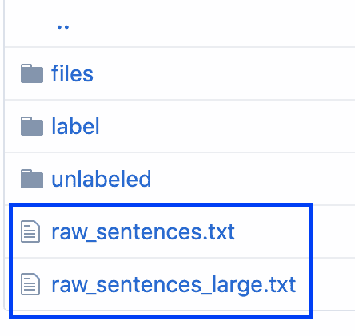
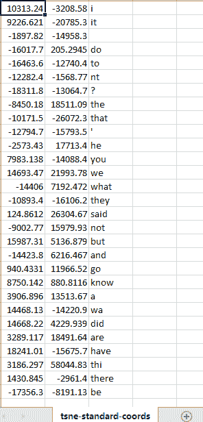
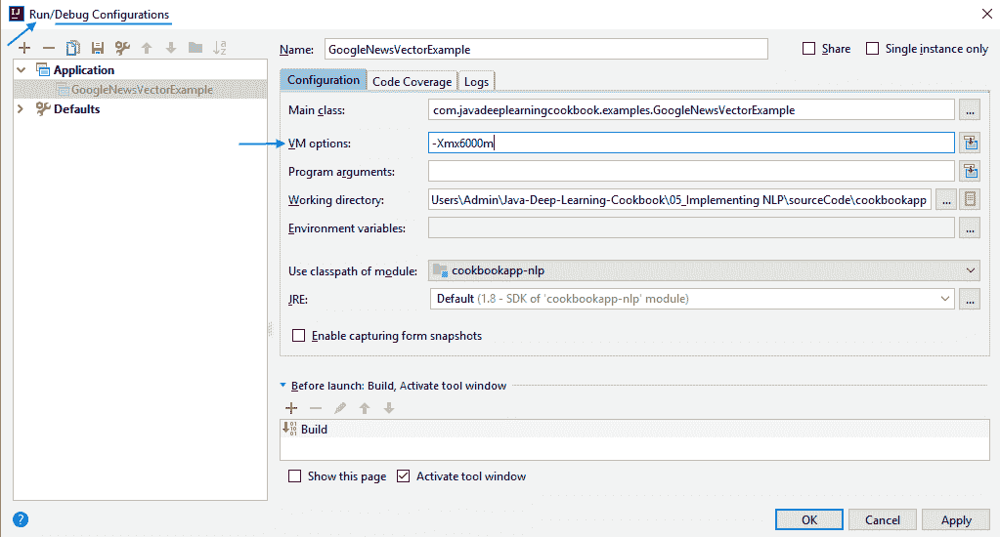
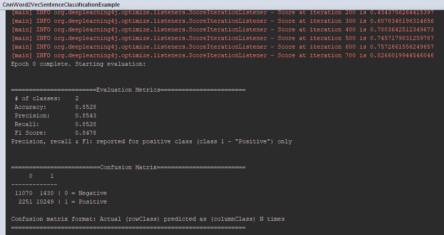
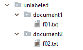

# 实现自然语言处理

本章将讨论 DL4J 中的词向量（Word2Vec）和段落向量（Doc2Vec）。我们将逐步开发一个完整的运行示例，涵盖所有阶段，如 ETL、模型配置、训练和评估。Word2Vec 和 Doc2Vec 是 DL4J 中的**自然语言处理**（**NLP**）实现。在讨论 Word2Vec 之前，值得简单提一下词袋模型算法。

**词袋模型**是一种计数文档中词汇出现次数的算法。这将使我们能够执行文档分类。词袋模型和 Word2Vec 只是两种不同的文本分类方法。**Word2Vec**可以利用从文档中提取的词袋来创建向量。除了这些文本分类方法之外，**词频-逆文档频率**（**TF-IDF**）可以用来判断文档的主题/上下文。在 TF-IDF 的情况下，将计算所有单词的分数，并将词频替换为该分数。TF-IDF 是一种简单的评分方案，但词嵌入可能是更好的选择，因为词嵌入可以捕捉到语义相似性。此外，如果你的数据集较小且上下文是特定领域的，那么词袋模型可能比 Word2Vec 更适合。

Word2Vec 是一个两层神经网络，用于处理文本。它将文本语料库转换为向量。

请注意，Word2Vec 并不是一个**深度神经网络**（**DNN**）。它将文本数据转化为 DNN 可以理解的数字格式，从而实现定制化。

我们甚至可以将 Word2Vec 与 DNN 结合使用来实现这一目的。它不会通过重建训练输入词；相反，它使用语料库中的邻近词来训练词汇。

Doc2Vec（段落向量）将文档与标签关联，它是 Word2Vec 的扩展。Word2Vec 尝试将词与词相关联，而 Doc2Vec（段落向量）则将词与标签相关联。一旦我们将文档表示为向量格式，就可以将这些格式作为输入提供给监督学习算法，将这些向量映射到标签。

本章将涵盖以下几种方法：

+   读取和加载文本数据

+   对数据进行分词并训练模型

+   评估模型

+   从模型生成图形

+   保存和重新加载模型

+   导入 Google News 向量

+   排查问题和调整 Word2Vec 模型

+   使用 Word2Vec 进行基于 CNN 的句子分类

+   使用 Doc2Vec 进行文档分类

# 技术要求

本章讨论的示例可以在[`github.com/PacktPublishing/Java-Deep-Learning-Cookbook/tree/master/05_Implementing_NLP/sourceCode/cookbookapp/src/main/java/com/javadeeplearningcookbook/examples`](https://github.com/PacktPublishing/Java-Deep-Learning-Cookbook/tree/master/05_Implementing_NLP/sourceCode/cookbookapp/src/main/java/com/javadeeplearningcookbook/examples)找到。

克隆我们的 GitHub 仓库后，导航到名为 `Java-Deep-Learning-Cookbook/05_Implementing_NLP/sourceCode` 的目录。然后，通过导入 `pom.xml` 将 `cookbookapp` 项目作为 Maven 项目导入。

要开始使用 DL4J 中的 NLP，请在 `pom.xml` 中添加以下 Maven 依赖：

```py
<dependency>
 <groupId>org.deeplearning4j</groupId>
 <artifactId>deeplearning4j-nlp</artifactId>
 <version>1.0.0-beta3</version>
 </dependency>
```

# 数据要求

项目目录中有一个 `resource` 文件夹，其中包含用于 `LineIterator` 示例所需的数据：



对于 `CnnWord2VecSentenceClassificationExample` 或 `GoogleNewsVectorExampleYou`，你可以从以下网址下载数据集：

+   **Google News 向量**: [`deeplearning4jblob.blob.core.windows.net/resources/wordvectors/GoogleNews-vectors-negative300.bin.gz`](https://deeplearning4jblob.blob.core.windows.net/resources/wordvectors/GoogleNews-vectors-negative300.bin.gz)

+   **IMDB 评论数据**: [`ai.stanford.edu/~amaas/data/sentiment/aclImdb_v1.tar.gz`](http://ai.stanford.edu/~amaas/data/sentiment/aclImdb_v1.tar.gz)

请注意，IMDB 评论数据需要提取两次才能获得实际的数据集文件夹。

对于**t-分布随机邻域嵌入**（**t-SNE**）可视化示例，所需的数据（`words.txt`）可以在项目根目录中找到。

# 读取和加载文本数据

我们需要加载原始文本格式的句子，并使用一个下划线迭代器来迭代它们。文本语料库也可以进行预处理，例如转换为小写。在配置 Word2Vec 模型时，可以指定停用词。在本教程中，我们将从各种数据输入场景中提取并加载文本数据。

# 准备就绪

根据你要加载的数据类型和加载方式，从第 1 步到第 5 步选择一个迭代器方法。

# 如何做...

1.  使用 `BasicLineIterator` 创建句子迭代器：

```py
File file = new File("raw_sentences.txt");
SentenceIterator iterator = new BasicLineIterator(file);
```

例如，访问 [`github.com/PacktPublishing/Java-Deep-Learning-Cookbook/blob/master/05_Implementing_NLP/sourceCode/cookbookapp/src/main/java/com/javadeeplearningcookbook/examples/BasicLineIteratorExample.java`](https://github.com/PacktPublishing/Java-Deep-Learning-Cookbook/blob/master/05_Implementing_NLP/sourceCode/cookbookapp/src/main/java/com/javadeeplearningcookbook/examples/BasicLineIteratorExample.java)。

1.  使用 `LineSentenceIterator` 创建句子迭代器：

```py
File file = new File("raw_sentences.txt");
SentenceIterator iterator = new LineSentenceIterator(file);
```

例如，访问**[`github.com/PacktPublishing/Java-Deep-Learning-Cookbook/blob/master/05_Implementing_NLP/sourceCode/cookbookapp/src/main/java/com/javadeeplearningcookbook/examples/LineSentenceIteratorExample.java`](https://github.com/PacktPublishing/Java-Deep-Learning-Cookbook/blob/master/05_Implementing_NLP/sourceCode/cookbookapp/src/main/java/com/javadeeplearningcookbook/examples/LineSentenceIteratorExample.java)**。

1.  使用 `CollectionSentenceIterator` 创建句子迭代器：

```py
List<String> sentences= Arrays.asList("sample text", "sample text", "sample text");
SentenceIterator iter = new CollectionSentenceIterator(sentences); 
```

查看示例，请访问[`github.com/PacktPublishing/Java-Deep-Learning-Cookbook/blob/master/05_Implementing_NLP/sourceCode/cookbookapp/src/main/java/com/javadeeplearningcookbook/examples/CollectionSentenceIteratorExample.java`](https://github.com/PacktPublishing/Java-Deep-Learning-Cookbook/blob/master/05_Implementing_NLP/sourceCode/cookbookapp/src/main/java/com/javadeeplearningcookbook/examples/CollectionSentenceIteratorExample.java)。

1.  使用`FileSentenceIterator`创建一个句子迭代器：

```py
SentenceIterator iter = new FileSentenceIterator(new File("/home/downloads/sentences.txt"));
```

查看示例，请访问**[`github.com/PacktPublishing/Java-Deep-Learning-Cookbook/blob/master/05_Implementing_NLP/sourceCode/cookbookapp/src/main/java/com/javadeeplearningcookbook/examples/FileSentenceIteratorExample.java`](https://github.com/PacktPublishing/Java-Deep-Learning-Cookbook/blob/master/05_Implementing_NLP/sourceCode/cookbookapp/src/main/java/com/javadeeplearningcookbook/examples/FileSentenceIteratorExample.java)**。

1.  使用`UimaSentenceIterator`创建一个句子迭代器。

添加以下 Maven 依赖：

```py
<dependency>
 <groupId>org.deeplearning4j</groupId>
 <artifactId>deeplearning4j-nlp-uima</artifactId>
 <version>1.0.0-beta3</version>
 </dependency>
```

然后使用迭代器，如下所示：

```py
SentenceIterator iterator = UimaSentenceIterator.create("path/to/your/text/documents"); 
```

你也可以像这样使用它：

```py
SentenceIterator iter = UimaSentenceIterator.create("path/to/your/text/documents");
```

查看示例，请访问[`github.com/PacktPublishing/Java-Deep-Learning-Cookbook/blob/master/05_Implementing_NLP/sourceCode/cookbookapp/src/main/java/com/javadeeplearningcookbook/examples/UimaSentenceIteratorExample.java`](https://github.com/PacktPublishing/Java-Deep-Learning-Cookbook/blob/master/05_Implementing_NLP/sourceCode/cookbookapp/src/main/java/com/javadeeplearningcookbook/examples/UimaSentenceIteratorExample.java)。

1.  将预处理器应用到文本语料库：

```py
iterator.setPreProcessor(new SentencePreProcessor() {
 @Override
 public String preProcess(String sentence) {
 return sentence.toLowerCase();
 }
 });
```

查看示例，请访问[`github.com/PacktPublishing/Java-Deep-Learning-Cookbook/blob/master/05_Implementing_NLP/sourceCode/cookbookapp/src/main/java/com/javadeeplearningcookbook/examples/SentenceDataPreProcessor.java`](https://github.com/PacktPublishing/Java-Deep-Learning-Cookbook/blob/master/05_Implementing_NLP/sourceCode/cookbookapp/src/main/java/com/javadeeplearningcookbook/examples/SentenceDataPreProcessor.java)。

# 它是如何工作的……

在第 1 步中，我们使用了`BasicLineIterator`，这是一个基础的单行句子迭代器，没有涉及任何自定义。

在第 2 步中，我们使用`LineSentenceIterator`来遍历多句文本数据。这里每一行都被视为一个句子。我们可以用它来处理多行文本。

在第 3 步中，**`CollectionSentenceIterator`**将接受一个字符串列表作为文本输入，每个字符串表示一个句子（文档）。这可以是一个包含推文或文章的列表。

在第 4 步中，**`FileSentenceIterator`**处理文件/目录中的句子。每个文件的句子将逐行处理。

对于任何复杂的情况，我们建议使用**`UimaSentenceIterator`**，它是一个适当的机器学习级别管道。它会遍历一组文件并分割句子。 `UimaSentenceIterator` 管道可以执行分词、词形还原和词性标注。其行为可以根据传递的分析引擎进行自定义。这个迭代器最适合复杂数据，比如来自 Twitter API 的数据。分析引擎是一个文本处理管道。

如果你想在遍历一次后重新开始迭代器的遍历，你需要使用 `reset()` 方法。

我们可以通过在数据迭代器上定义预处理器来规范化数据并移除异常。因此，在步骤 5 中，我们定义了一个归一化器（预处理器）。

# 还有更多...

我们还可以通过传递分析引擎来使用 `UimaSentenceIterator` 创建句子迭代器，代码如下所示：

```py
SentenceIterator iterator = new UimaSentenceIterator(path,AnalysisEngineFactory.createEngine( AnalysisEngineFactory.createEngineDescription(TokenizerAnnotator.getDescription(), SentenceAnnotator.getDescription())));
```

分析引擎的概念借鉴自 UIMA 的文本处理管道。DL4J 提供了用于常见任务的标准分析引擎，支持进一步的文本自定义并决定句子的定义方式。分析引擎是线程安全的，相较于 OpenNLP 的文本处理管道。基于 ClearTK 的管道也被用来处理 DL4J 中常见的文本处理任务。

# 另请参见

+   **UIMA**: [`uima.apache.org/`](http://uima.apache.org/)

+   **OpenNLP**: [`opennlp.apache.org/`](http://opennlp.apache.org/)

# 分词数据并训练模型

我们需要执行分词操作以构建 Word2Vec 模型。句子（文档）的上下文是由其中的单词决定的。Word2Vec 模型需要的是单词而非句子（文档）作为输入，因此我们需要将句子拆分为原子单元，并在每次遇到空格时创建一个令牌。DL4J 拥有一个分词器工厂，负责创建分词器。 `TokenizerFactory` 为给定的字符串生成分词器。在这个教程中，我们将对文本数据进行分词，并在其上训练 Word2Vec 模型。

# 如何操作...

1.  创建分词器工厂并设置令牌预处理器：

```py
TokenizerFactory tokenFactory = new DefaultTokenizerFactory();
tokenFactory.setTokenPreProcessor(new CommonPreprocessor());

```

1.  将分词器工厂添加到 Word2Vec 模型配置中：

```py
Word2Vec model = new Word2Vec.Builder()
 .minWordFrequency(wordFrequency)
 .layerSize(numFeatures)
 .seed(seed)
 .epochs(numEpochs)
 .windowSize(windowSize)
 .iterate(iterator)
 .tokenizerFactory(tokenFactory)
 .build();

```

1.  训练 Word2Vec 模型：

```py
model.fit();
```

# 如何运作...

在步骤 1 中，我们使用了 `DefaultTokenizerFactory()` 来创建分词器工厂，用于将单词进行分词。 这是 Word2Vec 的默认分词器，它基于字符串分词器或流分词器。我们还使用了 `CommonPreprocessor` 作为令牌预处理器。预处理器会从文本语料库中移除异常。 `CommonPreprocessor` 是一个令牌预处理器实现，它移除标点符号并将文本转换为小写。它使用 `toLowerCase(String)` 方法，其行为取决于默认区域设置。

以下是我们在步骤 2 中所做的配置：

+   `minWordFrequency()`：这是词语在文本语料库中必须出现的最小次数。在我们的示例中，如果一个词出现次数少于五次，那么它将不会被学习。词语应在文本语料库中出现多次，以便模型能够学习到关于它们的有用特征。在非常大的文本语料库中，适当提高词语出现次数的最小值是合理的。

+   `layerSize()`：这定义了词向量中的特征数量。它等同于特征空间的维度数。用 100 个特征表示的词会成为 100 维空间中的一个点。

+   `iterate()`：这指定了训练正在进行的批次。我们可以传入一个迭代器，将其转换为词向量。在我们的例子中，我们传入了一个句子迭代器。

+   `epochs()`：这指定了整个训练语料库的迭代次数。

+   `windowSize()`：这定义了上下文窗口的大小。

# 还有更多内容……

以下是 DL4J Word2Vec 中可用的其他词法分析器工厂实现，用于为给定输入生成词法分析器：

+   `NGramTokenizerFactory`：这是一个基于*n*-gram 模型创建词法分析器的工厂。*N*-grams 是由文本语料库中的连续单词或字母组成，长度为*n*。

+   `PosUimaTokenizerFactory`：这是一个创建词法分析器的工厂，能够过滤部分词性标注。

+   `UimaTokenizerFactory`：这是一个使用 UIMA 分析引擎进行词法分析的工厂。该分析引擎对非结构化信息进行检查、发现并表示语义内容。非结构化信息包括但不限于文本文件。

以下是 DL4J 中内置的词元预处理器（不包括`CommonPreprocessor`）：

+   `EndingPreProcessor`：这是一个去除文本语料库中词尾的预处理器——例如，它去除词尾的*s*、*ed*、*.*、*ly*和*ing*。

+   `LowCasePreProcessor`：这是一个将文本转换为小写格式的预处理器。

+   `StemmingPreprocessor`：该词法分析器预处理器实现了从`CommonPreprocessor`继承的基本清理，并对词元执行英文 Porter 词干提取。

+   `CustomStemmingPreprocessor`：这是一个词干预处理器，兼容不同的词干处理程序，例如 lucene/tartarus 定义的`SnowballProgram`，如`RussianStemmer`、`DutchStemmer`和`FrenchStemmer`。这意味着它适用于多语言词干化。

+   `EmbeddedStemmingPreprocessor`：该词法分析器预处理器使用给定的预处理器并在其基础上对词元执行英文 Porter 词干提取。

我们也可以实现自己的词元预处理器——例如，一个移除所有停用词的预处理器。

# 评估模型

我们需要在评估过程中检查特征向量的质量。这将帮助我们了解生成的 Word2Vec 模型的质量。在本食谱中，我们将采用两种不同的方法来评估 Word2Vec 模型。

# 如何操作...

1.  找到与给定词语相似的词：

```py
Collection<String> words = model.wordsNearest("season",10); 
```

您将看到类似以下的*n*输出：

```py
week
game
team
year
world
night
time
country
last
group
```

1.  找到给定两个词的余弦相似度：

```py
double cosSimilarity = model.similarity("season","program");
System.out.println(cosSimilarity);

```

对于前面的示例，余弦相似度的计算方法如下：

```py
0.2720930874347687

```

# 它是如何工作的...

在第一步中，我们通过调用`wordsNearest()`，提供输入和数量`n`，找到了与给定词语上下文最相似的前*n*个词。`n`的数量是我们希望列出的词数。

在第二步中，我们尝试找出两个给定词语的相似度。为此，我们实际上计算了这两个给定词语之间的**余弦相似度**。余弦相似度是我们用来衡量词语/文档相似度的有用度量之一。我们使用训练好的模型将输入词语转化为向量。

# 还有更多...

余弦相似度是通过计算两个非零向量之间的角度余弦值来度量相似度的。这个度量方法衡量的是方向性，而不是大小，因为余弦相似度计算的是文档向量之间的角度，而不是词频。如果角度为零，那么余弦值将达到 1，表示它们非常相似。如果余弦相似度接近零，则表示文档之间的相似度较低，文档向量将是正交（垂直）关系。此外，彼此不相似的文档会产生负的余弦相似度。对于这些文档，余弦相似度可能会达到-1，表示文档向量之间的角度为 180 度。

# 从模型生成图表

我们已经提到，在训练 Word2Vec 模型时，我们使用了`100`的层大小。这意味着可以有 100 个特征，并最终形成一个 100 维的特征空间。我们无法绘制一个 100 维的空间，因此我们依赖于 t-SNE 进行降维。在本食谱中，我们将从 Word2Vec 模型中生成 2D 图表。

# 准备工作

对于这个配方，请参考以下 t-SNE 可视化示例：[//github.com/PacktPublishing/Java-Deep-Learning-Cookbook/blob/master/05_Implementing_NLP/sourceCode/cookbookapp/src/main/java/com/javadeeplearningcookbook/examples/TSNEVisualizationExample.java](https://github.com/PacktPublishing/Java-Deep-Learning-Cookbook/blob/master/05_Implementing_NLP/sourceCode/cookbookapp/src/main/java/com/javadeeplearningcookbook/examples/TSNEVisualizationExample.java)。

示例将在 CSV 文件中生成 t-SNE 图表。

# 如何操作...

1.  在源代码的开头添加以下代码片段，以设置当前 JVM 运行时的数据类型：

```py
Nd4j.setDataType(DataBuffer.Type.DOUBLE);
```

1.  将词向量写入文件：

```py
WordVectorSerializer.writeWordVectors(model.lookupTable(),new File("words.txt"));
```

1.  使用`WordVectorSerializer`将唯一单词的权重分离成自己的列表：

```py
Pair<InMemoryLookupTable,VocabCache> vectors = WordVectorSerializer.loadTxt(new File("words.txt"));
VocabCache cache = vectors.getSecond();
INDArray weights = vectors.getFirst().getSyn0(); 

```

1.  创建一个列表来添加所有独特的词：

```py
 List<String> cacheList = new ArrayList<>();
 for(int i=0;i<cache.numWords();i++){
 cacheList.add(cache.wordAtIndex(i));
 }
```

1.  使用 `BarnesHutTsne` 构建一个双树 t-SNE 模型来进行降维：

```py
BarnesHutTsne tsne = new BarnesHutTsne.Builder()
 .setMaxIter(100)
 .theta(0.5)
 .normalize(false)
 .learningRate(500)
 .useAdaGrad(false)
 .build();

```

1.  建立 t-SNE 值并将其保存到文件：

```py
tsne.fit(weights);
tsne.saveAsFile(cacheList,"tsne-standard-coords.csv");
```

# 如何操作...

在第 2 步中，来自训练模型的词向量被保存到本地计算机，以便进一步处理。

在第 3 步中，我们使用 `WordVectorSerializer` 从所有独特的词向量中提取数据。基本上，这将从提到的输入词汇中加载一个内存中的 VocabCache。但它不会将整个词汇表/查找表加载到内存中，因此能够处理通过网络传输的大型词汇表。

`VocabCache` 管理存储 Word2Vec 查找表所需的信息。我们需要将标签传递给 t-SNE 模型，而标签就是通过词向量表示的词。

在第 4 步中，我们创建了一个列表来添加所有独特的词。

`BarnesHutTsne` 短语是 DL4J 实现类，用于双树 t-SNE 模型。Barnes–Hut 算法采用双树近似策略。建议使用其他方法，如 **主成分分析** (**PCA**) 或类似方法，将维度降到最多 50。

在第 5 步中，我们使用 `BarnesHutTsne` 设计了一个 t-SNE 模型。这个模型包含以下组件：

+   `theta()`：这是 Barnes–Hut 平衡参数。

+   `useAdaGrad()`：这是在自然语言处理应用中使用的传统 AdaGrad 实现。

一旦 t-SNE 模型设计完成，我们可以使用从词汇中加载的权重来拟合它。然后，我们可以将特征图保存到 Excel 文件中，如第 6 步所示。

特征坐标将如下所示：



我们可以使用 gnuplot 或任何其他第三方库来绘制这些坐标。DL4J 还支持基于 JFrame 的可视化。

# 保存并重新加载模型

模型持久化是一个关键话题，尤其是在与不同平台操作时。我们还可以重用该模型进行进一步的训练（迁移学习）或执行任务。

在本示例中，我们将持久化（保存和重新加载）Word2Vec 模型。

# 如何操作...

1.  使用 `WordVectorSerializer` 保存 Word2Vec 模型：

```py
WordVectorSerializer.writeWord2VecModel(model, "model.zip");
```

1.  使用 `WordVectorSerializer` 重新加载 Word2Vec 模型：

```py
Word2Vec word2Vec = WordVectorSerializer.readWord2VecModel("model.zip");
```

# 如何操作...

在第 1 步中，`writeWord2VecModel()` 方法将 Word2Vec 模型保存为压缩的 ZIP 文件，并将其发送到输出流。它保存了完整的模型，包括 `Syn0` 和 `Syn1`。`Syn0` 是存储原始词向量的数组，并且是一个投影层，可以将词的独热编码转换为正确维度的密集嵌入向量。`Syn1` 数组代表模型的内部隐含权重，用于处理输入/输出。

在第 2 步中，`readWord2VecModel()` 方法加载以下格式的模型：

+   二进制模型，可以是压缩的或未压缩的

+   流行的 CSV/Word2Vec 文本格式

+   DL4J 压缩格式

请注意，只有权重会通过此方法加载。

# 导入 Google 新闻向量

Google 提供了一个预训练的大型 Word2Vec 模型，包含大约 300 万个 300 维的英文单词向量。它足够大，并且预训练后能够展示出良好的结果。我们将使用 Google 向量作为输入单词向量进行评估。运行此示例至少需要 8 GB 的 RAM。在本教程中，我们将导入 Google News 向量并进行评估。

# 如何操作...

1.  导入 Google News 向量：

```py
File file = new File("GoogleNews-vectors-negative300.bin.gz");
Word2Vec model = WordVectorSerializer.readWord2VecModel(file);
```

1.  对 Google News 向量进行评估：

```py
model.wordsNearest("season",10))
```

# 工作原理...

在步骤 1 中，使用 `readWord2VecModel()` 方法加载保存为压缩文件格式的预训练 Google News 向量。

在步骤 2 中，使用 `wordsNearest()` 方法根据正负分数查找与给定单词最相近的单词。

执行完步骤 2 后，我们应该看到以下结果：


你可以尝试使用自己的输入来测试此技术，看看不同的结果。

# 还有更多...

Google News 向量的压缩模型文件大小为 1.6 GB。加载和评估该模型可能需要一些时间。如果你第一次运行代码，可能会观察到 `OutOfMemoryError` 错误：


现在我们需要调整虚拟机（VM）选项，以便为应用程序提供更多内存。你可以在 IntelliJ IDE 中调整 VM 选项，如下图所示。你只需要确保分配了足够的内存值，并重新启动应用程序：



# 故障排除和调优 Word2Vec 模型

Word2Vec 模型可以进一步调整，以产生更好的结果。在内存需求较高而资源不足的情况下，可能会发生运行时错误。我们需要对它们进行故障排除，理解发生的原因并采取预防措施。在本教程中，我们将对 Word2Vec 模型进行故障排除和调优。

# 如何操作...

1.  在应用程序控制台/日志中监控 `OutOfMemoryError`，检查是否需要增加堆空间。

1.  检查 IDE 控制台中的内存溢出错误。如果出现内存溢出错误，请向 IDE 中添加 VM 选项，以增加 Java 堆内存。

1.  在运行 Word2Vec 模型时，监控 `StackOverflowError`。注意以下错误：


这个错误可能是由于项目中不必要的临时文件造成的。

1.  对 Word2Vec 模型进行超参数调优。你可能需要多次训练，使用不同的超参数值，如 `layerSize`、`windowSize` 等。

1.  在代码层面推导内存消耗。根据代码中使用的数据类型及其消耗的数据量来计算内存消耗。

# 工作原理...

内存溢出错误通常表明需要调整 VM 选项。如何调整这些参数取决于硬件的内存容量。对于步骤 1，如果你使用的是像 IntelliJ 这样的 IDE，你可以通过 VM 属性如`-Xmx`、`-Xms`等提供 VM 选项。VM 选项也可以通过命令行使用。

例如，要将最大内存消耗增加到 8 GB，你需要在 IDE 中添加`-Xmx8G` `VM`参数。

为了缓解步骤 2 中提到的`StackOverflowError`，我们需要删除在项目目录下由 Java 程序执行时创建的临时文件。这些临时文件应类似于以下内容：


关于步骤 3，如果你观察到你的 Word2Vec 模型未能包含原始文本数据中的所有词汇，那么你可能会考虑增加 Word2Vec 模型的 层大小 。这个`layerSize`实际上就是输出向量维度或特征空间维度。例如，在我们的代码中，我们的`layerSize`为`100`。这意味着我们可以将其增大到更大的值，比如`200`，作为一种解决方法：

```py
Word2Vec model = new Word2Vec.Builder()
 .iterate(iterator)
 .tokenizerFactory(tokenizerFactory)
 .minWordFrequency(5)
 .layerSize(200)
 .seed(42)
 .windowSize(5)
 .build();
```

如果你有一台 GPU 加速的机器，你可以用它来加速 Word2Vec 的训练时间。只要确保 DL4J 和 ND4J 后端的依赖项按常规添加即可。如果结果看起来仍然不对，确保没有归一化问题。

如`wordsNearest()`等任务默认使用归一化权重，而其他任务则需要未归一化的权重。

关于步骤 4，我们可以使用传统方法。权重矩阵是 Word2Vec 中内存消耗最大的部分。其计算方法如下：

*词汇数 * 维度数 * 2 * 数据类型内存占用*

例如，如果我们的 Word2Vec 模型包含 100,000 个词汇，且使用 `long` 数据类型，100 个维度，则权重矩阵的内存占用为 100,000 * 100 * 2 * 8（long 数据类型大小）= 160 MB RAM，仅用于权重矩阵。

请注意，DL4J UI 仅提供内存消耗的高层概览。

# 另见

+   请参考官方的 DL4J 文档，[`deeplearning4j.org/docs/latest/deeplearning4j-config-memory`](https://deeplearning4j.org/docs/latest/deeplearning4j-config-memory)以了解更多关于内存管理的信息。

# 使用 Word2Vec 进行 CNN 的句子分类

神经网络需要数值输入才能按预期执行操作。对于文本输入，我们不能直接将文本数据输入神经网络。由于`Word2Vec`将文本数据转换为向量，因此可以利用 Word2Vec，使得我们可以将其与神经网络结合使用。我们将使用预训练的 Google News 词向量模型作为参考，并在其基础上训练 CNN 网络。完成此过程后，我们将开发一个 IMDB 评论分类器，将评论分类为正面或负面。根据论文[`arxiv.org/abs/1408.5882`](https://arxiv.org/abs/1408.5882)中的内容，结合预训练的 Word2Vec 模型和 CNN 会带来更好的结果。

我们将采用定制的 CNN 架构，并结合 2014 年 Yoon Kim 在其论文中建议的预训练词向量模型，[`arxiv.org/abs/1408.5882`](https://arxiv.org/abs/1408.5882)。该架构稍微比标准 CNN 模型更为复杂。我们还将使用两个巨大的数据集，因此应用程序可能需要相当大的 RAM 和性能基准，以确保可靠的训练时间并避免`OutOfMemory`错误。

在本教程中，我们将使用 Word2Vec 和 CNN 进行句子分类。

# 准备开始

参考示例：[`github.com/PacktPublishing/Java-Deep-Learning-Cookbook/blob/master/05_Implementing_NLP/sourceCode/cookbookapp/src/main/java/com/javadeeplearningcookbook/examples/CnnWord2VecSentenceClassificationExample.java`](https://github.com/PacktPublishing/Java-Deep-Learning-Cookbook/blob/master/05_Implementing_NLP/sourceCode/cookbookapp/src/main/java/com/javadeeplearningcookbook/examples/CnnWord2VecSentenceClassificationExample.java)。

你还应该确保通过更改 VM 选项来增加更多的 Java 堆空间——例如，如果你的 RAM 为 8GB，可以设置`-Xmx2G -Xmx6G`作为 VM 参数。

我们将在第一步中提取 IMDB 数据。文件结构将如下所示：


如果我们进一步进入数据集目录，你会看到它们被标记为以下内容：


# 如何执行...

1.  使用`WordVectorSerializer`加载词向量模型：

```py
WordVectors wordVectors = WordVectorSerializer.loadStaticModel(new File(WORD_VECTORS_PATH));

```

1.  使用`FileLabeledSentenceProvider`创建句子提供器：

```py
 Map<String,List<File>> reviewFilesMap = new HashMap<>();
 reviewFilesMap.put("Positive", Arrays.asList(filePositive.listFiles()));
 reviewFilesMap.put("Negative", Arrays.asList(fileNegative.listFiles()));
 LabeledSentenceProvider sentenceProvider = new FileLabeledSentenceProvider(reviewFilesMap, rndSeed); 
```

1.  使用`CnnSentenceDataSetIterator`创建训练迭代器或测试迭代器，以加载 IMDB 评论数据：

```py
CnnSentenceDataSetIterator iterator = new CnnSentenceDataSetIterator.Builder(CnnSentenceDataSetIterator.Format.CNN2D)
 .sentenceProvider(sentenceProvider)
 .wordVectors(wordVectors) //we mention word vectors here
 .minibatchSize(minibatchSize)
 .maxSentenceLength(maxSentenceLength) //words with length greater than this will be ignored.
 .useNormalizedWordVectors(false)
 .build();

```

1.  通过添加默认的超参数来创建`ComputationGraph`配置：

```py
ComputationGraphConfiguration.GraphBuilder builder = new NeuralNetConfiguration.Builder()
 .weightInit(WeightInit.RELU)
 .activation(Activation.LEAKYRELU)
 .updater(new Adam(0.01))
 .convolutionMode(ConvolutionMode.Same) //This is important so we can 'stack' the results later
 .l2(0.0001).graphBuilder();

```

1.  使用`addLayer()`方法配置`ComputationGraph`的层：

```py
builder.addLayer("cnn3", new ConvolutionLayer.Builder()
 .kernelSize(3,vectorSize) //vectorSize=300 for google vectors
 .stride(1,vectorSize)
 .nOut(100)
 .build(), "input");
 builder.addLayer("cnn4", new ConvolutionLayer.Builder()
 .kernelSize(4,vectorSize)
 .stride(1,vectorSize)
 .nOut(100)
 .build(), "input");
 builder.addLayer("cnn5", new ConvolutionLayer.Builder()
 .kernelSize(5,vectorSize)
 .stride(1,vectorSize)
 .nOut(100)
 .build(), "input");
```

1.  将卷积模式设置为稍后堆叠结果：

```py
builder.addVertex("merge", new MergeVertex(), "cnn3", "cnn4", "cnn5")

```

1.  创建并初始化`ComputationGraph`模型：

```py
ComputationGraphConfiguration config = builder.build();
 ComputationGraph net = new ComputationGraph(config);
  net.init();
```

1.  使用`fit()`方法进行训练：

```py
for (int i = 0; i < numEpochs; i++) {
 net.fit(trainIterator);
 }
```

1.  评估结果：

```py
Evaluation evaluation = net.evaluate(testIter);
System.out.println(evaluation.stats());
```

1.  获取 IMDB 评论数据的预测：

```py
INDArray features = ((CnnSentenceDataSetIterator)testIterator).loadSingleSentence(contents);
 INDArray predictions = net.outputSingle(features);
 List<String> labels = testIterator.getLabels();
 System.out.println("\n\nPredictions for first negative review:");
 for( int i=0; i<labels.size(); i++ ){
 System.out.println("P(" + labels.get(i) + ") = " + predictions.getDouble(i));
 }
```

# 它是如何工作的...

在第 1 步，我们使用 `loadStaticModel()` 从给定路径加载模型；但是，你也可以使用 `readWord2VecModel()`。与 `readWord2VecModel()` 不同，`loadStaticModel()` 使用主机内存。

在第 2 步，`FileLabeledSentenceProvider` 被用作数据源从文件中加载句子/文档。我们使用相同的方式创建了 `CnnSentenceDataSetIterator`。`CnnSentenceDataSetIterator` 处理将句子转换为 CNN 的训练数据，其中每个单词使用指定的词向量模型进行编码。句子和标签由 `LabeledSentenceProvider` 接口提供。`LabeledSentenceProvider` 的不同实现提供了不同的加载句子/文档及标签的方式。

在第 3 步，我们创建了 `CnnSentenceDataSetIterator` 来创建训练/测试数据集迭代器。我们在这里配置的参数如下：

+   `sentenceProvider()`：将句子提供者（数据源）添加到 `CnnSentenceDataSetIterator`。

+   `wordVectors()`：将词向量引用添加到数据集迭代器中——例如，Google News 词向量。

+   `useNormalizedWordVectors()`：设置是否可以使用标准化的词向量。

在第 5 步，我们为 `ComputationGraph` 模型创建了层。

`ComputationGraph` 配置是一个用于神经网络的配置对象，具有任意连接结构。它类似于多层配置，但允许网络架构具有更大的灵活性。

我们还创建了多个卷积层，并将它们按不同的滤波宽度和特征图堆叠在一起。

在第 6 步，`MergeVertex` 在激活这三层卷积层时执行深度连接。

一旦第 8 步之前的所有步骤完成，我们应该会看到以下评估指标：



在第 10 步，`contents` 指的是来自单句文档的字符串格式内容。

对于负面评论内容，在第 9 步后我们会看到以下结果：


这意味着该文档有 77.8%的概率呈现负面情绪。

# 还有更多内容...

使用从预训练无监督模型中提取的词向量进行初始化是提升性能的常见方法。如果你记得我们在这个示例中做过的事情，你会记得我们曾为同样的目的使用了预训练的 Google News 向量。对于 CNN，当其应用于文本而非图像时，我们将处理一维数组向量来表示文本。我们执行相同的步骤，如卷积和最大池化与特征图，正如在第四章《构建卷积神经网络》中讨论的那样。唯一的区别是，我们使用的是表示文本的向量，而不是图像像素。随后，CNN 架构在 NLP 任务中展现了出色的结果。可以在[`www.aclweb.org/anthology/D14-1181`](https://www.aclweb.org/anthology/D14-1181)中找到有关此主题的进一步见解。

计算图的网络架构是一个有向无环图，其中图中的每个顶点都是一个图顶点。图顶点可以是一个层，或者是定义随机前向/反向传递功能的顶点。计算图可以有任意数量的输入和输出。我们需要叠加多个卷积层，但在普通的 CNN 架构中这是不可能的。

`ComputaionGraph` 提供了一个配置选项，称为 `convolutionMode`。`convolutionMode` 决定了网络配置以及卷积和下采样层的卷积操作如何执行（对于给定的输入大小）。网络配置如 `stride`/`padding`/`kernelSize` 适用于特定的卷积模式。我们通过设置 `convolutionMode` 来配置卷积模式，因为我们希望将三个卷积层的结果叠加为一个并生成预测。

卷积层和下采样层的输出尺寸在每个维度上计算方式如下：

*outputSize = (inputSize - kernelSize + 2*padding) / stride + 1*

如果 `outputSize` 不是整数，则在网络初始化或前向传递过程中将抛出异常。我们之前讨论过 `MergeVertex`，它用于组合两个或更多层的激活值。我们使用 `MergeVertex` 来执行与卷积层相同的操作。合并将取决于输入类型——例如，如果我们想要合并两个卷积层，样本大小（`batchSize`）为 `100`，并且 `depth` 分别为 `depth1` 和 `depth2`，则 `merge` 将按以下规则叠加结果：

*depth = depth1 + depth2*

# 使用 Doc2Vec 进行文档分类

Word2Vec 将词汇与词汇相关联，而 Doc2Vec（也称为段落向量）的目的是将标签与词汇相关联。在本食谱中，我们将讨论 Doc2Vec。文档按特定方式标记，使文档根目录下的子目录表示文档标签。例如，所有与金融相关的数据应放在`finance`子目录下。在这个食谱中，我们将使用 Doc2Vec 进行文档分类。

# 如何操作...

1.  使用`FileLabelAwareIterator`提取并加载数据：

```py
LabelAwareIterator labelAwareIterator = new FileLabelAwareIterator.Builder()
 .addSourceFolder(new ClassPathResource("label").getFile()).build();  
```

1.  使用`TokenizerFactory`创建一个分词器：

```py
TokenizerFactory tokenizerFactory = new DefaultTokenizerFactory();
tokenizerFactory.setTokenPreProcessor(new CommonPreprocessor()); 

```

1.  创建一个`ParagraphVector`模型定义：

```py
ParagraphVectors paragraphVectors = new ParagraphVectors.Builder()
 .learningRate(learningRate)
 .minLearningRate(minLearningRate)
 .batchSize(batchSize)
 .epochs(epochs)
 .iterate(labelAwareIterator)
 .trainWordVectors(true)
 .tokenizerFactory(tokenizerFactory)
 .build();

```

1.  通过调用`fit()`方法训练`ParagraphVectors`：

```py
paragraphVectors.fit();

```

1.  为未标记的数据分配标签并评估结果：

```py
ClassPathResource unClassifiedResource = new ClassPathResource("unlabeled");
 FileLabelAwareIterator unClassifiedIterator = new FileLabelAwareIterator.Builder()
 .addSourceFolder(unClassifiedResource.getFile())
 .build();
```

1.  存储权重查找表：

```py
InMemoryLookupTable<VocabWord> lookupTable = (InMemoryLookupTable<VocabWord>)paragraphVectors.getLookupTable();

```

1.  如下伪代码所示，预测每个未分类文档的标签：

```py
while (unClassifiedIterator.hasNextDocument()) {
//Calculate the domain vector of each document.
//Calculate the cosine similarity of the domain vector with all 
//the given labels
 //Display the results
 }

```

1.  从文档中创建标记，并使用迭代器来检索文档实例：

```py
LabelledDocument labelledDocument = unClassifiedIterator.nextDocument();
 List<String> documentAsTokens = tokenizerFactory.create(labelledDocument.getContent()).getTokens();

```

1.  使用查找表来获取词汇信息（`VocabCache`）：

```py
VocabCache vocabCache = lookupTable.getVocab();

```

1.  计算`VocabCache`中匹配的所有实例：

```py
AtomicInteger cnt = new AtomicInteger(0);
 for (String word: documentAsTokens) {
 if (vocabCache.containsWord(word)){
 cnt.incrementAndGet();
 }
 }
 INDArray allWords = Nd4j.create(cnt.get(), lookupTable.layerSize());

```

1.  将匹配词的词向量存储在词汇中：

```py
cnt.set(0);
 for (String word: documentAsTokens) {
 if (vocabCache.containsWord(word))
 allWords.putRow(cnt.getAndIncrement(), lookupTable.vector(word));
 }

```

1.  通过计算词汇嵌入的平均值来计算领域向量：

```py
INDArray documentVector = allWords.mean(0);

```

1.  检查文档向量与标记词向量的余弦相似度：

```py
List<String> labels = labelAwareIterator.getLabelsSource().getLabels();
 List<Pair<String, Double>> result = new ArrayList<>();
 for (String label: labels) {
 INDArray vecLabel = lookupTable.vector(label);
 if (vecLabel == null){
 throw new IllegalStateException("Label '"+ label+"' has no known vector!");
 }
 double sim = Transforms.cosineSim(documentVector, vecLabel);
 result.add(new Pair<String, Double>(label, sim));
 }
```

1.  显示结果：

```py
 for (Pair<String, Double> score: result) {
 log.info(" " + score.getFirst() + ": " + score.getSecond());
 }
```

# 它是如何工作的...

在第 1 步中，我们使用`FileLabelAwareIterator`创建了数据集迭代器。

`FileLabelAwareIterator`是一个简单的基于文件系统的`LabelAwareIterator`接口。它假设你有一个或多个按以下方式组织的文件夹：

+   **一级子文件夹**：标签名称

+   **二级子文件夹**：该标签对应的文档

查看以下截图，了解此数据结构的示例：


在第 3 步中，我们通过添加所有必需的超参数创建了**`ParagraphVector`**。段落向量的目的是将任意文档与标签关联。段落向量是 Word2Vec 的扩展，学习将标签和词汇相关联，而 Word2Vec 将词汇与其他词汇相关联。我们需要为段落向量定义标签，才能使其正常工作。

有关第 5 步中所做内容的更多信息，请参阅以下目录结构（项目中的`unlabeled`目录下）：



目录名称可以是随机的，不需要特定的标签。我们的任务是为这些文档找到适当的标签（文档分类）。词嵌入存储在查找表中。对于任何给定的词汇，查找表将返回一个词向量。

词汇嵌入存储在查找表中。对于任何给定的词汇，查找表将返回一个词向量。

在第 6 步中，我们通过段落向量创建了`InMemoryLookupTable`。`InMemoryLookupTable`是 DL4J 中的默认词汇查找表。基本上，查找表作为隐藏层操作，词汇/文档向量作为输出。

第 8 步到第 12 步仅用于计算每个文档的领域向量。

在第 8 步中，我们使用第 2 步中创建的分词器为文档创建了令牌。在第 9 步中，我们使用第 6 步中创建的查找表来获取`VocabCache`。`VocabCache`存储了操作查找表所需的信息。我们可以使用`VocabCache`在查找表中查找单词。

在第 11 步中，我们将单词向量与特定单词的出现次数一起存储在一个 INDArray 中。

在第 12 步中，我们计算了这个 INDArray 的均值，以获取文档向量。

在零维度上的均值意味着它是跨所有维度计算的。

在第 13 步中，余弦相似度是通过调用 ND4J 提供的`cosineSim()`方法计算的。我们使用余弦相似度来计算文档向量的相似性。ND4J 提供了一个功能接口，用于计算两个领域向量的余弦相似度。`vecLabel`表示从分类文档中获取的标签的文档向量。然后，我们将`vecLabel`与我们的未标记文档向量`documentVector`进行比较。

在第 14 步之后，你应该看到类似于以下的输出：


我们可以选择具有更高余弦相似度值的标签。从前面的截图中，我们可以推断出第一篇文档更可能是与金融相关的内容，概率为 69.7%。第二篇文档更可能是与健康相关的内容，概率为 53.2%。
