# 深度学习入门  

在本章中，我们将解释一些基础的**机器学习**（**ML**）和**深度学习（DL）**概念，这些概念将在后续的所有章节中使用。我们将从简要介绍机器学习开始。接下来，我们将讲解深度学习，它是机器学习的一个新兴分支。  

我们将简要讨论一些最著名和广泛使用的神经网络架构。接下来，我们将了解深度学习框架和库的各种特性。然后，我们将学习如何准备编程环境，在此基础上使用一些开源深度学习库，如**DeepLearning4J (DL4J)**进行编程。  

然后我们将解决一个非常著名的机器学习问题：泰坦尼克号生存预测。为此，我们将使用基于 Apache Spark 的**多层感知器**（**MLP**）分类器来解决这个问题。最后，我们将看到一些常见问题解答，帮助我们将深度学习的基本理解推广到更广泛的应用。简而言之，以下主题将被覆盖：  

+   机器学习的简单介绍  

+   人工神经网络（ANNs）

+   深度神经网络架构  

+   深度学习框架  

+   从灾难中学习深度学习——使用 MLP 进行泰坦尼克号生存预测  

+   常见问题解答（FAQ）  

# 机器学习的简单介绍  

机器学习方法基于一组统计和数学算法，以执行诸如分类、回归分析、概念学习、预测建模、聚类和挖掘有用模式等任务。因此，通过使用机器学习，我们旨在改善学习体验，使其变得自动化。结果，我们可能不需要完全的人类互动，或者至少我们可以尽可能减少这种互动的程度。  

# 机器学习算法的工作原理  

我们现在引用 Tom M. Mitchell 的经典机器学习定义（《机器学习，Tom Mitchell，McGraw Hill》），他从计算机科学的角度解释了学习真正意味着什么：  

“如果一个计算机程序在经验 E 的基础上，在某些任务类别 T 和性能度量 P 的衡量下，其在任务 T 上的表现通过经验 E 得到提升，那么我们就说该程序从经验中学习。”  

根据这个定义，我们可以得出结论：计算机程序或机器可以执行以下任务：  

+   从数据和历史中学习  

+   通过经验提升  

+   迭代优化一个可以用于预测问题结果的模型  

由于它们是预测分析的核心，几乎我们使用的每个机器学习算法都可以视为一个优化问题。这涉及到找到最小化目标函数的参数，例如，像成本函数和正则化这样的加权和。通常，一个目标函数有两个组成部分：  

+   一个正则化器，用来控制模型的复杂性  

+   损失，衡量模型在训练数据上的误差。  

另一方面，正则化参数定义了在最小化训练误差与模型复杂度之间的权衡，以避免过拟合问题。如果这两个组件都是凸的，那么它们的和也是凸的；否则，它是非凸的。更详细地说，在使用机器学习（ML）算法时，目标是获取能够在预测时返回最小误差的函数的最佳超参数。因此，使用凸优化技术，我们可以最小化该函数，直到它收敛到最小误差。

由于问题是凸的，通常更容易分析算法的渐进行为，这展示了当模型观察到越来越多的训练数据时，它的收敛速度如何。机器学习的挑战在于使模型训练能够识别复杂模式，并且不仅能以自动化的方式做出决策，还能尽可能地智能地做出决策。整个学习过程需要输入数据集，这些数据集可以被拆分（或已经提供）为三种类型，具体如下：

+   **训练集**是来自历史或实时数据的知识库，用于拟合机器学习算法的参数。在训练阶段，机器学习模型利用训练集来找到网络的最佳权重，并通过最小化训练误差来达到目标函数。在这里，使用**反向传播规则**（或其他更高级的优化器与适当的更新器；稍后会讨论）来训练模型，但所有超参数必须在学习过程开始之前设置**。**

+   **验证集**是一组用于调整机器学习模型参数的示例。它确保模型经过良好的训练，并能很好地泛化，从而避免过拟合。一些机器学习实践者也将其称为**开发集**或**dev 集**。

+   **测试集**用于评估训练模型在未见过的数据上的表现。此步骤也称为**模型推理**。在对测试集中的最终模型进行评估后（即，当我们对模型的表现完全满意时），我们不需要进一步调整模型，训练好的模型可以部署到生产环境中。

一个常见的做法是将输入数据（在必要的预处理和特征工程后）拆分为 60%的训练数据，10%的验证数据和 20%的测试数据，但这实际上取决于具体使用案例。此外，有时我们需要根据数据集的可用性和质量对数据进行上采样或下采样。

此外，学习理论使用的是源自概率论和信息论的数学工具。将简要讨论三种学习范式：

+   有监督学习

+   无监督学习

+   强化学习

以下图表总结了三种学习类型及其所解决的问题：

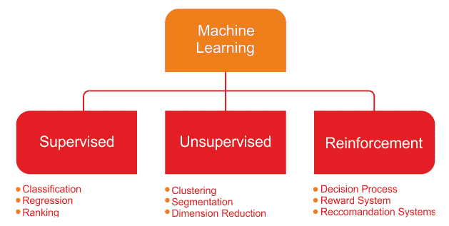

学习类型及相关问题

# 监督学习

**监督学习**是最简单且最著名的自动学习任务。它基于一组预定义的示例，其中每个输入所属的类别已经知道。*图 2*展示了监督学习的典型工作流程。

一位参与者（例如，机器学习实践者、数据科学家、数据工程师、机器学习工程师等）执行**提取转换加载**（**ETL**）及必要的特征工程（包括特征提取、选择等），以获得具有特征和标签的适当数据。然后他执行以下操作：

1.  将数据拆分为训练集、开发集和测试集

1.  使用训练集训练机器学习模型

1.  验证集用于验证训练是否过拟合以及正则化

1.  然后，他在测试集上评估模型的表现（即未见过的数据）

1.  如果性能不令人满意，他可以进行额外的调优，以通过超参数优化获得最佳模型

1.  最后，他将最佳模型部署到生产环境中


监督学习的实际应用

在整个生命周期中，可能会有多个参与者参与（例如，数据工程师、数据科学家或机器学习工程师），他们独立或协作执行每个步骤。

监督学习的任务包括**分类**和**回归**；分类用于预测数据点属于哪个类别（**离散值**），而回归用于预测**连续值**。换句话说，分类任务用于预测类属性的标签，而回归任务则用于对类属性进行数值预测。

在监督学习的背景下，**不平衡数据**指的是分类问题，其中不同类别的实例数量不平衡。例如，如果我们有一个仅针对两个类别的分类任务，**平衡数据**意味着每个类别都有 50%的预先分类示例。

如果输入数据集稍微不平衡（例如，某一类占 60%，另一类占 40%），学习过程将要求将输入数据集随机拆分为三个子集，其中 50%用于训练集，20%用于验证集，剩余 30%用于测试集。

# 无监督学习

在**无监督学习**中，训练阶段将输入集提供给系统。与监督学习不同，输入对象没有被标记其类别。对于分类任务，我们假设给定一个正确标记的数据集。然而，在现实世界中收集数据时，我们不总是拥有这种优势。

例如，假设你在硬盘的一个拥挤且庞大的文件夹中有一大堆完全合法的、没有盗版的 MP3 文件。在这种情况下，如果我们无法直接访问它们的元数据，我们如何可能将歌曲归类呢？一种可能的方法是混合各种机器学习技术，但聚类往往是最好的解决方案。

那么，假设你能构建一个聚类预测模型，帮助自动将相似的歌曲分组，并将它们组织成你最喜欢的类别，如*乡村*、*说唱*、*摇滚*等。简而言之，无监督学习算法通常用于聚类问题。下图给我们展示了应用聚类技术解决此类问题的思路：

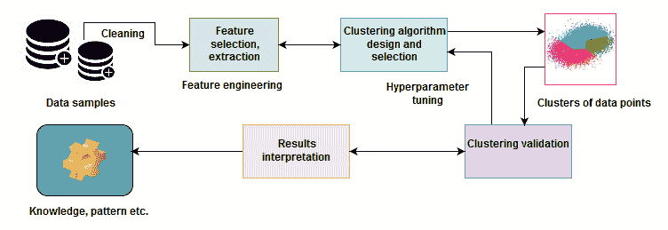

聚类技术 —— 一种无监督学习的例子

尽管数据点没有标签，但我们仍然可以进行必要的特征工程和对象分组，将属于同一组的对象（称为**聚类**）聚集在一起。这对于人类来说并不容易。标准方法是定义两个对象之间的相似度度量，然后寻找任何比其他聚类中的对象更相似的对象群集。一旦我们完成了数据点（即 MP3 文件）的聚类并完成验证，我们就能知道数据的模式（即，哪些类型的 MP3 文件属于哪个组）。

# 强化学习

**强化学习**是一种人工智能方法，专注于通过与环境的交互来学习系统。在强化学习中，系统的参数会根据从环境中获得的反馈进行调整，而环境又会对系统做出的决策提供反馈。下图展示了一个人在做决策，以便到达目的地。

让我们以你从家到工作地点的路线为例。在这种情况下，你每天都走相同的路线。然而，某天你突然好奇，决定尝试另一条路线，目的是寻找最短的路径。这个尝试新路线与坚持走最熟悉路线之间的两难困境，就是**探索与利用**的一个例子：


一个智能体始终尝试到达目的地

我们可以看一个更多的例子，假设有一个系统模拟一个棋手。为了提高其表现，系统利用先前动作的结果；这样的系统被称为强化学习系统。

# 将机器学习任务整合在一起

我们已经了解了机器学习算法的基本工作原理。接下来我们了解了基本的机器学习任务，以及它们如何形成特定领域的问题。现在让我们来看一下如何总结机器学习任务以及一些应用，如下图所示：

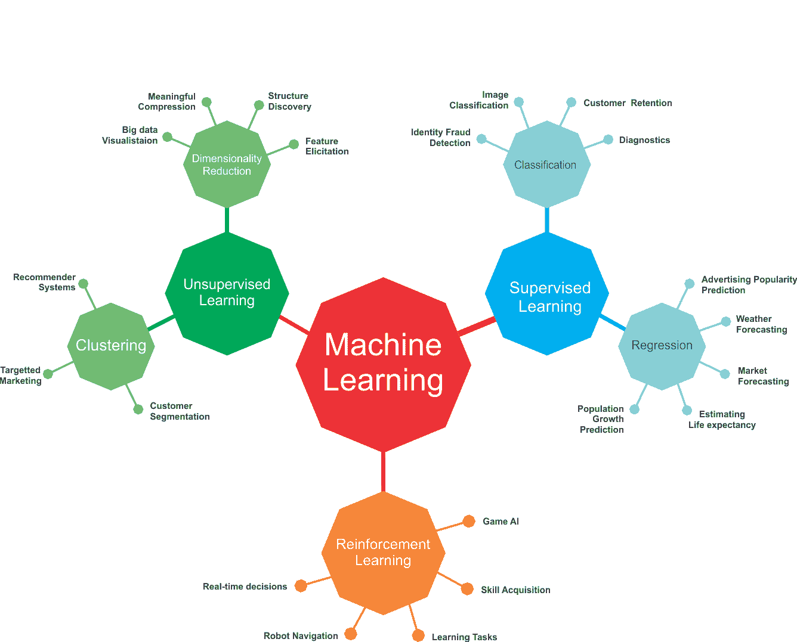

来自不同应用领域的机器学习任务及一些应用案例

然而，前面的图表只列出了使用不同机器学习任务的一些应用案例。在实践中，机器学习在许多应用场景中都有广泛应用。我们将在本书中尽量涵盖其中的一些案例。

# 深入了解深度学习

以往在常规数据分析中使用的简单机器学习方法已经不再有效，应该被更强大的机器学习方法所替代。尽管传统的机器学习技术允许研究人员识别相关变量的组或聚类，但随着大规模和高维数据集的增加，这些方法的准确性和有效性逐渐降低。

这里出现了深度学习，它是近年来人工智能领域最重要的进展之一。深度学习是机器学习的一个分支，基于一套算法，旨在尝试对数据中的高级抽象进行建模。

# 深度学习是如何将机器学习提升到一个新水平的？

简而言之，深度学习算法大多是一些人工神经网络（ANN），它们能够更好地表示大规模数据集，从而建立能够深入学习这些表示的模型。如今，这不仅仅局限于人工神经网络，实际上，理论上的进展以及软件和硬件的改进都是我们能够走到今天这一步的必要条件。在这方面，Ian Goodfellow 等人（《深度学习》，MIT 出版社，2016 年）将深度学习定义如下：

“深度学习是一种特定类型的机器学习，通过学习将世界表示为一个嵌套的概念层级结构，在这个层级中，每个概念都是相对于更简单的概念来定义的，更抽象的表示是通过较不抽象的表示来计算的，从而实现了巨大的能力和灵活性。”

让我们举个例子；假设我们想开发一个预测分析模型，比如一个动物识别器，在这种情况下，我们的系统需要解决两个问题：

+   用于判断一张图片是猫还是狗

+   用于将狗和猫的图片进行聚类。

如果我们使用典型的机器学习方法来解决第一个问题，我们必须定义面部特征（如耳朵、眼睛、胡须等），并编写一个方法来识别在分类特定动物时哪些特征（通常是非线性的）更为重要。

然而，与此同时，我们无法解决第二个问题，因为用于图像聚类的传统机器学习算法（例如**k-means**）无法处理非线性特征。深度学习算法将把这两个问题提升一个层次，最重要的特征将在确定哪些特征对分类或聚类最为重要后自动提取。

相比之下，当使用传统的机器学习算法时，我们必须手动提供这些特征。总结来说，深度学习的工作流程如下：

+   深度学习算法首先会识别在聚类猫或狗时最相关的边缘。接着，它会尝试以层级方式找到各种形状和边缘的组合。这个步骤叫做 ETL（提取、转换、加载）。

+   经过多次迭代后，复杂概念和特征的层级识别被执行。然后，基于已识别的特征，深度学习算法自动决定哪些特征在统计上对分类动物最为重要。这个步骤叫做特征提取。

+   最后，算法去掉标签列，使用**自编码器**（**AEs**）进行无监督训练，以提取潜在特征，再将这些特征分配给 k-means 进行聚类。

+   然后，聚类分配硬化损失（CAH 损失）和重建损失被联合优化，以实现最优的聚类分配。深度嵌入聚类（详见[`arxiv.org/pdf/1511.06335.pdf`](https://arxiv.org/pdf/1511.06335.pdf)）就是这种方法的一个例子。我们将在第十一章中讨论基于深度学习的聚类方法，*讨论、当前趋势与展望*。

到目前为止，我们看到深度学习系统能够识别图像代表的是什么。计算机看图像的方式与我们不同，因为它只知道每个像素的位置和颜色。通过深度学习技术，图像被分解成多个分析层次。

在较低的层次上，软件分析例如一小块像素网格，任务是检测某种颜色或其不同的色调。如果它发现了什么，它会通知下一层，下一层会检查该颜色是否属于更大的形态，比如一条线。这个过程会一直持续到更高层次，直到你理解图像展示的内容。下图展示了我们在图像分类系统中讨论的内容：

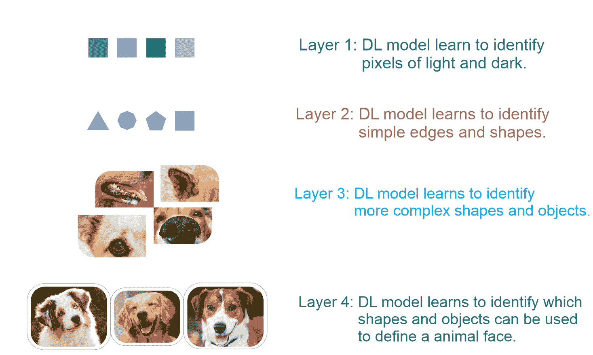

在处理狗与猫分类问题时的深度学习系统工作原理

更准确地说，前述的图像分类器可以逐层构建，如下所示：

+   **第一层**：算法开始识别原始图像中的暗像素和亮像素。

+   **第二层**：算法接着识别边缘和形状。

+   **第三层**：接下来，算法识别更复杂的形状和物体。

+   **第四层**：算法接着学习哪些物体定义了人脸。

尽管这只是一个非常简单的分类器，但能够进行这些操作的软件如今已经非常普及，广泛应用于面部识别系统，或例如在 Google 中通过图像进行搜索的系统。这些软件是基于深度学习算法的。

相反，通过使用线性机器学习（ML）算法，我们无法构建这样的应用程序，因为这些算法无法处理非线性的图像特征。而且，使用机器学习方法时，我们通常只处理少数几个超参数。然而，当神经网络进入这个领域时，事情变得复杂了。在每一层中，都有数百万甚至数十亿个超参数需要调整，以至于成本函数变得非凸。

另一个原因是隐藏层中使用的激活函数是非线性的，因此成本是非凸的。我们将在后续章节中更详细地讨论这一现象，但先快速了解一下人工神经网络（ANNs）。

# 人工神经网络（ANNs）

人工神经网络（ANNs）基于深度学习的概念。它们通过多个神经元之间的相互通信，代表了人类神经系统的工作方式，这些神经元通过轴突相互联系。

# 生物神经元

人工神经网络（ANNs）的工作原理受到人脑工作的启发，如*图 7*所示。受体接收来自内部或外部世界的刺激；然后将信息传递给生物*神经元*进行进一步处理。除了另一个长的延伸部分称为**轴突**外，还有许多树突。

在其末端，有一些微小的结构称为**突触末端**，用于将一个神经元连接到其他神经元的树突。生物神经元接收来自其他神经元的短电流冲动，称为**信号**，并以此触发自己的信号：

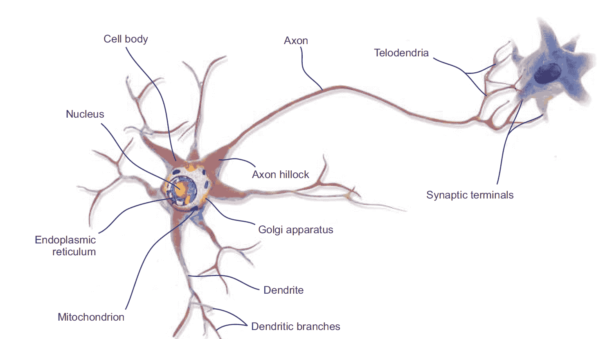

生物神经元的工作原理

我们可以总结出，神经元由一个细胞体（也称为胞体）、一个或多个**树突**用于接收来自其他神经元的信号，以及一个**轴突**用于传递神经元产生的信号。

当神经元向其他神经元发送信号时，它处于激活状态。然而，当它接收来自其他神经元的信号时，它处于非激活状态。在空闲状态下，神经元会积累所有接收到的信号，直到达到一定的激活阈值。这一现象促使研究人员提出了人工神经网络（ANN）。

# 人工神经网络（ANNs）的简史

受到生物神经元工作原理的启发，沃伦·麦卡洛克和沃尔特·皮茨于 1943 年提出了第一个人工神经元模型，作为神经活动的计算模型。这个简单的生物神经元模型，也称为**人工神经元（AN）**，有一个或多个二进制（开/关）输入，只有一个输出。

一个人工神经元只有在它的输入中有超过一定数量的输入处于活动状态时，才会激活它的输出。例如，在这里我们看到几个执行各种逻辑运算的人工神经网络（ANNs）。在这个例子中，我们假设一个神经元只有在至少有两个输入处于活动状态时才会被激活：

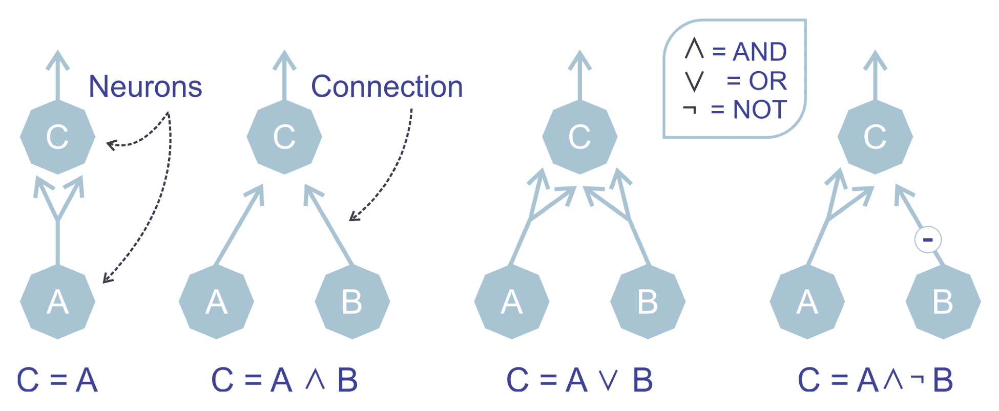

执行简单逻辑计算的人工神经网络（ANNs）

这个例子听起来过于简单，但即使是如此简化的模型，也能构建一个人工神经网络。然而，这些网络也可以组合在一起计算复杂的逻辑表达式。这个简化模型启发了约翰·冯·诺依曼、马文·明斯基、弗兰克·罗森布拉特等人在 1957 年提出了另一个模型——**感知器**。

感知器是过去 60 年里我们见过的最简单的人工神经网络架构之一。它基于一种略有不同的人工神经元——**线性阈值单元**（**LTU**）。唯一的区别是输入和输出现在是数字，而不是二进制的开/关值。每个输入连接都与一个权重相关联。LTU 计算其输入的加权和，然后对该和应用一个阶跃函数（类似于激活函数的作用），并输出结果：


左图表示一个线性阈值单元（LTU），右图显示一个感知器

感知器的一个缺点是其决策边界是线性的。因此，它们无法学习复杂的模式。它们也无法解决一些简单的问题，比如**异或**（**XOR**）。然而，后来通过堆叠多个感知器（称为 MLP），感知器的局限性在某种程度上得到了消除。

# 人工神经网络是如何学习的？

基于生物神经元的概念，人工神经元的术语和思想应运而生。与生物神经元类似，人工神经元由以下部分组成：

+   一个或多个输入连接，用于从神经元聚合信号

+   一个或多个输出连接，用于将信号传递到其他神经元

+   一个**激活函数**，用于确定输出信号的数值

神经网络的学习过程被配置为*迭代过程*，即对*权重*的*优化*（更多内容见下一节）。在每一轮训练中，权重都会被更新。一旦训练开始，目标是通过最小化损失函数来生成预测。然后，网络的性能将在测试集上进行评估。

现在我们知道了人工神经元的简单概念。然而，单单生成一些人工信号并不足以学习复杂的任务。尽管如此，一个常用的监督学习算法是反向传播算法，它被广泛用于训练复杂的人工神经网络。

# 人工神经网络和反向传播算法

反向传播算法旨在最小化当前输出与期望输出之间的误差。由于网络是前馈型的，激活流总是从输入单元向输出单元前进。

成本函数的梯度会反向传播，网络权重会被更新；该方法可以递归地应用于任何数量的隐藏层。在这种方法中，两种阶段之间的结合是非常重要的。简而言之，训练过程的基本步骤如下：

1.  用一些随机（或更先进的 XAVIER）权重初始化网络

1.  对于所有训练样本，按照接下来的步骤执行前向和后向传播

# 前向和后向传播

在前向传播中，会执行一系列操作来获得一些预测或评分。在这个操作中，创建一个图，将所有依赖操作按从上到下的方式连接起来。然后计算网络的误差，即预测输出与实际输出之间的差异。

另一方面，反向传播主要涉及数学运算，比如为所有微分操作（即自动微分方法）创建导数，从上到下（例如，测量损失函数以更新网络权重），对图中的所有操作进行处理，然后应用链式法则。

在这个过程中，对于所有层，从输出层到输入层，展示了网络层的输出与正确的输入（误差函数）。然后，调整当前层的权重以最小化误差函数。这是反向传播的优化步骤。顺便说一下，自动微分方法有两种类型：

1.  **反向模式**：关于所有输入的单个输出的导数

1.  **前向模式**：关于一个输入的所有输出的导数

反向传播算法以这样的方式处理信息，使得网络在学习迭代过程中减少全局误差；然而，这并不保证能够到达全局最小值。隐藏单元的存在和输出函数的非线性意味着误差的行为非常复杂，具有许多局部最小值。

这个反向传播步骤通常会执行成千上万次，使用许多训练批次，直到模型参数收敛到能最小化代价函数的值。当验证集上的误差开始增大时，训练过程结束，因为这可能标志着过拟合阶段的开始。

# 权重和偏置

除了神经元的状态外，还考虑突触权重，它影响网络中的连接。每个权重都有一个数值，表示为 *W[ij]*，它是连接神经元 *i* 和神经元 *j* 的突触权重。

**突触权重**：这个概念源自生物学，指的是两个节点之间连接的强度或幅度，在生物学中对应于一个神经元的激活对另一个神经元的影响程度。

对于每个神经元（也叫单元） *i*，可以定义一个输入向量 *x[i]* = (*x[1]*, *x[2]*, ... *x[n]*)，并且可以定义一个权重向量 *w[i]* = (*w[i1]*, *w[i2]*, ... *w[in]*)。现在，根据神经元的位置，权重和输出函数决定了单个神经元的行为。然后，在前向传播过程中，隐藏层中的每个单元都会接收到以下信号：


然而，在权重中，还有一种特殊类型的权重叫做*偏置*单元*b*。从技术上讲，偏置单元并不与任何前一层连接，因此它没有真正的活动。但偏置*b*的值仍然可以让神经网络将激活函数向左或向右平移。现在，考虑到偏置单元后，修改后的网络输出可以表示如下：


上述方程表示，每个隐藏单元都会得到输入的总和乘以相应的权重——求和节点。然后，求和节点的结果通过激活函数，激活函数会压缩输出，如下图所示：

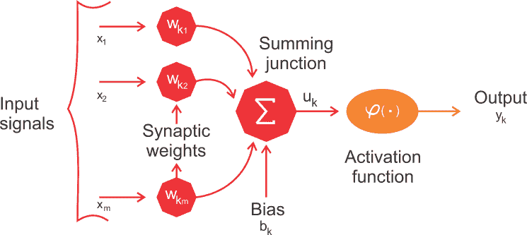

人工神经元模型

现在，有一个棘手的问题：我们该如何初始化权重？如果我们将所有的权重初始化为相同的值（例如 0 或 1），每个隐藏神经元都会得到完全相同的信号。让我们试着分析一下：

+   如果所有的权重都初始化为 1，那么每个单元将收到等于输入总和的信号

+   如果所有的权重都为 0，那么情况就更糟了，隐藏层中的每个神经元都会收到零信号

对于网络权重初始化，目前广泛使用 Xavier 初始化方法。它类似于随机初始化，但通常效果更好，因为它可以根据输入和输出神经元的数量自动确定初始化的规模。

有兴趣的读者可以参考这篇出版物以获取详细信息：Xavier Glorot 和 Yoshua Bengio，*理解训练深度前馈神经网络的难度*：2010 年第 13 届国际人工智能与统计学会议（**AISTATS**）论文集，地点：意大利撒丁岛 Chia Laguna 度假村；JMLR 卷 9：W&CP。

你可能会想，是否可以在训练普通的 DNN（例如 MLP 或 DBN）时摆脱随机初始化。最近，一些研究人员提到过随机正交矩阵初始化，这种方法比任何随机初始化更适合用于训练 DNN。

在初始化偏置时，我们可以将其初始化为零。但将所有偏置设置为一个小的常数值，例如 0.01，可以确保所有**修正线性单元**（**ReLU**）单元能够传播一些梯度。然而，这种方法并不表现良好，也没有展现出一致的改善。因此，推荐将其保持为零。

# 权重优化

在训练开始之前，网络的参数是随机设置的。然后，为了优化网络权重，使用一种叫做**梯度下降法**（**GD**）的迭代算法。通过 GD 优化，我们的网络根据训练集计算代价梯度。然后，通过迭代过程，计算误差函数*E*的梯度*G*。

在下图中，误差函数***E***的梯度**G**提供了当前值的误差函数最陡坡度的方向。由于最终目标是减少网络误差，梯度下降法沿着相反方向*-***G**前进，采取小步走。这一迭代过程执行多次，使得误差*E*逐渐下降，向全局最小值*移动。这样，最终目标是达到**G = 0**的点，表示无法再进行优化：

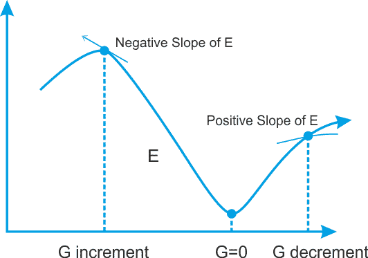

在搜索误差函数 E 的最小值时，我们朝着误差函数 E 的梯度 G 最小的方向移动

缺点是收敛速度太慢，导致无法满足处理大规模训练数据的需求。因此，提出了一种更快的梯度下降法，称为**随机梯度下降法**（**SGD**），这也是深度神经网络（DNN）训练中广泛使用的优化器。在 SGD 中，每次迭代我们只使用来自训练集的一个训练样本来更新网络参数。

我并不是说 SGD 是唯一可用的优化算法，但现在有很多先进的优化器可供选择，例如 Adam、RMSProp、ADAGrad、Momentum 等。或多或少，它们大多数都是 SGD 的直接或间接优化版本。

顺便说一下，术语**随机**源于基于每次迭代中单个训练样本的梯度是对真实代价梯度的随机近似。

# 激活函数

为了让神经网络学习复杂的决策边界，我们在某些层上应用非线性激活函数。常用的函数包括 Tanh、ReLU、softmax 及其变种。从技术上讲，每个神经元接收的输入信号是与其连接的神经元的突触权重和激活值的加权和。为了实现这个目的，最广泛使用的函数之一是所谓的**Sigmoid 函数**。它是逻辑函数的一个特例，定义如下公式：


该函数的定义域包括所有实数，值域为(*0, 1*)。这意味着神经元输出的任何值（根据其激活状态的计算）都将始终在零和一之间。如下图所示，Sigmoid 函数提供了对神经元饱和度的解释，从不激活（*= 0*）到完全饱和，发生在预定的最大值（*= 1*）时。

另一方面，双曲正切（**tanh**）是另一种激活函数。Tanh 将实值数字压缩到范围*[-1, 1]*内。特别地，数学上，tanh 激活函数可以表示为以下公式：


上述公式可以通过以下图形表示：


Sigmoid 与 tanh 激活函数

通常，在**前馈神经网络（FFNN）**的最后一层，会应用 softmax 函数作为决策边界。这是一个常见的情况，尤其是在解决分类问题时。在概率论中，softmax 函数的输出会被压缩为 *K* 种不同可能结果的概率分布。然而，softmax 函数也被用于多类别分类方法中，使得网络的输出在各类别之间分布（即，类别的概率分布），并且具有 *-1* 到 *1* 或 *0* 到 *1* 之间的动态范围。

对于回归问题，我们不需要使用任何激活函数，因为网络生成的是连续值——概率。然而，近年来我看到一些人开始在回归问题中使用**恒等（IDENTITY）**激活函数。我们将在后续章节中讨论这一点。

总结来说，选择合适的激活函数和网络权重初始化是两个决定网络性能的重要问题，能帮助获得良好的训练效果。我们将在后续章节中进一步讨论，探讨如何选择合适的激活函数。

# 神经网络架构

神经网络有多种架构类型。我们可以将深度学习架构分为四大类：**深度神经网络（DNN）**、**卷积神经网络（CNN）**、**递归神经网络（RNN）**和**涌现架构（EA）**。

如今，基于这些架构，研究人员提出了许多针对特定领域的变种，以应对不同的研究问题。接下来的章节将简要介绍这些架构，更多的详细分析和应用实例将在本书的后续章节中讨论。

# 深度神经网络

DNN（深度神经网络）是一种具有复杂和更深层次架构的神经网络，每层包含大量的神经元，并且连接众多。每一层的计算会将后续层的表示转化为更抽象的表示。然而，我们将使用“DNN”这一术语专指多层感知机（MLP）、**堆叠自编码器（SAE）**和**深度信念网络（DBN）**。

SAE 和 DBN 使用 AE 和**受限玻尔兹曼机（RBM）**作为架构的构建模块。这些与 MLP 的主要区别在于，训练过程分为两个阶段：无监督预训练和有监督微调。

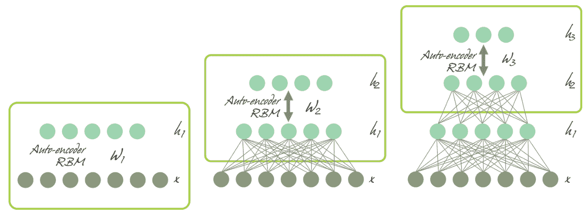

SAE 和 DBN 分别使用 AE 和 RBM

在无监督预训练中，如前图所示，各层被按顺序堆叠，并以逐层的方式进行训练，类似于使用无标记数据的 AE 或 RBM。之后，在有监督的微调过程中，堆叠一个输出分类层，并通过使用标记数据重新训练整个神经网络来进行优化。

# 多层感知机

如前所述，单一感知器甚至无法逼近 XOR 函数。为了克服这一限制，将多个感知器堆叠在一起形成 MLP，其中各层作为有向图连接。通过这种方式，信号沿着一个方向传播，从输入层到隐藏层再到输出层，如下图所示：

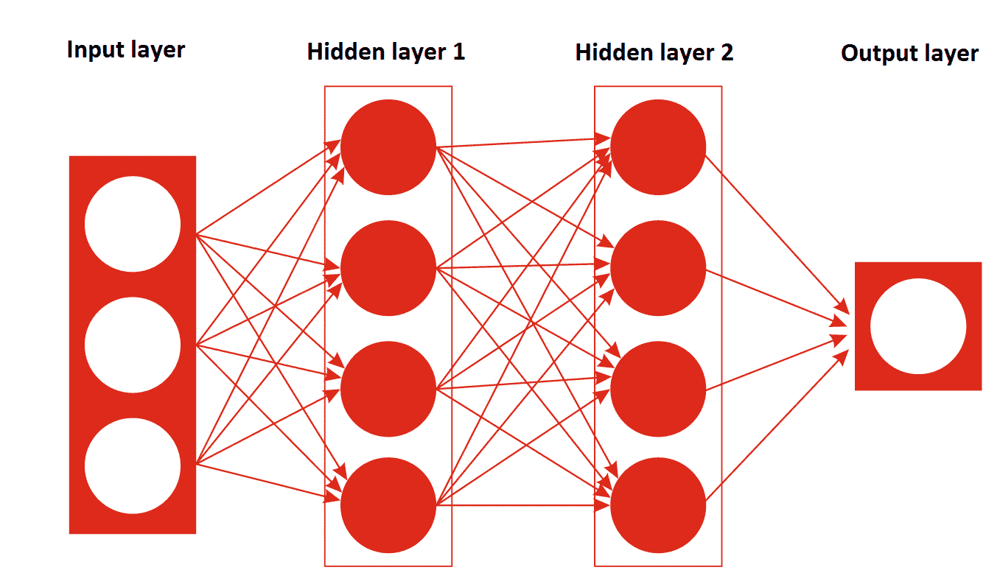

一个具有输入层、两个隐藏层和输出层的 MLP 架构

从根本上讲，MLP 是最简单的前馈神经网络（FFNN），至少有三层：输入层、隐藏层和输出层。MLP 最早在 1980 年代使用反向传播算法进行训练。

# 深度信念网络

为了克服 MLP 中的过拟合问题，Hinton 等人提出了 DBN。它使用贪心的逐层预训练算法，通过概率生成模型初始化网络权重。

DBN 由一个可见层和多个层—**隐藏单元**组成。顶部两层之间有无向对称连接，形成关联记忆，而较低层则从前一层接收自上而下的有向连接。DBN 的构建模块是 RBM，如下图所示，多个 RBM 一个接一个地*堆叠*在一起形成 DBN：

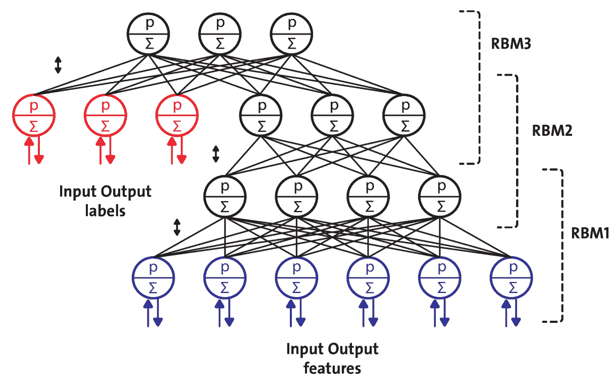

用于半监督学习的 DBN 配置

单个 RBM 由两层组成。第一层由可见神经元组成，第二层由隐藏神经元组成。*图 16*展示了一个简单 RBM 的结构，其中神经元按照对称的二分图排列：

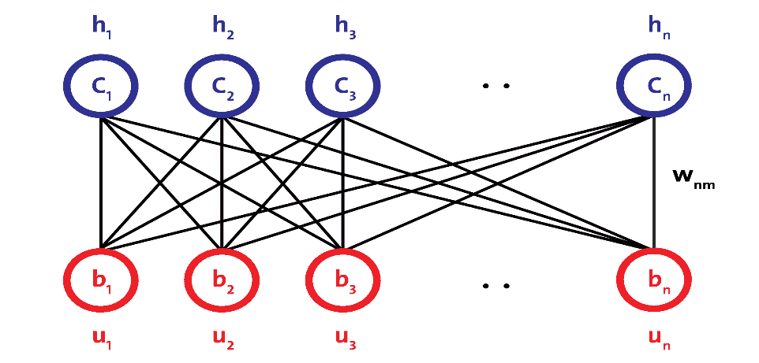

RBM 架构

在 DBN 中，首先用输入数据训练 RBM，这被称为无监督预训练，隐藏层代表了通过称为监督微调的贪心学习方法学习到的特征。尽管 DBN 取得了众多成功，但它们正被 AE 所取代。

# 自动编码器

AE 是一个具有三层或更多层的网络，其中输入层和输出层的神经元数量相同，而中间的隐藏层神经元数量较少。网络被训练以在输出端重现每个输入数据的相同活动模式。

AE 的常见应用包括数据去噪和用于数据可视化的降维。下图展示了 AE 的典型工作原理。它通过两个阶段重建接收到的输入：编码阶段，通常对应于原始输入的降维；解码阶段，能够从编码（压缩）表示中重建原始输入：

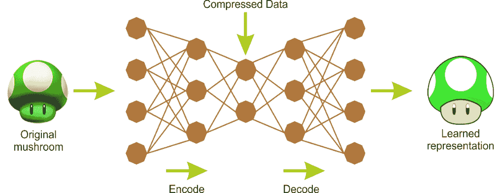

自动编码器（AE）的编码和解码阶段

# 卷积神经网络

CNN 已在计算机视觉（例如，图像识别）领域取得了巨大成功，并被广泛采用。在 CNN 网络中，定义卷积层（conv）的连接方案与 MLP 或 DBN 有显著不同。

重要的是，DNN 对像素如何组织没有先验知识；它并不知道邻近的像素是接近的。CNN 的架构嵌入了这种先验知识。低层通常识别图像中小区域的特征，而高层则将低级特征组合成更大的特征。这在大多数自然图像中效果良好，使得 CNN 在 DNN 之前占据了决定性优势：


常规 DNN 与 CNN

仔细观察前面的图示；左侧是一个常规的三层神经网络，右侧是一个将神经元以三维（宽度、高度和深度）排列的 CNN。在 CNN 架构中，几个卷积层以级联方式连接，每一层后面跟着一个 ReLU 层，然后是池化层，再接几个卷积层（+ReLU），再接另一个池化层，依此类推。

每个卷积层的输出是一组由单个内核滤波器生成的特征图。这些特征图随后可以作为下一层的新输入。CNN 网络中的每个神经元都会产生一个输出，并跟随一个激活阈值，该阈值与输入成正比且没有限制。这种类型的层称为卷积层。以下图示为用于面部识别的 CNN 架构示意图：


用于面部识别的 CNN 架构示意图

# 递归神经网络

**递归神经网络**（**RNN**）是一类**人工神经网络**（**ANN**），其中单元之间的连接形成有向循环。RNN 架构最初由 Hochreiter 和 Schmidhuber 于 1997 年提出。RNN 架构有标准的 MLP，并且加上了循环（如下面的图所示），因此它们能够利用 MLP 强大的非线性映射能力；并且具有某种形式的记忆：

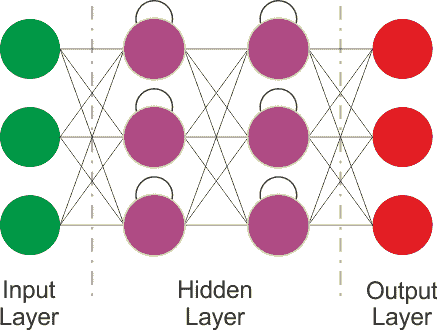

RNN 架构

上面的图像展示了一个非常基础的 RNN，包含输入层、两个递归层和一个输出层。然而，这个基础的 RNN 存在梯度消失和爆炸问题，无法建模长期依赖性。因此，设计了更先进的架构，利用输入数据的顺序信息，并在各个构建模块（如感知器）之间使用循环连接。这些架构包括**长短期记忆网络**（**LSTM**）、**门控递归单元**（**GRUs**）、**双向 LSTM**等变体。

因此，LSTM 和 GR 可以克服常规 RNN 的缺点：梯度消失/爆炸问题以及长期短期依赖问题。我们将在第二章中详细讨论这些架构。

# 新兴架构

许多其他新兴的深度学习架构已经被提出，例如 **深度时空神经网络** (**DST-NNs**)、**多维递归神经网络** (**MD-RNNs**)，以及 **卷积自编码器** (**CAEs**)。

然而，还有一些新兴的网络，如 **CapsNets**（CNN 的改进版本，旨在消除常规 CNN 的缺点）、用于图像识别的 RNN，以及用于简单图像生成的 **生成对抗网络** (**GANs**)。除了这些，个性化的因式分解机和深度强化学习也被广泛应用。

# 残差神经网络

由于有时涉及数百万甚至数十亿个超参数和其他实际因素，训练更深的神经网络非常困难。为了解决这个问题，Kaiming He 等人（见 [`arxiv.org/abs/1512.03385v1`](https://arxiv.org/abs/1512.03385v1)）提出了一种残差学习框架，简化了训练比以前更深的网络。

他们还明确地将层次结构重新定义为学习参考层输入的残差函数，而不是学习无参考的函数。通过这种方式，这些残差网络更容易优化，并且可以从显著增加的深度中获得更高的准确性。

不利的一面是，简单堆叠残差块来构建网络不可避免地会限制其优化能力。为了克服这一局限性，Ke Zhang 等人还提出了使用多层次残差网络（[`arxiv.org/abs/1608.02908`](https://arxiv.org/abs/1608.02908)）。

# 生成对抗网络

GANs 是深度神经网络架构，由两个相互对抗的网络组成（因此得名“对抗”）。Ian Goodfellow 等人在一篇论文中介绍了 GANs（详情见 [`arxiv.org/abs/1406.2661v1`](https://arxiv.org/abs/1406.2661v1)）。在 GANs 中，两个主要组件是 **生成器** 和 **判别器**。

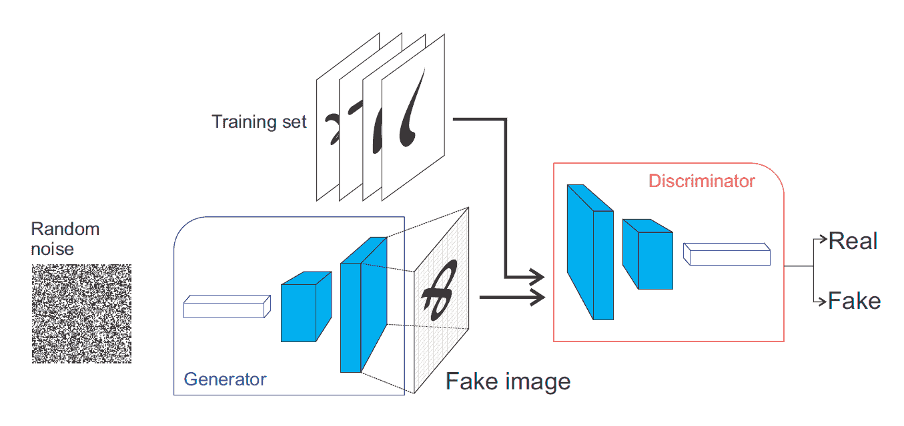

生成对抗网络（GANs）的工作原理

生成器将尝试从特定的概率分布中生成数据样本，这些样本与实际对象非常相似。判别器则会判断其输入是来自原始训练集还是来自生成器部分。

# 胶囊网络

CNNs 在图像分类方面表现优异。然而，如果图像有旋转、倾斜或其他不同的方向，CNNs 的表现会相对较差。即使是 CNN 中的池化操作，也无法在位置不变性方面提供太多帮助。

CNN 中的这一问题促使了 CapsNet 的最新进展，相关论文为 *胶囊之间的动态路由*（详情见 [`arxiv.org/abs/1710.09829`](https://arxiv.org/abs/1710.09829)），由 Geoffrey Hinton 等人提出。

与常规的 DNN 不同，在 CapsNets 中，核心思想是将更多的层添加到单一层内部。这样，CapsNet 就是一个嵌套的神经网络层集合。我们将在 第十一章 中详细讨论，*讨论、当前趋势与展望*。

# 深度学习框架和云平台

在本节中，我们将介绍一些最流行的深度学习框架。然后，我们将讨论一些可以部署/运行深度学习应用程序的云平台。简而言之，几乎所有的库都提供了使用图形处理器加速学习过程的可能性，都是开源发布的，并且是大学研究小组的成果。

# 深度学习框架

**TensorFlow** 是一个数学软件，也是一个用于机器智能的开源软件库。由 Google Brain 团队于 2011 年开发，并在 2015 年开源。TensorFlow 最新版本（本书写作时为 v1.8）提供的主要功能包括更快的计算速度、灵活性、可移植性、易于调试、统一的 API、透明的 GPU 计算支持、易于使用和可扩展性。一旦你构建了神经网络模型，并进行了必要的特征工程后，你可以通过绘图或 TensorBoard 轻松地进行交互式训练。

**Keras** 是一个深度学习库，位于 TensorFlow 和 Theano 之上，提供了一个直观的 API，灵感来源于 Torch。它可能是现存最好的 Python API。DeepLearning4J 将 Keras 作为其 Python API，并通过 Keras 从 Theano 和 TensorFlow 导入模型。

**Theano** 也是一个用 Python 编写的深度学习框架。它允许使用 GPU，速度是单个 CPU 的 24 倍。在 Theano 中，定义、优化和评估复杂的数学表达式非常直接。

**Neon** 是一个基于 Python 的深度学习框架，由 Nirvana 开发。Neon 的语法类似于 Theano 的高级框架（例如 Keras）。目前，Neon 被认为是基于 GPU 实现的最快工具，尤其适用于 CNN。但其基于 CPU 的实现相比大多数其他库较为逊色。

**PyTorch** 是一个庞大的机器学习生态系统，提供大量的算法和功能，包括深度学习和处理各种类型的多媒体数据，特别专注于并行计算。Torch 是一个高度可移植的框架，支持多种平台，包括 Windows、macOS、Linux 和 Android。

**Caffe** 由 **伯克利视觉与学习中心**（**BVLC**）主要开发，是一个因其表达性、速度和模块化而突出的框架。

**MXNet** *（[`mxnet.io/`](http://mxnet.io/)）是一个支持多种语言的深度学习框架，诸如 R、Python、C++ 和 Julia。这个特点很有帮助，因为如果你掌握了这些语言中的任何一种，你将无需走出舒适区就能训练你的深度学习模型。它的后端使用 C++ 和 CUDA 编写，能够像 Theano 一样管理自己的内存。  

**Microsoft Cognitive Toolkit**（**CNTK**）是微软研究院推出的统一深度学习工具包，旨在简化多 GPU 和服务器上的流行模型类型训练与组合。CNTK 实现了高效的 CNN 和 RNN 训练，适用于语音、图像和文本数据。它支持 cuDNN v5.1 进行 GPU 加速。  

DeepLearning4J 是首批为 Java 和 Scala 编写的商业级开源分布式深度学习库之一。它还提供了对 Hadoop 和 Spark 的集成支持。DeepLearning4J 旨在用于分布式 GPU 和 CPU 环境中的企业应用。  

DeepLearning4J 旨在成为前沿技术且即插即用，更注重约定而非配置，这使得非研究人员能够快速原型开发。以下库可以与 DeepLearning4J 集成，无论你是用 Java 还是 Scala 开发机器学习应用，都将让你的 JVM 使用体验更加便捷。  

ND4J 就像是 JVM 上的 NumPy，提供了诸如矩阵创建、加法和乘法等线性代数的基本操作。而 ND4S 是一个用于线性代数和矩阵操作的科学计算库，支持 JVM 语言中的 n 维数组。  

总结如下图所示，展示了过去一年来关于不同深度学习框架的 Google 趋势：

  

不同深度学习框架的趋势。TensorFlow 和 Keras 是最具主导性的框架，而 Theano 的人气正在下降。另一方面，DeepLearning4J 正在成为 JVM 上的新兴选择。  

# 基于云平台的深度学习  

除了前述的库之外，最近在云端也有一些深度学习的倡议。其理念是将深度学习能力引入到拥有数百万、数十亿数据点和高维数据的大数据中。例如，**Amazon Web Services**（**AWS**）、Microsoft Azure、Google Cloud Platform 和 **NVIDIA GPU Cloud**（**NGC**）都提供原生于其公共云平台的机器学习和深度学习服务。  

2017 年 10 月，AWS 发布了针对 Amazon **Elastic Compute Cloud**（**EC2**）P3 实例的深度学习 **Amazon Machine Images**（**AMIs**）。这些 AMI 预装了深度学习框架，如 TensorFlow、Gluon 和 Apache MXNet，且已针对 Amazon EC2 P3 实例内的 NVIDIA Volta V100 GPU 进行了优化。  

微软认知工具包是 Azure 的开源深度学习服务。与 AWS 提供的服务类似，它专注于可以帮助开发者构建和部署深度学习应用程序的工具。  

另一方面，NGC 为 AI 科学家和研究人员提供了 GPU 加速的容器（见[`www.nvidia.com/en-us/data-center/gpu-cloud-computing/`](https://www.nvidia.com/en-us/data-center/gpu-cloud-computing/)）。NGC 提供了如 TensorFlow、PyTorch、MXNet 等容器化的深度学习框架，这些框架经过 NVIDIA 的调优、测试和认证，可以在最新的 NVIDIA GPU 上运行。

现在我们对可用的深度学习库、框架和云平台有了基本的了解，能够运行和部署我们的深度学习应用程序，我们可以开始编写代码了。首先，我们将通过解决著名的泰坦尼克号生存预测问题来入手。不过，我们不会使用之前列出的框架；我们将使用 Apache Spark ML 库。由于我们将结合其他深度学习库使用 Spark，了解一点 Spark 知识会帮助我们在接下来的章节中更好地掌握相关内容。

# 深度学习与灾难——泰坦尼克号生存预测

在本节中，我们将解决 Kaggle 上的著名泰坦尼克号生存预测问题（见[`www.kaggle.com/c/titanic/data`](https://www.kaggle.com/c/titanic/data)）。任务是使用机器学习算法完成对哪些人群可能生还的分析。

# 问题描述

在开始编写代码之前，让我们先看看问题的简短描述。以下段落直接引用自 Kaggle 泰坦尼克号生存预测页面：

“RMS 泰坦尼克号沉没事件是历史上最臭名昭著的海难之一。1912 年 4 月 15 日，泰坦尼克号在她的处女航中与冰山相撞沉没，造成 2224 名乘客和船员中 1502 人丧生。这场震惊国际社会的悲剧促使各国对船舶安全规定进行了改进。沉船导致如此大量的生命损失，其中一个原因是乘客和船员没有足够的救生艇。虽然幸存者在沉船过程中有一些运气成分，但某些群体比其他群体更有可能幸存，比如女性、儿童和上层阶级。在这个挑战中，我们要求你完成对哪些人群更可能生还的分析。特别是，我们要求你运用机器学习工具来预测哪些乘客在这场灾难中幸存下来。”

现在，在深入之前，我们需要了解泰坦尼克号灾难中乘客的数据，以便我们可以开发出可用于生存分析的预测模型。数据集可以从[`github.com/rezacsedu/TitanicSurvivalPredictionDataset`](https://github.com/rezacsedu/TitanicSurvivalPredictionDataset)下载。数据集中有两个`.csv`文件：

+   **训练集** (`train.csv`): 可用于构建你的机器学习模型。此文件还包括每位乘客的标签，作为训练集的*真实标签*。

+   **测试集** (`test.csv`): 可以用来查看你的模型在未见数据上的表现。然而，对于测试集，我们没有为每个乘客提供实际结果。

简而言之，对于测试集中的每个乘客，我们必须使用训练好的模型预测他们是否能在泰坦尼克号沉没中幸存。*表 1* 显示了训练集的元数据：

| **Variable** | **定义** |
| --- | --- |

| `survival` | 两个标签：

+   *0 = 否*

+   *1 = 是*

|

| `pclass` | 这是乘客的**社会经济地位**（**SES**）的代理，分为上层、中层和下层。具体来说，*1 = 1^(st)*, *2 = 2^(nd)*, *3 = 3^(rd)*。 |
| --- | --- |
| `sex` | 男性或女性。 |
| `Age` | 年龄（单位：年）。 |

| `sibsp` | 这表示家庭关系，如下所示：

+   *Sibling = 兄弟，姐妹，继兄，继姐*

+   *Spouse = 丈夫，妻子（情妇和未婚夫未考虑在内）*

|

| `parch` | 在数据集中，家庭关系定义如下：

+   *Parent = 母亲，父亲*

+   *Child = 女儿，儿子，继女，继子*

有些孩子是单独和保姆一起旅行的，因此对于他们来说，*parch=0*。

| `ticket` | 票号。 |
| --- | --- |
| `fare` | 乘客票价。 |
| cabin | 舱号。 |

| `embarked` | 三个港口：

+   *C = 瑟堡*

+   *Q = 皇后镇*

+   *S = 南安普顿*

|

现在问题是：使用这些标注数据，我们能否得出一些直接的结论？比如说，女性、头等舱以及儿童是能够提高乘客在这场灾难中幸存几率的因素。

为了解决这个问题，我们可以从基本的 MLP 开始，MLP 是最古老的深度学习算法之一。为此，我们使用基于 Spark 的 `MultilayerPerceptronClassifier`。此时，你可能会想，既然 Spark 不是深度学习库，为什么我要讲 Spark？不过，Spark 有一个 MLP 实现，这足以满足我们的目标。

接下来的章节中，我们将逐步开始使用更强大的 DNN，通过使用 DeepLearning4J，一个基于 JVM 的深度学习应用开发框架。所以我们来看看如何配置我们的 Spark 环境。

# 配置编程环境

我假设你的机器上已经安装了 Java，且 `JAVA_HOME` 也已设置。还假设你的 IDE 安装了 Maven 插件。如果是这样，那么只需创建一个 Maven 项目，并按照以下方式添加项目属性：

```py
<properties>
        <project.build.sourceEncoding>UTF-8</project.build.sourceEncoding>
        <java.version>1.8</java.version>
        <jdk.version>1.8</jdk.version>
        <spark.version>2.3.0</spark.version>
</properties>
```

在前面的标签中，我指定了 Spark（即 2.3.0），但你可以进行调整。然后在 `pom.xml` 文件中添加以下依赖项：

```py
<dependencies>
        <dependency>
            <groupId>org.apache.spark</groupId>
            <artifactId>spark-core_2.11</artifactId>
            <version>${spark.version}</version>
        </dependency>
        <dependency>
            <groupId>org.apache.spark</groupId>
            <artifactId>spark-sql_2.11</artifactId>
            <version>${spark.version}</version>
        </dependency>
        <dependency>
            <groupId>org.apache.spark</groupId>
            <artifactId>spark-mllib_2.11</artifactId>
            <version>${spark.version}</version>
        </dependency>
        <dependency>
            <groupId>org.apache.spark</groupId>
            <artifactId>spark-graphx_2.11</artifactId>
            <version>${spark.version}</version>
        </dependency>
        <dependency>
            <groupId>org.apache.spark</groupId>
            <artifactId>spark-yarn_2.11</artifactId>
            <version>${spark.version}</version>
        </dependency>
        <dependency>
            <groupId>org.apache.spark</groupId>
            <artifactId>spark-network-shuffle_2.11</artifactId>
            <version>${spark.version}</version>
        </dependency>
        <dependency>
            <groupId>org.apache.spark</groupId>
            <artifactId>spark-streaming-flume_2.11</artifactId>
            <version>${spark.version}</version>
        </dependency>
        <dependency>
            <groupId>com.databricks</groupId>
            <artifactId>spark-csv_2.11</artifactId>
            <version>1.3.0</version>
        </dependency>
</dependencies>
```

然后如果一切顺利，所有 JAR 文件都会作为 Maven 依赖下载到项目目录下。好了！接下来我们可以开始编写代码了。

# 特征工程和输入数据集准备

在本小节中，我们将看到一些基本的特征工程和数据集准备，它们可以输入到 MLP 分类器中。那么让我们从创建 `SparkSession` 开始，它是访问 Spark 的门户：

```py
SparkSession spark = SparkSession
                     .*builder*()
                     .master("local[*]")
                     .config("spark.sql.warehouse.dir", "/tmp/spark")
                     .appName("SurvivalPredictionMLP")
                     .getOrCreate();
```

然后让我们读取训练集并看一看它的概况：

```py
Dataset<Row> df = spark.sqlContext()
                .read()
                .format("com.databricks.spark.csv")
                .option("header", "true")
                .option("inferSchema", "true")
                .load("data/train.csv");
df.show();
```

数据集的快照如下所示：

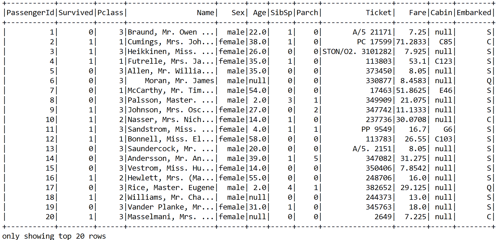

泰坦尼克号生存数据集快照

现在我们可以看到，训练集同时包含了分类特征和数值特征。此外，一些特征并不重要，例如`PassengerID`、`Ticket`等。同样，`Name`特征也不重要，除非我们手动基于标题创建一些特征。然而，我们还是保持简单。不过，一些列包含了空值，因此需要大量的考虑和清理。

我忽略了`PassengerId`、`Name`和`Ticket`列。除此之外，`Sex`列是分类变量，因此我根据`male`和`female`对乘客进行了编码。然后，`Embarked`列也被编码了。我们可以将`S`编码为`0`，`C`编码为`1`，`Q`编码为`2`。

对于这一点，我们也可以编写名为`normSex`和`normEmbarked`的用户定义函数（UDF），分别对应`Sex`和`Embarked`。让我们看看它们的签名：

```py
private static UDF1<String,Option<Integer>> *normEmbarked*=(String d) -> {
        if (null == d)
            return Option.*apply*(null);
        else {
            if (d.equals("S"))
                return Some.apply(0);
            else if (d.equals("C"))
                return Some.apply(1);
            else
                return Some.apply(2);
        }
    };
```

因此，这个 UDF 接收一个`String`类型，并将其编码为整数。`normSex` UDF 的工作方式也类似：

```py
private static UDF1<String, Option<Integer>> normSex = (String d) -> {
      if (null == d)
          return Option.apply(null);
      else {
        if (d.equals("male"))
            return Some.apply(0);
        else
            return Some.apply(1);
      }
    };
```

所以我们现在可以只选择有用的列，但对于`Sex`和`Embarked`列，我们需要使用上述 UDF：

```py
Dataset<Row> projection = df.select(
                col("Survived"),
                col("Fare"),
                callUDF("normSex", col("Sex")).alias("Sex"),
                col("Age"),
                col("Pclass"),
                col("Parch"),
                col("SibSp"),
                 callUDF("normEmbarked",
                col("Embarked")).alias("Embarked"));
projectin.show();
```

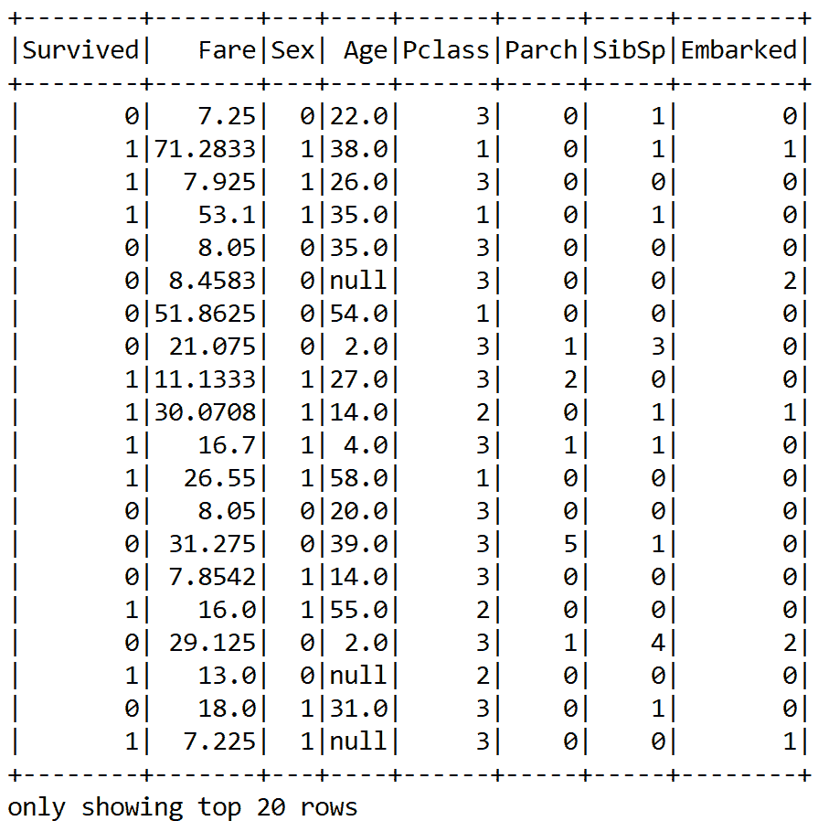

现在我们已经能够将一个分类列转换为数值型；然而，正如我们所看到的，仍然存在空值。那么，我们该怎么办呢？我们可以选择直接删除`null`值，或者使用一些`null`填补技术，用该列的均值进行填充。我认为第二种方法更好。

现在，再次针对这个空值填补，我们也可以编写用户定义函数（UDF）。不过，为此我们需要了解一些关于数值列的统计信息。不幸的是，我们不能对 DataFrame 执行汇总统计。因此，我们必须将 DataFrame 转换为`JavaRDD<Vector>`。另外，我们在计算时也忽略了`null`值：

```py
JavaRDD<Vector> statsDf =projection.rdd().toJavaRDD().map(row -> Vectors.*dense*( row.<Double>getAs("Fare"),
               row.isNullAt(3) ? 0d : row.Double>getAs("Age")
                  ));
```

现在，让我们计算多变量统计`summary`。`summary`统计将进一步用于计算这两个特征对应的缺失值的`meanAge`和`meanFare`：

```py
MultivariateStatisticalSummary summary = Statistics.*colStats*(statsRDD.rdd());
double meanFare = summary.mean().apply(0);
double meanAge = summary.mean().apply(1); 
```

现在，让我们为`Age`和`Fare`列创建两个 UDF 来进行空值填补：

```py
UDF1<String, Option<Double>> normFare = (String d) -> {
            if (null == d) {
                return Some.apply(meanFare);
            }
            else
                return Some.apply(Double.parseDouble(d));
        };
```

因此，我们定义了一个 UDF，如果数据没有条目，它会填充`meanFare`值。现在，让我们为`Age`列创建另一个 UDF：

```py
UDF1<String, Option<Double>> normAge = (String d) -> {
          if (null == d)
              return Some.apply(meanAge);
          else
              return Some.apply(Double.parseDouble(d));
        };
```

现在我们需要按照如下方式注册 UDF：

```py
spark.sqlContext().udf().register("normFare", normFare, DataTypes.DoubleType);
spark.sqlContext().udf().register("normAge", normAge, DataTypes.DoubleType);
```

因此，让我们应用前面的 UDF 进行`null`填补：

```py
Dataset<Row> finalDF = projection.select(
                *col*("Survived"),
                *callUDF*("normFare",
                *col*("Fare").cast("string")).alias("Fare"),
                *col*("Sex"),
                *callUDF*("normAge",
                *col*("Age").cast("string")).alias("Age"),
                *col*("Pclass"),
                *col*("Parch"),
                *col*("SibSp"),
                *col*("Embarked"));
finalDF.show();
```

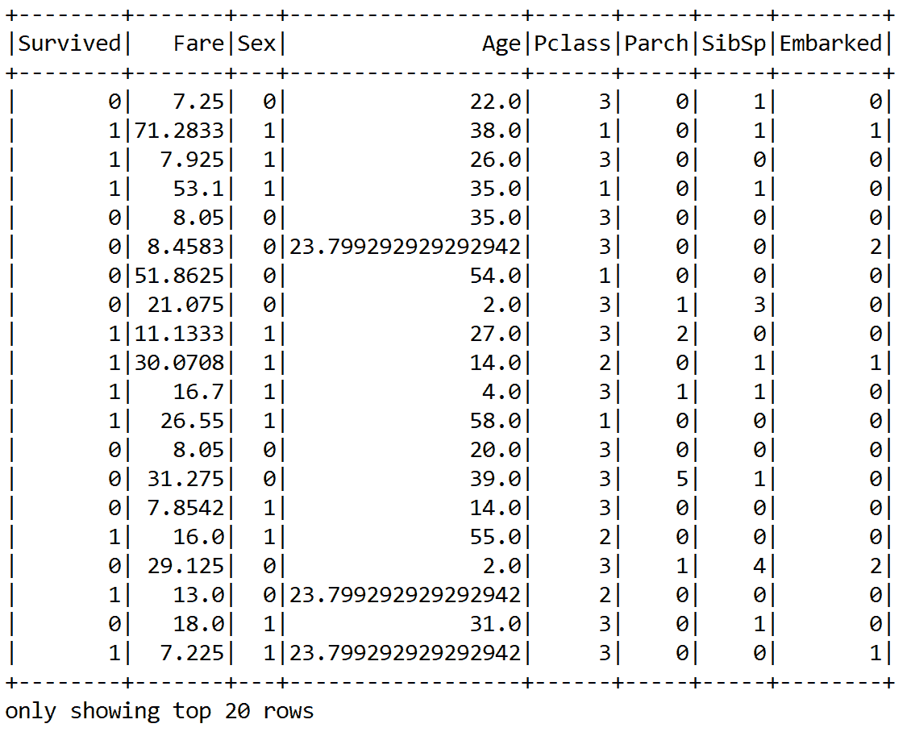

太棒了！我们现在可以看到，`null`值已经被`Age`和`Fare`列的均值所替代。然而，数值仍然没有经过缩放。因此，最好对它们进行缩放。但是，为此，我们需要计算均值和方差，然后将它们存储为模型，以便以后进行缩放：

```py
Vector stddev = Vectors.dense(Math.sqrt(summary.variance().apply(0)), Math.sqrt(summary.variance().apply(1)));

Vector mean = Vectors.dense(summary.mean().apply(0), summary.mean().apply(1));
StandardScalerModel scaler = new StandardScalerModel(stddev, mean);
```

然后，我们需要一个用于数值值的编码器（即`Integer`；可以是`BINARY`或`Double`）：

```py
Encoder<Integer> integerEncoder = Encoders.INT();
Encoder<Double> doubleEncoder = Encoders.DOUBLE();
Encoders.BINARY();

Encoder<Vector> vectorEncoder = Encoders.kryo(Vector.class);
Encoders.tuple(integerEncoder, vectorEncoder);
Encoders.tuple(doubleEncoder, vectorEncoder);
```

然后我们可以创建一个`VectorPair`，由标签（即`Survived`）和特征组成。这里的编码基本上是创建一个缩放后的特征向量：

```py
JavaRDD<VectorPair> scaledRDD = trainingDF.toJavaRDD().map(row -> {
                VectorPair vectorPair = new VectorPair();
                vectorPair.setLable(new
                Double(row.<Integer> getAs("Survived")));

                vectorPair.setFeatures(Util.*getScaledVector*(
                                row.<Double>getAs("Fare"),
                                row.<Double>getAs("Age"),
                                row.<Integer>getAs("Pclass"),
                                row.<Integer>getAs("Sex"),
                                row.isNullAt(7) ? 0d :
                                row.<Integer>getAs("Embarked"),
                                scaler));
                return vectorPair;
        });
```

在上面的代码块中，`getScaledVector()`方法执行了缩放操作。该方法的函数签名如下所示：

```py
public static org.apache.spark.mllib.linalg.Vector getScaledVector(double fare, 
 double age, double pclass,  double sex, double embarked, StandardScalerModel scaler) {
        org.apache.spark.mllib.linalg.Vector scaledContinous = scaler.transform(Vectors.dense(fare, age));
        Tuple3<Double, Double, Double> pclassFlat = flattenPclass(pclass);
        Tuple3<Double, Double, Double> embarkedFlat = flattenEmbarked(embarked);
        Tuple2<Double, Double> sexFlat = flattenSex(sex);

        return Vectors.dense(
                scaledContinous.apply(0),
                scaledContinous.apply(1),
                sexFlat._1(),
                sexFlat._2(),
                pclassFlat._1(),
                pclassFlat._2(),
                pclassFlat._3(),
                embarkedFlat._1(),
                embarkedFlat._2(),
                embarkedFlat._3());
    }
```

由于我们计划使用基于 Spark ML 的分类器（即 MLP 实现），我们需要将这个 RDD 向量转换为 ML 向量：

```py
Dataset<Row> scaledDF = spark.createDataFrame(scaledRDD, VectorPair.class);
```

最后，让我们看看结果 DataFrame 的样子：

```py
scaledDF.show();
```

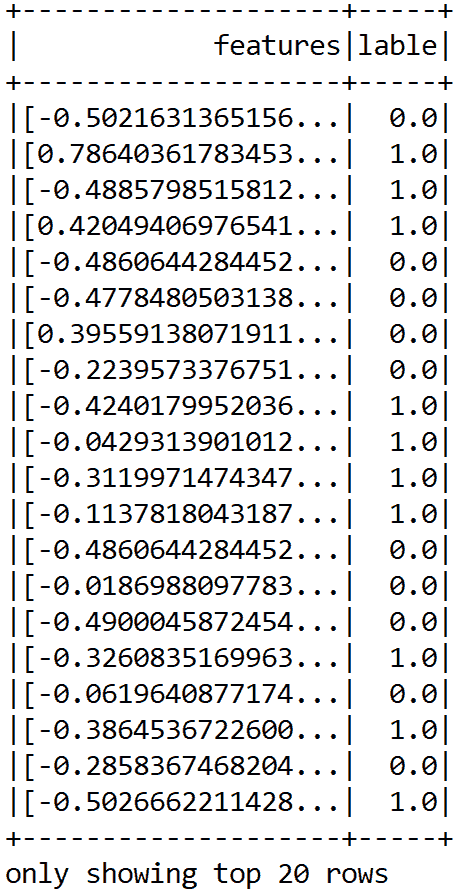

到目前为止，我们已经能够准备好特征了。不过，这仍然是一个基于 MLlib 的向量，因此我们需要进一步将其转换为 ML 向量：

```py
Dataset<Row> scaledData2 = MLUtils.convertVectorColumnsToML(scaledDF);
```

太棒了！现在我们几乎完成了准备一个可以供 MLP 分类器使用的训练集。由于我们还需要评估模型的性能，因此可以随机拆分训练数据为训练集和测试集。我们将 80%分配给训练，20%分配给测试。它们将分别用于训练模型和评估模型：

```py
Dataset<Row> data = scaledData2.toDF("features", "label");
Dataset<Row>[] datasets = data.randomSplit(new double[]{0.80, 0.20}, 12345L);

Dataset<Row> trainingData = datasets[0];
Dataset<Row> validationData = datasets[1];
```

好的。现在我们已经有了训练集，可以对 MLP 模型进行训练了。

# 训练 MLP 分类器

在 Spark 中，MLP 是一个包含多层的分类器。每一层都与网络中的下一层完全连接。输入层的节点表示输入数据，而其他节点通过线性组合输入、节点的权重和偏置，并应用激活函数，将输入映射到输出。

有兴趣的读者可以查看[`spark.apache.org/docs/latest/ml-classification-regression.html#multilayer-perceptron-classifier`](https://spark.apache.org/docs/latest/ml-classification-regression.html#multilayer-perceptron-classifier)。

那么让我们为 MLP 分类器创建层。对于这个示例，考虑到我们的数据集维度并不高，让我们构建一个浅层网络。

假设第一隐藏层只有 18 个神经元，第二隐藏层有`8`个神经元就足够了。请注意，输入层有`10`个输入，因此我们设置`10`个神经元，输出层设置`2`个神经元，因为我们的 MLP 只会预测`2`个类别。有一件事非常重要——输入的数量必须等于特征向量的大小，输出的数量必须等于标签的总数：

```py
int[] layers = new int[] {10, 8, 16, 2};
```

然后我们用训练器实例化模型，并设置其参数：

```py
MultilayerPerceptronClassifier mlp = new MultilayerPerceptronClassifier()
                                          .setLayers(layers)
                                          .setBlockSize(128)
                                          .setSeed(1234L)
                                          .setTol(1E-8)
                                          .setMaxIter(1000);
```

正如你所理解的，前面的`MultilayerPerceptronClassifier()`是基于 MLP 的分类器训练器。除了输出层使用 softmax 激活函数外，每一层都使用 sigmoid 激活函数。需要注意的是，基于 Spark 的 MLP 实现仅支持小批量梯度下降（minibatch GD）和 LBFGS 优化器。

简而言之，我们不能在隐藏层使用其他激活函数，如 ReLU 或 tanh。除此之外，其他高级优化器也不被支持，批量归一化等也无法使用。这是该实现的一个严重限制。在下一章中，我们将尝试用 DL4J 克服这个问题。

我们还将迭代的收敛容差设置为非常小的值，这样可以通过更多的迭代获得更高的准确性。我们设置了块大小，以便在矩阵中堆叠输入数据，从而加速计算。

如果训练集的大小很大，那么数据会在分区内堆叠。如果块大小超过了分区中剩余的数据量，那么它会调整为该数据的大小。推荐的块大小在 10 到 1,000 之间，但默认的块大小为 128。

最后，我们计划将训练迭代 1,000 次。那么让我们开始使用训练集来训练模型：

```py
MultilayerPerceptronClassificationModel model = mlp.fit(trainingData);
```

# 评估 MLP 分类器

当训练完成后，我们计算测试集上的预测结果，以评估模型的鲁棒性：

```py
Dataset<Row> predictions = model.transform(validationData);
```

那么，如何看一些样本预测呢？让我们观察真实标签和预测标签：

```py
predictions.show();
```

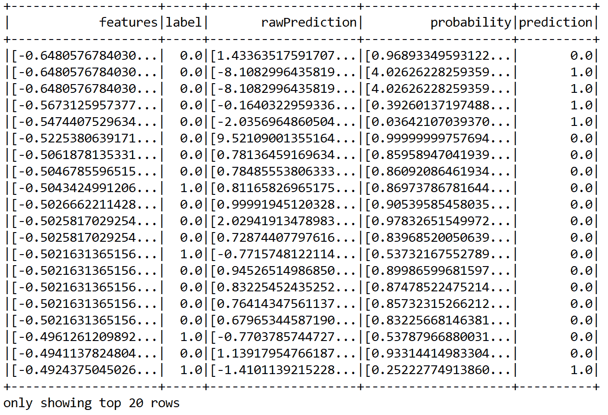

我们可以看到一些预测是正确的，但也有一些是错误的。然而，以这种方式很难猜测性能。因此，我们可以计算精确度、召回率和 F1 值等性能指标：

```py
MulticlassClassificationEvaluator evaluator = new MulticlassClassificationEvaluator()
                                              .setLabelCol("label")
                                              .setPredictionCol("prediction");

MulticlassClassificationEvaluator evaluator1 = evaluator.setMetricName("accuracy");
MulticlassClassificationEvaluator evaluator2 = evaluator.setMetricName("weightedPrecision");
MulticlassClassificationEvaluator evaluator3 = evaluator.setMetricName("weightedRecall");
MulticlassClassificationEvaluator evaluator4 = evaluator.setMetricName("f1");
```

现在让我们计算分类的`准确度`、`精确度`、`召回率`、`F1`值以及测试数据上的错误率：

```py
double accuracy = evaluator1.evaluate(predictions);
double precision = evaluator2.evaluate(predictions);
double recall = evaluator3.evaluate(predictions);
double f1 = evaluator4.evaluate(predictions);

// Print the performance metrics
System.*out*.println("Accuracy = " + accuracy);
System.*out*.println("Precision = " + precision);
System.*out*.println("Recall = " + recall);
System.*out*.println("F1 = " + f1);

System.*out*.println("Test Error = " + (1 - accuracy));
```

```py
<q>>>></q> Accuracy = 0.7796476846282568
 Precision = 0.7796476846282568
 Recall = 0.7796476846282568
 F1 = 0.7796476846282568
 Test Error = 0.22035231537174316
```

做得很好！我们已经能够达到一个相当高的准确率，即 78%。不过，我们依然可以通过额外的特征工程进行改进。更多提示将在下一节给出！现在，在结束本章之前，让我们尝试利用训练好的模型对测试集进行预测。首先，我们读取测试集并创建 DataFrame：

```py
Dataset<Row> testDF = Util.getTestDF();
```

然而，即使你查看测试集，你会发现其中有一些空值。所以我们需要对`Age`和`Fare`列进行空值填充。如果你不想使用 UDF，你可以创建一个 MAP，包含你的填充方案：

```py
Map<String, Object> m = new HashMap<String, Object>();
m.put("Age", meanAge);
m.put("Fare", meanFare);

Dataset<Row> testDF2 = testDF.na().fill(m);
```

然后，我们再次创建一个包含特征和标签（目标列）的`vectorPair`的 RDD：

```py
JavaRDD<VectorPair> testRDD = testDF2.javaRDD().map(row -> {
            VectorPair vectorPair = new VectorPair();
            vectorPair.setLable(row.<Integer>getAs("PassengerId"));
            vectorPair.setFeatures(Util.*getScaledVector*(
                    row.<Double>getAs("Fare"),
                    row.<Double>getAs("Age"),
                    row.<Integer>getAs("Pclass"),
                    row.<Integer>getAs("Sex"),
                    row.<Integer>getAs("Embarked"),
                    scaler));
            return vectorPair;
        });
```

然后我们创建一个 Spark DataFrame：

```py
Dataset<Row> scaledTestDF = spark.createDataFrame(testRDD, VectorPair.class);
```

最后，让我们将 MLib 向量转换为基于 ML 的向量：

```py
Dataset<Row> finalTestDF = MLUtils.convertVectorColumnsToML(scaledTestDF).toDF("features", "PassengerId");
```

现在，让我们执行模型推理，即为`PassengerId`列创建预测并展示示例`prediction`：

```py
Dataset<Row> resultDF = model.transform(finalTestDF).select("PassengerId", "prediction"); 
resultDF.show();
```

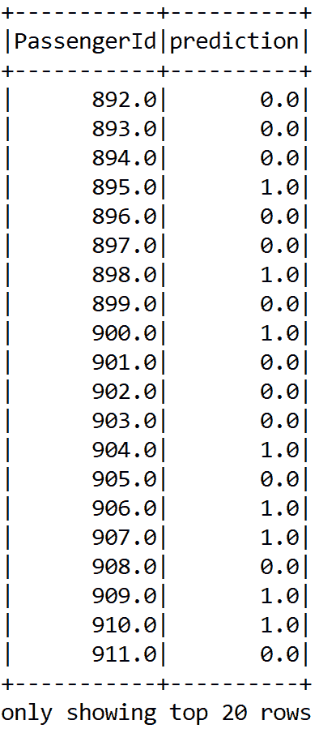

最后，让我们将结果写入 CSV 文件：

```py
resultDF.write().format("com.databricks.spark.csv").option("header", true).save("result/result.csv");
```

# 常见问题解答（FAQs）

现在，我们已经以可接受的准确率解决了泰坦尼克号生存预测问题，但这个问题以及深度学习现象中其他实际问题也需要考虑。在这一节中，我们将看到一些你可能已经在想的常见问题。答案可以在*附录 A*中找到。

1.  使用原始人工神经元绘制一个计算 XOR 操作的人工神经网络：*A*⊕ *B*。将这个问题正式描述为一个分类问题。为什么简单的神经元无法解决这个问题？多层感知器（MLP）是如何通过堆叠多个感知器来解决这个问题的？

1.  我们简要回顾了人工神经网络的历史。那么在深度学习的时代，最重要的里程碑是什么？我们能否用一张图来解释时间线？

1.  我可以使用其他深度学习框架更灵活地解决这个泰坦尼克号生存预测问题吗？

1.  我可以在代码中使用`Name`作为 MLP 中的一个特征吗？

1.  我理解输入层和输出层的神经元数量。那么我应该为隐藏层设置多少个神经元？

1.  我们不能通过交叉验证和网格搜索技术来提高预测准确性吗？

# 总结

在本章中，我们介绍了一些深度学习的基本主题。我们从对机器学习的基本但全面的介绍开始。然后，我们逐步过渡到深度学习和不同的神经网络结构。接着，我们对最重要的深度学习框架进行了简要概述。最后，我们看了一些与深度学习和泰坦尼克号生存预测问题相关的常见问题。

在下一章中，我们将开始深入学习深度学习，通过使用多层感知器（MLP）解决泰坦尼克号生存预测问题。然后，我们将开始开发一个端到端的项目，用于使用循环 LSTM 网络进行癌症类型分类。我们将使用一个非常高维的基因表达数据集来训练和评估模型。

# 常见问题解答

问题 1 的答案：解决这个问题的方法有很多：

1.  *A* ⊕ *B= (A ∨ ¬ B)∨ (¬ A ∧ B)*

1.  *A* ⊕ *B = (A ∨ B) ∧ ¬(A ∨ B)*

1.  *A* ⊕ *B = (A ∨ B) ∧ (¬ A ∨ ∧ B)*，依此类推

如果我们采用第一种方法，得到的人工神经网络将如下所示：

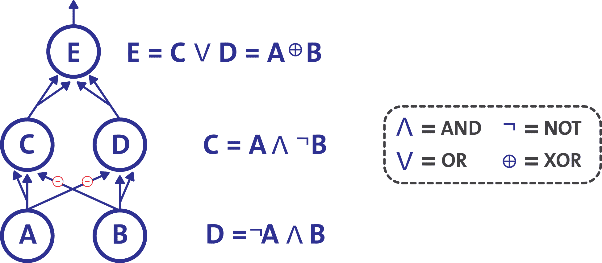

现在，从计算机科学文献中，我们知道 XOR 操作仅与两个输入组合和一个输出相关联。对于输入（0, 0）或（1, 1），网络输出 0；对于输入（0, 1）或（1, 0），网络输出 1。因此，我们可以正式地将前述真值表表示如下：

| **X0** | **X1** | **Y** |
| --- | --- | --- |
| 0 | 0 | 0 |
| 0 | 1 | 1 |
| 1 | 0 | 1 |
| 1 | 1 | 0 |

在这里，每个模式被分类为两个类之一，这两个类可以通过一条单独的直线*L*分开。它们被称为线性可分模式，如下所示：


问题 2 的答案：人工神经网络和深度学习的最重要进展可以通过以下时间线描述。我们已经看到，人工神经元和感知器分别在 1943 年和 1958 年为基础提供了支持。然后，1969 年，Minsky 等人将 XOR 问题公式化为一个线性不可分的问题。但是，后来在 1974 年，Werbos 等人展示了用于训练感知器的反向传播算法。

然而，最重要的进展发生在 1980 年代，当时 John Hopfield 等人于 1982 年提出了 Hopfield 网络。然后，神经网络和深度学习的奠基人之一 Hinton 和他的团队于 1985 年提出了玻尔兹曼机。然而，可能最重要的进展发生在 1986 年，当时 Hinton 等人成功训练了 MLP，而 Jordan 等人提出了 RNN。同年，Smolensky 等人也提出了改进版的 RBM。

在 1990 年代，最重要的一年是 1997 年。Lecun 等人于 1990 年提出了 LeNet，而 Jordan 等人则在 1997 年提出了 RNN。同年，Schuster 等人提出了改进版的 LSTM 和改进版的原始 RNN，称为 **双向 RNN**。

尽管计算能力有了显著的进展，但从 1997 年到 2005 年，我们并没有经历太多的突破，直到 2006 年 Hinton 再次提出了 DBN——通过堆叠多个 RBM。然后在 2012 年，Hinton 又发明了 dropout，这大大改善了 DNN 中的正则化和过拟合问题。

之后，Ian Goodfellow 等人引入了 GAN，这是图像识别领域的一个重要里程碑。2017 年，Hinton 提出了 CapsNets 来克服常规 CNN 的局限性——迄今为止，这是最重要的里程碑之一。

**问题 3 的答案**：是的，你可以使用*深度学习框架*部分中描述的其他深度学习框架。然而，由于本书是关于使用 Java 进行深度学习的，我建议使用 DeepLearning4J。我们将在下一章中看到如何灵活地通过堆叠输入层、隐藏层和输出层来创建网络，使用 DeepLearning4J。

**问题 4 的答案**：是的，你可以，因为乘客的名字包含不同的称呼（例如，先生、夫人、小姐、少爷等等）也可能很重要。例如，我们可以想象，作为女性（即夫人）和作为一个年轻人（例如，少爷）可能有更高的生存机会。

甚至，在看完著名电影《泰坦尼克号》（1997）后，我们可以想象，如果一个女孩处于一段关系中，她可能有更好的生存机会，因为她的男朋友会尝试救她！不过，这只是想象而已，所以不要太当真。现在，我们可以编写一个用户定义的函数，使用 Apache Spark 来编码这个过程。让我们来看一下以下的 Java 中的 UDF：

```py
private static final UDF1<String, Option<String>> getTitle = (String name) ->      {
    if(name.contains("Mr.")) { // If it has Mr.
        return Some.apply("Mr.");
    } else if(name.contains("Mrs.")) { // Or if has Mrs.
        return Some.apply("Mrs.");
    } else if(name.contains("Miss.")) { // Or if has Miss.
        return Some.apply("Miss.");
    } else if(name.contains("Master.")) { // Or if has Master.
        return Some.apply("Master.");
    } else{ // Not any.
        return Some.apply("Untitled");
    }
};
```

接下来，我们可以注册 UDF。然后我必须按如下方式注册前面的 UDF：

```py
spark.sqlContext().udf().register("getTitle", getTitle, DataTypes.StringType);

Dataset<Row> categoricalDF = df.select(callUDF("getTitle", col("Name")).alias("Name"), col("Sex"), 
                                       col("Ticket"), col("Cabin"), col("Embarked"));
categoricalDF.show();
```

结果列看起来如下所示：

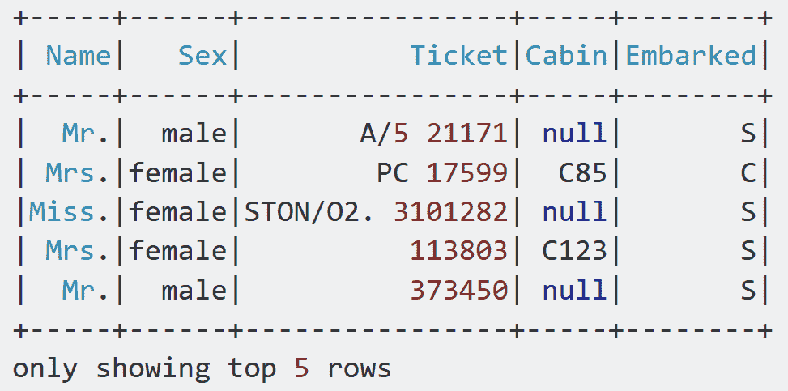

**问题 5 的答案**：对于许多问题，你可以从只有一到两个隐藏层开始。使用两个隐藏层（具有相同总神经元数量，稍后阅读时你会了解神经元数量）并且训练时间大致相同，这个设置就能很好地工作。现在让我们来看看关于设置隐藏层数量的一些简单估算：

+   **0**：只能表示线性可分函数

+   **1**：可以近似任何包含从一个有限空间到另一个有限空间的连续映射的函数

+   **2**：可以以任意精度表示任意的决策边界

然而，对于更复杂的问题，你可以逐渐增加隐藏层的数量，直到开始过拟合训练集。不过，你也可以尝试逐步增加神经元的数量，直到网络开始过拟合。这意味着不会导致过拟合的隐藏神经元的上限是：


在上述方程中：

+   *N[i]* = 输入神经元的数量

+   *N[o]* = 输出神经元的数量

+   *N[s]* = 训练数据集中的样本数量

+   *α* = 任意的缩放因子，通常为*2-10*

请注意，上述方程并非来源于任何研究，而是来自我个人的工作经验。

**问题 6 的答案**：当然可以。我们可以对训练进行交叉验证，并创建网格搜索技术来寻找最佳超参数。让我们试试看。

首先，我们定义了各层。不幸的是，我们无法对各层进行交叉验证。这可能是一个 bug，或者是 Spark 团队故意为之。所以我们坚持使用单层结构：

```py
int[] layers = new int[] {10, 16, 16, 2};
```

然后我们创建训练器，并只设置层和种子参数：

```py
MultilayerPerceptronClassifier mlp = new MultilayerPerceptronClassifier()
                     .setLayers(layers)
                     .setSeed(1234L);
```

我们在 MLP 的不同超参数中搜索最佳模型：

```py
ParamMap[] paramGrid = new ParamGridBuilder() 
                    .addGrid(mlp.blockSize(), new int[] {32, 64, 128})
                    .addGrid(mlp.maxIter(), new int[] {10, 50})
                    .addGrid(mlp.tol(), new double[] {1E-2, 1E-4, 1E-6})
                    .build();
MulticlassClassificationEvaluator evaluator = new MulticlassClassificationEvaluator()
          .setLabelCol("label")
          .setPredictionCol("prediction");
```

接着，我们设置交叉验证器，并执行 10 折交叉验证：

```py
int numFolds = 10;
CrossValidator crossval = new CrossValidator()
          .setEstimator(mlp)
          .setEvaluator(evaluator)
          .setEstimatorParamMaps(paramGrid)
          .setNumFolds(numFolds);
```

然后，我们使用交叉验证后的模型进行训练：

```py
CrossValidatorModel cvModel = crossval.fit(trainingData);
```

最后，我们对测试集上的交叉验证模型进行评估，如下所示：

```py
Dataset<Row> predictions = cvModel.transform(validationData);
```

现在我们可以计算并显示性能指标，类似于我们之前的示例：

```py
double accuracy = evaluator1.evaluate(predictions);
double precision = evaluator2.evaluate(predictions);
double recall = evaluator3.evaluate(predictions);
double f1 = evaluator4.evaluate(predictions);

// Print the performance metrics
System.out.println("Accuracy = " + accuracy);
System.out.println("Precision = " + precision);
System.out.println("Recall = " + recall);
System.out.println("F1 = " + f1);
System.out.println("Test Error = " + (1 - accuracy));
>>>Accuracy = 0.7810132575757576
 Precision = 0.7810132575757576
 Recall = 0.7810132575757576
 F1 = 0.7810132575757576
 Test Error = 0.21898674242424243
```
