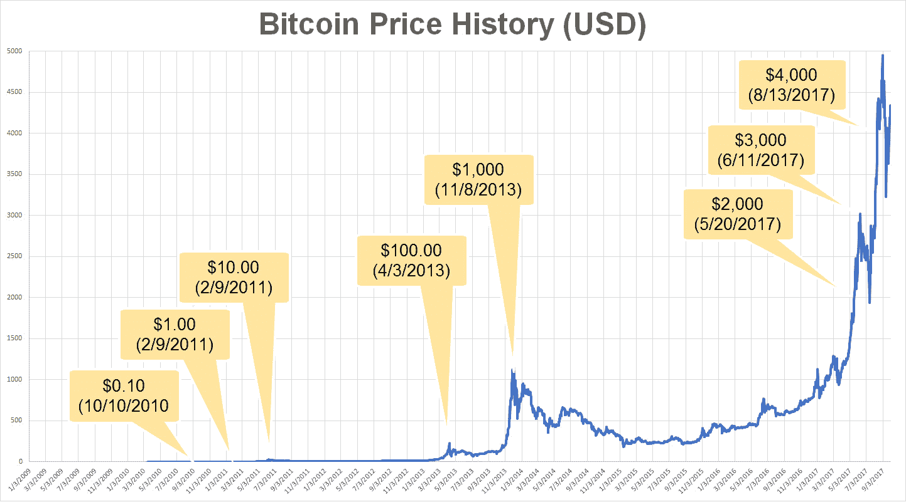
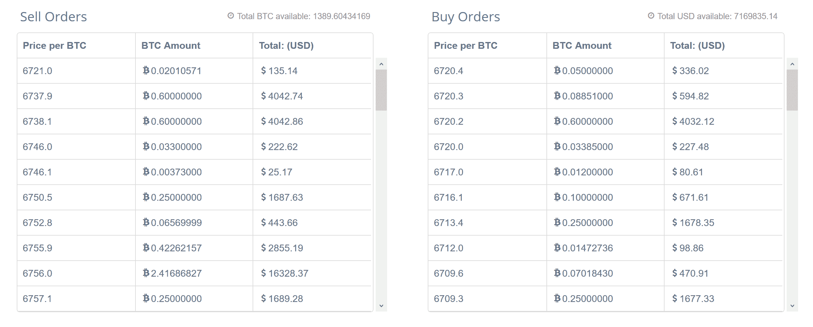
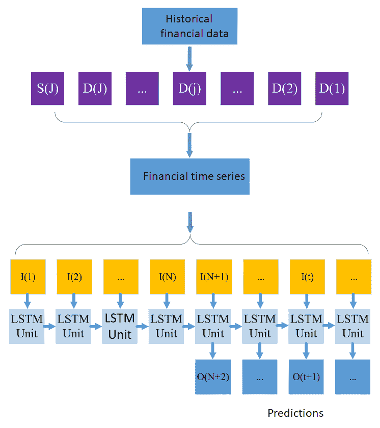
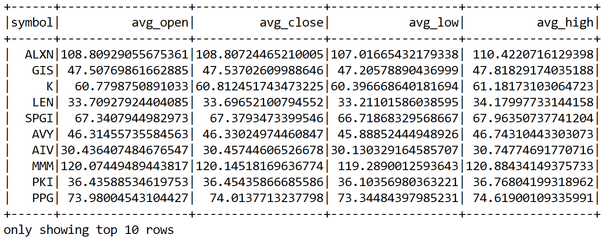
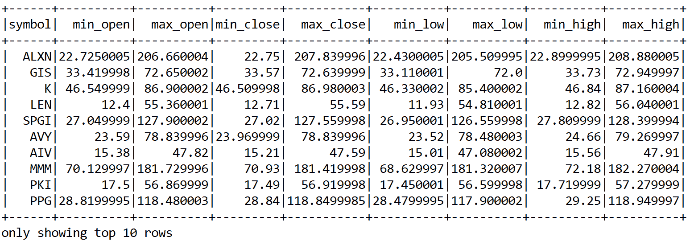
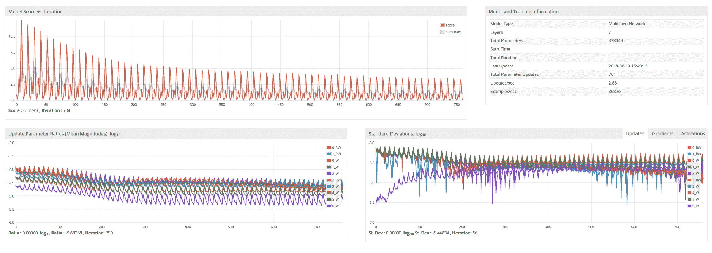
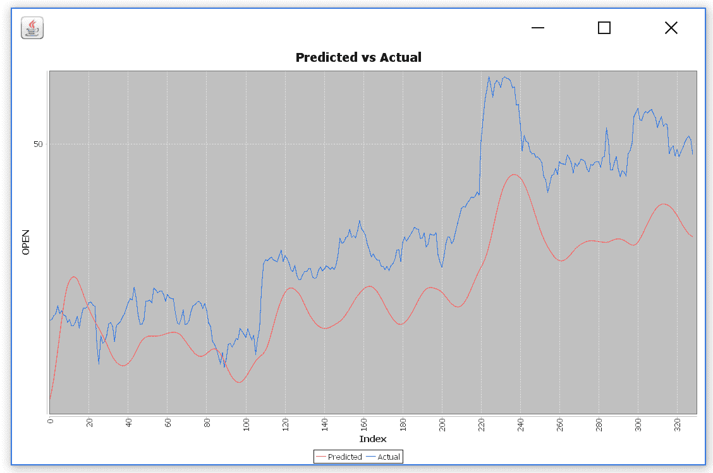
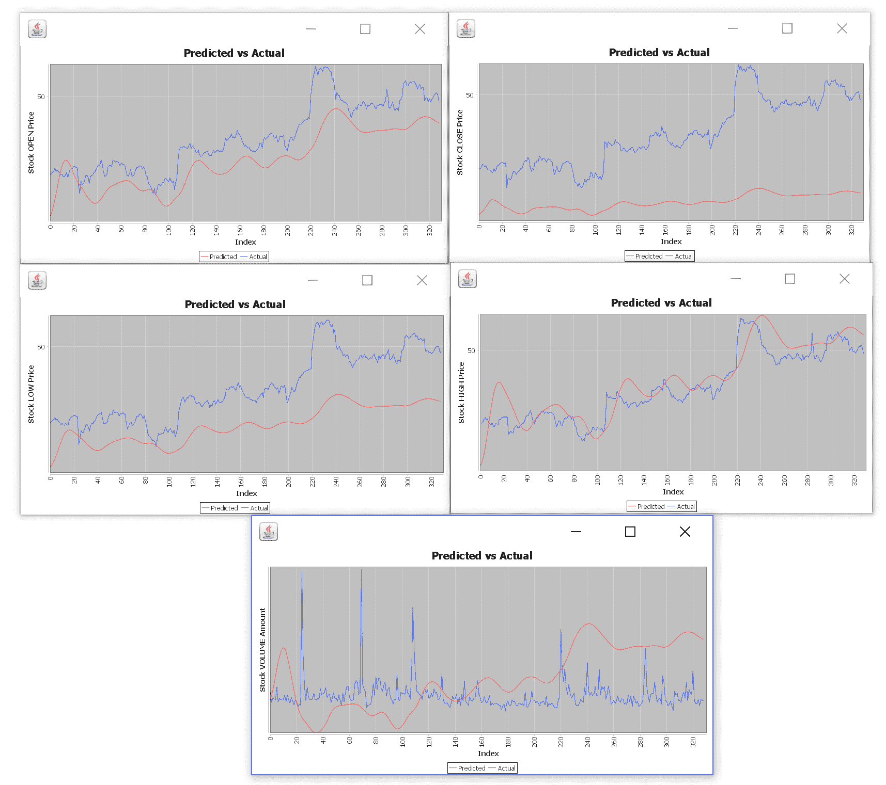
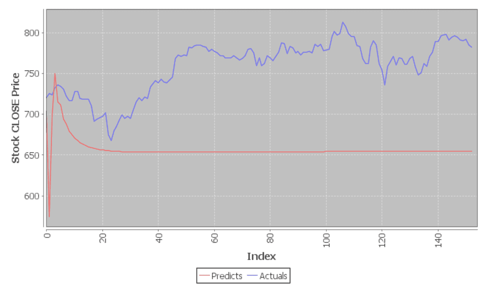

# 使用 LSTM 网络进行股票价格预测

股票市场价格预测是最具挑战性的任务之一。一个主要原因是噪声和这种类型数据集的波动特性。因此，如何准确预测股价走势仍然是现代交易世界中的一个未解问题。然而，经典的机器学习算法，如支持向量机、决策树和树集成算法（例如，随机森林和梯度提升树），在过去十年中已被广泛应用。

然而，股市价格存在严重的波动性和历史视角，这使得它们适合进行时间序列分析。这也对经典算法提出了挑战，因为这些算法无法利用长期依赖关系。考虑到这些挑战和现有算法的局限性，在本章中，我们将学习如何利用 LSTM 并基于 DL4J 库开发一个真实的股票开盘或收盘价预测模型。

将使用从真实股市数据集生成的时间序列数据集来训练 LSTM 模型，该模型将用于预测一次仅一天的股票价格。简而言之，我们将在整个端到端的项目中学习以下内容：

+   股票价格预测与在线交易

+   数据收集与描述

+   使用 LSTM 进行股票价格预测

+   常见问题解答（FAQ）

# 先进的自动化股票交易

通常，在证券交易所，交易所会维护所有买卖订单的订单簿，包括它们的数量和价格，并在买方和卖方匹配时执行这些订单。此外，交易所还会保持并提供关于状态交易的统计数据，这些数据通常以**OHCL**（即**开盘-最高-最低-收盘**）和交易对货币的成交量形式呈现。

顺便提一下，柱状图用于展示开盘价、最高价、最低价和收盘价。与线形图不同，OHLC 图表使得技术分析师能够评估日内波动性，并查看价格的开盘和收盘情况。看看这个图表：


OHLC 定价模型展示了某一时间段的开盘价、最高价、最低价和收盘价（来源：[`en.tradimo.com/tradipedia/ohlc-chart/`](http://en.tradimo.com/tradipedia/ohlc-chart/)）

这些数据以某些时间段的聚合形式展示，从秒到天，甚至是几个月。专门的服务器在为专业交易员和机构收集这些数据。虽然你不能指望所有订单数据都可以免费获取，但其中一部分是对公众开放的，并且可以使用。第一组数据是历史股市交易数据（OHLC），第二组数据包含股市交易的技术指标。

例如，比特币作为最早的加密货币之一，吸引了投资者和交易员的关注。这是因为以下原因：

+   使用比特币，可以开始进行交易

+   比特币让你保持伪匿名状态

+   在比特币的历史中，曾经历过剧烈的增长（见下图的一些统计数据），这吸引了长期投资者

+   存在高度的波动性，这吸引了日内交易者

难以预测比特币的长期价值，因为比特币背后的价值较为抽象，其价格主要反映市场认知，并且高度依赖于新闻、法规、政府与银行的合作、平台的技术问题，如交易费用和区块大小、机构投资者是否将比特币纳入其投资组合等。看看这个截图：



比特币及其在 2017 年 9 月之前的剧烈价格上涨（来源：http://www.bitcoin2040.com/bitcoin-price-history/）

现在的问题是如何以自动化的方式分析这个数据集，帮助投资者或在线货币交易者。好吧，在传统证券世界中，比如公司的股票，过去是由人来做分析，预测股价并进行交易。目前，比特币的交易量相较于传统交易所来说还是较低的。造成这种情况的两个原因是股市的高波动性和加密货币的监管问题。看看这个图表：



比特币的买卖订单数据（BTC/USD 对，截止 2018 年 6 月 18 日，来源：https://cex.io/trade#）

所以，现在人们主要通过购买和出售比特币进行交易，而这一切都伴随着与此相关的非理性行为，但也有一些尝试将比特币交易自动化的努力。最著名的尝试之一是麻省理工学院和斯坦福大学研究人员于 2014 年发布的一篇论文。

许多事情已经发生了变化，考虑到过去三年比特币价格的大幅上涨，任何只买入并持有的人都会对结果感到满意。显然，一些交易者使用**机器学习**（**ML**）进行交易，这类应用看起来很有前景。直到现在，仍然有几种最佳的可能方法。

对于训练，使用订单簿数据，而不是衍生的*OHLC + 成交量数据*。因此，训练和预测时，使用以下方式的数据：

+   将数据拆分为某一大小的时间序列（其中大小是一个可以调整的参数）。

+   将时间序列数据聚类为*K*个集群，其中*K*是唯一需要调节的参数。假设某些具有自然趋势的集群会出现（如价格的急剧下跌/上涨等）。

+   对每个集群，训练回归/分类器，分别预测价格和价格变化。

对于推理和评估，这种方法考虑了最新的时间序列，并使用特定窗口的大小来训练模型。然后，它会按如下方式对数据进行分类：

+   它会采用用于训练的窗口大小的最新时间序列，并对其进行分类——它属于哪个集群？

+   它使用机器学习模型来预测价格和价格变动的聚类

这个解决方案来源于 2014 年，但仍然具有一定的鲁棒性。由于需要识别多个参数，并且没有可用的订单簿历史数据，在本项目中我们使用了一种更简单的方法和数据集。

# 开发股票价格预测模型

如前所述，股市价格具有较大的波动性和历史视角，这使得它非常适合时间序列分析。这也对经典算法构成了挑战，因为这些算法无法处理长期依赖关系。

如下图所示，首先我们收集历史财务数据。数据经过必要的预处理和特征工程后，转换成时间序列。最终生成的时间序列数据被输入到 LSTM 中进行训练。下图展示了这一过程：



本项目原型的高层数据管道

因此，我们将使用 LSTM 模型，不仅因为它优于经典算法，还因为它能够解决长期依赖问题。因此，我们的项目将包括以下步骤：

1.  加载并预处理数据，并将其划分为训练集和测试集

1.  使用数据训练`LSTM`模型

1.  在测试数据上评估模型

1.  可视化模型的表现

我们将详细讲解每一步。但在此之前，了解数据集是必须的。

# 数据收集与探索性分析

如前所述，我们将使用历史股票数据来训练我们的 LSTM 网络。数据集包含来自 506 只不同证券的每分钟 OHLC 数据，时间跨度为 2016 年 1 月至 2016 年 12 月。让我们来看一下我们将使用的数据：

```py
//DataPreview.java
SparkSession spark = SparkSession.*builder*().master("local").appName("StockPricePredictor").getOrCreate();
spark.conf().set("spark.sql.crossJoin.enabled", "true");//enables cross joining across Spark DataFrames

// load data from csv file
String filename = "data/prices-split-adjusted.csv"; 
Dataset<Row> data = spark.read().option("inferSchema", false).option("header", true)
       .format("csv").load(filename)
             .withColumn("openPrice", functions.*col*("open").cast("double")).drop("open")
             .withColumn("closePrice", functions.*col*("close").cast("double")).drop("close")
             .withColumn("lowPrice", functions.*col*("low").cast("double")).drop("low")
             .withColumn("highPrice", functions.*col*("high").cast("double")).drop("high")
             .withColumn("volumeTmp", functions.*col*("volume").cast("double")).drop("volume")
             .toDF("date", "symbol", "open", "close", "low", "high", "volume");
data.show(10);
```

以下快照展示了该代码的输出：


本项目使用的历史数据集快照

如前面的截图所示，我们的数据集包含七个特征，具体如下：

+   `date`：2016 年 1 月到 2016 年 12 月之间的时间

+   `symbol`：506 只不同证券的股票代码

+   `open`：时间区间开始时的开盘价

+   `close`：时间区间结束时的收盘价

+   `high`：该时间区间内所有订单执行时的最高价格

+   `low`：同样的，但为最低价格

+   `volume`：该时间段内所有转手的股票数量

现在让我们看看一些股票代码（更多内容请见`securities.csv`文件）：

```py
data.createOrReplaceTempView("stock");
spark.sql("SELECT DISTINCT symbol FROM stock GROUP BY symbol").show(10);
```

这是上一段代码的输出快照：


本项目使用的部分股票符号及其价格数据

如果我们需要了解证券，以下表格可以为我们提供一些信息：


本项目使用的部分证券及其详细信息

然后，我们决定查看所有个别证券的四个类别的平均价格——开盘价、收盘价、最低价和最高价。看看这个代码：

```py
spark.sql("SELECT symbol, avg(open) as avg_open, "
                + "avg(close) as avg_close, "
                + "avg(low) as avg_low, "
                + "avg(high) as avg_high "
                + "FROM stock GROUP BY symbol")
                .show(10); 
```

这个快照展示了之前代码的输出：



开盘价、收盘价、最低价和最高价的平均价格。

然而，前面的表格并没有提供太多的见解，除了平均价格这一点。因此，知道最小值和最大值价格可以让我们了解股票市场是否真的有很高的波动性。看看这个代码：

```py
spark.sql("SELECT symbol, "
                + "MIN(open) as min_open, MAX(open) as max_open, "
                + "MIN(close) as min_close, MAX(close) as max_close, "
                + "MIN(low) as min_low, MAX(low) as max_low, "
                + "MIN(high) as min_high, MAX(high) as max_high "
                + "FROM stock GROUP BY symbol")
                .show(10);   
```

这个快照展示了代码的输出：



开盘价、收盘价、最低价和最高价的平均最大和最小价格。

这个表格展示了例如最小开盘价和收盘价并没有显著的差异。然而，最大开盘价甚至收盘价差异很大。这是时间序列数据的特点，它促使我选择通过将数据转换为时间序列来使用 `LSTM`。

# 准备训练集和测试集。

数据科学流程中最重要的部分之一，在数据收集（从某种意义上讲是外包的——我们使用了别人收集的数据）之后，就是数据预处理，即清理数据集并将其转换为适应我们需求的格式。

所以，我们的目标是预测价格变化的方向，基于实际的美元价格随时间的变化。为了做到这一点，我们定义了像 `file`、`symbol`、`batchSize`、`splitRatio` 和 `epochs` 这样的变量。你可以在代码中的内联注释中看到每个变量的解释：

```py
// StockPricePrediction.java
String file = "data/prices-split-adjusted.csv";
String symbol = "GRMN"; // stock name
int batchSize = 128; // mini-batch size
double splitRatio = 0.8; // 80% for training, 20% for testing
int epochs = 100; // training epochs
```

我们使用 `StockDataSetIterator` 构造函数变量来为模型准备数据集。在这里，我们为模型准备了一个按序列格式的输入数据集，`category = PriceCategory.ALL`，这意味着我们将预测所有五个价格类别（开盘价、收盘价、最低价、最高价和成交量）。看看这个代码：

```py
//StockPricePrediction.java
System.*out*.println("Creating dataSet iterator...");
PriceCategory category = PriceCategory.*ALL*; // CLOSE: predict close price

*iterator* = new StockDataSetIterator(file, symbol, batchSize, *exampleLength*, splitRatio, category);
System.*out*.println("Loading test dataset...");
List<Pair<INDArray, INDArray>> test = *iterator*.getTestDataSet();
```

在前面的代码块中，我们使用的 `PriceCategory` 构造函数具有以下签名：

```py
public enum PriceCategory {
      OPEN, CLOSE, LOW, HIGH, VOLUME, ALL}
```

在同一行中，以下选项也是有效的：

```py
PriceCategory category = PriceCategory.OPEN; // OPEN: predict open price
PriceCategory category = PriceCategory.CLOSE; // CLOSE: predict close price
PriceCategory category = PriceCategory.LOW; // LOW: predict low price
PriceCategory category = PriceCategory.HIGH; // HIGH: predict high price.
```

而在内部，`StockDataSetIterator` 类的构造函数具有以下功能：

+   我们从文件中读取股票数据，对于每个符号，我们创建一个列表。

+   我们将 `miniBatchSize`、`exampleLength` 和 `category` 变量设置为类的属性。

+   然后，`split` 变量是根据 `splitRation` 变量计算得出的。

+   我们将 `stockDataList` 分成两部分：训练集和测试集。

+   然后，股票数据被分割成训练集和测试集。

+   我们调用函数 `initializeOffsets()` 来初始化 `exampleStartOffsets` 数组的值。

接下来，`StockDataSetIterator()` 构造函数具有以下签名，它将生成一个 `List<Pair<INDArray, INDArray>>` 类型的测试数据集：

```py
//StockDataSetIterator.java
/** stock dataset for training */
private List<StockData> train;
```

在下面的代码中，`StockData` 是一个 case 类，提供了从输入的 `CSV` 文件中提取或准备数据集的结构：

```py
//StockData.java
private String date; // date
private String symbol; // stock name

private double open; // open price
private double close; // close price
private double low; // low price
private double high; // high price
private double volume; // volume

public StockData () {}

public StockData (String date, String symbol, double open, double close, double low, double high, double volume) {
        this.date = date;
        this.symbol = symbol;
        this.open = open;
        this.close = close;
        this.low = low;
        this.high = high;
        this.volume = volume;
    }
```

然后，我们有以下的 getter 和 setter 方法，用于上述变量，如下所示：

```py
public String getDate() { return date; }
public void setDate(String date) { this.date = date; }

public String getSymbol() { return symbol; }
public void setSymbol(String symbol) { this.symbol = symbol; }

public double getOpen() { return open; }
public void setOpen(double open) { this.open = open; }

public double getClose() { return close; }
public void setClose(double close) { this.close = close; }

public double getLow() { return low; }
public void setLow(double low) { this.low = low; }

public double getHigh() { return high; }
public void setHigh(double high) { this.high = high; }

public double getVolume() { return volume; }
public void setVolume(double volume) { this.volume = volume; }
```

现在我们已经看过`StockData.java`类的签名，是时候创建测试数据集作为`StockDataSetIterator`了：

```py
/** adjusted stock dataset for testing */
private List<Pair<INDArray, INDArray>> test;

public StockDataSetIterator (String filename, String symbol, int miniBatchSize, int exampleLength, 
        double splitRatio, PriceCategory category) {
        List<StockData> stockDataList = readStockDataFromFile(filename, symbol);

        this.miniBatchSize = miniBatchSize;
        this.exampleLength = exampleLength;
        this.category = category;

        int split = (int) Math.round(stockDataList.size() * splitRatio);
        train = stockDataList.subList(0, split);
        test = generateTestDataSet(stockDataList.subList(split, stockDataList.size()));
        initializeOffsets();
    }
```

在前面的代码中，调用了`initializeOffsets()`方法来初始化小批量的偏移量：

```py
private void initializeOffsets() {
        exampleStartOffsets.clear();
        int window = exampleLength + predictLength;
        for(int i = 0; i < train.size() - window; i++) {
              exampleStartOffsets.add(i); 
                }
    }
```

实际读取是通过`readStockDataFromFile()`方法完成的。在构造函数内部，首先，我们调用函数`readStockDataFromFile()`从文件中读取数据并加载到`stockDataList`中。然后，我们初始化`StockDataList`列表，以包含从`csv`文件中读取的数据。

接下来，我们用`Double.MIN_VALUE`和`Double.MAX_VALUE`初始化最大值和最小值数组。然后，逐行读取`CSV`文件中的五个值。接着将这些值依次插入到`StockData`对象的构造函数中，并将该对象添加到`StockDataList`中。此外，如果出现任何异常，我们会抛出异常。最后，方法返回`StockDataList`。方法的签名如下：

```py
private List<StockData> readStockDataFromFile (String filename, String symbol) {
        List<StockData> stockDataList = new ArrayList<>();
        try {
            for(int i = 0; i < maxArray.length; i++) { // initialize max and min arrays
                maxArray[i] = Double.MIN_VALUE;
                minArray[i] = Double.MAX_VALUE;
            }
            List<String[]> list = new CSVReader(new FileReader(filename)).readAll();//load as a list
            for(String[] arr : list) {
                if(!arr[1].equals(symbol)) continue;
                double[] nums = new double[VECTOR_SIZE];

                for(int i = 0; i < arr.length - 2; i++) {
                    nums[i] = Double.valueOf(arr[i + 2]);

                    if(nums[i] > maxArray[i]) maxArray[i] = nums[i];
                    if(nums[i] < minArray[i]) minArray[i] = nums[i];
                }
                stockDataList.add(new StockData(arr[0], arr[1], nums[0], nums[1], 
                                  nums[2], nums[3], nums[4]));
            }
        } catch (IOException e) {
            e.printStackTrace();
        }
        return stockDataList;
    }
```

然后，`generateTestDataSet()`方法实际上生成仅能由`LSTM`模型消费的特征，格式为`List<Pair<INDArray, INDArray>>`，其中排序设置为`f`以便更快构建：

```py
private List<Pair<INDArray, INDArray>> generateTestDataSet (List<StockData> stockDataList) {
        int window = exampleLength + predictLength;
        List<Pair<INDArray, INDArray>> test = new ArrayList<>();

        for (int i = 0; i < stockDataList.size() - window; i++) {
            INDArray input = Nd4j.create(new int[] {exampleLength, VECTOR_SIZE}, 'f');

            for (int j = i; j < i + exampleLength; j++) {
                StockData stock = stockDataList.get(j);
                input.putScalar(new int[] {j - i, 0}, (stock.getOpen() - minArray[0]) / (maxArray[0] - 
                     minArray[0]));
                input.putScalar(new int[] {j - i, 1}, (stock.getClose() - minArray[1]) / (maxArray[1] -    
                     minArray[1]));
                input.putScalar(new int[] {j - i, 2}, (stock.getLow() - minArray[2]) / (maxArray[2] - 
                     minArray[2]));
                input.putScalar(new int[] {j - i, 3}, (stock.getHigh() - minArray[3]) / (maxArray[3] - 
                     minArray[3]));
                input.putScalar(new int[] {j - i, 4}, (stock.getVolume() - minArray[4]) / (maxArray[4] - 
                       minArray[4]));
            }
            StockData stock = stockDataList.get(i + exampleLength);
            INDArray label;

            if (category.equals(PriceCategory.ALL)) {
                label = Nd4j.create(new int[]{VECTOR_SIZE}, 'f'); // ordering is set faster construct
                label.putScalar(new int[] {0}, stock.getOpen());
                label.putScalar(new int[] {1}, stock.getClose());
                label.putScalar(new int[] {2}, stock.getLow());
                label.putScalar(new int[] {3}, stock.getHigh());
                label.putScalar(new int[] {4}, stock.getVolume());
            } else {
                label = Nd4j.create(new int[] {1}, 'f');
                switch (category) {
                    case OPEN: label.putScalar(new int[] {0}, stock.getOpen()); break;
                    case CLOSE: label.putScalar(new int[] {0}, stock.getClose()); break;
                    case LOW: label.putScalar(new int[] {0}, stock.getLow()); break;
                    case HIGH: label.putScalar(new int[] {0}, stock.getHigh()); break;
                    case VOLUME: label.putScalar(new int[] {0}, stock.getVolume()); break;
                    default: throw new NoSuchElementException();
                }
            }
            test.add(new Pair<>(input, label));
        }
        return test;
    }
```

在前面的代码块中，我们将`miniBatchSize`、`exampleLength`和`category`变量保存为类属性。然后，根据`splitRation`变量计算`split`变量。接着，我们将`stockDataList`分为两部分：

+   从开始到`split`的索引属于训练集。

+   从`split+1`到列表末尾的索引属于测试集。

生成的测试数据与训练数据集差异很大。调用函数`generatedTestDataSet()`来设置测试数据集。首先，我们通过示例长度和预测长度设置一个窗口变量。然后，我们从 0 开始循环，直到测试数据的长度减去窗口大小。请考虑以下内容：

+   读取五个输入变量：开盘价、收盘价、最低价、最高价和交易量。

+   基于`category`的值，读取标签值。如果`category`等于`ALL`，则读取五个变量，如输入变量。否则，仅通过`category`的值读取一个变量。

在前面的代码块中，标签是通过`feedLabel()`方法传递的，具体如下：

```py
private double feedLabel(StockData data) {
        double value;

        switch(category) {
            case OPEN: value = (data.getOpen() - minArray[0]) / (maxArray[0] - minArray[0]); break;
            case CLOSE: value = (data.getClose() - minArray[1]) / (maxArray[1] - minArray[1]); break;
            case LOW: value = (data.getLow() - minArray[2]) / (maxArray[2] - minArray[2]); break;
            case HIGH: value = (data.getHigh() - minArray[3]) / (maxArray[3] - minArray[3]); break;
            case VOLUME: value = (data.getVolume() - minArray[4]) / (maxArray[4] - minArray[4]); break;
            default: throw new NoSuchElementException();
        }
        return value;
    }
```

在前面的代码块中，我们初始化变量`value`。然后检查变量`category`的值，计算出的变量`value`的值可以用数学符号表示如下：

`value = (data.getOpen() - minArray[0]) / (maxArray[0] - minArray[0])`

然后，特征和标签都被用来准备数据集。看看这段代码：

```py
public DataSet next(int num) {
        if(exampleStartOffsets.size() == 0) throw new NoSuchElementException();
        int actualMiniBatchSize = Math.min(num, exampleStartOffsets.size());

        INDArray input = Nd4j.create(new int[] {actualMiniBatchSize, VECTOR_SIZE, exampleLength}, 'f');
        INDArray label;

        if(category.equals(PriceCategory.ALL)) 
            label = Nd4j.create(new int[] {actualMiniBatchSize, VECTOR_SIZE, exampleLength}, 'f');
        else 
            label = Nd4j.create(new int[] {actualMiniBatchSize, predictLength, exampleLength}, 'f');

        for(int index = 0; index < actualMiniBatchSize; index++) {
            int startIdx = exampleStartOffsets.removeFirst();
            int endIdx = startIdx + exampleLength;

            StockData curData = train.get(startIdx);
            StockData nextData;

            for(int i = startIdx; i < endIdx; i++) {
                int c = i - startIdx;
                input.putScalar(new int[] {index, 0, c}, (curData.getOpen() - minArray[0]) 
                                 / (maxArray[0] - minArray[0]));
                input.putScalar(new int[] {index, 1, c}, (curData.getClose() - minArray[1]) 
                                 / (maxArray[1] - minArray[1]));
                input.putScalar(new int[] {index, 2, c}, (curData.getLow() - minArray[2]) 
                                 / (maxArray[2] - minArray[2]));
                input.putScalar(new int[] {index, 3, c}, (curData.getHigh() - minArray[3]) 
                                 / (maxArray[3] - minArray[3]));
                input.putScalar(new int[] {index, 4, c}, (curData.getVolume() - minArray[4]) 
                                 / (maxArray[4] - minArray[4]));
                nextData = train.get(i + 1);

                if(category.equals(PriceCategory.ALL)) {
                    label.putScalar(new int[] {index, 0, c}, (nextData.getOpen() - minArray[1]) 
                                    / (maxArray[1] - minArray[1]));
                    label.putScalar(new int[] {index, 1, c}, (nextData.getClose() - minArray[1]) 
                                   / (maxArray[1] - minArray[1]));
                    label.putScalar(new int[] {index, 2, c}, (nextData.getLow() - minArray[2]) 
                                   / (maxArray[2] - minArray[2]));
                    label.putScalar(new int[] {index, 3, c}, (nextData.getHigh() - minArray[3]) 
                                   / (maxArray[3] - minArray[3]));
                    label.putScalar(new int[] {index, 4, c}, (nextData.getVolume() - minArray[4]) 
                                   / (maxArray[4] - minArray[4]));
                } else {
                    label.putScalar(new int[]{index, 0, c}, feedLabel(nextData));
                }
                curData = nextData;
            }
            if(exampleStartOffsets.size() == 0) break;
        }
        return new DataSet(input, label);
    }
```

在前面的代码块中，我们循环`epochs`次数，对于每次循环，直到获取到数据，我们通过`iterator.next()`函数将数据拟合到网络中。请考虑以下内容：

+   我们初始化两个变量：`input`使用`actualMinibatchSize`，`label`使用`category`。

+   然后我们从 0 循环到`actualMiniBatchSize`。每次循环时，我们创建两个额外的变量：`curData`，它是当前时间点的`StockData`数据。然后我们将它们的值放入`input`列表中。类似地，`nextData`变量也是一天的`StockData`数据，它是`curData`数据的后一天。最后，我们将`nextData`的值放入`label`列表中。

# LSTM 网络构建

如前所述，我编写了一个名为`RecurrentNets.java`的类来构建 LSTM 网络。我们创建了一个`MultilayerNetwork` LSTM 网络，包含一个输入层、四个 LSTM 层、三个密集层和一个输出层。输入由基因变异的序列组成。

我们使用`BuildBuildLstmNetworks()`方法，传入两个参数——输入层的输入数量和输出层的输出数量，如下所示：

```py
private static final int lstmLayer1Size = 128;
private static final int lstmLayer2Size = 128;
private static final int denseLayerSize = 32;
private static final double dropoutRatio = 0.5;
private static final int truncatedBPTTLength = 22;
```

现在，在我们开始创建和构建网络之前，先来看看我们的模型将是什么样子：


股票价格 LSTM 网络

然后，使用`createAndBuildLstmNetworks()`方法根据前面的参数设置创建并构建网络：

```py
public static MultiLayerNetwork createAndBuildLstmNetworks(int nIn, int nOut) {
        // Creating MultiLayerConfiguration 
        MultiLayerConfiguration conf = new NeuralNetConfiguration.Builder()
                .seed(123456)// for the reproducibility
                .optimizationAlgo(OptimizationAlgorithm.STOCHASTIC_GRADIENT_DESCENT)//optimizer
                .updater(new Adam(0.001)) // Adam updater with SGD
                .l2(1e-4)// l2 regularization
                .weightInit(WeightInit.XAVIER)// network weight initialization
                .activation(Activation.RELU)// ReLU as activation
                .list()
                .layer(0, new LSTM.Builder()//LSTM layer 1
                        .nIn(nIn)
                        .nOut(lstmLayer1Size)
                        .activation(Activation.TANH)
                        .gateActivationFunction(Activation.HARDSIGMOID)// Segment-wise linear       
                                                                       // approximation of sigmoid
                        .dropOut(dropoutRatio)// keeping drop-out ratio
                        .build())
                .layer(1, new LSTM.Builder()// LSTM layer 2
                        .nIn(lstmLayer1Size)
                        .nOut(lstmLayer2Size)
                        .activation(Activation.TANH)
                        .gateActivationFunction(Activation.HARDSIGMOID)
                        .dropOut(dropoutRatio)//kee drop-out ratio
                        .build())
                .layer(2, new LSTM.Builder()//LSTM layer 3
                        .nIn(lstmLayer1Size)
                        .nOut(lstmLayer2Size)
                        .activation(Activation.TANH)
                        .gateActivationFunction(Activation.HARDSIGMOID)
                        .dropOut(dropoutRatio)// keep drop-out ratio
                        .build())
                .layer(3, new DenseLayer.Builder()// FC layer 1
                        .nIn(lstmLayer2Size)
                        .nOut(denseLayerSize)
                        .activation(Activation.RELU)
                        .build())
                .layer(4, new DenseLayer.Builder()//FC layer 2
                        .nIn(denseLayerSize)
                        .nOut(denseLayerSize)
                        .activation(Activation.RELU)
                        .build())
                .layer(5, new DenseLayer.Builder()//FC layer 3
                        .nIn(denseLayerSize)
                        .nOut(denseLayerSize)
                        .activation(Activation.RELU)
                        .build())
                .layer(6, new RnnOutputLayer.Builder() // RNN output layer
                        .nIn(denseLayerSize)
                        .nOut(nOut)
                        .activation(Activation.IDENTITY)// Regression with MSE as the loss function
                        .lossFunction(LossFunctions.LossFunction.MSE)
                        .build())
                .backpropType(BackpropType.TruncatedBPTT)// Back propagation with time
                .tBPTTForwardLength(truncatedBPTTLength)
                .tBPTTBackwardLength(truncatedBPTTLength)
                .pretrain(false).backprop(true)//no pretraining necessary
                .build();

        // Creating MultiLayerNetwork using the above MultiLayerConfig
        MultiLayerNetwork net = new MultiLayerNetwork(conf);
        net.init(); // initilize the MultiLayerNetwork
        net.setListeners(new ScoreIterationListener(100));// shows score in each 100th iteration/epoch
        return net; // return the MultiLayerNetwork
    }
```

由于我们在本章中多次创建并使用了`LSTM`网络，我决定不讨论它的详细内容。不过，这里有一个重要的点是使用了`IDENTITY`激活函数，并结合`均方根误差（RMSE）`，它通常用于回归问题。

简而言之，要在 DL4J 中执行回归分析，你需要设置一个多层神经网络，并在末尾添加一个输出层，具有如下属性，如前所示：

```py
//Create output layer
    .layer()
    .nIn($NumberOfInputFeatures)
    .nOut(1)// regression hence, only a single output
    .activation(Activation.IDENTITY)//Regression with RMSE as the loss function
    .lossFunction(LossFunctions.LossFunction.RMSE)
```

有关使用 DL4J 进行回归分析的更多信息，感兴趣的读者可以访问[`deeplearning4j.org/evaluation#Regression`](https://deeplearning4j.org/evaluation#Regression)。

# 网络训练，以及保存训练好的模型

现在，既然我们的网络以及训练和测试集已经准备好，我们就可以开始训练网络了。为此，我们再次使用 DL4J 提供的`fit()`方法。我们循环`epochs`次数，每次循环直到获得数据。我们在每个时间步中使用`miniBatchSize`数量的数据来拟合网络，如下所示：

```py
// StockPricePrediction.java
System.out.println("Training LSTM network...");
for(int i = 0; i < epochs; i++) {
            while(iterator.hasNext()) net.fit(iterator.next()); // fit model using mini-batch data
            iterator.reset(); // reset iterator
            net.rnnClearPreviousState(); // clear previous state
        }

>>
 Creating dataSet iterator...
 Loading test dataset...
 Building LSTM networks...
 Training LSTM network...
```

训练完成后，我们将训练好的模型保存到磁盘（在`data`目录中）。这里我指定了一个示例名称`StockPriceLSTM_+ category name + .zip`，如下所示：

```py
# StockPricePrediction.java
System.*out*.println("Saving model...");
File locationToSave = new File("data/StockPriceLSTM_".concat(String.*valueOf*(category)).concat(".zip"));

// saveUpdater: i.e., state for Momentum, RMSProp, Adagrad etc. Save this to train your network in future
ModelSerializer.*writeModel*(net, locationToSave, true);
```

现在让我们来看一下每层的参数数量：

```py
//Print the  number of parameters in the network (and for each layer)
Layer[] layers_before_saving = net.getLayers();
              int totalNumParams_before_saving = 0;

              for(int i=0; i<layers_before_saving.length; i++ ){
                  int nParams = layers_before_saving[i].numParams();
                  System.out.println("Number of parameters in layer " + i + ": " + nParams);
                  totalNumParams_before_saving += nParams;
              }
System.out.println("Total number of network parameters: " + totalNumParams_before_saving);
>>>
 Saving model...
 Number of parameters in layer 0: 68608
 Number of parameters in layer 1: 131584
 Number of parameters in layer 2: 131584
 Number of parameters in layer 3: 4128
 Number of parameters in layer 4: 1056
 Number of parameters in layer 5: 1056
 Number of parameters in layer 6: 165
 Total number of network parameters: 338181
```

尽管如此，我们启用了 DL4J UI 以查看训练进度和参数，如下所示：

```py
//Initialize the user interface backend
UIServer uiServer = UIServer.*getInstance*();

//Configure where the network information (gradients, activations, score vs. time etc) is to be stored. //Then add the StatsListener to collect this information from the network, as it trains:
StatsStorage statsStorage = new InMemoryStatsStorage();

//Alternative: new FileStatsStorage(File) - see UIStorageExample. Attach the StatsStorage instance to the //UI: this allows the contents of the StatsStorage to be visualized:
uiServer.attach(statsStorage);

int listenerFrequency = 1;
net.setListeners(new StatsListener(statsStorage, listenerFrequency));
```

以下截图显示了输出：



用户界面上的网络参数

图表看起来似乎没有进行正则化，可能是因为我们没有足够的训练数据。

# 恢复已保存的模型进行推断

现在我们已经完成了训练，并且训练好的模型已在手，我们可以直接使用该训练模型进行推断，或者从磁盘恢复已保存的模型，或者开始推理。看看这段代码：

```py
System.*out*.println("Restoring model...");
net = ModelSerializer.*restoreMultiLayerNetwork*(locationToSave);

//print the score with every 1 iteration
net.setListeners(new ScoreIterationListener(1));

//Print the number of parameters in the network (and for each layer)
Layer[] layers = net.getLayers(); 

int totalNumParams = 0;
for( int i=0; i<layers.length; i++ ){
        int nParams = layers[i].numParams(); 
       System.*out*.println("Number of parameters in layer " + i + ": " + nParams);
       totalNumParams += nParams;
}
System.*out*.println("Total number of network parameters: " + totalNumParams);
>>>
 Restoring model...
 Number of parameters in layer 0: 68608
 Number of parameters in layer 1: 131584
 Number of parameters in layer 2: 131584
 Number of parameters in layer 3: 4128
 Number of parameters in layer 4: 1056
 Number of parameters in layer 5: 1056
 Number of parameters in layer 6: 165
 Total number of network parameters: 338181
```

# 评估模型

参数的数量与我们在磁盘上保存的一样。这意味着我们的训练模型没有受到污染，因此我们是安全的。接下来，我们开始在测试集上评估模型。但是，正如前面所说，我们将对模型进行双向评估。首先，我们预测某只股票的一个特征，提前一天，如下所示：

```py
/** Predict one feature of a stock one-day ahead */
private static void predictPriceOneAhead (MultiLayerNetwork net, List<Pair<INDArray, INDArray>> testData, double max, double min, PriceCategory category) {
        double[] predicts = new double[testData.size()];
        double[] actuals = new double[testData.size()];

        for (int i = 0; i < testData.size(); i++) {
            predicts[i] = net.rnnTimeStep(testData.get(i).getKey()).getDouble(exampleLength - 1) 
                          * (max - min) + min;
            actuals[i] = testData.get(i).getValue().getDouble(0);
        }

        RegressionEvaluation eval = net.evaluateRegression(iterator);   
        System.out.println(eval.stats());

        System.out.println("Printing predicted and actual values...");
        System.out.println("Predict, Actual");

        for (int i = 0; i < predicts.length; i++) 
            System.out.println(predicts[i] + "," + actuals[i]);

        System.out.println("Plottig...");
        PlotUtil.plot(predicts, actuals, String.valueOf(category));
    }
```

在前面的代码块中，我们对单一类别进行训练，例如，设置以下任意选项：

```py
PriceCategory category = PriceCategory.OPEN; // OPEN: predict open price
PriceCategory category = PriceCategory.CLOSE; // CLOSE: predict close price
PriceCategory category = PriceCategory.LOW; // LOW: predict low price
PriceCategory category = PriceCategory.HIGH; // HIGH: predict high price
```

我们可以同时对所有类别进行评估，方法是设置`PriceCategory category = PriceCategory.***ALL***; // **ALL**: 预测收盘价`。

因此，我们预测了所有股票特征（开盘价、收盘价、最低价、最高价和交易量）的一天后值。对一个类别的评估过程在所有类别中都是相同的。唯一不同的是：我们需要使用`PlotUtil`循环遍历多个类别，绘制`XY`折线图，如下所示：

```py
/** Predict all the features (open, close, low, high prices and volume) of a stock one-day ahead */
private static void predictAllCategories (MultiLayerNetwork net, List<Pair<INDArray, INDArray>> testData, INDArray max, INDArray min) {
        INDArray[] predicts = new INDArray[testData.size()];
        INDArray[] actuals = new INDArray[testData.size()];
        for(int i = 0; i < testData.size(); i++) {
            predicts[i] = net.rnnTimeStep(testData.get(i).getKey()).getRow(exampleLength - 1)
                          .mul(max.sub(min)).add(min);
            actuals[i] = testData.get(i).getValue();
        }

        System.out.println("Printing predicted and actual values...");
        System.out.println("Predict, Actual");

        for(int i = 0; i < predicts.length; i++) 
            System.out.println(predicts[i] + "\t" + actuals[i]);
        System.out.println("Plottig...");

        RegressionEvaluation eval = net.evaluateRegression(iterator);   
        System.out.println(eval.stats());

        for(int n = 0; n < 5; n++) {
            double[] pred = new double[predicts.length];
            double[] actu = new double[actuals.length];

            for(int i = 0; i < predicts.length; i++) {
                pred[i] = predicts[i].getDouble(n);
                actu[i] = actuals[i].getDouble(n);
            }
            String name;
            switch(n) {
                case 0: name = "Stock OPEN Price"; break;
                case 1: name = "Stock CLOSE Price"; break;
                case 2: name = "Stock LOW Price"; break;
                case 3: name = "Stock HIGH Price"; break;
                case 4: name = "Stock VOLUME Amount"; break;
                default: throw new NoSuchElementException();
            }
            PlotUtil.plot(pred, actu, name);
        }
    }
```

在前面的代码块中，我们进入函数`predictAllCategories()`，查看在所有类别中的评估过程。接下来，我们创建两个数组，`predicts`和`actuals`，分别用于存储预测结果和实际结果。然后我们遍历测试数据。接着我们执行以下操作：

+   调用函数`net.rnnTimeStep()`，参数为第 i 行的键，并将结果附加到`predicts`列表中

+   实际值来自测试数据行*i*^(th)的值

+   打印预测值和实际值

最后，我们遍历五个类别；我们使用`PlotUtil.java`来绘制预测值与实际值之间的*XY*折线图。请考虑以下内容：

+   最初的两个双精度数组分别命名为`pred`和`actu`，其大小与预测的长度相等。

+   遍历`predicts`和`actuals`数组，获取每个列表中每个元素的双精度值。

+   每个*n*的值有四个从 0 到 4 的值。将变量`name`设置为*Y*列的边缘。

+   调用`PlotUtil`函数来绘制*XY*折线图。

顺便提一下，`PlotUtil.java`类用于绘制预测值与实际值的*XY*折线图，代码如下：

```py
public static void plot(double[] predicts, double[] actuals, String name) {
        double[] index = new double[predicts.length];
        for(int i = 0; i < predicts.length; i++)
            index[i] = i;

        int min = minValue(predicts, actuals);
        int max = maxValue(predicts, actuals);

        final XYSeriesCollection dataSet = new XYSeriesCollection();
        addSeries(dataSet, index, predicts, "Predicted");
        addSeries(dataSet, index, actuals, "Actual");

        final JFreeChart chart = ChartFactory.createXYLineChart(
                "Predicted vs Actual", // chart title
                "Index", // x axis label
                name, // y axis label
                dataSet, // data
                PlotOrientation.VERTICAL,
                true, // include legend
                true, // tooltips
                false // urls
              );

        XYPlot xyPlot = chart.getXYPlot();

        // X-axis
        final NumberAxis domainAxis = (NumberAxis) xyPlot.getDomainAxis();
        domainAxis.setRange((int) index[0], (int) (index[index.length - 1] + 2));
        domainAxis.setTickUnit(new NumberTickUnit(20));
        domainAxis.setVerticalTickLabels(true);

        // Y-axis
        final NumberAxis rangeAxis = (NumberAxis) xyPlot.getRangeAxis();
        rangeAxis.setRange(min, max);
        rangeAxis.setTickUnit(new NumberTickUnit(50));

        final ChartPanel panel = new ChartPanel(chart);
        final JFrame f = new JFrame();
        f.add(panel);
        f.setDefaultCloseOperation(WindowConstants.EXIT_ON_CLOSE);
        f.pack();
        f.setVisible(true);
    }
```

在前面的代码块中，`addSeries()`方法用于添加*XY*系列，代码如下：

```py
private static void addSeries (final XYSeriesCollection dataSet, double[] x, double[] y, final String label){
        final XYSeries s = new XYSeries(label);
        for(int j = 0; j < x.length; j++ ) s.add(x[j], y[j]);
        dataSet.addSeries(s);
    }
```

除了这些，找出我们在前面代码中使用的`predicted`和`actual`值的最小值和最大值，过程如下：

+   **寻找最小值：**首先，我们将变量`min`设置为`MAX_VALUE`。然后我们遍历`predicted`和`actual`数组，如果`min`大于任何元素，则将`min`重置为当前元素。接着我们取`min`值的最接近下界的整数：

```py
private static int minValue (double[] predicts, double[] actuals) {
        double min = Integer.MAX_VALUE;

        for(int i = 0; i < predicts.length; i++) {
            if(min > predicts[i]) min = predicts[i];
            if(min > actuals[i]) min = actuals[i];
        }
        return (int) (min * 0.98);
    }
```

+   **查找最大值：**首先，我们将变量 `max` 设置为 `MIN_VALUE`。然后，我们循环遍历 `predicts` 和 `actual` 数组，如果 `max` 小于某个元素，则将 `max` 重置为该元素。接着，我们取 `max` 值上限最接近的整数，如下所示：

```py
private static int maxValue (double[] predicts, double[] actuals) {
        double max = Integer.MIN_VALUE;

        for(int i = 0; i < predicts.length; i++) {
            if(max < predicts[i]) max = predicts[i];
            if(max < actuals[i]) max = actuals[i];
        }
        return (int) (max * 1.02);
    }
```

最后，我们使用 `addSeries()` 方法在绘制图表时将一个系列添加到数据集。然而，由于这是一个回归任务，我们也会展示回归指标，例如 `MSE`、`MAE`、`R2` 等。

现在，基于前述计划和变量 `category` 的值，我们有两种方法来评估模型。如果类别是 `ALL`，那么网络将预测所有类别；否则，网络只会处理一个类别。首先，对于单一类别，比如 `OPEN`，请查看以下代码：

```py
System.out.println("Evaluating...");
if(category.equals(PriceCategory.OPEN)) {
            INDArray max = Nd4j.create(iterator.getMaxArray());
            INDArray min = Nd4j.create(iterator.getMinArray());
            predictAllCategories(net, test, max, min);
} else {
            double max = iterator.getMaxNum(category);
            double min = iterator.getMinNum(category);
            predictPriceOneAhead(net, test, max, min, category);
 }
System.out.println("Done...");
>>>
 Evaluating...
 Printing predicted and actual values...
 Predict, Actual
 ---------------------------------------
 29.175033326034814,35.61000061035156
 29.920153324534823,35.70000076293945
 30.84457991629533,35.9900016784668
 31.954761620513793,36.150001525878906
 33.171770076832885,36.79999923706055
 34.42622247035372,36.150001525878906
 35.63831635695636,36.41999816894531
 36.79695794284552,36.04999923706055
 37.79222186089784,35.9900016784668
 38.45504267616927,35.470001220703125
 38.837315702846766,35.66999816894531
```

然后回归指标将会如下所示（尽管你的结果可能略有不同）：

```py
Column MSE MAE RMSE RSE PC R²
 -------------------------------------------------------------------------------------------
 col_0 3.27134e-02 1.14001e-01 1.80868e-01 5.53901e-01 7.17285e-01 4.46100e-01
```

最后，我们观察到以下截图，展示了预测价格与实际 `OPEN` 类别价格的对比：



`OPEN` 类别的预测与实际价格对比

然后，对于仅 `**ALL**` 类别，我们运行类似的代码，唯一不同的是使用了 `PriceCategory.ALL`，如下所示：

```py
System.out.println("Evaluating...");
if(category.equals(PriceCategory.ALL)) {
            INDArray max = Nd4j.create(iterator.getMaxArray());
            INDArray min = Nd4j.create(iterator.getMinArray());
            predictAllCategories(net, test, max, min);
} else {
            double max = iterator.getMaxNum(category);
            double min = iterator.getMinNum(category);
            predictPriceOneAhead(net, test, max, min, category);
   }
System.out.println("Done...");
>>>
 Evaluating...
 Printing predicted and actual values...
 Predict, Actual
 ------------ ---------------------------------------------------------------
 [[27.8678,27.1462,27.0535,27.9431, 9.7079e5]] [[35.6100,35.8900,35.5500,36.1100, 1.5156e6]]
 [[28.3925,27.2648,27.2769,28.4423, 1.2579e6]] [[35.7000,35.8100,35.6500,36.1000,8.623e5]]
 [[29.0413,27.4402,27.6015,29.1540, 1.6014e6]] [[35.9900,36.1400,35.9000,36.3200, 1.0829e6]]
 [[29.9264,27.6811,28.0419,30.1133, 2.0673e6]] [[36.1500,36.7100,36.0700,36.7600, 1.0635e6]]
 [[30.9201,27.9385,28.5584,31.2908, 2.5381e6]] [[36.8000,36.5700,36.4600,37.1600, 1.0191e6]]
 [[32.0080,28.2469,29.1343,32.6514, 3.0186e6]] [[36.1500,36.2300,35.9300,36.7600, 1.8299e6]]
 [[33.1358,28.5809,29.7641,34.1525, 3.4644e6]] [[36.4200,36.5400,36.1800,36.8900,8.774e5]]
 [[45.2637,31.2634,39.5828,53.1128, 5.0282e6]] [[50.3600,49.2200,49.1700,50.4500,9.415e5]]
 [[45.1651,31.2336,39.5284,52.9815, 4.9879e6]] [[49.1700,49.0100,48.8100,49.4400,9.517e5]]
```

然后回归指标将会如下所示（尽管你的结果可能略有不同）：

```py
Column MSE MAE RMSE RSE PC R²
 -------------------------------------------------------------------------------------------------
 col_0 4.52917e-02 1.35709e-01 2.12819e-01 7.49715e-01 6.60401e-01 2.50287e-01
 col_1 1.52875e-01 3.27669e-01 3.90993e-01 2.54384e+00 6.61151e-01 -1.54384e+00
 col_2 8.46744e-02 2.19064e-01 2.90989e-01 1.41381e+00 6.01910e-01 -4.13806e-01
 col_3 6.05071e-02 1.93558e-01 2.45982e-01 9.98581e-01 5.95618e-01 1.41977e-03
 col_4 2.34488e-02 1.17289e-01 1.53130e-01 9.97561e+00 5.59983e-03 -8.97561e+00
```

现在看看以下图表，展示了预测价格与实际 `ALL` 类别价格的对比：



`ALL` 类别的预测与实际价格对比

从图表中我们可以看到，`OPEN` 和 `HIGH` 的价格表现得较为匹配，而 `LOW` 的表现则稍微较好。遗憾的是，`CLOSE` 和 `VOLUME` 的匹配程度非常令人失望（请参见前面的回归结果表）。一个可能的原因是数据不足。另外，使用的超参数完全没有进行超参数调优。不过，大部分超参数是天真地选择的。

# 常见问题解答 (FAQs)

在这一部分，我们将看到一些可能已经浮现在你脑海中的常见问题。答案可以在附录 A 中找到：

1.  我可以将这个项目扩展用于比特币价格预测吗？如果可以，如何做以及在哪里可以获得这样的数据集？

1.  如果你将预测值作为输入进行下一次预测，会发生什么？

1.  我理解这是一个回归问题，但我如何预测价格是会上涨还是下跌？

1.  我想扩展这个应用并部署一个 Web 应用程序。我该怎么做？

1.  我想将这个应用扩展，不仅用于价格预测，还用于价格的异常检测。我该怎么做？

1.  我可以使用类似的技术进行股票价格推荐吗？

# 总结

在本章中，我们展示了如何开发一个示范项目，用于预测五个类别的股票价格：`OPEN`（开盘价）、`CLOSE`（收盘价）、`LOW`（最低价）、`HIGH`（最高价）和`VOLUME`（成交量）。然而，我们的方法不能生成实际的信号。尽管如此，它仍然提供了使用 LSTM 的一些思路。我知道这种方法存在一些严重的缺点。然而，我们并没有使用足够的数据，这可能限制了该模型的性能。

在下一章中，我们将看到如何将深度学习方法应用于视频数据集。我们将描述如何处理和提取来自大量视频片段的特征。然后，我们将通过在多个设备（CPU 和 GPU）上分布式训练，并进行并行运行，使整个流程更加可扩展和高效。

我们将看到如何开发一个深度学习应用的完整示例，该应用能够准确地分类大规模视频数据集，如`UCF101`，使用结合 CNN-LSTM 网络与 DL4J。这克服了独立 CNN 或 `LSTM` 网络的局限性。训练将在 Amazon EC2 GPU 计算集群上进行。最终，这个端到端的项目可以作为视频中人类活动识别的入门指南。

# 问题的答案

**问题 1 的答案：** 一些历史比特币数据可以从 Kaggle 下载，例如，[`www.kaggle.com/mczielinski/bitcoin-historical-data/data`](https://www.kaggle.com/mczielinski/bitcoin-historical-data/data)。

下载数据集后，尝试提取最重要的特征，并将数据集转换为时间序列，这样就可以输入到 LSTM 模型中。然后，模型可以通过每个时间步的时间序列进行训练。

**问题 2 的答案：** 我们的示例项目只计算那些实际股价已给出的股票的股价，而不是第二天的股价。它显示的是`实际`和`预测`，但是第二天的股价应仅包含`预测`。如果我们将预测值作为输入进行下一次预测，就会出现这种情况：



预测与实际价格对比，针对`所有`类别，预测值作为下一次预测的输入

**问题 3 的答案：** 好的，那么这个任务将是一个二分类问题。为了实现这一点，您需要进行两个更改：

+   转换数据集，使其包含两个标签

+   将 `IDENTITY` 激活函数和 `RMSE` 损失函数替换为交叉熵损失函数

**问题 4 的答案：** 这是个很好的主意。你可以尝试通过问题 1 和 2 来改进建模。然后，你可以将模型保存到磁盘，以便后续推理。最后，你可以像前面章节建议的那样，将这个模型作为 web 应用提供服务。

**回答第 5 题：** 在这样的数据集中应用异常检测非常具有挑战性，我不确定是否可行，因为市场波动性非常大。因此，时间序列有时会经历非常多的波动，这是股市的本质。这有助于训练好的模型识别出这种异常波动。

**回答第 6 题：** 是的，你可以。你可以尝试使用**基于机器学习的 ZZAlpha 有限公司股票推荐 2012-2014 数据集**。该数据集可以从`UCI ML 仓库`下载，网址是[`archive.ics.uci.edu/ml/datasets/Machine+Learning+based+ZZAlpha+Ltd.+Stock+Recommendations+2012-2014`](https://archive.ics.uci.edu/ml/datasets/Machine+Learning+based+ZZAlpha+Ltd.+Stock+Recommendations+2012-2014)。仓库中还描述了问题和数据集的详细信息。
