# 检测和定位图像中的物体

在构建深度卷积神经网络和迁移学习的章节中，我们学习了如何使用深度 CNN 检测图像属于哪个类别，也学习了如何利用迁移学习进行检测。

虽然物体分类是有效的，但在现实世界中，我们还会遇到需要定位图像中物体的场景。

例如，在自动驾驶汽车的情况下，我们不仅需要检测到行人出现在汽车的视野中，还需要检测行人与汽车之间的距离，从而可以采取适当的行动。

本章将讨论检测图像中物体的各种技术。本章将涵盖以下案例研究：

+   创建边界框的训练数据集

+   使用选择性搜索生成图像中的区域提议

+   计算两幅图像的交集与并集的比值

+   使用基于区域提议的 CNN 检测物体

+   执行非最大抑制

+   使用基于锚框的算法检测人物

# 介绍

随着自动驾驶汽车、人脸检测、智能视频监控和人流计数解决方案的兴起，快速且准确的目标检测系统需求巨大。这些系统不仅包括图像中的物体识别和分类，还能通过在物体周围绘制适当的框来定位每个物体。这使得目标检测比其传统的计算机视觉前身——图像分类更具挑战。

为了理解目标检测的输出是什么样的，让我们看一下以下这张图片：


到目前为止，在前面的章节中，我们已经学习了分类。

在本章中，我们将学习如何为图像中的物体生成一个紧密的边界框，这是定位任务。

此外，我们还将学习如何检测图像中的多个物体，这就是目标检测任务。

# 创建边界框的数据集

我们已经学到，目标检测可以输出一个围绕图像中感兴趣物体的边界框。为了构建一个检测图像中物体边界框的算法，我们需要创建输入输出映射，其中输入是图像，输出是给定图像中围绕物体的边界框。

请注意，当我们检测边界框时，我们实际上是在检测围绕图像的边界框左上角的像素位置，以及边界框的相应宽度和高度。

为了训练一个提供边界框的模型，我们需要图像以及图像中所有物体的对应边界框坐标。

在本节中，我们将重点介绍创建训练数据集的一种方法，其中图像作为输入，相应的边界框存储在 XML 文件中。

我们将使用`labelImg`包来标注边界框和相应的类别。

# 如何操作...

可以通过以下方式准备图像中的物体的边界框：

# Windows

1.  从以下链接下载`labelImg`的可执行文件：[`github.com/tzutalin/labelImg/files/2638199/windows_v1.8.1.zip`](https://github.com/tzutalin/labelImg/files/2638199/windows_v1.8.1.zip)。

1.  提取并打开`labelImg.exe`图形界面，如下图所示：

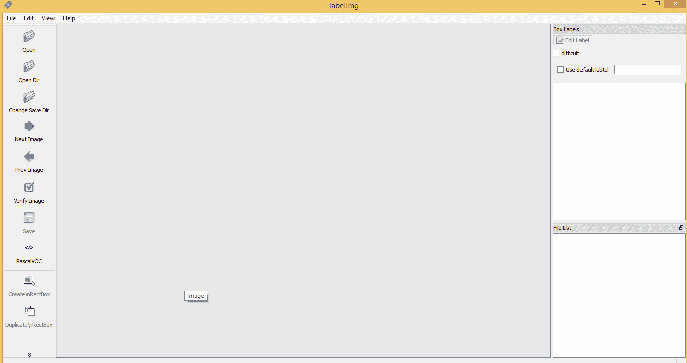

1.  在`data`文件夹中的`predefined_classes.txt`文件中指定图像中所有可能的标签。我们需要确保每个类别都列在单独的一行中，如下所示：


1.  在 GUI 中点击“打开”以打开图像，并通过点击“创建矩形框”来标注图像，这将弹出如下所示的可选类别：

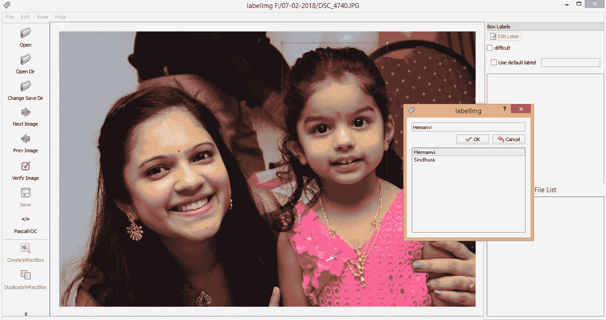

1.  点击“保存”并保存 XML 文件。

1.  检查 XML 文件。绘制矩形边界框后的 XML 文件快照如下所示：

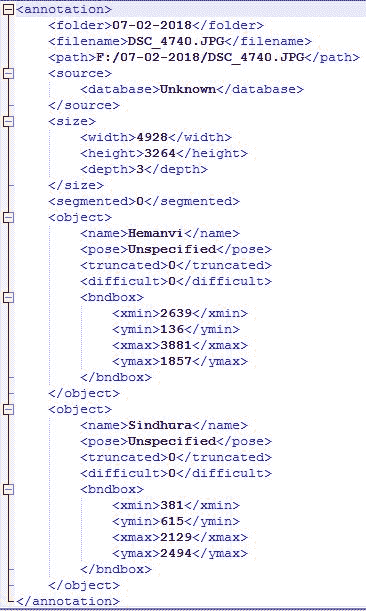

从前面的截图中，你应该注意到`bndbox`包含了与图像中感兴趣物体相对应的*x*和*y*坐标的最小值和最大值。此外，我们还应该能够提取图像中物体对应的类别。

# Ubuntu

在 Ubuntu 中，可以通过输入以下命令执行与前述相同的步骤：

```py
$sudo apt-get install pyqt5-dev-tools
$sudo pip3 install -r requirements/requirements-linux-python3.txt
$make qt5py3
$python3 labelImg.py
```

脚本`labelImg.py`可以通过以下 GitHub 链接找到：[`github.com/tzutalin/labelImg`](https://github.com/tzutalin/labelImg)。

一旦我们执行了前面的代码，我们应该能够进行与*Windows*部分中看到的相同分析。

# MacOS

在 macOS 中，可以通过输入以下命令来执行相同的前述步骤：

```py
$brew install qt  # will install qt-5.x.x
$brew install libxml2
$make qt5py3
$python3 labelImg.py
```

脚本`labelImg.py`可以通过以下 GitHub 链接找到：[`github.com/tzutalin/labelImg`](https://github.com/tzutalin/labelImg)。

一旦我们执行了前面的脚本，我们应该能够进行与*Windows*部分中看到的相同分析。

# 在图像中生成区域提议，使用选择性搜索

为了理解什么是区域提议，让我们将这个术语分解为两个组成部分——区域和提议。

**区域**是图像的一个部分，其中该部分的像素具有非常相似的值。

**区域提议**是图像的较小部分，在该部分中有更高的可能性属于某个特定物体。

区域提议是有用的，因为我们从图像中生成了候选区域，这些区域内物体出现的概率较高。在目标定位任务中非常有用，我们需要围绕物体生成一个与前一节中图像中类似的边界框。

# 准备工作

在本节中，我们将探讨如何在一个人的图像中生成一个边界框。

选择性搜索是一种在目标检测中使用的区域提议算法。它旨在快速运行，并具有非常高的召回率。该算法基于计算基于颜色、纹理、大小和形状兼容性的相似区域的层次分组。

可以使用名为`selectivesearch`的 Python 包生成区域提议，示例如下。

选择性搜索通过使用 Felzenszwalb 和 Huttenlocher 提出的基于图的分割方法，首先对图像进行过度分割（生成成千上万的区域提议），并基于像素的强度来执行。

选择性搜索算法将这些过度分割作为初始输入，并执行以下步骤：

1.  将所有与分割部分对应的边界框添加到区域提议列表中

1.  根据相似性将相邻的区域分组

1.  进入第一步

在每次迭代中，较大的区域会被形成并添加到区域提议列表中。因此，我们采用自下而上的方法，从较小的区域生成较大的区域提议。

选择性搜索使用四种相似性度量方法，分别基于颜色、纹理、大小和形状兼容性来生成区域提议。

区域提议有助于识别图像中的潜在感兴趣目标。因此，我们可能会将定位的任务转化为分类任务，分类每个区域是否包含感兴趣的物体。

# 如何进行...

在本节中，我们将展示如何提取区域提议，示例如下（代码文件在 GitHub 上的`Selective_search.ipynb`中可用）：

1.  按如下方式安装`selectivesearch`：

```py
$pip install selectivesearch
```

1.  导入相关的包，见下面的代码：

```py
import matplotlib.pyplot as plt
%matplotlib inline
import selectivesearch
import cv2
```

1.  按如下方式加载图像：

```py
img = cv2.imread('/content/Hemanvi.jpeg')
```

1.  提取区域提议：

```py
img_lbl, regions = selectivesearch.selective_search(img, scale=100, min_size=2000)
```

参数`min_size`提供了一个约束，要求区域提议的大小至少为 2,000 个像素，而参数 scale 有效地设置了观察的尺度，较大的尺度倾向于偏好较大的组件。

1.  检查结果中区域的数量，并将其存储在列表中：

```py
print(len(regions))
candidates = set()
for r in regions:
     if r['rect'] in candidates:
         continue
 # excluding regions smaller than 2000 pixels
     if r['size'] < 2000:
         continue
     x, y, w, h = r['rect']
 candidates.add(r['rect'])
```

在前一步中，我们将所有大于 2,000 像素（面积）的区域存储到候选区域集合中。

1.  绘制包含候选区域的结果图像：

```py
import matplotlib.patches as mpatches
fig, ax = plt.subplots(ncols=1, nrows=1, figsize=(6, 6))
ax.imshow(img)
for x, y, w, h in candidates:
    rect = mpatches.Rectangle(
        (x, y), w, h, fill=False, edgecolor='red', linewidth=1)
    ax.add_patch(rect)
plt.axis('off')
plt.show()
```

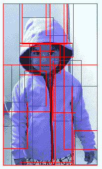

从前面的截图中可以看到，图像中提取了多个区域。

# 计算两个图像之间的交集与并集

为了理解提议区域的准确性，我们使用一个名为**交并比**（**IoU**）的度量。IoU 可以如下可视化：

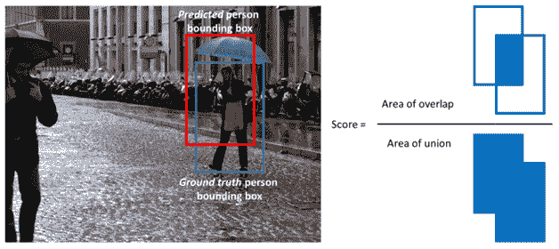

请注意，在上面的图片中，蓝色框（下方）是实际位置，红色框（上方的矩形）是区域提议。

区域提议的交集与并集的计算方法是将提议区域与真实位置的交集面积除以提议区域与真实位置的并集面积。

# 如何执行这个操作...

IoU 的计算方式如下（代码文件可以在 GitHub 中的`Selective_search.ipynb`找到）：

1.  定义 IoU 提取函数，以下代码演示了这个过程：

```py
from copy import deepcopy
import numpy as np
def extract_iou(candidate, current_y,img_shape):
     boxA = deepcopy(candidate)
     boxB = deepcopy(current_y)

     img1 = np.zeros(img_shape)
     img1[boxA[1]:boxA[3],boxA[0]:boxA[2]]=1

     img2 = np.zeros(img_shape)
     img2[int(boxB[1]):int(boxB[3]),int(boxB[0]):int(boxB[2])]=1

     iou = np.sum(img1*img2)/(np.sum(img1)+np.sum(img2)- np.sum(img1*img2))
     return iou
```

在上述函数中，我们将候选区域、实际物体区域和图像形状作为输入。

此外，我们为候选图像和实际物体位置图像初始化了两个相同形状且值为零的数组。

我们已经覆盖了候选图像和实际物体位置图像，在它们各自的位置上显示图像和物体。

最后，我们计算了候选图像与实际物体位置图像的交集与并集的比值。

1.  导入感兴趣的图像：

```py
img = cv2.imread('/content/Hemanvi.jpeg')
```

1.  绘制图像并验证物体的实际位置：

```py
plt.imshow(img)
plt.grid('off')
```

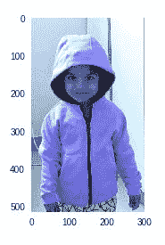

请注意，感兴趣的区域大约从左下角的 50 个像素开始，延伸到图像的第 290 个像素。此外，在*y*轴上，它也从大约第 50 个像素开始，直到图像的末端。

所以，物体的实际位置是（50，50，290，500），这是（`xmin`，`ymin`，`xmax`，`ymax`）格式。

1.  提取区域提议：

```py
img_lbl, regions = selectivesearch.selective_search(img, scale=100, min_size=2000)
```

从`selectivesearch`方法提取的区域格式为（`xmin`，`ymin`，`width`，`height`）。因此，在提取区域的 IoU 之前，我们需要确保候选区域和实际位置图像的格式一致，即（`xmin`，`ymin`，`xmax`，`ymax`）。

1.  将 IoU 提取函数应用于感兴趣的图像。请注意，函数的输入是实际物体的位置和候选图像的形状：

```py
regions =list(candidates)
actual_bb = [50,50,290,500]
iou = []
for i in range(len(regions)):
     candidate = list(regions[i])
     candidate[2] += candidate[0]
     iou.append(extract_iou(candidate, actual_bb, img.shape))
```

1.  确定与实际物体（真实边界框）具有最高重叠的区域：

```py
np.argmax(iou)
```

对于这个特定图像，前述输出是第十个候选区域，其坐标为 0，0，299，515。

1.  让我们打印实际的边界框和候选边界框。为此，我们需要将输出的（`xmin`，`ymin`，`xmax`，`ymax`）格式转换为（`xmin`，`ymin`，`width`，`height`）：

```py
max_region = list(regions[np.argmax(iou)])
max_region[2] -= max_region[0]
max_region[3] -= max_region[1]

actual_bb[2] -= actual_bb[0]
actual_bb[3] -= actual_bb[1]
```

让我们附加实际边界框和具有最高 IoU 的候选边界框：

```py
maxcandidate_actual = [max_region,actual_bb]
```

现在，我们将循环遍历前述列表，并为图像中物体的实际位置分配更大的线宽，以便区分候选区域与实际物体的位置：

```py
import matplotlib.patches as mpatches
fig, ax = plt.subplots(ncols=1, nrows=1, figsize=(6, 6))
ax.imshow(img)
for i,(x, y, w, h) in enumerate(maxcandidate_actual):
 if(i==0):
 rect = mpatches.Rectangle(
 (x, y), w, h, fill=False, edgecolor='blue', linewidth=2)
 ax.add_patch(rect)
 else:
 rect = mpatches.Rectangle(
 (x, y), w, h, fill=False, edgecolor='red', linewidth=5)
 ax.add_patch(rect)
plt.axis('off')
plt.show()
```

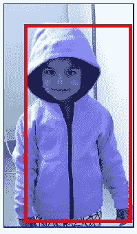

通过这种方式，我们可以确定每个候选区域与图像中物体实际位置的 IoU。此外，我们还可以确定与图像中物体实际位置 IoU 最高的候选区域。

# 使用基于区域建议的 CNN 进行物体检测

在前一节中，我们已经学习了如何从图像中生成区域建议。 本节中，我们将利用这些区域建议来进行物体检测和定位。

# 准备工作

我们将采用的基于区域建议的物体检测和定位策略如下：

1.  对于当前的练习，我们将基于仅包含一个物体的图像来构建模型

1.  我们将从图像中提取不同的区域建议（候选框）

1.  我们将计算候选框与实际物体位置的接近程度：

    +   本质上，我们计算候选框与物体实际位置的交并比

1.  如果交并比大于某个阈值——则该候选框被认为包含目标物体，否则不包含：

    +   这将为每个候选框创建标签，其中候选框的图像作为输入，交并比阈值提供输出

1.  我们将调整每个候选框的图像大小，并通过 VGG16 模型（我们在前一章节中学习过）提取候选框的特征

1.  此外，我们将通过比较候选框的位置与物体实际位置来创建边界框修正的训练数据

1.  构建一个分类模型，将候选框的特征映射到区域是否包含物体的输出

1.  对于包含图像的区域（根据模型），构建一个回归模型，将候选框的输入特征映射到提取物体准确边界框所需的修正

1.  对结果边界框执行非极大值抑制：

    +   非极大值抑制确保了重叠度较高的候选框被压缩为 1，最终只保留具有最高概率包含物体的候选框

1.  通过执行非极大值抑制，我们将能够复现为包含多个物体的图像构建的模型

以下是前述内容的示意图：


# 如何做到……

在本节中，我们将编写前一节讨论过的算法（代码文件和相应推荐数据集的链接可在 GitHub 上找到，文件名为`Region_proposal_based_object_detection.ipynb`，并附有推荐的数据集）：

1.  下载包含一组图像、其中包含的物体及图像中物体对应的边界框的数据集。数据集和相应的代码文件可以在 GitHub 上找到，供您使用。

以下是一个示例图像及其对应的边界框坐标和图像中的物体类别：


物体的类别和边界框坐标将保存在 XML 文件中（如何获取 XML 文件的详细信息可参考 GitHub 上的代码文件），可以通过以下方式从 XML 文件中提取：

如果`xml["annotation"]["object"]`是一个列表，说明图像中存在多个物体。

`xml["annotation"]["object"]["bndbox"]`提取图像中物体的边界框，其中边界框的坐标包括“xmin”、“ymin”、“xmax”和“ymax”。

`xml["annotation"]["object"]["name"]`提取图像中物体的类别。

1.  按如下方式导入相关包：

```py
import matplotlib.pyplot as plt
%matplotlib inline
import tensorflow as tf, selectivesearch
import json, scipy, os, numpy as np,argparse,time, sys, gc, cv2, xmltodict
from copy import deepcopy
```

1.  定义 IoU 提取函数，如下代码所示：

```py
def extract_iou2(candidate, current_y,img_shape):
     boxA = deepcopy(candidate)
     boxB = deepcopy(current_y)
     boxA[2] += boxA[0]
     boxA[3] += boxA[1]
     iou_img1 = np.zeros(img_shape)
     iou_img1[boxA[1]:boxA[3],boxA[0]:boxA[2]]=1
     iou_img2 = np.zeros(img_shape)
     iou_img2[int(boxB[1]):int(boxB[3]),int(boxB[0]):int(boxB[2])]=1
     iou = np.sum(iou_img1*iou_img2)/(np.sum(iou_img1)+np.sum(iou_img2)-np.sum(iou_img1*iou_img2))
     return iou
```

1.  定义候选框提取函数，如下所示：

```py
def extract_candidates(img):
     img_lbl, regions = selectivesearch.selective_search(img, scale=100, min_size=100)
     img_area = img.shape[0]*img.shape[1]
     candidates = []
     for r in regions:
         if r['rect'] in candidates:
             continue
         if r['size'] < (0.05*img_area):
             continue
         x, y, w, h = r['rect']
         candidates.append(list(r['rect']))
     return candidates
```

注意，在上述函数中，我们排除了占据图像面积小于 5%的所有候选框。

1.  按如下方式导入预训练的 VGG16 模型：

```py
from keras.applications import vgg16
from keras.utils.vis_utils import plot_model
vgg16_model = vgg16.VGG16(include_top=False, weights='imagenet')
```

1.  为包含单一物体的图像创建输入和输出映射。初始化多个列表，随着图像的遍历，它们将被填充：

```py
training_data_size = N = 1000

final_cls = []
final_delta = []
iou_list = []
imgs = []
```

我们将遍历图像，只处理那些包含单一物体的图像：

```py
for ix, xml in enumerate(XMLs[:N]):
    print('Extracted data from {} xmls...'.format(ix), end='\r')
    xml_file = annotations + xml
    fname = xml.split('.')[0]
    with open(xml_file, "rb") as f: # notice the "rb" mode
        xml = xmltodict.parse(f, xml_attribs=True)
        l = []        
        if isinstance(xml["annotation"]["object"], list):
            #'let us ignore cases with multiple objects...'
            continue
```

在上述代码中，我们提取了图像的`xml`属性，并检查图像是否包含多个对象（如果`xml["annotation"]["object"]`的输出是一个列表，则图像包含多个对象）。

归一化物体位置坐标，以便我们可以处理归一化后的边界框。这样即使图像形状在进一步处理时发生变化，归一化的边界框也不会变化。例如，如果物体的`xmin`在*x*轴的 20%和*y*轴的 50%处，即使图像被重新调整大小，其位置也不会变化（但如果处理的是像素值，`xmin`的值会发生变化）：

```py
        bndbox = xml['annotation']['object']['bndbox']
        for key in bndbox:
              bndbox[key] = float(bndbox[key])
        x1, x2, y1, y2 = [bndbox[key] for key in ['xmin', 'xmax', 'ymin', 'ymax']]

        img_size = xml['annotation']['size']
        for key in img_size:
              img_size[key] = float(img_size[key])
        w, h = img_size['width'], img_size['height']

        #'converting pixel values from bndbox to fractions...'
        x1 /= w; x2 /= w; y1 /= h; y2 /= h
        label = xml['annotation']['object']['name']

        y = [x1, y1, x2-x1, y2-y1, label]  # top-left x & y, width and height
```

在上述代码中，我们已经对边界框坐标进行了归一化处理。

提取图像中的候选框：

```py
         filename = jpegs+fname+'.jpg' # Path to jpg files here
         img = cv2.resize(cv2.imread(filename), (224,224)) # since VGG's input shape is 224x224
         candidates = extract_candidates(img)
```

在上述代码中，我们使用了`extract_candidates`函数来提取调整大小后的图像的区域建议。

遍历候选框，计算每个候选框与图像中实际边界框的交并比（IoU），并计算实际边界框与候选框之间的对应偏差：

```py
         for jx, candidate in enumerate(candidates):
                current_y2 = [int(i*224) for i in [x1,y1,x2,y2]] # [int(x1*224), int(y1*224), int(x2*224), int(y2*224)]
                iou = extract_iou2(candidate, current_y2, (224, 224))
                candidate_region_coordinates = c_x1, c_y1, c_w, c_h = np.array(candidate)/224

                dx = c_x1 - x1 
                dy = c_y1 - y1 
                dw = c_w - (x2-x1)
                dh = c_h - (y2-y1)

                final_delta.append([dx,dy,dw,dh]) 
```

计算每个区域建议的 VGG16 特征，并根据区域建议与实际边界框的 IoU 来分配目标：

```py
               if(iou>0.3): 
                    final_cls.append(label)
               else:
                    final_cls.append('background')

            #"We'll predict our candidate crop using VGG"
               l = int(c_x1 * 224)
               r = int((c_x1 + c_w) * 224)
               t = int(c_y1 * 224)
               b = int((c_y1 + c_h) * 224)

               img2 = img[t:b,l:r,:3]
               img3 = cv2.resize(img2,(224,224))/255
               img4 = vgg16_model.predict(img3.reshape(1,224,224,3))
               imgs.append(img4)
```

1.  创建输入和输出数组：

```py
targets = pd.DataFrame(final_cls, columns=['label'])
labels = pd.get_dummies(targets['label']).columns
y_train = pd.get_dummies(targets['label']).values.astype(float)
```

我们使用`get_dummies`方法，因为类别是分类文本值：

```py
x_train = np.array(imgs)
x_train = x_train.reshape(x_train.shape[0],x_train.shape[2],x_train.shape[3],x_train.shape[4])
```

1.  构建并编译模型：

```py
model = Sequential()
model.add(Flatten(input_shape=((7,7,512))))
model.add(Dense(512, activation='relu'))
model.add(Dense(all_classes.shape[1],activation='softmax'))

model.compile(loss='binary_crossentropy',optimizer='adam', metrics=['accuracy'])
```

1.  训练模型，如下所示：

```py
model.fit(xtrain3/x_train.max(),y_train,validation_split = 0.1, epochs=5, batch_size=32, verbose=1)
```

上述结果在测试数据集上实现了 97%的分类准确率。

我们通过 `x_train.max()` 来对输入数组进行除法操作，因为输入数组中的最大值大约是 11。通常来说，将输入值缩放至 0 和 1 之间是一个好主意，并且考虑到 VGG16 在缩放输入上的预测最大值大约是 11，所以我们将输入数组除以 `x_train.max()` —— 其值大约为 11。

1.  对数据集中的类别进行预测（确保我们不考虑用于训练的图像）。

1.  选择一个未用于测试的图像：

```py
import matplotlib.patches as mpatches
ix = np.random.randint(N, len(XMLs))
filename = jpegs + XMLs[ix].replace('xml', 'jpg')
```

1.  构建一个函数，执行图像预处理以提取候选区域，对调整大小后的候选区域进行模型预测，过滤掉预测为背景类别的区域，最后绘制出具有最高概率包含非背景类别的区域（候选区域）：

```py
def test_predictions(filename):
     img = cv2.resize(cv2.imread(filename), (224,224))
     candidates = extract_candidates(img)
```

在前面的代码中，我们正在调整输入图像的大小，并从中提取候选区域：

```py
    _, ax = plt.subplots(1, 2)
    ax[0].imshow(img)
    ax[0].grid('off')
    ax[0].set_title(filename.split('/')[-1])
    pred = []
    pred_class = []
```

在前面的代码中，我们正在绘制一张图像，并初始化预测的概率和预测类别列表，这些列表将在后续步骤中被填充：

```py
    for ix, candidate in enumerate(candidates):
        l, t, w, h = np.array(candidate).astype(int)
        img2 = img[t:t+h,l:l+w,:3]
        img3 = cv2.resize(img2,(224,224))/255
        img4 = vgg16_model.predict(img3.reshape(1,224,224,3))
        final_pred = model.predict(img4/x_train.max())
        pred.append(np.max(final_pred))
        pred_class.append(np.argmax(final_pred))
```

在前面的代码中，我们正在遍历候选区域，调整其大小，并将其通过 VGG16 模型进行处理。此外，我们还将 VGG16 的输出传入我们的模型，后者提供了图像属于各种类别的概率：

```py
    pred = np.array(pred)
    pred_class = np.array(pred_class)
    pred2 = pred[pred_class!=1]
    pred_class2 = pred_class[pred_class!=1]
    candidates2 = np.array(candidates)[pred_class!=1]
    x, y, w, h = candidates2[np.argmax(pred2)]
```

在前面的代码中，我们正在提取具有最高概率包含非背景物体的候选区域（其中一个预测类别对应于背景）：

```py
   ax[1].set_title(labels[pred_class2[np.argmax(pred2)]])
   ax[1].imshow(img)
   ax[1].grid('off')
   rect = mpatches.Rectangle((x, y), w, h, fill=False, edgecolor='red', linewidth=1)
   ax[1].add_patch(rect)
```

在前面的代码中，我们正在绘制图像并显示边界框的矩形区域。

1.  调用定义的函数并使用一张新图像：

```py
filename = '...' #Path to new image
test_predictions(filename)
```

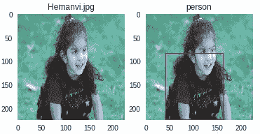

请注意，模型准确地预测了图像中物体的类别。此外，具有最高概率包含人的边界框（候选区域）需要稍作修正。

在下一步中，我们将进一步修正边界框。

1.  构建并编译一个模型，该模型以图像的 VGG16 特征作为输入，并预测边界框的修正值：

```py
model2 = Sequential()
model2.add(Flatten(input_shape=((7,7,512))))
model2.add(Dense(512, activation='relu'))
model2.add(Dense(4,activation='linear'))

model2.compile(loss='mean_absolute_error',optimizer='adam')
```

1.  构建模型以预测边界框的修正值。然而，我们需要确保只对那些可能包含图像的区域进行边界框修正预测：

```py
for i in range(1000):
     samp=random.sample(range(len(x_train)),500)
     x_train2=[x_train[i] for i in samp if pred_class[i]!=1]
     x_train2 = np.array(x_train2)
     final_delta2 = [final_delta[i] for i in samp if pred_class[i]!=1]
     model2.fit(x_train2/x_train.max(), np.array(final_delta2), validation_split = 0.1, epochs=1, batch_size=32, verbose=0)
```

在前面的代码中，我们正在遍历输入数组数据集，并创建一个新的数据集，该数据集仅包含那些可能包含非背景区域的部分。

此外，我们正在重复执行前面的步骤 1,000 次，以微调模型。

1.  构建一个函数，输入图像路径并预测图像的类别，同时修正边界框：

```py
'TESTING'
import matplotlib.patches as mpatches
def test_predictions2(filename):
     img = cv2.resize(cv2.imread(filename), (224,224))
     candidates = extract_candidates(img)
     _, ax = plt.subplots(1, 2)
     ax[0].imshow(img)
     ax[0].grid('off')
     ax[0].set_title(filename.split('/')[-1])
     pred = []
     pred_class = []
     del_new = []
     for ix, candidate in enumerate(candidates):
        l, t, w, h = np.array(candidate).astype(int)
        img2 = img[t:t+h,l:l+w,:3]
        img3 = cv2.resize(img2,(224,224))/255
        img4 = vgg16_model.predict(img3.reshape(1,224,224,3)) 
        final_pred = model.predict(img4/x_train.max())
        delta_new = model2.predict(img4/x_train.max())[0] 
        pred.append(np.max(final_pred))
        pred_class.append(np.argmax(final_pred))
        del_new.append(delta_new) 
     pred = np.array(pred)
     pred_class = np.array(pred_class)
     non_bgs = (pred_class!=1)
     pred = pred[non_bgs]
     pred_class = pred_class[non_bgs] 
     del_new = np.array(del_new)
     del_new = del_new[non_bgs]
     del_pred = del_new*224
     candidates = C = np.array(candidates)[non_bgs]
     C = np.clip(C, 0, 224)
     C[:,2] += C[:,0]
     C[:,3] += C[:,1]
     bbs_pred = candidates - del_pred
     bbs_pred = np.clip(bbs_pred, 0, 224) 
     bbs_pred[:,2] -= bbs_pred[:,0]
     bbs_pred[:,3] -= bbs_pred[:,1]
     final_bbs_pred = bbs_pred[np.argmax(pred)]
     x, y, w, h = final_bbs_pred
     ax[1].imshow(img)
     ax[1].grid('off')
     rect = mpatches.Rectangle((x, y), w, h, fill=False, edgecolor='red', linewidth=1)
     ax[1].add_patch(rect)
     ax[1].set_title(labels[pred_class[np.argmax(pred)]])
```

1.  提取仅包含一个物体的测试图像（因为我们已经构建了仅包含单一物体的图像模型）：

```py
single_object_images = []
for ix, xml in enumerate(XMLs[N:]):
     xml_file = annotations + xml
     fname = xml.split('.')[0]
     with open(xml_file, "rb") as f: # notice the "rb" mode
         xml = xmltodict.parse(f, xml_attribs=True)
         l = []
         if isinstance(xml["annotation"]["object"], list):
             continue
         single_object_images.append(xml["annotation"]['filename'])
         if(ix>100):
             break
```

在前面的代码中，我们正在遍历图像注释并识别包含单一物体的图像。

1.  对单一物体图像进行预测：

```py
test_predictions2(filename)
```

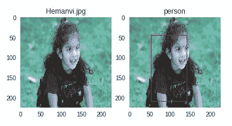

请注意，第二个模型能够修正边界框以适应人物；然而，边界框仍然需要稍微进一步修正。这可以通过在更多数据点上进行训练来实现。

# 执行非极大值抑制（NMS）

到目前为止，在前一节中，我们只考虑了没有背景的候选区域，并进一步考虑了具有最高物体兴趣概率的候选。然而，这在图像中存在多个物体的情况下无法正常工作。

在本节中，我们将讨论筛选候选区域提议的方法，以便我们能够提取图像中尽可能多的物体。

# 准备工作

我们采用的 NMS 策略如下：

+   从图像中提取区域提议。

+   重新调整区域提议的形状，并预测图像中包含的物体。

+   如果物体不是背景类，我们将保留该候选区域。

+   对于所有非背景类的候选区域，我们将按其包含物体的概率排序。

+   第一个候选（按照各类别概率降序排序后的第一个候选）将与其余所有候选区域进行 IoU 比较。

+   如果其他任何区域与第一个候选区域有较大重叠，它们将被丢弃。

+   在剩下的候选中，我们将再次考虑具有最高包含物体概率的候选区域。

+   我们将重复比较第一个候选（在前一步中已过滤且与第一个候选重叠较小的候选列表中的候选）与其余候选区域。

+   该过程将持续进行，直到没有剩余候选区域可以比较为止。

+   我们将绘制前述步骤后剩余候选区域的最终边界框。

# 如何执行……

非极大值抑制的 Python 代码如下。我们将从前面食谱中的第 14 步继续（代码文件及对应推荐数据集链接可在 GitHub 中的`Region_proposal_based_object_detectionn.ipynb`找到）。

1.  从图像中提取所有有较高信心包含非背景类物体的区域：

```py
filename = jpegs + single_object_images[ix]
img = cv2.imread(filename)
img = cv2.resize(img,(224,224))
img_area = img.shape[0]*img.shape[1]
candidates = extract_candidates(img)
plt.imshow(img)
plt.grid('off')
```

我们正在考虑的图像如下：

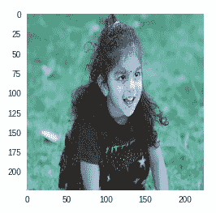

1.  对候选区域进行预处理——将它们通过 VGG16 模型，然后预测每个区域提议的类别以及区域的边界框：

```py
pred = []
pred_class = []
del_new = []

for ix, candidate in enumerate(candidates):
    l, t, w, h = np.array(candidate).astype(int)
    img2 = img[t:t+h,l:l+w,:3]
    img3 = cv2.resize(img2,(224,224))/255
    img4 = vgg16_model.predict(img3.reshape(1,224,224,3)) 
    final_pred = model.predict(img4/x_train.max())
    delta_new = model2.predict(img4/x_train.max())[0]
    pred.append(np.max(final_pred))
    pred_class.append(np.argmax(final_pred))
    del_new.append(delta_new)
pred = np.array(pred)
pred_class = np.array(pred_class)
```

1.  提取非背景类预测结果及其对应的边界框修正值：

```py
non_bgs = ((pred_class!=1))
pred = pred[non_bgs]
pred_class = pred_class[non_bgs]

del_new = np.array(del_new)
del_new = del_new[non_bgs]
del_pred = del_new*224
```

在前一步中，我们已过滤掉所有概率、类别和边界框修正值，针对非背景区域（预测类别`1`在我们的数据准备过程中属于背景类别）。

1.  使用边界框修正值校正候选区域：

```py
candidates = C = np.array(candidates)[non_bgs]
C = np.clip(C, 0, 224)
C[:,2] += C[:,0]
C[:,3] += C[:,1]

bbs_pred = candidates - del_pred
bbs_pred = np.clip(bbs_pred, 0, 224)
```

此外，我们还确保了`xmax`和`ymax`坐标不能大于`224`。

此外，我们需要确保边界框的宽度和高度不能为负值：

```py
bbs_pred[:,2] -= bbs_pred[:,0]
bbs_pred[:,3] -= bbs_pred[:,1]
bbs_pred = np.clip(bbs_pred, 0, 224)

bbs_pred2 = bbs_pred[(bbs_pred[:,2]>0) & (bbs_pred[:,3]>0)]
pred = pred[(bbs_pred[:,2]>0) & (bbs_pred[:,3]>0)]
pred_class = pred_class[(bbs_pred[:,2]>0) & (bbs_pred[:,3]>0)]
```

1.  绘制包含边界框的图像：

```py
import matplotlib.patches as mpatches
fig, ax = plt.subplots(ncols=1, nrows=1, figsize=(6, 6))
ax.imshow(img)
for ix, (x, y, w, h) in enumerate(bbs_pred2):
    rect = mpatches.Rectangle(
        (x, y), w, h, fill=False, edgecolor='red', linewidth=1)
    ax.add_patch(rect)

plt.axis('off')
plt.show()
```

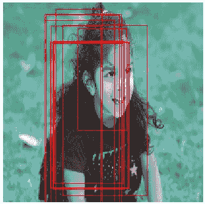

1.  对边界框执行非最大值抑制（NMS）。为此，我们将定义一个函数，该函数通过考虑两个边界框可能具有的最小交集（阈值）、边界框坐标以及与每个边界框相关的概率得分来执行 NMS，详细步骤如下：

    1.  计算每个边界框的`x`、`y`、`w`和`h`值，它们的对应面积，以及它们的概率顺序：

```py
def nms_boxes(threshold, boxes, scores):
     x = boxes[:, 0]
     y = boxes[:, 1]
     w = boxes[:, 2]
     h = boxes[:, 3]
     areas = w * h
     order = scores.argsort()[::-1]
```

1.  1.  计算概率最高的候选框与其他候选框之间的交并比（IoU）：

```py
     keep = []
     while order.size > 0:
         i = order[0]
         keep.append(i)
         xx1 = np.maximum(x[i], x[order[1:]])
         yy1 = np.maximum(y[i], y[order[1:]])
         xx2 = np.minimum(x[i] + w[i], x[order[1:]] + w[order[1:]])
         yy2 = np.minimum(y[i] + h[i], y[order[1:]] + h[order[1:]])
         w1 = np.maximum(0.0, xx2 - xx1 + 1)
         h1 = np.maximum(0.0, yy2 - yy1 + 1)
         inter = w1 * h1
         iou = inter / (areas[i] + areas[order[1:]] - inter)
```

1.  1.  确定那些 IoU 小于阈值的候选框：

```py
        inds = np.where(ovr <= threshold)[0]
        order = order[inds + 1]
```

在前面的步骤中，我们确保了接下来的一组候选框（除了第一个候选框）将循环执行相同的步骤（注意函数开始处的`while`循环）。

1.  1.  返回需要保留的候选框的索引：

```py
    keep = np.array(keep)
    return keep
```

1.  执行前面的函数：

```py
keep_box_ixs = nms_boxes(0.3, bbs_pred2, pred)
```

1.  绘制前一步留下的边界框：

```py
import matplotlib.patches as mpatches
fig, ax = plt.subplots(ncols=1, nrows=1, figsize=(6, 6))
ax.imshow(img)
for ix, (x, y, w, h) in enumerate(bbs_pred2):
     if ix not in keep_box_ixs:
         continue
     rect = mpatches.Rectangle((x, y), w, h, fill=False, edgecolor='red', linewidth=1)
     ax.add_patch(rect)
     centerx = x + w/2
     centery = y + h - 10
     plt.text(centerx, centery,labels[pred_class[ix]]+" "+str(round(pred[ix],2)),fontsize = 20,color='red')
plt.axis('off')
plt.show()
```

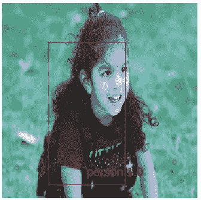

从前面的截图中，我们看到我们移除了所有其他作为区域提案生成的边界框。

# 使用基于锚框的算法检测人物

基于区域提案的 CNN 的一个缺点是它无法实现实时物体识别，因为选择性搜索需要相当长的时间来提出区域。这使得基于区域提案的物体检测算法在像自动驾驶汽车这样的实时检测场景中不具备实用性。

为了实现实时检测，我们将从零开始构建一个受**You Only Look Once**（**YOLO**）算法启发的模型，该模型可以查看包含人物的图像，并在图像中的人物周围绘制边界框。

# 准备就绪

为了理解 YOLO 如何克服生成区域提案时所消耗的时间这一缺点，让我们将“YOLO”一词拆解成其组成部分——我们将在神经网络的单次前向传播中完成所有预测（图像类别以及边界框）。与基于区域提案的 CNN 方法相比，我们首先使用选择性搜索算法得到区域提案，然后在其基础上构建分类算法。

为了弄清楚 YOLO 的工作细节，让我们通过一个简单的示例。假设输入图像如下所示——该图像被划分为一个 3 x 3 的网格：

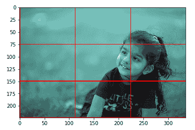

我们的神经网络模型的输出将是 3 x 3 x 5 的大小，其中前 3 x 3 表示图像中的网格数，第一个输出通道对应网格包含物体的概率，另外四个通道是网格对应的* x *，* y *，* w *，* h *坐标的增量。

另一个我们使用的工具是锚框。实质上，我们已经知道，在我们拥有的图像集合中，有些形状是已知的。例如，汽车的形状通常宽度大于高度，而站立的人物通常高度大于宽度。

因此，我们将把图像集中所有的高度和宽度值聚类成五个簇，这样就会得到五个锚框的高度和宽度，用于识别图像中的物体边界框。

如果图像中有五个锚框工作，则输出将是 3 x 3 x 5 x 5，其中 5 x 5 对应每个锚框的五个组成部分（一个物体的概率和四个* x *，* y *，* w *，* h *的增量）。

从前面的内容可以看出，3 x 3 x 5 x 5 的输出可以通过神经网络模型的单次前向传播生成。

在接下来的部分，我们将看到如何生成锚框大小的伪代码：

+   提取数据集中所有图像的宽度和高度。

+   运行一个具有五个簇的 k-means 聚类，来识别图像中宽度和高度的簇。

+   五个簇中心对应五个锚框的宽度和高度，用于构建模型。

此外，在接下来的部分，我们将了解 YOLO 算法是如何工作的：

+   将图像分割成固定数量的网格单元。

+   与图像的真实边界框中心相对应的网格将负责预测边界框。

+   锚框的中心将与网格的中心相同。

+   创建训练数据集：

    +   对于包含物体中心的网格，因变量为 1，且需要为每个锚框计算* x *，* y *，* w *，* h *的增量。

    +   对于不包含物体中心的网格，因变量为零，且* x *，* y *，* w *，* h *的增量不重要。

+   在第一个模型中，我们将预测包含图像中心的锚框和网格单元组合。

+   在第二个模型中，我们预测锚框的边界框修正。

# 如何实现...

我们将构建用于执行人脸检测的代码（代码文件和相应推荐数据集链接可以在 GitHub 中作为`Anchor_box_based_person_detection.ipynb`找到，连同推荐的数据集）：

1.  下载包含一组图像、图像中物体及其对应边界框的数据集。可以在 GitHub 上找到推荐的数据集及其相关代码文件供你使用。

一个示例图像及其相应的边界框位置输出看起来类似于我们在"*基于区域提议的 CNN 物体检测*"食谱的第 1 步中看到的内容。

1.  导入相关的包，如下所示：

```py
import matplotlib.pyplot as plt
%matplotlib inline
import tensorflow as tf, selectivesearch
import json, scipy, os, numpy as np,argparse,time, sys, gc, cv2, xmltodict
from copy import deepcopy
```

1.  定义 IoU 提取函数，如下所示：

```py
def extract_iou2(candidate, current_y,img_shape):
     boxA = deepcopy(candidate)
     boxB = deepcopy(current_y)
     boxA[2] += boxA[0]
     boxA[3] += boxA[1]
     iou_img1 = np.zeros(img_shape)
     iou_img1[boxA[1]:boxA[3],boxA[0]:boxA[2]]=1
     iou_img2 = np.zeros(img_shape)
     iou_img2[int(boxB[1]):int(boxB[3]),int(boxB[0]):int(boxB[2])]=1
     iou = np.sum(iou_img1*iou_img2)/(np.sum(iou_img1)+np.sum(iou_img2)-np.sum(iou_img1*iou_img2))
     return iou
```

1.  将锚框的宽度和高度定义为图像总宽度和高度的百分比：

1.  1.  确定边界框中人物的所有可能宽度和高度：

```py
y_train = []

for i in mylist[:10000]:
     xml_file = xml_filepath +i
     arg1=i.split('.')[0]
     with open(xml_file, "rb") as f: # notice the "rb" mode
         d = xmltodict.parse(f, xml_attribs=True)
         l=[]
         if type(d["annotation"]["object"]) == type(l):
             discard=1
         else:
             x1=((float(d['annotation']['object']
             ['bndbox']['xmin'])))/(float(d['annotation']['size']['width']))
             x2=((float(d['annotation']['object']
             ['bndbox']['xmax'])))/(float(d['annotation']['size']['width']))
             y1=((float(d['annotation']['object']
             ['bndbox']['ymin'])))/(float(d['annotation']['size']['height']))
             y2=((float(d['annotation']['object']
             ['bndbox']['ymax'])))/(float(d['annotation']['size']['height']))
             cls=d['annotation']['object']['name']
             if(cls == 'person'):
                 y_train.append([x2-x1, y2-y1])
```

在前面的代码中，我们遍历所有仅包含一个物体的图像，然后计算该图像中的边界框的宽度和高度，前提是图像中包含一个人。

1.  1.  使用五个中心进行 k-means 聚类：

```py
y_train = np.array(y_train)
from sklearn.cluster import KMeans
km = KMeans(n_clusters=5)
km.fit(y_train)
km.cluster_centers_
```

前面的步骤产生了如下所示的聚类中心：

```py
anchors = [[[0.84638352, 0.90412013],        
            [0.28036872, 0.58073186],        
            [0.45700897, 0.87035502],        
            [0.15685545, 0.29256264],        
            [0.59814951, 0.64789503]]]

```

1.  创建训练数据集：

    1.  初始化空列表，以便在进一步处理时向其中添加数据：

```py
k=-1
pre_xtrain = []
y_train = []
cls = []
xtrain=[]
final_cls = []
dx = []
dy = []
dw= []
dh = []
final_delta = []
av = 0
x_train = []
img_paths = []
label_coords = []
y_delta = []
anc = []
```

1.  1.  遍历数据集，处理只包含一个物体且该物体为人的图像：

```py
for i in mylist[:10000]:
     xml_file = xml_filepath +i
     arg1=i.split('.')[0]
     discard=0
     with open(xml_file, "rb") as f: # notice the "rb" mode
         d = xmltodict.parse(f, xml_attribs=True)
         l=[]
         if type(d["annotation"]["object"]) == type(l):
             discard=1
         else:
             coords={arg1:[]}
             pre_xtrain.append(arg1)
             m=pre_xtrain[(k+1)]
             k = k+1
             if(discard==0):
                 x1=((float(d['annotation']['object']['bndbox']['xmin'])))/(float(d['annotation']['size']['width']))
                 x2=((float(d['annotation']['object']['bndbox']['xmax'])))/(float(d['annotation']['size']['width']))
                 y1=((float(d['annotation']['object']['bndbox']['ymin'])))/(float(d['annotation']['size']['height']))
                 y2=((float(d['annotation']['object']['bndbox']['ymax'])))/(float(d['annotation']['size']['height']))
                 cls=d['annotation']['object']['name']
                 if(cls == 'person'):
                     coords[arg1].append(x1)
                     coords[arg1].append(y1)
                     coords[arg1].append(x2)
                     coords[arg1].append(y2)
                     coords[arg1].append(cls)
```

前面的代码附加了物体的位置（经过归一化的图像宽度和高度）。

1.  1.  调整人物图像的大小，使所有图像具有相同的形状。此外，将图像缩放至值域在零到一之间：

```py
                     filename = base_dir+m+'.jpg'
                     # reference to jpg files here
                     img = filename
                     img_size=224
                     img = cv2.imread(filename)
                     img2 = cv2.resize(img,(img_size,img_size))
                     img2 = img2/255
```

1.  1.  提取物体的边界框位置，并且还要提取归一化的边界框坐标：

```py
                    current_y = [int(x1*224), int(y1*224), int(x2*224), int(y2*224)]
                    current_y2 = [float(d['annotation']['object']['bndbox']['xmin']), float(d['annotation']['object']['bndbox']['ymin']),
 float(d['annotation']['object']['bndbox']['xmax'])-float(d['annotation']['object']['bndbox']['xmin']),
 float(d['annotation']['object']['bndbox']['ymax'])-float(d['annotation']['object']['bndbox']['ymin'])]

                    label_center = [(current_y[0]+current_y[2])/2,(current_y[1]+current_y[3])/2] 
                    label = current_y
```

1.  1.  提取输入图像的 VGG16 特征：

```py
            vgg_predict =vgg16_model.predict(img2.reshape(1,img_size,img_size,3))
            x_train.append(vgg_predict)
```

到这一步，我们已经创建了输入特征。

1.  1.  让我们创建输出特征——在本例中，我们将为类标签生成 5 x 5 x 5 的输出，为边界框修正标签生成 5 x 5 x 20 的标签：

```py
            target_class = np.zeros((num_grids,num_grids,5))
            target_delta = np.zeros((num_grids,num_grids,20))
```

在前面的步骤中，我们为目标类和边界框修正初始化了零数组：

```py
def positive_grid_cell(label,img_width = 224, img_height = 224): 
     label_center = [(label[0]+label[2])/(2),(label[1]+label[3])/(2)] 
     a = int(label_center[0]/(img_width/num_grids)) 
     b = int(label_center[1]/(img_height/num_grids)) 
     return a, b
```

在前面的步骤中，我们定义了一个包含物体中心的函数：

```py
            a,b = positive_grid_cell(label)
```

前面的代码帮助我们将`1`类分配给包含物体中心的网格，其他所有网格的标签将为零。

此外，让我们定义一个函数，找到与感兴趣物体形状最接近的锚框：

```py
def find_closest_anchor(label,img_width, img_height):
     label_width = (label[2]-label[0])/img_width
     label_height = (label[3]-label[1])/img_height 
     label_width_height_array = np.array([label_width, label_height]) 
     distance = np.sum(np.square(np.array(anchors) - label_width_height_array), axis=1) 
     closest_anchor = anchors[np.argmin(distance)] 
     return closest_anchor
```

前面的代码将图像中感兴趣物体的宽度和高度与所有可能的锚框进行比较，并识别出最接近图像中实际物体宽度和高度的锚框。

最后，我们还将定义一个计算锚框边界框修正的函数，如下所示：

```py
def closest_anchor_corrections(a, b, anchor, label, img_width, img_height): 
     label_center = [(label[0]+label[2])/(2),(label[1]+label[3])/(2)] 
     anchor_center = [a*img_width/num_grids , b*img_height/num_grids ] 
     dx = (label_center[0] - anchor_center[0])/img_width 
     dy = (label_center[1] - anchor_center[1])/img_height
     dw = ((label[2] - label[0])/img_width) / (anchor[0])
     dh = ((label[3] - label[1])/img_height) / (anchor[1]) 
     return dx, dy, dw, dh 
```

现在我们已经准备好创建目标数据了：

```py
for a2 in range(num_grids):
     for b2 in range(num_grids):
         for m in range(len(anchors)):
             dx, dy, dw, dh = closest_anchor_corrections(a2, b2, anchors[m], label, 224, 224)
             target_class[a2,b2,m] = 0
             target_delta[a2,b2,((4*m)):((4*m)+4)] = [dx, dy, dw, dh]
             anc.append(anchors[m])
             if((anchors[m] == find_closest_anchor(label,224, 224)) & (a2 == a) & (b2 == b)):
                 target_class[a2,b2,m] = 1
```

在前面的代码中，当考虑到的锚框是与图像中物体形状最接近的锚框时，我们将目标类赋值为`1`。

我们还将边界框修正存储在另一个列表中：

```py
            y_train.append(target_class.flatten())
            y_delta.append(target_delta)
```

1.  构建一个模型来识别最可能包含物体的网格单元和锚框：

```py
from keras.optimizers import Adam
optimizer = Adam(lr=0.001)
from keras.layers import BatchNormalization
from keras import regularizers
model = Sequential()
model.add(BatchNormalization(input_shape=(7,7,512)))
model.add(Conv2D(1024, (3,3), activation='relu',padding='valid'))
model.add(BatchNormalization())
model.add(Conv2D(5, (1,1), activation='relu',padding='same'))
model.add(Flatten())
model.add(Dense(125, activation='sigmoid'))
model.summary()
```

1.  创建用于分类的输入和输出数组：

```py
y_train = np.array(y_train)
x_train = np.array(x_train)
x_train = x_train.reshape(x_train.shape[0],7,7,512)
```

1.  编译并拟合分类模型：

```py
model.compile(loss='binary_crossentropy', optimizer=optimizer)

model.fit(x_train/np.max(x_train), y_train, epochs=5, batch_size = 32, validation_split = 0.1, verbose = 1)
```

1.  从前面的模型中，我们能够识别出最可能包含人物的网格单元和锚框组合。在此步骤中，我们将构建一个数据集，其中我们修正最有可能包含物体的预测边界框：

```py
delta_x = []
delta_y = []
for i in range(len(x_train)):
     delta_x.append(x_train[i])
     delta = y_delta[i].flatten()
     coord = np.argmax(model.predict(x_train[i].reshape(1,7,7,512)/12))
     delta_y.append(delta[(coord*4):((coord*4)+4)])
```

在前一步中，我们已经准备好了输入（即原始图像的 VGG16 特征）和输出边界框修正，用于预测最有可能包含物体的区域。

请注意，我们将`coord`乘以四，因为对于每个网格单元和锚框组合，都有四个可能的修正值，分别对应* x *、* y *、* w * 和 * h *。

1.  构建一个模型，用来预测* x *、* y *、* w * 和 * h * 坐标的修正：

    1.  创建输入和输出数组，并对四个边界框修正值进行标准化，使得所有四个值具有相似的范围：

```py
delta_x = np.array(delta_x)
delta_y = np.array(delta_y)

max_y = np.max(delta_y, axis=0)
delta_y2 = deltay/max_y
```

1.  1.  构建一个模型，根据 VGG16 特征预测边界框修正：

```py
model2 = Sequential()
model2.add(BatchNormalization(input_shape=(7,7,512)))
model2.add(Conv2D(1024, (3,3), activation='relu',padding='valid'))
model2.add(BatchNormalization())
model2.add(Conv2D(5, (1,1), activation='relu',padding='same'))
model2.add(Flatten())
model2.add(Dense(2, activation='linear'))
```

1.  编译并拟合模型：

```py
model2.compile(loss = 'mean_absolute_error', optimizer = optimizer)
model2.fit(delta_x/np.max(x_train), delta_y2, epochs = 10, batch_size = 32, verbose = 1, validation_split = 0.1)
```

1.  在新图像上预测边界框：

    1.  提取最有可能包含物体的位置：

```py
img = cv2.imread('/content/Hemanvi.jpg')
img = cv2.resize(img,(224,224))
img = img/255
img2 = vgg16_model.predict(img.reshape(1,224,224,3))
arg = np.argmax(model.predict(img2/np.max(x_train)))
```

在前面的步骤中，我们选择了一张包含人物的图像，并调整其大小，以便进一步处理以提取 VGG16 特征。最后，我们识别出最有可能包含人物位置的锚框。

1.  1.  提取最有可能包含图像的网格单元和锚框组合。

上一步预测了最有可能包含感兴趣物体的网格单元和锚框组合，具体做法如下：

```py
count = 0
for a in range(num_grids):
     for b in range(num_grids):
         for c in range(len(anchors)):
             if(count == arg):
                 a2 = a
                 b2 = b
                 c2 = c 
             count+=1
```

在前面的代码中，`a2`和`b2`将是最有可能包含物体的网格单元（即* x *轴和* y *轴的组合），`c2`是可能与物体形状相同的锚框。

1.  1.  预测* x *、* y *、* w * 和 * h * 坐标的修正：

```py
pred = model2.predict(img2/np.max(delta_x))[0]
```

1.  1.  去标准化预测的边界框修正：

```py
pred1 = pred*max_y
```

1.  1.  提取最终修正后的* x *、* y *、* w * 和 * h * 坐标：

```py
xmin = pred1[0]*224+a2*224/num_grids - (anchors[c2][0]*pred1[2] * 224)/2
ymin = pred1[1]*224+b2*224/num_grids - (anchors[c2][1]*pred1[3] * 224)/2

w = anchors[c2][0]*pred1[2] * 224
h = anchors[c2][1]*pred1[3] * 224
```

1.  1.  绘制图像和边界框：

```py
import matplotlib.patches as mpatches
cand = [xmin, ymin, w, h]
cand = np.clip(cand, 1, 223)
fig, ax = plt.subplots(ncols=1, nrows=1, figsize=(6, 6))
ax.imshow(img)
rect = mpatches.Rectangle(
(cand[0], cand[1]), cand[2], cand[3], fill=False, edgecolor='red', linewidth=1)
ax.add_patch(rect)
plt.grid('off')
plt.show()
```

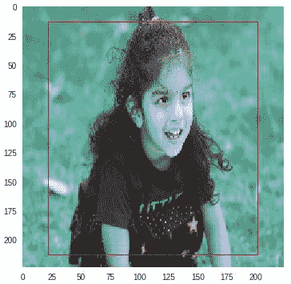

这种方法的一个缺点是，当我们检测的物体相较于图像大小非常小时，检测变得更加困难。

# 还有更多...

假设我们考虑一个要检测的物体较小的场景。如果将这张图片传入预训练网络中，该物体会在早期层中被检测到，因为在最后几层中，图像会经过多个池化层处理，导致物体被压缩到一个非常小的空间中。

同样地，如果要检测的物体较大，那么该物体会在预训练网络的最后几层中被检测到。

单次检测器使用一个预训练网络，其中网络的不同层负责检测不同类型的图像：

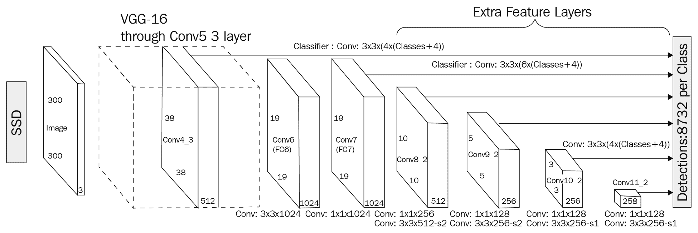

来源：https://arxiv.org/pdf/1512.02325.pdf

在前面的图示中，你需要注意，不同层的特征会通过一个全连接层，最终被连接在一起，以便构建和微调模型。

此外，YOLO 也可以基于此教程实现：[`pjreddie.com/darknet/yolo/`](https://pjreddie.com/darknet/yolo/)。
