# 图像生成

在前面的章节中，我们学习了如何预测图像的类别并检测物体在图像中的位置。如果我们反向操作，给定一个类别后，我们应该能够生成一张图像。在这种情况下，生成网络非常有用，我们尝试创建看起来与原始图像非常相似的新图像。

本章将涵盖以下几种方法：

+   通过对抗性攻击生成能够欺骗神经网络的图像

+   使用 DeepDream 算法生成图像

+   图像之间的神经风格迁移

+   使用生成对抗网络生成数字图像

+   使用深度卷积生成对抗网络生成数字图像

+   使用深度卷积生成对抗网络（Deep Convolutional GAN）生成面部

+   面部从一个到另一个的过渡

+   对生成的图像进行向量算术运算

# 介绍

在前几章中，我们确定了分类图像到正确类别的最优权重。通过改变以下内容，可以改变图像的输出类别：

+   连接输入层和输出层的权重，输入像素保持恒定

+   输入像素值保持不变时，权重保持恒定

本章将采用这两种技术来生成图像。

在对抗性攻击的案例研究中，神经风格迁移和 DeepDream 将利用改变输入像素值的技巧。而涉及**生成对抗网络**（**GAN**）的技术，则会利用改变连接输入像素值和输出的某些权重的技巧。

本章的前三个案例研究将利用改变输入像素值的技巧，而其余的则利用改变连接输入和输出的权重。

# 通过对抗性攻击生成能够欺骗神经网络的图像

为了了解如何对图像执行对抗性攻击，我们先了解如何使用迁移学习进行常规预测，然后我们将弄清楚如何调整输入图像，以便图像的类别完全不同，尽管我们几乎没有改变输入图像。

# 准备工作

让我们通过一个例子，尝试识别图像中的物体类别：

1.  读取一张猫的图像

1.  预处理图像，以便将其传递给 Inception 网络

1.  导入预训练的 Inception v3 模型

1.  预测图像中物体的类别

1.  由于 Inception v3 在预测属于 ImageNet 类之一的物体时表现良好，图像将被预测为波斯猫

当前任务是以这样的方式改变图像，使其满足以下两个标准：

+   使用相同的网络对新图像进行预测时，应该以非常高的概率预测为非洲象

+   新生成的图像应在人眼看来与原始图像无法区分

为了实现这一目标，我们将遵循以下策略：

1.  定义损失函数：

    +   损失是图像（波斯猫）属于非洲象类别的概率

    +   损失越高，我们离目标就越近

    +   因此，在此情况下，我们将最大化我们的损失函数

1.  计算损失变化相对于输入变化的梯度：

    +   这一步有助于理解哪些输入像素将输出向我们的目标推进

1.  基于计算出的梯度更新输入图像：

    +   确保原始图像中的像素值在最终图像中不会偏移超过 3 个像素

    +   这确保了生成的图像在人眼看来与原始图像无法区分

1.  重复步骤 2 和步骤 3，直到更新后的图像被预测为非洲象，且置信度至少为 0.8

# 如何操作...

现在，让我们在代码中实现这一策略（代码文件可在 GitHub 上的`Adversarial_attack.ipynb`找到）：

1.  读取猫的图像：

```py
import matplotlib.pyplot as plt
%matplotlib inline
img = cv2.imread('/content/cat.JPG')
img = cv2.cvtColor(img, cv2.COLOR_BGR2RGB)
img = cv2.resize(img, (299,299))
plt.imshow(img)
plt.axis('off')
```

图像的绘制如下所示：


1.  预处理图像，以便将其传递到 Inception 网络：

```py
original_image = cv2.resize(img,(299,299)).astype(float)
original_image /= 255.
original_image -= 0.5
original_image *= 2.
original_image = np.expand_dims(original_image, axis=0)
```

1.  导入预训练模型：

```py
import numpy as np
from keras.preprocessing import image
from keras.applications import inception_v3
model = inception_v3.InceptionV3()
```

1.  预测图像中对象的类别：

```py
predictions = model.predict(original_image)
predicted_classes = inception_v3.decode_predictions(predictions, top=1)
imagenet_id, name, confidence = predicted_classes[0][0]
print("This is a {} with {:.4}% confidence".format(name, confidence * 100))
```

前面的代码结果如下：

```py
" This is a Persian_cat with 95.45% confidence"
```

1.  定义输入和输出：

```py
model = inception_v3.InceptionV3()
model_input_layer = model.layers[0].input
model_output_layer = model.layers[-1].output
```

`model_input_layer`是模型的输入，`model_output_layer`是输入图像的各种类别的概率（最后一层使用 softmax 激活）。

1.  设置原始图像变化的限制：

```py
max_change_above = np.copy(original_image) + 0.01
max_change_below = np.copy(original_image) - 0.01
hacked_image = np.copy(original_image)
```

在前面的代码中，我们指定了原始图像可以改变的限制。

1.  初始化代价函数，使得要伪装的对象类型是非洲象（预测向量中第 386 个索引值）：

```py
learning_rate = 0.1
object_type_to_fake = 386
cost_function = model_output_layer[0, object_type_to_fake]
```

`model_output_layer`的输出是感兴趣图像的各种类别的概率。在此实例中，我们指定代价函数将由我们试图将对象伪装成的目标对象的索引位置来决定。

1.  初始化代价函数相对于输入的梯度：

```py
gradient_function = K.gradients(cost_function, model_input_layer)[0]
```

这段代码计算了`cost_function`相对于`model_input_layer`（即输入图像）变化的梯度。

1.  映射与输入相关的代价和梯度函数：

```py
grab_cost_and_gradients_from_model = K.function([model_input_layer], [cost_function, gradient_function])
cost = 0.0
```

在前面的代码中，我们正在计算`cost_function`（图像属于非洲象类别的概率）和相对于输入图像的梯度。

1.  一直更新输入图像，直到生成图像的非洲象概率至少达到 80%：

```py
while cost < 0.80:
    cost, gradients = grab_cost_and_gradients_from_model([hacked_image, 0])
    hacked_image += gradients * learning_rate
    hacked_image = np.clip(hacked_image, max_change_below, max_change_above)
    print("Model's predicted likelihood that the image is an African elephant: 
{:.8}%".format(cost * 100))
```

在前面的代码中，我们获取与输入图像（`hacked_image`）对应的代价和梯度。此外，我们通过梯度（与学习率相乘）更新输入图像。最后，如果被修改的图像超过了输入图像的最大变化阈值，我们将对其进行裁剪。

不断循环这些步骤，直到你得到输入图像的概率至少为 0.8。

随着训练轮次的增加，波斯猫图像被识别为非洲象图像的概率变化如下：

```py
epochs = range(1, len(prob_elephant) + 1)
plt.plot(epochs, prob_elephant, 'b')
plt.title('Probability of African elephant class')
plt.xlabel('Epochs')
plt.ylabel('Probability')
plt.grid('off')
```

修改后的图像属于非洲象类别的概率变化如下：


1.  预测更新图像的类别：

```py
model.predict(hacked_image)[0][386]
```

`predict`方法的输出是修改后图像属于非洲象类别的概率，值为 0.804。

1.  对更新后的输入图像进行去处理（因为它在预处理时已经被缩放）以便可视化：

```py
hacked_image = hacked_image/2
hacked_image = hacked_image + 0.5
hacked_image = hacked_image*255
hacked_image = np.clip(hacked_image, 0, 255).astype('uint8')

plt.subplot(131)
plt.imshow(img)
plt.title('Original image')
plt.axis('off')
plt.subplot(132)
plt.imshow(hacked_image[0,:,:,:])
plt.title('Hacked image')
plt.axis('off')
plt.subplot(133)
plt.imshow(img - hacked_image[0,:,:,:])
plt.title('Difference')
plt.axis('off')
```

原始图像、修改后的（被篡改的）图像以及两者之间的差异将如下打印出来：


注意，输出现在在视觉上与原始图像无法区分。

有趣的是，尽管像素值几乎没有变化，但我们成功地欺骗了神经网络（inception v3 模型），使它预测了一个不同的类别。这是一个很好的例子，展示了如果用于预测的算法暴露给可以制作欺骗系统图像的用户，可能会遇到的安全漏洞。

# 使用 DeepDream 算法生成图像

在上一节中，我们稍微调整了输入图像的像素。在这一节中，我们将进一步调整输入图像，以便生成一张仍然是相同物体的图像，但比原图更具艺术感。该算法是使用神经网络进行风格迁移技术的核心。

让我们了解一下 DeepDream 如何工作的直觉。

我们将通过一个预训练模型（例如 VGG19）来处理我们的图像。我们已经了解到，根据输入图像，预训练模型中的某些滤波器激活得最多，而某些滤波器则激活得最少。

我们将提供我们希望激活的神经网络层。

神经网络会调整输入像素值，直到我们获得所选层的最大值。

然而，我们也会确保最大可能的激活值不超过某个值，因为如果激活值过高，结果图像可能会与原始图像有很大不同。

# 准备就绪

理解了这些直觉后，让我们来看看如何实现 DeepDream 算法的步骤：

1.  选择你想要最强激活的神经网络层，并为这些层对整体损失计算的贡献分配权重。

1.  提取给定层的输出，当图像通过该层时，并计算每一层的损失值：

    +   当图像在某一层的输出平方和最大时，图像会最强地激活该层。

1.  提取输入像素值变化相对于损失的梯度。

1.  根据上一阶段提取的梯度更新输入像素值。

1.  提取更新后的输入像素值在所有选定层中的损失值（激活的平方和）。

1.  如果损失值（激活值的加权平方和）大于预定义的阈值，则停止更新图像。

# 如何做到这一点...

让我们在代码中实现这些步骤（代码文件可在 GitHub 的`Deepdream.ipynb`中找到）：

1.  导入相关的包并导入图像：

```py
import keras.backend as K
import multiprocessing
import tensorflow as tf
import warnings
from keras.applications.vgg19 import VGG19
from keras.applications.imagenet_utils import preprocess_input
from scipy.optimize import minimize
from skimage import img_as_float, img_as_ubyte
from skimage.io import imread, imsave
from skimage.transform import pyramid_gaussian, rescale
import scipy
from keras.preprocessing import image
from keras.applications.vgg19 import preprocess_input
import matplotlib.pyplot as plt
%matplotlib inline
```

对图像进行预处理，使其能够传递到 VGG19 模型：

```py
def preprocess_image(image_path):
     img = image.load_img(image_path, target_size=(img_nrows, img_ncols))
     img = image.img_to_array(img)
     img = np.expand_dims(img, axis=0)
     img[:, :, :, 0] -= 103.939
     img[:, :, :, 1] -= 116.779
     img[:, :, :, 2] -= 123.68
     img = img[:, :, :, ::-1]/255
     return img
```

构建一个去处理已处理图像的函数：

```py
def deprocess_image(x):
     x = x[:,:,:,::-1]*255
     x[:, :, :, 0] += 103.939
     x[:, :, :, 1] += 116.779
     x[:, :, :, 2] += 123.68
     x = np.clip(x, 0, 255).astype('uint8')
     return x
```

预处理图像：

```py
img = preprocess_image('/content/cat.png')
```

1.  定义对整体损失值计算有贡献的层：

```py
layer_contributions = {
    'block2_pool':0.3,
    'block5_pool': 1.5}
```

在前面的代码中，我们展示了将使用第二层和第五层池化层，并且分配这两层对整体损失值的贡献权重。

1.  初始化损失函数：

```py
layer_dict = dict([(layer.name, layer) for layer in model.layers])
loss = K.variable(0.)
```

在前面的步骤中，我们初始化了损失值和模型中各个层的字典。

计算激活的整体损失值：

```py
for layer_name in layer_contributions:
     coeff = layer_contributions[layer_name]
     activation = layer_dict[layer_name].output
     scaling = K.prod(K.cast(K.shape(activation), 'float32'))
     loss += coeff * K.sum(K.square(activation)) / scaling
     print(loss)
```

在前面的代码中，我们遍历了感兴趣的层（`layer_contributions`），并记录了为每层分配的权重（`coeff`）。此外，我们还计算了感兴趣层的输出（`activation`），并通过对激活值进行缩放后求平方和来更新损失值。

1.  初始化梯度值：

```py
dream = model.input
grads = K.gradients(loss, dream)[0]
```

`K.gradients`方法给出了损失相对于输入变化（`dream`）的梯度。

1.  对梯度值进行归一化，以便梯度的变化速度较慢：

```py
grads /= K.maximum(K.mean(K.abs(grads)), 1e-7)
```

1.  创建一个函数，将输入图像映射到损失值以及损失值相对于输入像素值变化的梯度（其中输入图像是`dream`）：

```py
outputs = [loss, grads]
fetch_loss_and_grads = K.function([dream], outputs)
```

1.  定义一个函数，提供给定输入图像的损失值和梯度值：

```py
def eval_loss_and_grads(img):
      outs = fetch_loss_and_grads([img])
      loss_value = outs[0]
      grad_values = outs[1]
      return loss_value, grad_values
```

1.  基于获得的损失和梯度值，通过多次迭代更新原始图像。

在下面的代码中，我们遍历图像 100 次。我们定义了图像变化的学习率和图像可能发生的最大损失（变化）：

```py
for i in range(100):
      learning_rate=0.01
      max_loss=20
```

在下面的代码中，我们提取了图像的损失值和梯度值，然后在损失值超过定义的阈值时停止图像的变化：

```py
     loss_value, grad_values = eval_loss_and_grads(img)
     if max_loss is not None and loss_value > max_loss:
         print(loss_value)
         break
     print('...Loss value at', i, ':', loss_value)
```

在下面的代码中，我们根据梯度值更新图像，并进行去处理图像并打印图像：

```py
    img += learning_rate * grad_values
    img2 = deprocess_image(img.copy())
    plt.imshow(img2[0,:,:,:])
    plt.axis('off')
    plt.show()
```

前面的代码生成的图像如下所示：


请注意，前面图像中的波浪图案可能是因为这些是最大化各个网络层激活的模式。

在这里，我们看到了扰动输入像素的另一种应用， 在这种情况下，结果是图像略显艺术感。

# 图像之间的神经风格迁移

在之前的步骤中，修改的像素值试图最大化滤波器的激活值。然而，这并没有给我们提供指定图像风格的灵活性；此时，神经风格迁移派上了用场。

在神经风格迁移中，我们有一个内容图像和一个风格图像，我们尝试以一种方式将这两张图像结合起来，既能保持内容图像中的内容，又能保持风格图像的风格。

# 准备中

神经风格迁移的直觉如下。

我们尝试以类似于 DeepDream 算法的方式修改原始图像。然而，额外的步骤是将损失值分为内容损失和风格损失。

内容损失指的是生成图像与内容图像之间的差异。风格损失指的是风格图像与生成图像之间的相关性。

虽然我们提到损失是基于图像之间的差异来计算的，但在实践中，我们通过确保使用来自图像的激活值而不是原始图像来稍微修改它。例如，第二层的内容损失将是内容图像和生成图像在通过第二层时激活值之间的平方差。

尽管计算内容损失看起来很直接，但让我们尝试理解如何计算生成图像与风格图像之间的相似性。

一种叫做 gram 矩阵的技术出现了。gram 矩阵计算生成图像和风格图像之间的相似度，计算公式如下：


其中，*GM(l)* 是风格图像 *S* 和生成图像 *G* 在层 *l* 处的 gram 矩阵值。

gram 矩阵是通过将一个矩阵与其自身的转置相乘得到的。

现在我们可以计算风格损失和内容损失了，最终的修改输入图像是最小化整体损失的图像，也就是风格损失和内容损失的加权平均值。

神经风格迁移的实现步骤如下：

1.  将图像通过一个预训练模型。

1.  提取预定义层的层值。

1.  将生成的图像初始化为与内容图像相同。

1.  将生成的图像通过模型并提取其在相同层的值。

1.  计算内容损失。

1.  将风格图像通过模型的多个层，并计算风格图像的 gram 矩阵值。

1.  将生成的图像通过与风格图像相同的层，并计算其对应的 gram 矩阵值。

1.  提取两张图像的 gram 矩阵值之间的平方差。这将是风格损失。

1.  整体损失将是风格损失和内容损失的加权平均值。

1.  最小化整体损失的输入图像将是最终的目标图像。

# 如何做到…

1.  导入相关的包和内容、样式图像，它们需要结合在一起形成艺术图像，如下所示（代码文件可在 GitHub 上的`Neural_style_transfer.ipynb`找到）：

```py
from keras.preprocessing.image import load_img, save_img, img_to_array
import numpy as np
import time
from keras.applications import vgg19
from keras.applications.imagenet_utils import preprocess_input
from keras import backend as K
import tensorflow as tf
import keras

style_img = cv2.imread('/content/style image.png')
style_img = cv2.cvtColor(style_img, cv2.COLOR_BGR2RGB)
style_img = cv2.resize(style_img,(224,224))

base_img = cv2.imread('/content/cat.png')
base_img = cv2.cvtColor(base_img, cv2.COLOR_BGR2RGB)
base_img = cv2.resize(base_img,(224,224))
```

样式图像和基础图像如下所示：

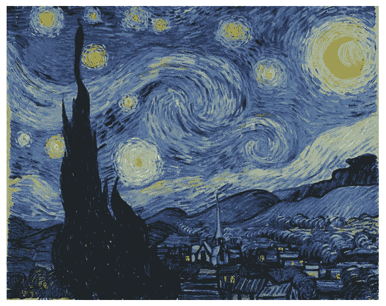

1.  初始化`vgg19`模型，以便图像可以通过其网络传递：

```py
from keras.applications import vgg19
model = vgg19.VGG19(include_top=False, weights='imagenet')
```

1.  重新调整基础图像并提取 VGG19 模型中`block3_conv4`层的特征值：

```py
base_img = base_img.reshape(1,224,224,3)/255
from keras import backend as K
get_3rd_layer_output = K.function([model.layers[0].input],
[model.get_layer('block3_conv4').output])
layer_output_base = get_3rd_layer_output([base_img])[0]
```

在前面的代码中，我们定义了一个函数，该函数获取输入图像并在预定义层中提取输出。

1.  定义需要提取内容和样式损失的层，以及需要分配给每个层的相应权重：

```py
layer_contributions_content = {'block3_conv4': 0.1}

layer_contributions_style =    { 'block1_pool':1,
                                 'block2_pool':1,
                                 'block3_conv4':1}
```

在前面的代码中，我们定义了计算内容和样式损失的层，并为这些层产生的损失分配了相应的权重。

1.  定义 Gram 矩阵和样式损失函数：

在以下代码中，我们定义了一个函数，该函数计算作为通过扁平化图像获得的特征的点积的 Gram 矩阵输出：

```py
def gram_matrix(x):
    features = K.batch_flatten(K.permute_dimensions(x, (2, 0, 1)))
    gram = K.dot(features, K.transpose(features))
    return gram
```

在以下代码中，我们正在计算在*准备阶段*中定义的样式损失方程式中所指定的样式损失：

```py
def style_loss(style, combination):
    S = gram_matrix(style)
    C = gram_matrix(combination)
    channels = 3
    size = img_nrows * img_ncols
    return K.sum(K.square(S - C)) / (4\. * (pow(channels,2)) * (pow(size,2)))
```

1.  初始化损失值函数：

计算内容损失：

```py
layer_dict = dict([(layer.name, layer) for layer in model.layers])
loss = K.variable(0.)
for layer_name in layer_contributions_content:
      coeff = layer_contributions_content[layer_name]
      activation = layer_dict[layer_name].output
      scaling = K.prod(K.cast(K.shape(activation), 'float32'))
      loss += coeff * K.sum(K.square(activation - layer_output_base)) / scaling
```

在前面的代码中，我们根据计算内容损失的层中的损失更新损失值。请注意，`layer_output_base`是通过内容层传递原始基础图像时的输出（如第 3 步所定义）。

激活（基于修改后的图像）和`layer_output_base`（基于原始图像）之间的差异越大，图像的内容损失就越大。

计算样式损失：

```py
for layer_name in layer_contributions_style:
    coeff = layer_contributions_style[layer_name]
    activation = layer_dict[layer_name].output
    scaling = K.prod(K.cast(K.shape(activation), 'float32'))
    style_layer_output = K.function([model.layers[0].input],
model.get_layer(layer_name).output])
    layer_output_style = style_layer_output([style_img.reshape(1,224,224,3)/255])[0][0]
    loss += style_loss(layer_output_style, activation[0])
```

在前面的代码中，我们以与计算内容损失相同的方式计算样式损失，但在不同的层上，并使用我们构建的不同自定义函数：`style_loss`。

1.  构建一个函数，将输入图像映射到损失值和相应的梯度值：

```py
dream = model.input
grads = K.gradients(loss, dream)[0]
grads /= K.maximum(K.mean(K.abs(grads)), 1e-7)
outputs = [loss, grads]
fetch_loss_and_grads = K.function([dream], outputs)

def eval_loss_and_grads(img):
      outs = fetch_loss_and_grads([img])
      loss_value = outs[0]
      grad_values = outs[1]
      return loss_value, grad_values
```

前面的代码以与*DeepDream 算法生成图像*食谱非常相似的方式获取损失和梯度值。

1.  运行模型多个周期：

```py
for i in range(2000):
      step=0.001
      loss_value, grad_values = eval_loss_and_grads(img)
      print('...Loss value at', i, ':', loss_value)
      img -= step * grad_values
      if(i%100 ==0):
            img2 = img.copy().reshape(224,224,3)
            img2 = np.clip(img2*255, 0, 255).astype('uint8')
            plt.imshow(img2)
            plt.axis('off')
            plt.show()
```

前面的代码生成了一张将内容图像和样式图像相结合的图像：

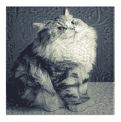

通过选择不同的层来计算内容和样式损失，并为这些层在各自样式或内容贡献中分配不同的系数权重，最终生成的图像可能会有所不同。

在前面的三个案例研究中，我们看到如何通过改变输入像素值来生成新图像。在本章的其余部分，我们将采用一种不同的生成新图像的方法：使用**生成对抗网络**（GANs）。

# 使用生成对抗网络生成数字图像

一个生成对抗网络（GAN）使用一堆神经网络生成一张与原始图像集非常相似的新图像。它在图像生成中有着广泛的应用，并且 GAN 研究领域正在快速进展，旨在生成那些非常难以与真实图像区分的图像。在本节中，我们将理解 GAN 的基础知识——它是如何工作的，以及 GAN 变种之间的差异。

一个 GAN 由两个网络组成：生成器和判别器。生成器尝试生成一张图像，判别器则尝试确定它收到的输入图像是真实的图像还是生成的（假的）图像。

为了进一步理解，假设判别器模型试图将一张图片分类为人脸图像或非人脸图像，数据集中包含了成千上万的人脸图像和非人脸图像。

一旦我们训练模型以区分人脸和非人脸，当我们向模型展示一张新的人脸时，模型仍然会将其分类为人脸，而它会学习将非人脸分类为非人脸。

生成器网络的任务是生成与原始图像集非常相似的图像，以至于判别器会被“欺骗”，认为生成的图像实际上来自原始数据集。

# 准备工作

我们将采用的生成图像的策略如下：

1.  使用生成器网络生成合成图像，初始步骤是生成一张噪声图像，该图像是通过将一组噪声值重新塑形为我们图像的形状来生成的。

1.  将生成的图像与原始图像集合连接，并让判别器预测每个图像是生成的图像还是原始图像——这确保了判别器被训练：

    +   请注意，判别器网络的权重在这一迭代过程中得到了训练。

    +   判别器网络的损失是图像的预测值和实际值之间的二元交叉熵。

    +   生成图像的输出值将是假的（0），而原始图像的值将是真实的（1）。

1.  现在，判别器已经经过了一次迭代训练，接下来训练生成器网络，修改输入噪声，使其看起来更像真实图像而非合成图像——一个有可能欺骗判别器的图像。这个过程包括以下步骤：

    1.  输入噪声通过生成器网络传递，生成器将输入转化为图像。

    1.  从生成器网络生成的图像会传递到判别器网络——但请注意，在这一迭代中判别器网络的权重是被冻结的，因此它们不会在这一迭代中被训练（因为它们已经在步骤 2 中进行了训练）。

    1.  从判别器得到的生成图像输出值将是真实的（1），因为它的任务是欺骗判别器。

    1.  生成器网络的损失是输入图像的预测与实际值之间的二进制交叉熵（对于所有生成的图像，实际值为 1）——这确保了生成器网络的权重被微调：

        +   请注意，在这一步中，判别器网络的权重已被冻结

        +   冻结判别器可以确保生成器网络从判别器提供的反馈中学习

    1.  重复这些步骤多次，直到生成真实的图像。

# 如何操作...

在*对抗性攻击欺骗神经网络*部分，我们讨论了如何生成一个与原始图像非常相似的图像的策略。在这一部分，我们将实现从 MNIST 数据集生成数字图像的过程（代码文件可在 GitHub 上的`Vanilla_and_DC_GAN.ipynb`中找到）：

1.  导入相关的包：

```py
import numpy as np
from keras.datasets import mnist
from keras.layers import Input, Dense, Reshape, Flatten, Dropout
from keras.layers import BatchNormalization
from keras.layers.advanced_activations import LeakyReLU
from keras.models import Sequential
from keras.optimizers import Adam
import matplotlib.pyplot as plt
%matplotlib inline
plt.switch_backend('agg')
from keras.models import Sequential
from keras.layers import Dense
from keras.layers import Reshape
from keras.layers.core import Activation
from keras.layers.normalization import BatchNormalization
from keras.layers.convolutional import UpSampling2D
from keras.layers.convolutional import Conv2D, MaxPooling2D
from keras.layers.core import Flatten
from keras.optimizers import SGD
from keras.datasets import mnist
import numpy as np
from PIL import Image
import argparse
import math
```

1.  定义参数：

```py
shape = (28, 28, 1)
epochs = 400
batch = 32
save_interval = 100
```

1.  定义生成器和判别器网络：

```py
def generator():
    model = Sequential()
    model.add(Dense(256, input_shape=(100,)))
    model.add(LeakyReLU(alpha=0.2))
    model.add(BatchNormalization(momentum=0.8))
    model.add(Dense(512))
    model.add(LeakyReLU(alpha=0.2))
    model.add(BatchNormalization(momentum=0.8))
    model.add(Dense(1024))
    model.add(LeakyReLU(alpha=0.2))
    model.add(BatchNormalization(momentum=0.8))
    model.add(Dense(28 * 28 * 1, activation='tanh'))
    model.add(Reshape(shape))
    return model
```

对于生成器，我们构建了一个模型，它接收一个形状为 100 维的噪声向量，并将其转换为一个形状为 28 x 28 x 1 的图像。注意，我们在模型中使用了`LeakyReLU`激活函数。生成器网络的摘要如下：

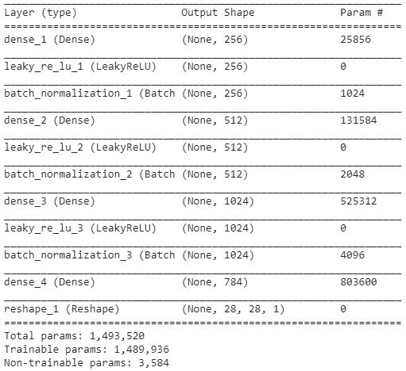

在以下代码中，我们构建了一个判别器模型，其中我们输入一个形状为 28 x 28 x 1 的图像，并输出一个值为 1 或 0 的结果，表示输入图像是原始图像还是伪造图像：

```py
def discriminator():
     model = Sequential()
     model.add(Flatten(input_shape=shape))
     model.add(Dense((28 * 28 * 1), input_shape=shape))
     model.add(LeakyReLU(alpha=0.2))
     model.add(Dense(int((28 * 28 * 1) / 2)))
     model.add(LeakyReLU(alpha=0.2))
     model.add(Dense(1, activation='sigmoid'))
     return model
```

判别器网络的摘要如下：

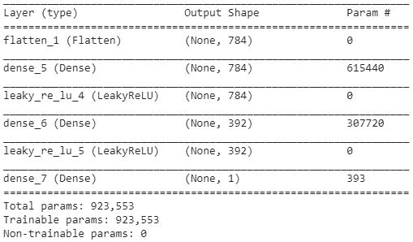

编译生成器和判别器模型：

```py
Generator = generator()
Generator.compile(loss='binary_crossentropy', optimizer=Adam(lr=0.0002, beta_1=0.5, decay=8e-8))
```

```py
Discriminator = discriminator()
Discriminator.compile(loss='binary_crossentropy', optimizer=Adam(lr=0.0002, beta_1=0.5, decay=8e-8),metrics=['accuracy'])
```

1.  定义堆叠的生成器判别器模型，帮助优化生成器的权重，同时冻结判别器网络的权重。堆叠的生成器判别器接受我们传入模型的随机噪声作为输入，并使用生成器网络将噪声转换为一个 28 x 28 的图像。此外，它还判断这个 28 x 28 的图像是真实的还是伪造的：

```py
def stacked_generator_discriminator(D, G):
    D.trainable = False
    model = Sequential()
    model.add(G)
    model.add(D)
    return model

stacked_generator_discriminator = stacked_generator_discriminator(Discriminator, Generator)
stacked_generator_discriminator.compile(loss='binary_crossentropy', optimizer=Adam(lr=0.0002, beta_1=0.5, decay=8e-8))
```

1.  定义一个函数来绘制生成的图像：

```py
def plot_images(samples=16, step=0):
    noise = np.random.normal(0, 1, (samples, 100))
    images = Generator.predict(noise)
    plt.figure(figsize=(10, 10))
    for i in range(images.shape[0]):
        plt.subplot(4, 4, i + 1)
        image = images[i, :, :, :]
        image = np.reshape(image, [28, 28])
        plt.imshow(image, cmap='gray')
        plt.axis('off')
    plt.tight_layout()
    plt.show()
```

1.  提供输入图像：

```py
(X_train, _), (_, _) = mnist.load_data()
X_train = (X_train.astype(np.float32) - 127.5) / 127.5
X_train = np.expand_dims(X_train, axis=3)
```

我们丢弃了`y_train`数据集，因为我们不需要输出标签，模型是基于给定的图像集合（即`X_train`）生成新图像的。

1.  通过多次训练周期优化图像：

在以下代码中，我们正在获取真实图像（`legit_images`）并生成假图像（`synthetic_images`）数据，我们将尝试通过修改噪声数据（`gen_noise`）作为输入，将其转换为逼真的图像，如下所示：

```py
for cnt in range(4000):
      random_index = np.random.randint(0, len(X_train) - batch / 2)
      legit_images = X_train[random_index: random_index + batch // 2].reshape(batch // 2, 28, 28, 1)
      gen_noise = np.random.normal(-1, 1, (batch // 2, 100))/2
      synthetic_images = Generator.predict(gen_noise)
```

在以下代码中，我们正在训练判别器（使用`train_on_batch`方法），其中真实图像应输出 1，而假图像应输出 0：

```py
x_combined_batch = np.concatenate((legit_images, synthetic_images))
y_combined_batch = np.concatenate((np.ones((batch // 2, 1)), np.zeros((batch // 2, 1))))
d_loss = Discriminator.train_on_batch(x_combined_batch, y_combined_batch)
```

在以下代码中，我们正在准备一组新的数据，其中`noise`是输入，`y_mislabeled`是输出，用于训练生成器（请注意，输出与我们训练判别器时的输出正好相反）：

```py
noise = np.random.normal(-1, 1, (batch, 100))/2
y_mislabled = np.ones((batch, 1))
```

在以下代码中，我们正在训练生成器和判别器的堆叠组合，其中判别器的权重被冻结，而生成器的权重会更新，以最小化损失值。生成器的任务是生成能够欺骗判别器输出 1 的图像：

```py
g_loss = stacked_generator_discriminator.train_on_batch(noise, y_mislabled)
```

在以下代码中，我们观察生成器损失和判别器损失在不同周期的输出：

```py
logger.info('epoch: {}, [Discriminator: {}], [Generator: {}]'.format(cnt, d_loss[0], g_loss))
    if cnt % 100 == 0:
          plot_images(step=cnt)
```

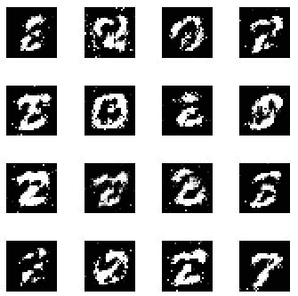

判别器和生成器损失随着周期增加的变化如下：

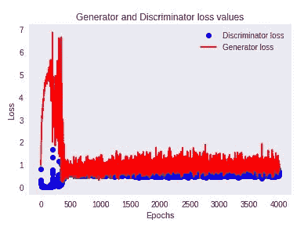

请注意，前面的输出在生成图像的真实感方面还有很大的改进空间。

# 还有更多...

我们看到的输出也是模型架构的函数。例如，可以将模型各层的激活函数更改为 tanh，看看生成的输出如何变化，从而大致了解生成图像的样子。

# 使用深度卷积 GAN 生成图像

在上一部分中，我们研究了使用 Vanilla 生成器和判别器网络生成数字。然而，我们也可以遇到一种情况，即通过使用卷积架构，网络能更好地学习图像中的特征，因为 CNN 中的滤波器会学习图像中的特定细节。**深度卷积生成对抗网络**（**DCGANs**）利用这一现象生成新的图像。

# 如何实现...

虽然 DCGAN 的工作原理与 GAN（我们在上一个示例中使用的模型）非常相似，但主要的区别在于 DCGAN 的生成器和判别器架构，其结构如下（代码文件可以在 GitHub 上找到，文件名为`Vanilla_and_DC_GAN.ipynb`）：

```py
def generator():
    model = Sequential()
    model.add(Dense(input_dim=100, output_dim=1024))
    model.add(Activation('tanh'))
    model.add(Dense(128*7*7))
    model.add(BatchNormalization())
    model.add(Activation('tanh'))
    model.add(Reshape((7, 7, 128), input_shape=(128*7*7,)))
    model.add(UpSampling2D(size=(2, 2)))
    model.add(Conv2D(64, (5, 5), padding='same'))
    model.add(Activation('tanh'))
    model.add(UpSampling2D(size=(2, 2)))
    model.add(Conv2D(1, (5, 5), padding='same'))
    model.add(Activation('tanh'))
    return model

def discriminator():
    model = Sequential()
    model.add(Conv2D(64, (5, 5),padding='same',input_shape=(28, 28, 1)))
    model.add(Activation('tanh'))
    model.add(MaxPooling2D(pool_size=(2, 2)))
    model.add(Conv2D(128, (5, 5)))
    model.add(Activation('tanh'))
    model.add(MaxPooling2D(pool_size=(2, 2)))
    model.add(Flatten())
    model.add(Dense(1024))
    model.add(Activation('tanh'))
    model.add(Dense(1))
    model.add(Activation('sigmoid'))
    return model
```

请注意，在 DCGAN 中，我们对输入数据执行了多次卷积和池化操作。

如果我们重新执行在 Vanilla GAN（*生成对抗网络用于生成图像*）示例中执行的完全相同的步骤，但这次使用定义了卷积和池化架构的模型（即 DCGAN），我们将得到以下生成的图像：


随着迭代轮次增加，生成器和判别器的损失值变化如下：

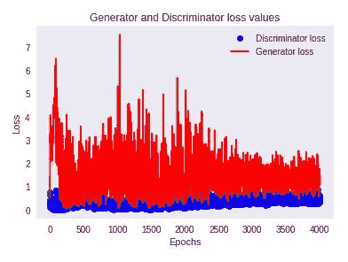

我们可以看到，尽管其他一切保持不变，仅模型架构发生了变化，但通过 DCGAN 生成的图像比 Vanilla GAN 的结果真实得多。

# 使用深度卷积 GAN 生成面部

到目前为止，我们已经了解了如何生成新图像。在本节中，我们将学习如何从现有的面部数据集中生成一组新的面部图像。

# 准备工作

我们将在本次练习中采用的方案与我们在 *使用深度卷积 GAN 生成图像* 处方中的方法非常相似：

1.  收集一个包含多个面部图像的数据集。

1.  在开始时生成随机图像。

1.  通过展示包含面部和随机图像的组合来训练判别器，判别器需要区分实际面部图像和生成的面部图像。

1.  一旦判别器模型训练完成，将其冻结，并调整随机图像，使得判别器现在会给经过调整的随机图像分配更高的属于原始面部图像的概率。

1.  重复前面两步，进行多次迭代，直到生成器不再继续训练。

# 如何实现...

面部生成的代码实现如下（代码文件在 GitHub 上可用，名为 `Face_generation.ipynb`）：

1.  下载数据集。建议下载的数据集和相关代码已在 GitHub 上提供。以下是图像示例：

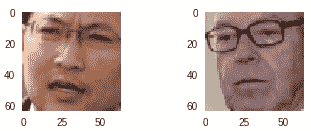

1.  定义模型架构：

```py
def generator():
    model = Sequential()
    model.add(Dense(input_dim=100, output_dim=1024))
    model.add(Activation('tanh'))
    model.add(Dense(128*7*7))
    model.add(BatchNormalization())
    model.add(Activation('tanh'))
    model.add(Reshape((7, 7, 128), input_shape=(128*7*7,)))
    model.add(UpSampling2D(size=(2, 2)))
    model.add(Conv2D(64, (5, 5), padding='same'))
    model.add(Activation('tanh'))
    model.add(UpSampling2D(size=(2, 2)))
    model.add(Conv2D(1, (5, 5), padding='same'))
    model.add(Activation('tanh'))
    return model
```

请注意，上述代码与我们在 *深度卷积生成对抗网络* 处方中构建的生成器相同：

```py
def discriminator():
    model = Sequential()
    model.add(Conv2D(64, (5, 5),padding='same',input_shape=(28, 28, 1)))
    model.add(Activation('tanh'))
    model.add(MaxPooling2D(pool_size=(2, 2)))
    model.add(Conv2D(128, (5, 5)))
    model.add(Activation('tanh'))
    model.add(MaxPooling2D(pool_size=(2, 2)))
    model.add(Flatten())
    model.add(Dense(1024))
    model.add(Activation('tanh'))
    model.add(Dense(1))
    model.add(Activation('sigmoid'))
    return model
```

请注意，上述架构与我们在 *使用深度卷积 GAN 生成图像* 部分中构建的架构相同：

```py
def stacked_generator_discriminator(D, G):
    D.trainable = False
    model = Sequential()
    model.add(G)
    model.add(D)
    return model
```

1.  定义用于加载、预处理和反处理图像的实用函数，并绘制图像：

```py
def plot_images(samples=16, step=0):
    noise = np.random.normal(0, 1, (samples, 100))
    images = deprocess(Generator.predict(noise))
    plt.figure(figsize=(5, 5))
    for i in range(images.shape[0]):
        plt.subplot(4, 4, i + 1)
        image = images[i, :, :, :]
        image = np.reshape(image, [56, 56,3])
        plt.imshow(image, cmap='gray')
        plt.axis('off')
    plt.tight_layout()
    plt.show()
```

请注意，我们正在将图像调整为较小的形状，以便通过模型调整的参数数量最小化：

```py
def preprocess(x):
    return (x/255)*2-1

def deprocess(x):
    return np.uint8((x+1)/2*255)
```

1.  导入数据集并进行预处理：

```py
from skimage import io
import os
import glob
root_dir = '/content/lfwcrop_color/'
all_img_paths = glob.glob(os.path.join(root_dir, '*/*.ppm'))
```

在以下代码中，我们正在创建输入数据集并将其转换为数组：

```py
import numpy as np
X_train = []
for i in range(len(all_img_paths)):
  img = cv2.imread(all_img_paths[i])
  X_train.append(preprocess(img))
len(X_train)
X_train = np.array(X_train)
```

1.  编译生成器、判别器和堆叠的生成器-判别器模型：

```py
Generator = generator()
Generator.compile(loss='binary_crossentropy', optimizer=Adam(lr=0.0002, beta_1=0.5, decay=8e-8))

Discriminator = discriminator()
Discriminator.compile(loss='binary_crossentropy', optimizer=Adam(lr=0.0002, beta_1=0.5, decay=8e-8),metrics=['accuracy'])

stacked_generator_discriminator = stacked_generator_discriminator(Discriminator, Generator)
stacked_generator_discriminator.compile(loss='binary_crossentropy', optimizer=Adam(lr=0.0002, beta_1=0.5, decay=8e-8))
```

1.  以类似于我们在 *深度卷积生成对抗网络* 处方中使用的方式，运行模型多轮迭代：

```py
%matplotlib inline
$pip install logger
from logger import logger
for cnt in range(10000):
      random_index = np.random.randint(0, len(X_train) - batch / 2)
      legit_images = X_train[random_index: random_index + batch // 2].reshape(batch // 2, 56, 56, 3)
      gen_noise = np.random.normal(0, 1, (batch // 2, 100))
      syntetic_images = Generator.predict(gen_noise)
      x_combined_batch = np.concatenate((legit_images, syntetic_images))
      y_combined_batch = np.concatenate((np.ones((batch // 2, 1)), np.zeros((batch // 2, 1))))
      d_loss = Discriminator.train_on_batch(x_combined_batch, y_combined_batch)
      noise = np.random.normal(0, 1, (batch*2, 100))
      y_mislabled = np.ones((batch*2, 1))
      g_loss = stacked_generator_discriminator.train_on_batch(noise, y_mislabled)
      logger.info('epoch: {}, [Discriminator: {}], [Generator: {}]'.format(cnt, d_loss[0], g_loss))
      if cnt % 100 == 0:
          plot_images(step=cnt)
```

上述代码生成的图像如下所示：

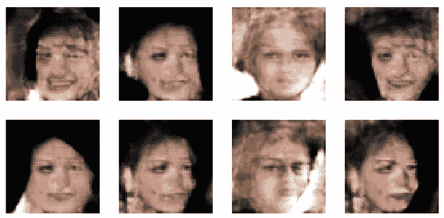

请注意，尽管这些图像看起来非常模糊，但这张图片是原始的，不存在于原始数据集中。通过改变模型架构并增加更深的层次，这个输出还有很大的提升空间。

随着训练轮数增加，判别器和生成器损失值的变化如下所示：

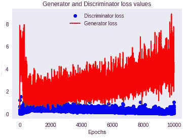

请注意，从前面的图表中，我们可能希望训练模型的轮数少一些，以使生成器的损失值不那么高。

# 从一张人脸过渡到另一张人脸

现在我们已经能够生成面部图像了，接下来让我们在生成的图像上进行一些向量运算。

在这个练习中，我们将执行从一个人脸到另一个人脸的生成过渡。

# 准备开始

我们将继续从《*使用深度卷积 GAN 进行人脸生成*》部分构建的图像生成模型开始。

假设我们希望看到一张生成的人脸图像逐渐过渡到另一张生成的人脸图像。这个过程是通过慢慢改变从第一个向量（第一张生成图像的向量）到第二个向量（第二张生成图像的向量）来实现的。你可以将每个潜在的（向量）维度看作是图像的某个特定方面。

我们将采用的策略如下：

1.  生成两张图像

1.  在 10 步中将第一张生成图像转换为第二张生成图像

1.  在第一步中，将第一张生成图像的权重设为 1，第二张生成图像的权重设为 0。

1.  在第二步中，将第一张生成图像的权重设为 0.9，第二张生成图像的权重设为 0.1。

1.  重复前面的步骤，直到我们将第一张生成图像的权重设为 0，第二张生成图像的权重设为 1。

# 如何执行...

我们将编写在《准备开始》部分中概述的策略，代码如下（代码文件可以在 GitHub 上的`Face_generation.ipynb`中找到）：

1.  从随机噪声生成第一张图像（请注意，我们将从《*使用深度卷积 GAN 进行人脸生成*》部分的第 6 步继续）：

```py
gen_noise = np.random.normal(0, 1, (1, 100))
syntetic_images = Generator.predict(gen_noise)
plt.imshow(deprocess(syntetic_images)[0])
plt.axis('off')
```

生成的图像如下所示：


1.  从随机噪声生成第二张图像：

```py
gen_noise2 = np.random.normal(0, 1, (1, 100))
syntetic_images = Generator.predict(gen_noise2)
plt.imshow(deprocess(syntetic_images)[0])
plt.axis('off')
plt.show() 
```

以下是前面代码片段的输出：


1.  生成从第一张图像到第二张图像的可视化：

```py
plt.figure(figsize=(10, 8))
for i in range(10):
  gen_noise3 = gen_noise + (gen_noise2 - gen_noise)*(i+1)/10
  syntetic_images = Generator.predict(gen_noise3)
  plt.subplot(1, 10, i+1)
  plt.imshow(deprocess(syntetic_images)[0])
  plt.axis('off')
```

我们将获得以下输出：


请注意，在前面的输出中，我们已经慢慢将第一张图像转换成了第二张图像。

# 在生成图像上执行向量运算

现在我们理解了潜在向量表示在改变生成图像结果中的关键作用，接下来让我们用具有特定人脸对齐的图像进一步构建我们的直觉。

# 准备开始

我们将采用的向量运算策略如下：

1.  生成三张基于 100 个向量值随机噪声的图像

1.  确保三张图像中有两张生成的面朝左，并且有一张面朝右。

1.  计算一个新的向量，它是对齐同一方向的图像之和，再从对齐在相反方向的图像中减去该向量。

1.  从上一步骤中获得的结果向量生成图像

# 如何操作...

我们将按照以下策略进行编程（代码文件在 GitHub 上可作为 `Face_generation.ipynb` 获取）。注意，我们将从 *使用深度卷积 GAN 生成面孔* 部分的第 6 步继续：

1.  生成三个向量（确保两幅图像对齐在一个方向上，另一幅图像则通过改变生成的噪声与之对立方向对齐）：

```py
gen_noise = np.random.normal(0, 1, (1, 100))
gen_noise2 = np.random.normal(0, 1, (1, 100))
gen_noise3 = np.random.normal(0, 1, (1, 100))
syntetic_images = Generator.predict(gen_noise4)
plt.imshow(deprocess(syntetic_images)[0])
plt.axis('off')
plt.show()
```

1.  绘制生成的图像：

```py
plt.subplot(131)
syntetic_images = Generator.predict(gen_noise)
plt.imshow(deprocess(syntetic_images)[0])
plt.axis('off')
plt.title('Image 1')
plt.subplot(132)
syntetic_images = Generator.predict(gen_noise2)
plt.imshow(deprocess(syntetic_images)[0])
plt.axis('off')
plt.title('Image 2')
plt.subplot(133)
syntetic_images = Generator.predict(gen_noise3)
plt.imshow(deprocess(syntetic_images)[0])
plt.axis('off')
plt.title('Image 3')
```

三个生成的图像如下：

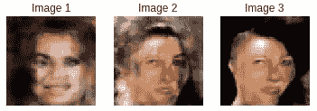

我们可以看到图像 2 和 3 的人脸朝向右侧，而图像 1 的人脸正面朝前。

1.  对这些图像的每一个向量表示进行向量运算，以查看结果：

```py
gen_noise4 = gen_noise + gen_noise2 - gen_noise3
syntetic_images = Generator.predict(gen_noise4)
plt.imshow(deprocess(syntetic_images)[0])
plt.axis('off')
plt.show()  
```

上述代码生成了如下的面孔：

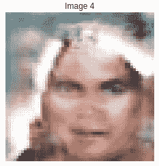

上述运算显示，向量运算（图像 1 + 图像 2 - 图像 3 的向量）生成的图像使得面孔朝前，从而增强了我们对潜在向量表示工作原理的直觉。

# 还有更多...

我们仅仅触及了 GAN 的基础；目前有多种基于 GAN 的技术正在变得流行。我们将讨论其中一些技术的应用：

+   **pix2pix**：想象一个场景，你涂鸦（草图）一个物体的结构，然后这个物体以多种形式呈现。pix2pix 是一种帮助实现这一点的算法。

+   **Cycle GAN**：想象一个场景，你希望一个物体看起来像完全不同的物体（例如，你希望一个马的物体看起来像一只斑马，反之亦然）。你还希望确保图像的其他所有部分保持不变，只有物体发生变化。在这种情况下，Cycle GAN 很有用。

+   **BigGAN** 是最近的一项发展，它生成的图像看起来极为真实。
