# 序列到序列学习

在前面的章节中，我们学习了 RNN 的应用，其中有多个输入（每个时间步长一个输入）和一个输出。然而，还有一些应用场景涉及多个输入以及多个时间步长——例如机器翻译，其中源句子有多个输入词，目标句子有多个输出词。鉴于有多个输入和多个输出，这就变成了一个多输出的基于 RNN 的应用——本质上是一个序列到序列的学习任务。这要求我们在构建模型架构时采用不同于目前为止的方式，这将在本章中进行讲解。本章将涵盖以下内容：

+   从网络返回序列

+   双向 LSTM 如何帮助命名实体提取

+   提取意图和实体以构建聊天机器人

+   编码器-解码器网络架构的工作原理

+   使用编码器-解码器架构将英语句子翻译成法语

+   通过使用注意力机制改善翻译结果

# 介绍

在前面的章节中，我们了解到 LSTM，甚至是 RNN，是从最后一个时间步长返回结果的（最后一个时间步长的隐藏状态值会传递给下一层）。假设输出是五维的，其中五个维度是五个输出（而不是五个类别的 softmax 值）。为了进一步解释这个想法，假设我们不仅预测下一天的股价，而是预测未来五天的股价。或者，我们不仅预测下一个词，而是预测给定输入序列的下一个五个词的序列。

这种情况需要采用不同的方法来构建网络。在接下来的部分，我们将探讨构建网络的多个场景，以便在不同时间步长中提取输出结果。

**场景 1**：命名实体提取

在命名实体提取中，我们试图为句子中的每个词分配一个标签——判断它是否与人名、地名相关。因此，这变成了输入词与其是否为人名或地名的输出类别之间的一对一映射问题。尽管输入和输出之间是一个一对一的映射，但在某些情况下，周围的词语会在决定某个输入是否是命名实体时起到作用。例如，单独的*new*可能不是命名实体，但如果*new*与*york*一起出现，那么我们就知道它是一个命名实体。因此，这是一个问题，输入的时间步长在决定一个词是否是命名实体时起到了作用，即使在大多数情况下，输入和输出之间可能会存在一对一的映射。

此外，这是一个序列返回问题，因为我们是基于输入的词序列来判断命名实体是否存在。鉴于此，这是一个输入与输出之间一一对应的关系问题，且相邻时间步的输入在决定输出时起着关键作用。只要确保时间步中两个方向的词都能影响输出，传统的 LSTM 就可以工作。因此，双向 LSTM 在解决这种问题时非常有用。

双向 LSTM 的架构如下所示：


请注意，在前面的图示中，我们通过使输入之间相互连接并反向流动，修改了传统的 LSTM，从而确保信息能够从两个方向流动。我们将在后续部分学习更多关于双向 LSTM 如何工作的内容，以及如何应用它。

**场景 2**：文本摘要

文本摘要任务需要不同于我们之前讨论的架构，因为我们通常需要在阅读完整个输入句子（本例中的输入文本/评论）后，才能生成摘要。

这要求将所有输入编码为一个向量，然后基于输入的编码向量生成输出。此外，鉴于给定文本中的一系列词可能有多个输出（多个词），这就变成了一个多输出生成问题，因此，另一个可以利用 RNN 的多输入多输出特性的场景也随之而来。

让我们来看一下如何构建模型来得出解决方案：


请注意，在前述架构中，我们将所有输入文本编码为输入序列的最后一个词生成的向量，然后将该编码向量作为输入传递给解码器序列。本章后续部分将提供更多关于如何构建此网络的信息。

**场景 3**：机器翻译

在前面的场景中，我们将输入编码为一个向量，并希望该向量也能包含词序信息。但是，如果我们通过网络显式提供一种机制，让网络能够根据我们正在解码的词的位置，给输入词在给定位置上的不同加权，该怎么办呢？例如，如果源语言和目标语言的词对齐方式相似，也就是说，两种语言的词序相似，那么源语言开头的词对目标语言最后一个词的影响很小，但对决定目标语言第一个词的影响却很大。

注意力机制如下所示：

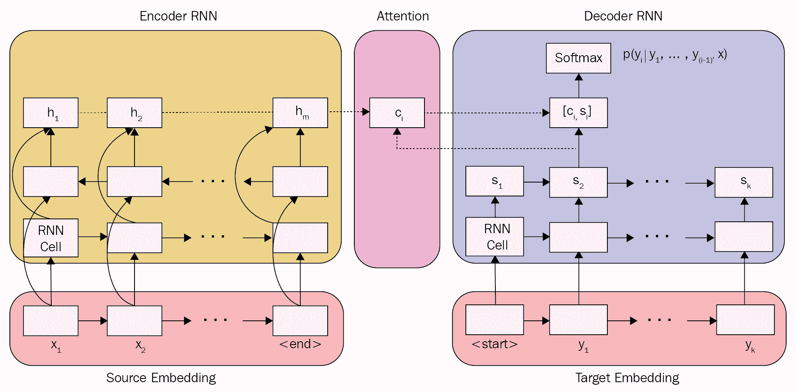

请注意，注意力向量（中间部分）受输入编码向量和输出值的隐藏状态的影响。更多关于如何利用注意力机制的内容将在后文中讨论。

通过理解不同编码器-解码器架构的原因，让我们深入了解如何在 Keras 中生成输出序列。

# 从网络中返回输出序列

正如我们在上一节中讨论的那样，生成输出序列的网络架构有多种方式。在本节中，我们将学习如何通过编码器-解码器方式生成输出，并且通过一个玩具数据集学习输入到输出的逐一映射网络，以便更好地理解这一过程。

让我们定义一个输入序列和一个对应的输出序列，如下所示（代码文件可在 GitHub 上的`Return_state_and_sequences_working_details.ipynb`找到）：

```py
input_data = np.array([[1,2],[3,4]])
output_data = np.array([[3,4],[5,6]])
```

我们可以看到，输入中有两个时间步，并且每个输入都有相应的输出。

如果我们用传统的方法来解决这个问题，我们会像下面的代码那样定义模型架构。请注意，我们使用的是函数式 API，因为在后续的场景中，我们将提取多个输出，并检查中间层：

```py
# define model
inputs1 = Input(shape=(2,1))
lstm1 = LSTM(1, activation = 'tanh', return_sequences=False,recurrent_initializer='Zeros',recurrent_activation='sigmoid')(inputs1)
out= Dense(2, activation='linear')(lstm1)
model = Model(inputs=inputs1, outputs=out)
model.summary()
```


请注意，在上述场景中，LSTM 接收的数据形状是（`batch_size`，时间步，时间步每个特征）。由于 LSTM 不返回一系列输出，LSTM 的输出是隐藏层中的一个值（因为 LSTM 的单元数为 1）。

由于输出是二维的，我们将添加一个全连接层，该层接受隐藏层的输出并从中提取`2`个值。

让我们开始拟合模型，如下所示：

```py
model.compile(optimizer='adam',loss='mean_squared_error')
model.fit(input_data.reshape(2,2,1), output_data,epochs=1000)
print(model.predict(input_data[0].reshape(1,2,1)))
# [[2.079641 1.8290598]]
```

现在我们有了输出，让我们像上一章那样验证结果（注意，这段代码与上一章中的完全相同——它的解释已经在第十一章的*从头开始构建 LSTM*一节中提供）。

```py
input_t0 = 1
cell_state0 = 0
forget0 = input_t0*model.get_weights()[0][0][1] + model.get_weights()[2][1]
forget1 = 1/(1+np.exp(-(forget0)))
cell_state1 = forget1 * cell_state0
input_t0_1 = input_t0*model.get_weights()[0][0][0] + model.get_weights()[2][0]
input_t0_2 = 1/(1+np.exp(-(input_t0_1)))
input_t0_cell1 = input_t0*model.get_weights()[0][0][2] + model.get_weights()[2][2]
input_t0_cell2 = np.tanh(input_t0_cell1)
input_t0_cell3 = input_t0_cell2*input_t0_2
input_t0_cell4 = input_t0_cell3 + cell_state1
output_t0_1 = input_t0*model.get_weights()[0][0][3] + model.get_weights()[2][3]
output_t0_2 = 1/(1+np.exp(-output_t0_1))
hidden_layer_1 = np.tanh(input_t0_cell4)*output_t0_2
input_t1 = 2
cell_state1 = input_t0_cell4
forget21 = hidden_layer_1*model.get_weights()[1][0][1] + model.get_weights()[2][1] + input_t1*model.get_weights()[0][0][1]
forget_22 = 1/(1+np.exp(-(forget21)))
cell_state2 = cell_state1 * forget_22
input_t1_1 = input_t1*model.get_weights()[0][0][0] + model.get_weights()[2][0] + hidden_layer_1*model.get_weights()[1][0][0]
input_t1_2 = 1/(1+np.exp(-(input_t1_1)))
input_t1_cell1 = input_t1*model.get_weights()[0][0][2] + model.get_weights()[2][2]+ hidden_layer_1*model.get_weights()[1][0][2]
input_t1_cell2 = np.tanh(input_t1_cell1)
input_t1_cell3 = input_t1_cell2*input_t1_2
input_t1_cell4 = input_t1_cell3 + cell_state2
output_t1_1 = input_t1*model.get_weights()[0][0][3] + model.get_weights()[2][3]+ hidden_layer_1*model.get_weights()[1][0][3]
output_t1_2 = 1/(1+np.exp(-output_t1_1))
hidden_layer_2 = np.tanh(input_t1_cell4)*output_t1_2
final_output = hidden_layer_2 * model.get_weights()[3][0] + model.get_weights()[4]
```

`final_output`的输出如下：

```py
[[2.079 1.829]]
```

你应该注意到，前面生成的`final_output`与我们在`model.predict`输出中看到的是完全相同的。

通过这种方式生成输出的一个缺点是，在时间*步 1*的输出显然不依赖于时间*步 2*的情况下，我们使得模型很难找到将时间*步 2*的值对时间*步 1*的影响隔离开来的方法，因为我们正在获取时间*步 2*的隐藏层输出（它是时间*步 1*和时间*步 2*输入值的组合）。

我们可以通过从每个时间步提取隐藏层值，然后将其传递到全连接层来解决这个问题。

**返回每个时间步隐藏层值的序列**

在接下来的代码中，我们将了解如何返回每个时间步的隐藏层值序列：

```py
# define model
inputs1 = Input(shape=(2,1))
lstm1 = LSTM(1, activation = 'tanh', return_sequences=False,recurrent_initializer='Zeros',recurrent_activation='sigmoid')(inputs1)
out= Dense(1, activation='linear')(lstm1)
model = Model(inputs=inputs1, outputs=out)
model.summary()
```

注意我们所做的两个代码更改如下：

+   将`return_sequences`参数的值更改为`True`

+   给定输出为`1`的全连接层：

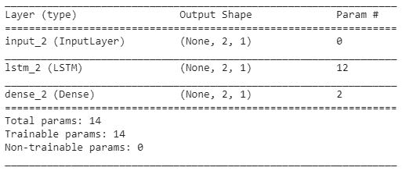

注意，因为我们提取了每个时间步的隐藏层值（其中隐藏层只有一个单元），所以 LSTM 的输出形状是（批量大小，时间步，1）。

此外，由于有一个全连接层将 LSTM 的输出连接到每个时间步的最终输出，因此输出形状保持不变。

让我们继续训练模型，如下所示：

```py
model.compile(optimizer='adam',loss='mean_squared_error')
model.fit(input_data.reshape(2,2,1), output_data.reshape(2,2,1),epochs=1000)
```

预测值如下所示：

```py
print(model.predict(input_data[0].reshape(1,2,1)))
```

前面的执行将给出以下输出：

```py
[[[1.7584195] [2.2500749]]]
```

与前一部分类似，我们将通过输入通过权重进行前向传播，然后匹配我们的预测值来验证结果。

我们将提取第一个时间步的输出，如下所示：

```py
input_t0 = 1
cell_state0 = 0
forget0 = input_t0*model.get_weights()[0][0][1] + model.get_weights()[2][1]
forget1 = 1/(1+np.exp(-(forget0)))
cell_state1 = forget1 * cell_state0
input_t0_1 = input_t0*model.get_weights()[0][0][0] + model.get_weights()[2][0]
input_t0_2 = 1/(1+np.exp(-(input_t0_1)))
input_t0_cell1 = input_t0*model.get_weights()[0][0][2] + model.get_weights()[2][2]
input_t0_cell2 = np.tanh(input_t0_cell1)
input_t0_cell3 = input_t0_cell2*input_t0_2
input_t0_cell4 = input_t0_cell3 + cell_state1
output_t0_1 = input_t0*model.get_weights()[0][0][3] + model.get_weights()[2][3]
output_t0_2 = 1/(1+np.exp(-output_t0_1))
hidden_layer_1 = np.tanh(input_t0_cell4)*output_t0_2
final_output_1 = hidden_layer_1 * model.get_weights()[3][0] + model.get_weights()[4]
final_output_1
*# 1.7584*
```

你应该注意到`final_output_1`值与第一个时间步的预测值相匹配。同样，我们继续验证第二个时间步的预测：

```py
input_t1 = 2
cell_state1 = input_t0_cell4
forget21 = hidden_layer_1*model.get_weights()[1][0][1] + model.get_weights()[2][1] + input_t1*model.get_weights()[0][0][1]
forget_22 = 1/(1+np.exp(-(forget21)))
cell_state2 = cell_state1 * forget_22
input_t1_1 = input_t1*model.get_weights()[0][0][0] + model.get_weights()[2][0] + hidden_layer_1*model.get_weights()[1][0][0]
input_t1_2 = 1/(1+np.exp(-(input_t1_1)))
input_t1_cell1 = input_t1*model.get_weights()[0][0][2] + model.get_weights()[2][2]+ hidden_layer_1*model.get_weights()[1][0][2]
input_t1_cell2 = np.tanh(input_t1_cell1)
input_t1_cell3 = input_t1_cell2*input_t1_2
input_t1_cell4 = input_t1_cell3 + cell_state2
output_t1_1 = input_t1*model.get_weights()[0][0][3] + model.get_weights()[2][3]+ hidden_layer_1*model.get_weights()[1][0][3]
output_t1_2 = 1/(1+np.exp(-output_t1_1))
hidden_layer_2 = np.tanh(input_t1_cell4)*output_t1_2
final_output_2 = hidden_layer_2 * model.get_weights()[3][0] + model.get_weights()[4]
final_output_2
*# 2.250*
```

你应该注意到，这会返回与第二个时间步的`model.predict`值完全相同的结果。

现在我们理解了网络中的`return_sequences`参数，让我们继续学习另一个参数——`return_state`。我们知道网络的两个输出是隐藏层值（当`return_sequences`为`False`时，它也是 LSTM 在最终时间步的输出，而当`return_sequences`为`True`时，它是 LSTM 在每个时间步的输出）和细胞状态值。

`return_state`有助于提取网络的细胞状态值。

提取细胞状态对于将输入文本编码为向量时很有用，我们不仅会传递编码向量，还会将输入编码器的最终细胞状态传递给解码器网络（更多内容请见 *机器翻译的编码器解码器架构* 部分）。

在接下来的部分，我们来了解`return_state`是如何工作的。请注意，这只是为了帮助我们理解每个时间步的细胞状态是如何生成的，因为实际上我们会将此步骤的输出（隐藏层值和细胞状态值）作为输入传递给解码器：

```py

inputs1 = Input(shape=(2,1))
lstm1,state_h,state_c = LSTM(1, activation = 'tanh', return_sequences=True, return_state = True, recurrent_initializer='Zeros',recurrent_activation='sigmoid')(inputs1)
model = Model(inputs=inputs1, outputs=[lstm1, state_h, state_c])

```

在前面的代码中，我们同样将`return_state`参数设置为`True`。注意现在 LSTM 的输出：

+   `lstm1`：每个时间步的隐藏层（因为在前面的情境中，`return_sequences`为`True`）

+   `state_h`：最终时间步的隐藏层值

+   `state_c`：最终时间步的细胞状态值

让我们继续预测值，如下所示：

```py
print(model.predict(input_data[0].reshape(1,2,1)))
```

我们将得到以下值：

```py
[array([[[-0.256911 ], [-0.6683883]]], dtype=float32), array([[-0.6683883]], dtype=float32), array([[-0.96862674]], dtype=float32)]
```

您应该会看到三个输出数组，正如我们之前讨论的：隐藏层值序列、最终隐藏层值，以及按顺序排列的单元状态值。

让我们验证之前得到的数字：

```py
input_t0 = 1
cell_state0 = 0
forget0 = input_t0*model.get_weights()[0][0][1] + model.get_weights()[2][1]
forget1 = 1/(1+np.exp(-(forget0)))
cell_state1 = forget1 * cell_state0
input_t0_1 = input_t0*model.get_weights()[0][0][0] + model.get_weights()[2][0]
input_t0_2 = 1/(1+np.exp(-(input_t0_1)))
input_t0_cell1 = input_t0*model.get_weights()[0][0][2] + model.get_weights()[2][2]
input_t0_cell2 = np.tanh(input_t0_cell1)
input_t0_cell3 = input_t0_cell2*input_t0_2
input_t0_cell4 = input_t0_cell3 + cell_state1
output_t0_1 = input_t0*model.get_weights()[0][0][3] + model.get_weights()[2][3]
output_t0_2 = 1/(1+np.exp(-output_t0_1))
hidden_layer_1 = np.tanh(input_t0_cell4)*output_t0_2
print(hidden_layer_1)
```

前述计算中的`hidden_layer_1`值为`-0.2569`，这是我们从`model.predict`方法中获得的值：

```py
input_t1 = 2
cell_state1 = input_t0_cell4
forget21 = hidden_layer_1*model.get_weights()[1][0][1] + model.get_weights()[2][1] + input_t1*model.get_weights()[0][0][1]
forget_22 = 1/(1+np.exp(-(forget21)))
cell_state2 = cell_state1 * forget_22
input_t1_1 = input_t1*model.get_weights()[0][0][0] + model.get_weights()[2][0] + hidden_layer_1*model.get_weights()[1][0][0]
input_t1_2 = 1/(1+np.exp(-(input_t1_1)))
input_t1_cell1 = input_t1*model.get_weights()[0][0][2] + model.get_weights()[2][2]+ hidden_layer_1*model.get_weights()[1][0][2]
input_t1_cell2 = np.tanh(input_t1_cell1)
input_t1_cell3 = input_t1_cell2*input_t1_2
input_t1_cell4 = input_t1_cell3 + cell_state2
output_t1_1 = input_t1*model.get_weights()[0][0][3] + model.get_weights()[2][3]+ hidden_layer_1*model.get_weights()[1][0][3]
output_t1_2 = 1/(1+np.exp(-output_t1_1))
hidden_layer_2 = np.tanh(input_t1_cell4)*output_t1_2
print(hidden_layer_2, input_t1_cell4)
```

`hidden_layer_2`和`input_t1_cell4`的值分别是`-0.6683`和`-0.9686`。

您会注意到，输出与我们在`predict`函数中看到的完全相同。

在双向网络的情况下，我们在计算时从两个方向同时引入隐藏层值，代码如下：

```py
inputs1 = Input(shape=(2,1))
lstm1,state_fh,state_fc,state_bh,state_bc = Bidirectional(LSTM(1, activation = 'tanh', return_sequences=True, return_state = True, recurrent_initializer='Zeros',recurrent_activation='sigmoid'))(inputs1)
model = Model(inputs=inputs1, outputs=[lstm1, state_fh,state_fc,state_bh,state_bc])
model.summary()
```

请注意，在双向 LSTM 中，最终的隐藏状态有两个输出，一个是从左到右考虑输入时间步长时的输出，另一个是从右到左考虑输入时间步长时的输出。以类似的方式，我们也有两个可能的单元状态值。

通常，我们会将得到的隐藏状态连接成一个单一的向量，并将单元状态也连接成另一个单一的向量。

为简洁起见，本书中不对双向 LSTM 的输出进行验证。不过，您可以在本章附带的 Jupyter Notebook 中查看相关验证。

# 构建聊天机器人

在某些场景下，聊天机器人非常有用，尤其是当机器人能够自动处理一些常见查询时。这在实际场景中非常有用，尤其是在你只需要从数据库中查找结果，或查询 API 以获得与查询相关的结果时。

基于此，您可以设计聊天机器人的两种潜在方式，如下所示：

+   将非结构化的用户查询转换为结构化格式：

    +   根据转换后的结构从数据库查询

+   根据输入文本生成回应

在本次练习中，我们将采用第一种方法，因为它更可能提供可以在呈现给用户之前进一步调整的预测结果。此外，我们还将了解为什么在机器翻译和文本摘要案例研究后，可能不希望根据输入文本生成回应。

将用户查询转换为结构化格式涉及以下两个步骤：

1.  为查询中的每个单词分配实体

1.  理解查询的意图

命名实体识别是一个应用广泛的技术，适用于多个行业。例如，用户想去哪里旅行？用户考虑购买哪个产品？等等。从这些例子中，我们可能会认为命名实体识别只是从现有城市名称或产品名称的字典中进行简单查找。然而，考虑一种情境，当用户说“*我想从波士顿到西雅图*”时，机器虽然知道*波士顿*和*西雅图*是城市名，但我们无法判断哪个是*from*城市，哪个是*to*城市。

尽管我们可以添加一些启发式规则，比如在“*to*”前面有名字的是*to city*，另一个是*from city*，但在多个类似示例中复制这个过程时它并不可扩展。神经网络在这种情况下非常有用，因为我们不再依赖手动调整特征。我们将让机器处理特征工程的部分，以提供输出。

# 准备就绪

基于前述的直觉，让我们继续定义解决这个问题的方法，假设数据集包含与航空公司相关的用户查询。

**目标**：从查询中提取各种实体，同时提取查询的意图。

**方法**：

+   我们将找到一个数据集，其中包含查询标签和每个查询单词所属的实体：

    +   如果没有标注数据集，我们将手动标注查询中的实体，对于合理数量的示例进行标注，以便训练我们的模型。

+   考虑到周围的词汇可能会影响给定单词分类为某一类别的结果，让我们使用基于 RNN 的技术来解决这个问题。

+   另外，考虑到周围的单词可能位于给定单词的左侧或右侧，我们将使用双向 RNN 来解决这个问题。

+   预处理输入数据集，以便可以输入到 RNN 的多个时间步中。

+   对输出数据集进行一热编码，以便我们可以优化模型。

+   构建模型，返回查询中每个单词所对应的实体。

+   同样，构建另一个模型，提取查询的意图。

# 如何做到...

让我们按照之前定义的方法编写代码，如下所示（代码文件可在 GitHub 上的`Intent_and_entity_extraction.ipynb`中找到）：

1.  导入数据集，如以下代码所示：

```py
!wget https://www.dropbox.com/s/qpw1wnmho8v0gi4/atis.zip
!unzip atis.zip
```

加载训练数据集：

```py
import numpy as np 
import pandas as pd
import pickle
DATA_DIR="/content"
def load_ds(fname='atis.train.pkl'):
     with open(fname, 'rb') as stream:
     ds,dicts = pickle.load(stream)
     print('Done loading: ', fname)
     print(' samples: {:4d}'.format(len(ds['query'])))
     print(' vocab_size: {:4d}'.format(len(dicts['token_ids'])))
     print(' slot count: {:4d}'.format(len(dicts['slot_ids'])))
     print(' intent count: {:4d}'.format(len(dicts['intent_ids'])))
     return ds,dicts
```

```py
import os
train_ds, dicts = load_ds(os.path.join(DATA_DIR,'atis.train.pkl'))
test_ds, dicts = load_ds(os.path.join(DATA_DIR,'atis.test.pkl'))
```

上述代码输出如下：

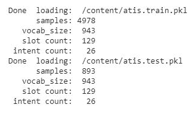

注意，附加数据集中的样本是用户查询，slot 是单词所属的实体，而 intent 是查询的整体意图。

1.  对查询、slot 和 intent 中的每个单词应用 ID：

```py
t2i, s2i, in2i = map(dicts.get, ['token_ids', 'slot_ids','intent_ids'])
i2t, i2s, i2in = map(lambda d: {d[k]:k for k in d.keys()}, [t2i,s2i,in2i])
query, slots, intent = map(train_ds.get, ['query', 'slot_labels', 'intent_labels'])
```

词汇中的标记（单词）、slot（单词的实体）和 intent 的 ID 示例如下：


最后，查询、槽位和意图被转换为 ID 值，如下所示（我们报告第一个查询、意图和槽位的输出）：

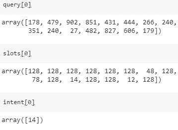

查询、意图和与查询中词对应的实体示例如下：

```py
for j in range(len(query[i])):
        print('{:>33} {:>40}'.format(i2t[query[i][j]],
                                     i2s[slots[i][j]]))
```

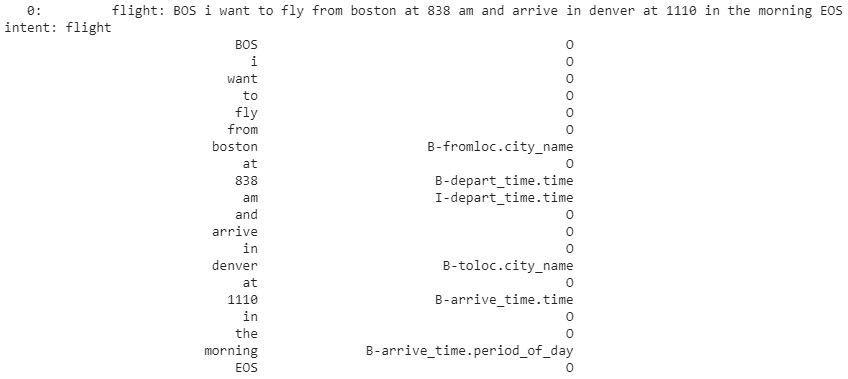

查询是前面截图顶部的语句。槽位表示每个词所属的对象类型。请注意，`O`表示对象，其他每个实体名称都是自描述的。此外，总共有 23 个可能的意图类，它们在总体上描述查询。

在以下代码中，我们将所有数据转换为一个列表的列表，其中每个列表对应数据集中的一个查询：

```py
i2t2 = []
i2s2 = []
c_intent=[]
for i in range(4978):
     a_query = []
     b_slot = []
     c_intent.append(i2in[intent[i][0]])
     for j in range(len(query[i])):
         a_query.append(i2t[query[i][j]])
         b_slot.append(i2s[slots[i][j]])
     i2t2.append(a_query)
     i2s2.append(b_slot)
i2t2 = np.array(i2t2)
i2s2 = np.array(i2s2)
i2in2 = np.array(c_intent)
```

一些令牌、意图和查询的示例如下：


1.  创建索引化的输入和输出：

```py
final_sentences = []
final_targets = []
final_docs = []
for i in range(len(i2t2)):
  tokens = ''
  entities = ''
  intent = ''
  for j in range(len(i2t2[i])):
    tokens= tokens + i2t2[i][j] + ' '
    entities = entities + i2s2[i][j] +' '
  intent = i2in2[i]
  final_sentences.append(tokens)
  final_targets.append(entities)
  final_docs.append(intent)
```

前面的代码为我们提供了最终查询和目标的列表，如下所示：


现在，我们将每个**输入**句子转换为其组成词的对应 ID 列表：

```py
from collections import Counter
counts = Counter()
for i,sentence in enumerate(final_sentences):
     counts.update(sentence.split())
sentence_words = sorted(counts, key=counts.get, reverse=True)
chars = sentence_words
nb_chars = len(chars)
sentence_word_to_int = {word: i for i, word in enumerate(sentence_words, 1)}
sentence_int_to_word = {i: word for i, word in enumerate(sentence_words, 1)}
mapped_reviews = []
for review in final_sentences:
     mapped_reviews.append([sentence_word_to_int[word] for word in review.split()])
```

在以下代码中，我们将每个**输出**词转换为其组成的词 ID：

```py
from collections import Counter
counts = Counter()
for i,sentence in enumerate(final_targets):
    counts.update(sentence.split())
target_words = sorted(counts, key=counts.get, reverse=True)
chars = target_words
nb_chars = len(target_words)
```

```py
target_word_to_int = {word: i for i, word in enumerate(target_words, 1)}
target_int_to_word = {i: word for i, word in enumerate(target_words, 1)}
mapped_targets = []
for review in final_targets:
    mapped_targets.append([target_word_to_int[word] for word in review.split()])
```

1.  填充输入并对输出进行独热编码：

```py
from keras.preprocessing.sequence import pad_sequences
y = pad_sequences(maxlen=124, sequences=mapped_targets, padding="post", value=0)
from keras.utils import to_categorical
y2 = [to_categorical(i, num_classes=124) for i in y]
y3 = np.array(y2)
```

在以下代码中，我们决定在填充输入之前查询的最大长度：

```py
length_sent = []
for i in range(len(mapped_reviews)):
     a = mapped_reviews[i]
     b = len(a)
     length_sent.append(b)
np.max(length_sent)
```

在前面的代码中，我们决定在填充输入之前查询的最大长度——这恰好是`48`。

在以下代码中，我们使用最大长度为`50`来填充输入和输出，因为没有输入查询的长度超过`48`个词（即`max(length_sent)`）：

```py
from keras.preprocessing.sequence import pad_sequences
X = pad_sequences(maxlen=50, sequences=mapped_reviews, padding="post", value=0)
Y = pad_sequences(maxlen=50, sequences=mapped_targets, padding="post", value=0)
```

在以下代码中，我们将输出转换为独热编码版本：

```py
from keras.utils import to_categorical
y2 = [to_categorical(i, num_classes=124) for i in Y]
y2 = np.array(y2)
```

我们总共有`124`个类，因为总共有`123`个唯一类，且词汇索引从`1`开始。

1.  构建、训练和测试数据集，以及模型：

```py
from sklearn.model_selection import train_test_split
X_train, X_test, y_train, y_test = train_test_split(X,y2, test_size=0.30,random_state=10)
```

在前面的代码中，我们将数据集分割为训练集和测试集：

```py
input = Input(shape=(50,))
model = Embedding(input_dim=891, output_dim=32, input_length=50)(input)
model = Dropout(0.1)(model)
model = Bidirectional(LSTM(units=100, return_sequences=True, recurrent_dropout=0.1))(model)
out = (Dense(124, activation="softmax"))(model)
```

```py
model = Model(input, out)
model.summary()
```

模型的总结如下：

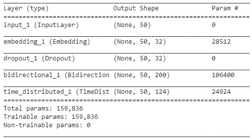

请注意，在前面的代码中，我们使用了双向 LSTM，因此隐藏层有 200 个单元（因为 LSTM 层有 100 个单元）。

1.  编译并拟合模型，如下所示：

```py
model.compile(optimizer="adam", loss="categorical_crossentropy", metrics=["accuracy"])
model.fit(X_train,y_train, batch_size=32, epochs=5, validation_data = (X_test,y_test), verbose=1)
```

前面的代码产生了一个模型，该模型在查询中的每个词上正确识别实体的准确率为 95%：

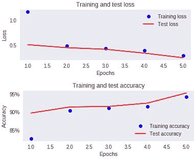

从前面的输出中，我们可以看到我们为每个词分配正确实体的准确率超过 95%。

# 意图提取

现在我们已经构建了一个具有良好准确性的模型，能够预测查询中的实体，接下来让我们找出查询的意图。

我们将重用在前一个模型中初始化的大部分变量：

1.  将每个查询的意图转换为 ID：

```py
from collections import Counter
counts = Counter()
for i,sentence in enumerate(final_docs):
     counts.update(sentence.split())
intent_words = sorted(counts, key=counts.get, reverse=True)
chars = intent_words
nb_chars = len(intent_words)
intent_word_to_int = {word: i for i, word in enumerate(intent_words, 1)}
intent_int_to_word = {i: word for i, word in enumerate(intent_words, 1)}
mapped_docs = []
for review in final_docs:
     mapped_docs.append([intent_word_to_int[word] for word in review.split()])
```

1.  提取意图的独热编码版本：

```py
from keras.utils import to_categorical
doc2 = [to_categorical(i[0], num_classes=23) for i in mapped_docs]
doc3 = np.array(doc2)
```

1.  构建模型，如以下代码所示：

```py
from sklearn.model_selection import train_test_split
X_train, X_test, y_train, y_test = train_test_split(X,doc3, test_size=0.30,random_state=10)
```

```py
input = Input(shape=(50,))
model2 = Embedding(input_dim=891, output_dim=32, input_length=50)(input)
model2 = Dropout(0.1)(model2)
model2 = Bidirectional(LSTM(units=100))(model2)
out = (Dense(23, activation="softmax"))(model2)
model2 = Model(input, out)
```

```py
model2.compile(optimizer="adam", loss="categorical_crossentropy", metrics=["accuracy"])
```

```py
model2.fit(X_train,y_train, batch_size=32, epochs=5, validation_data = (X_test,y_test), verbose=1)
```

前面的代码结果是一个模型，它在验证数据集上正确识别查询意图的准确率为 90%：

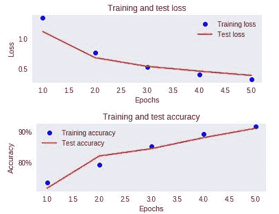

# 将所有内容整合起来

在上一节中，我们构建了两个模型，第一个模型预测查询中的实体，第二个模型提取查询的意图。

在本节中，我们将定义一个函数，接受查询并将其转换为结构化格式：

1.  预处理新的输入文本，以便将其传递给模型：

```py
def preprocessing(text):
     text2 = text.split()
     a=[]
     for i in range(len(text2)):
         a.append(sentence_word_to_int[text2[i]])
     return a
```

1.  预处理输入文本，将其转换为单词 ID 列表：

```py
text = "BOS i would fly from boston to dallas EOS"
```

```py
indexed_text = preprocessing(text)
padded_text=np.zeros(50)
padded_text[:len(indexed_text)]=indexed_text
padded_text=padded_text.reshape(1,50)
```

前面的结果处理后的输入文本如下：


现在，我们将预测前面列表的意图：

```py
pred_index_intent = np.argmax(model2.predict(c),axis=1)
entity_int_to_word[pred_index_intent[0]]
```

前面的代码结果是查询的意图是关于航班的，如下所示：


1.  提取查询中与单词相关的实体：

```py
pred_entities = np.argmax(model.predict(padded_text),axis=2)

for i in range(len(pred_entities[0])):
      if pred_entities[0][i]>1:
            print('word: ',text.split()[i], 'entity: ',target_int_to_word[pred_entities[0][i]])

```


从前面的代码中，我们可以看到模型已经正确地将一个单词分类到正确的实体中。

现在我们已经识别出实体和意图，可以使用预定义的 SQL 查询（或 API），其参数由提取的实体填充，每个意图可能具有不同的 API/SQL 查询来为用户提取信息。

# 机器翻译

到目前为止，我们已经看到一个输入和输出一一对应的场景。在本节中，我们将探讨如何构建能够将所有输入数据映射到一个向量，然后将其解码为输出向量的架构。

在这个案例研究中，我们将把一段英文输入文本翻译成法语文本。

# 准备就绪

我们将定义的用于执行机器翻译的架构如下：

+   获取一个标记化的数据集，其中包含输入句子和对应的法语翻译

+   对英文和法语文本中频繁出现的单词进行标记化和提取：

    +   为了识别频繁的单词，我们将统计每个单词的频率

    +   构成所有单词总累计频率前 80% 的单词被认为是频繁单词

+   对于所有不属于频繁单词的单词，将其替换为未知（`unk`）符号

+   为每个单词分配一个 ID

+   构建一个编码器 LSTM，提取输入文本的向量

+   通过密集层传递编码向量，以便在每个时间步骤提取解码文本的概率

+   训练模型以最小化输出的损失

# 如何做到这一点...

可能有多种模型架构可以帮助翻译输入文本。我们将在以下章节中介绍其中的一些（代码文件在 GitHub 上可用，名为`Machine_translation.ipynb`）。

# 数据预处理

为了将输入和输出数据传递给我们的模型，我们需要像下面这样预处理数据集：

1.  导入相关的包和数据集：

```py
import pandas as pd
import numpy as np
import string
from string import digits
import matplotlib.pyplot as plt
%matplotlib inline
import re
from sklearn.model_selection import train_test_split
from keras.models import Model
from keras.layers import Input, LSTM, Dense
import numpy as np
```

```py
$ wget https://www.dropbox.com/s/2vag8w6yov9c1qz/english%20to%20french.txt
```

```py
lines= pd.read_table('english to french.txt', names=['eng', 'fr'])
```

1.  鉴于数据集中有超过 140,000 个句子，我们将仅考虑前 50,000 对句子翻译对来构建模型：

```py
lines = lines[0:50000]
```

1.  将输入和输出文本转换为小写并移除标点符号：

```py
lines.eng=lines.eng.apply(lambda x: x.lower())
lines.fr=lines.fr.apply(lambda x: x.lower())
exclude = set(string.punctuation)
lines.eng=lines.eng.apply(lambda x: ''.join(ch for ch in x if ch not in exclude))
lines.fr=lines.fr.apply(lambda x: ''.join(ch for ch in x if ch not in exclude))
```

1.  为输出句子（法语句子）添加开始和结束标记。我们添加这些标记是为了在编码器-解码器架构中起到帮助作用。这个方法的作用将在*编码器解码器架构用于机器翻译*部分说明：

```py
lines.fr = lines.fr.apply(lambda x : 'start '+ x + ' end')
```

数据的示例如下所示：

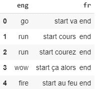

1.  识别常见单词。我们定义一个单词为常见，如果它出现在频率构成所有单词总频率 80%的单词列表中：

```py
# fit a tokenizer
from keras.preprocessing.text import Tokenizer
import json
from collections import OrderedDict
def create_tokenizer(lines):
     tokenizer = Tokenizer()
     tokenizer.fit_on_texts(lines)
     return tokenizer
```

```py
eng_tokenizer = create_tokenizer(lines.eng)
output_dict = json.loads(json.dumps(eng_tokenizer.word_counts))
df =pd.DataFrame([output_dict.keys(), output_dict.values()]).T
df.columns = ['word','count']
df = df.sort_values(by='count',ascending = False)
df['cum_count']=df['count'].cumsum()
df['cum_perc'] = df['cum_count']/df['cum_count'].max()
final_eng_words = df[df['cum_perc']<0.8]['word'].values
```

前面的代码提取了累计构成输入中 80%总英语单词的英语单词数量：

```py
fr_tokenizer = create_tokenizer(lines.fr)
output_dict = json.loads(json.dumps(fr_tokenizer.word_counts))
df =pd.DataFrame([output_dict.keys(), output_dict.values()]).T
df.columns = ['word','count']
df = df.sort_values(by='count',ascending = False)
df['cum_count']=df['count'].cumsum()
df['cum_perc'] = df['cum_count']/df['cum_count'].max()
final_fr_words = df[df['cum_perc']<0.8]['word'].values
```

前面的代码提取了累计构成输出中 80%总法语单词的法语单词数量。

1.  过滤掉不常见的单词。如果某个单词不在常见单词列表中，我们将用一个未知单词`unk`来替代它：

```py
def filter_eng_words(x):
     t = []
     x = x.split()
     for i in range(len(x)):
         if x[i] in final_eng_words:
             t.append(x[i])
         else:
             t.append('unk')
     x3 = ''
     for i in range(len(t)):
         x3 = x3+t[i]+' '
     return x3
```

前面的代码以句子为输入，提取唯一的单词，如果某个单词不在更常见的英语单词（`final_eng_words`）中，则用`unk`替代：

```py
def filter_fr_words(x):
     t = []
     x = x.split()
     for i in range(len(x)):
         if x[i] in final_fr_words:
             t.append(x[i])
         else:
             t.append('unk')
     x3 = ''
     for i in range(len(t)):
         x3 = x3+t[i]+' '
     return x3
```

前面的代码以句子为输入，提取唯一的单词，如果某个单词不在更常见的法语单词（`final_fr_words`）中，则用`unk`替代。

例如，在一个包含常见单词和不常见单词的随机句子中，输出结果如下所示：

```py
filter_eng_words('he is extremely good')
```


```py
lines['fr']=lines['fr'].apply(filter_fr_words)
lines['eng']=lines['eng'].apply(filter_eng_words)
```

在前面的代码中，我们根据之前定义的函数替换所有的英语和法语句子。

1.  给每个单词在英语（输入）和法语（输出）句子中分配一个 ID：

    1.  存储数据中所有唯一单词的列表（英语和法语句子）：

```py
all_eng_words=set()
for eng in lines.eng:
     for word in eng.split():
         if word not in all_eng_words:
             all_eng_words.add(word)

all_french_words=set()
for fr in lines.fr:
     for word in fr.split():
         if word not in all_french_words:
             all_french_words.add(word)
```

```py
input_words = sorted(list(all_eng_words))
target_words = sorted(list(all_french_words))
num_encoder_tokens = len(all_eng_words)
num_decoder_tokens = len(all_french_words)
```

1.  1.  创建输入单词及其对应索引的字典：

```py
input_token_index = dict( [(word, i+1) for i, word in enumerate(input_words)])
target_token_index = dict( [(word, i+1) for i, word in enumerate(target_words)])
```

1.  提取输入和目标句子的最大长度，以便所有句子具有相同的大小：

```py
length_list=[]
for l in lines.fr:
     length_list.append(len(l.split(' ')))
fr_max_length = np.max(length_list)
```

```py
length_list=[]
for l in lines.eng:
     length_list.append(len(l.split(' ')))
eng_max_length = np.max(length_list)
```

现在我们已经处理好数据集，让我们在数据集上尝试多种架构，比较它们的表现。

# 传统的多对多架构

在这个架构中，我们将每个输入单词嵌入到一个 128 维的向量中，得到形状为（`batch_size, 128, 17`）的输出向量。我们这样做是因为在这个版本中，我们希望测试输入数据有 17 个时间步，输出数据集也有 17 个时间步的场景。

我们将通过 LSTM 将每个输入时间步连接到输出时间步，然后对预测结果执行 softmax：

1.  创建输入和输出数据集。注意我们有`decoder_input_data`和`decoder_target_data`。现在，让我们将`decoder_input_data`创建为目标句子单词对应的单词 ID。`decoder_target_data`是目标数据的独热编码版本，包含在`start`标记后的所有单词：

```py
encoder_input_data = np.zeros((len(lines.eng), fr_max_length),dtype='float32')
decoder_input_data = np.zeros((len(lines.fr), fr_max_length),dtype='float32')
decoder_target_data = np.zeros((len(lines.fr), fr_max_length, num_decoder_tokens+1),dtype='float32')
```

请注意，我们在`num_decodder_tokens`中添加了`+1`，因为在我们在*步骤 7b*中创建的字典中没有对应于索引`0`的单词。

```py
for i, (input_text, target_text) in enumerate(zip(lines.eng, lines.fr)):
     for t, word in enumerate(input_text.split()):
         encoder_input_data[i, t] = input_token_index[word]
     for t, word in enumerate(target_text.split()):
 # decoder_target_data is ahead of decoder_input_data by one timestep
         decoder_input_data[i, t] = target_token_index[word]
         if t>0: 
 # decoder_target_data will be ahead by one timestep
 # and will not include the start character.
             decoder_target_data[i, t - 1, target_token_index[word]] = 1.
         if t== len(target_text.split())-1:
             decoder_target_data[i, t:, 89] = 1
```

在上面的代码中，我们正在循环遍历输入文本和目标文本，将英语或法语中的句子替换为对应的英语和法语单词 ID。

此外，我们在解码器中对目标数据进行独热编码，以便将其传递给模型。由于现在所有句子具有相同的长度，我们在`for`循环中将目标数据的值替换为在第 89 个索引处的 1（因为`89`是结束索引），当句子长度超出时：

```py
for i in range(decoder_input_data.shape[0]):
     for j in range(decoder_input_data.shape[1]):
         if(decoder_input_data[i][j]==0):
             decoder_input_data[i][j] = 89
```

在上面的代码中，我们将解码器输入数据中零的值替换为 89（因为 89 是结束标记，零在我们创建的单词索引中没有任何单词对应）。

注意我们创建的三个数据集的形状如下：

```py
print(decoder_input_data.shape,encoder_input_data.shape,decoder_target_data.shape)
```

以下是前面代码的输出：

```py
(50000, 17) (50000, 17) (50000, 17, 359)
```

1.  按照如下方式构建和拟合模型：

```py
model = Sequential()
model.add(Embedding(len(input_words)+1, 128, input_length=fr_max_length, mask_zero=True))
model.add((Bidirectional(LSTM(256, return_sequences = True))))
model.add((LSTM(256, return_sequences=True)))
model.add((Dense(len(target_token_index)+1, activation='softmax')))
```


```py
model.compile(optimizer='adam', loss='categorical_crossentropy',metrics=['acc'])
```

```py
model.fit(encoder_input_data, decoder_target_data,
 batch_size=32, epochs=5, validation_split=0.05)
```

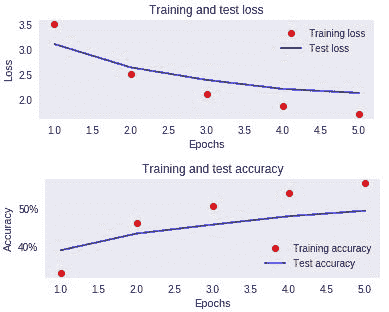

注意，模型输出的准确度可能具有误导性，因为它也将`end`标记计入准确度衡量中。

1.  计算正确翻译的单词数量：

```py
count = 0
correct_count = 0
pred = model2.predict(encoder_input_data[47500:])
for i in range(2500):
  t = np.argmax(pred[i], axis=1)
  act = np.argmax(decoder_target_data[47500],axis=1)
  correct_count += np.sum((act==t) & (act!=89))
  count += np.sum(act!=89)
correct_count/count
# 0.19
```

在上面的代码中，我们正在对测试数据进行预测（测试数据是总数据集的最后 5%，因为验证集为 5%）。

从前面的代码可以看出，大约 19%的总单词被正确翻译。

# 多对隐藏到多架构

之前架构的一个缺点是，我们必须人为地将输入的时间步数增加到 17，尽管我们知道输入最大只有八个时间步，其中有一些输入。

在这个架构中，构建一个模型，提取输入的最后时间步的隐藏状态值。此外，它将隐藏状态值复制 17 次（因为输出有 17 个时间步）。它将复制的隐藏时间步通过一个 Dense 层，最终提取输出中的可能类别。让我们按以下方式编写逻辑：

1.  重新创建输入和输出数据集，以便输入有 8 个时间步，输出有 17 个时间步。这与之前的迭代不同，因为输入在之前版本中有 17 个时间步，而当前版本中为 8 个：

```py
encoder_input_data = np.zeros(
    (len(lines.eng), eng_max_length),
    dtype='float32')
decoder_input_data = np.zeros(
    (len(lines.fr), fr_max_length),
    dtype='float32')
decoder_target_data = np.zeros(
    (len(lines.fr), fr_max_length, num_decoder_tokens+1),
    dtype='float32')

for i, (input_text, target_text) in enumerate(zip(lines.eng, lines.fr)):
    for t, word in enumerate(input_text.split()):
        encoder_input_data[i, t] = input_token_index[word]
    for t, word in enumerate(target_text.split()):
        # decoder_target_data is ahead of decoder_input_data by one timestep
        decoder_input_data[i, t] = target_token_index[word]
        if t>0: 
            # decoder_target_data will be ahead by one timestep
            # and will not include the start character.
          decoder_target_data[i, t - 1, target_token_index[word]] = 1.
          if t== len(target_text.split())-1:
            decoder_target_data[i, t:, 89] = 1

for i in range(decoder_input_data.shape[0]):
  for j in range(decoder_input_data.shape[1]):
    if(decoder_input_data[i][j]==0):
      decoder_input_data[i][j] = 89 
```

1.  构建模型。注意，`RepeatVector`层将双向层的输出复制 17 次：

```py
model2 = Sequential()
model2.add(Embedding(len(input_words)+1, 128, input_length=eng_max_length, mask_zero=True))
model2.add((Bidirectional(LSTM(256))))
model2.add(RepeatVector(fr_max_length))
model2.add((LSTM(256, return_sequences=True)))
model2.add((Dense(len(target_token_index)+1, activation='softmax')))
```

模型的总结如下：

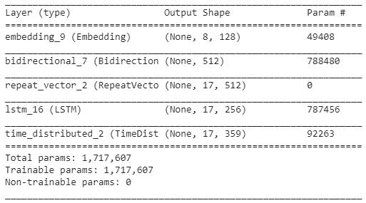

1.  编译并拟合模型：

```py
model2.compile(optimizer='adam', loss='categorical_crossentropy',metrics=['acc'])
model2.fit(encoder_input_data, decoder_target_data,
 batch_size=128,epochs=5,validation_split=0.05)
```

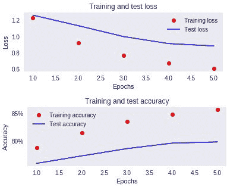

1.  计算总单词中正确翻译的百分比：

```py
count = 0
correct_count = 0
pred = model2.predict(encoder_input_data[47500:])
for i in range(2500):
  t = np.argmax(pred[i], axis=1)
  act = np.argmax(decoder_target_data[47500],axis=1)
  correct_count += np.sum((act==t) & (act!=89))
  count += np.sum(act!=89)
correct_count/count
```

以上结果准确率为 19%，与之前的迭代几乎相当。

这是可以预期的，因为当所有输入时间步的信息仅存储在最后一个隐藏层的值中时，我们往往会丢失大量信息。

另外，我们没有利用单元状态，该状态包含关于需要在每个时间步忘记哪些信息的相当多的内容。

# 机器翻译的编码器解码器架构

在我们之前定义的架构中，有两个潜在的逻辑增强：

1.  在生成翻译时，利用单元状态中存在的信息

1.  在预测下一个单词时，利用之前翻译过的单词作为输入

第二种技术称为**教师强制**。本质上，通过在生成当前时间步时，给定前一个时间步的实际值作为输入，我们可以更快地调整网络，且在实践中更加准确。

# 准备就绪

我们将采用的策略是使用编码器-解码器架构构建机器翻译系统，具体如下：

+   在准备输入和输出数据集时，我们有两个解码器数据集：

    +   `decoder_input_data`与`encoder_input_data`的组合为输入，`decoder_target_data`为输出

    +   `decoder_input_data`从`start`单词开始

+   当我们预测解码器中的第一个单词时，我们使用单词输入集，将其转换为向量，然后通过一个以`start`为输入的解码器模型。预期的输出是`start`后面的第一个单词。

+   我们以类似的方式继续，其中输出的实际第一个单词作为输入，同时预测第二个单词

+   我们将基于这个策略计算模型的准确率

# 如何操作...

有了这个，我们继续在之前准备好的输入和输出数据集上构建模型（前一部分的*第 1 步*中，许多到隐藏到许多的架构保持不变）。代码文件可以在 GitHub 上的`Machine_translation.ipynb`中找到。

1.  按如下方式构建模型：

```py
# We shall convert each word into a 128 sized vector
embedding_size = 128
```

1.  1.  准备编码器模型：

```py
encoder_inputs = Input(shape=(None,))
en_x= Embedding(num_encoder_tokens+1, embedding_size)(encoder_inputs)
encoder = LSTM(256, return_state=True)
encoder_outputs, state_h, state_c = encoder(en_x)
# We discard `encoder_outputs` and only keep the states.
encoder_states = [state_h, state_c]
```

请注意，由于我们正在提取编码器网络的中间层，并且将多个数据集作为输入（编码器输入数据和解码器输入数据），因此我们使用的是功能性 API。

1.  1.  准备解码器模型：

```py
decoder_inputs = Input(shape=(None,))
dex= Embedding(num_decoder_tokens+1, embedding_size)
final_dex= dex(decoder_inputs)
decoder_lstm = LSTM(256, return_sequences=True, return_state=True)
decoder_outputs, _, _ = decoder_lstm(final_dex, initial_state=encoder_states)
decoder_outputs = Dense(2000,activation='tanh')(decoder_outputs)
decoder_dense = Dense(num_decoder_tokens+1, activation='softmax')
decoder_outputs = decoder_dense(decoder_outputs)
```

1.  按如下方式构建模型：

```py
model3 = Model([encoder_inputs, decoder_inputs], decoder_outputs)
model3.compile(optimizer='adam', loss='categorical_crossentropy', metrics=['acc'])
```

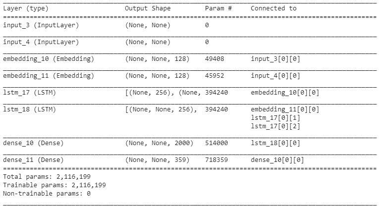

1.  按照以下代码拟合模型：

```py
history3 = model3.fit([encoder_input_data, decoder_input_data], decoder_target_data,
 batch_size=32,epochs=5,validation_split=0.05)
```

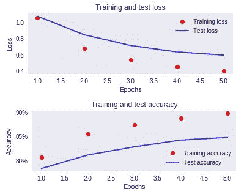

1.  计算准确转录的单词百分比：

```py
act = np.argmax(decoder_target_data, axis=2)
```

```py
count = 0
correct_count = 0
pred = model3.predict([encoder_input_data[47500:],decoder_input_data[47500:]])
for i in range(2500):
     t = np.argmax(pred[i], axis=1)
     correct_count += np.sum((act[47500+i]==t) & (act[47500+i]!=0))
     count += np.sum(decoder_input_data[47500+i]!=0)
correct_count/count
```

请注意，在此场景下，我们已正确翻译了总词汇的 44%。

然而，请注意，在计算测试数据集的准确性时，我们不应使用`decoder_input_data`，因为在实际场景中我们无法访问此数据。

这要求我们将上一时间步的预测单词作为当前时间步的解码器输入单词，如下所示。

我们将重新初始化`decoder_input_data`为`decoder_input_data_pred`：

```py
decoder_input_data_pred = np.zeros((len(lines.fr),fr_max_length),dtype='float32')
final_pred = []
for i in range(2500):
word = 284
     for j in range(17):
         decoder_input_data_pred[(47500+i), j] = word
         pred =         model3.predict([encoder_input_data[(47500+i)].reshape(1,8),decoder_input_data_pred[47500+i].reshape(1,17)])
         t = np.argmax(pred[0][j])
         word = t
         if word==89:
             break
     final_pred.append(list(decoder_input_data_pred[47500+i]))
```

请注意，在前面的代码中，单词索引 284 对应起始单词。我们将起始单词作为解码器输入的第一个单词，并预测下一时间步中概率最高的单词。

一旦我们预测出第二个单词，我们就更新`decoder_input_word_pred`，预测第三个单词，并继续直到遇到停止词。

现在我们已经修改了预测的翻译单词，让我们来计算翻译的准确性：

```py
final_pred2 = np.array(final_pred)
```

```py
count = 0
correct_count = 0
for i in range(2500):
     correct_count += np.sum((decoder_input_data[47500+i]==final_pred2[i]) & (decoder_input_data[47500+i]!=89))
     count += np.sum(decoder_input_data[47500+i]!=89)
correct_count/count
```

这样做的结果是，所有单词中有 46%通过此方法被正确翻译。

尽管相较于之前的方法，翻译的准确性有了显著提高，但我们仍未考虑到这样一个直觉：在源语言中位于开头的单词，在目标语言中也很可能位于开头，也就是说，单词的对齐并未被考虑。接下来的部分，我们将探讨如何解决单词对齐的问题。

# 带有注意力机制的编码器解码器架构用于机器翻译

在上一节中，我们学习了通过启用教师强制技术（即使用目标序列中上一时间步的实际单词作为模型输入）可以提高翻译准确度。

在本节中，我们将进一步扩展这一思路，并根据编码器和解码器向量在每个时间步的相似度为输入编码器分配权重。通过这种方式，我们可以根据解码器的时间步，确保某些单词在编码器的隐藏向量中具有更高的权重。

# 如何做……

有了这个，让我们看看如何构建编码器解码器架构，并结合注意力机制。代码文件在 GitHub 上的`Machine_translation.ipynb`中可用。

1.  构建编码器，如以下代码所示：

```py
encoder_inputs = Input(shape=(eng_max_length,))
en_x= Embedding(num_encoder_tokens+1, embedding_size)(encoder_inputs)
en_x = Dropout(0.1)(en_x)
encoder = LSTM(256, return_sequences=True, unroll=True)(en_x)
encoder_last = encoder[:,-1,:]
```

1.  构建解码器，如下所示：

```py
decoder_inputs = Input(shape=(fr_max_length,))
dex= Embedding(num_decoder_tokens+1, embedding_size)
decoder= dex(decoder_inputs)
decoder = Dropout(0.1)(decoder)
decoder = LSTM(256, return_sequences=True, unroll=True)(decoder, initial_state=[encoder_last, encoder_last])
```

请注意，在前面的代码中，我们并没有最终确定解码器架构。我们只是提取了解码器中的隐藏层值。

1.  构建注意力机制。注意力机制将基于编码器隐藏向量与解码器隐藏向量在每个时间步的相似度。基于这种相似度（执行 softmax 操作以提供一个加权值，所有可能的输入时间步的加权值总和为 1），我们将给编码器向量赋予权重，如下所示。

将编码器解码器向量通过激活层和密集层处理，以便在进行点积（衡量相似度——余弦相似度）之前实现进一步的非线性：

```py
t = Dense(5000, activation='tanh')(decoder)
t2 = Dense(5000, activation='tanh')(encoder)
attention = dot([t, t2], axes=[2, 2])
```

确定需要给输入时间步长分配的权重：

```py
attention = Dense(eng_max_length, activation='tanh')(attention)
attention = Activation('softmax')(attention)
```

计算加权编码器向量，方法如下：

```py
context = dot([attention, encoder], axes = [2,1])
```

1.  将解码器和加权编码器向量结合起来：

```py
decoder_combined_context = concatenate([context, decoder])
```

1.  将解码器和加权编码向量的组合连接到输出层：

```py
output_dict_size = num_decoder_tokens+1
decoder_combined_context=Dense(2000, activation='tanh')(decoder_combined_context)
output=(Dense(output_dict_size, activation="softmax"))(decoder_combined_context)
```

1.  编译并拟合模型，下面是相关代码：

```py
model4 = Model(inputs=[encoder_inputs, decoder_inputs], outputs=[output])
model4.compile(optimizer='adam', loss='categorical_crossentropy',metrics = ['accuracy'])
```

结构图如下：


```py
model4.fit([encoder_input_data, decoder_input_data], decoder_target_data,
 batch_size=32,epochs=5,validation_split=0.05)
```

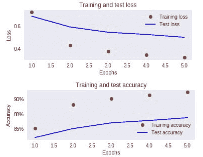

一旦你拟合了模型，你会发现该模型的验证损失略优于之前的迭代。

1.  以我们在上一部分所做的类似方式计算翻译的准确率：

```py
decoder_input_data_pred=np.zeros((len(lines.fr), fr_max_length), dtype='float32')
```

```py
final_pred_att = []
for i in range(2500):
     word = 284
     for j in range(17):
         decoder_input_data_pred[(47500+i), j] = word
         pred =         model4.predict([encoder_input_data[(47500+i)].reshape(1,8),decoder_input_data_pred[47500+i].reshape(1,17)])
         t = np.argmax(pred[0][j])
         word = t
         if word==89:
             break
     final_pred_att.append(list(decoder_input_data_pred[47500+i]))
```

```py
final_pred2_att = np.array(final_pred_att)
count = 0
correct_count = 0
for i in range(2500):
     correct_count += np.sum((decoder_input_data[47500+i]==final_pred2_att[i]) & (decoder_input_data[47500+i]!=89))
     count += np.sum(decoder_input_data[47500+i]!=89)
correct_count/count
```

前面的代码结果是 52%的总词汇被正确翻译，相较于上一个迭代有了改进。

1.  现在我们已经构建了一个具有合理准确率的翻译系统，让我们检查一下测试数据集中的一些翻译（测试数据集是总数据集的最后 5%，因为我们将`validation_split`指定为 5%），如下所示：

```py
k = -1500
t = model4.predict([encoder_input_data[k].reshape(1,encoder_input_data.shape[1]),decoder_input_data[k].reshape(1,decoder_input_data.shape[1])]).reshape(decoder_input_data.shape[1], num_decoder_tokens+1)
```

提取按词汇计算的预测翻译：

```py
t2 = np.argmax(t,axis=1)
for i in range(len(t2)):
     if int(t2[i])!=0:
         print(list(target_token_index.keys())[int(t2[i]-1)])
```

将英文句子转换为法文后的前面代码输出如下：

```py
je unk manger pas manger end end
```

提取实际的翻译，以词汇为单位：

```py
t2 = decoder_input_data[k]
for i in range(len(t2)):
     if int(t2[i])!=89:
         print(list(target_token_index.keys())[int(t2[i]-1)])
```

前面的代码输出如下：

```py
 je unk ne pas manger ça end
```

我们看到预测的翻译与原始翻译非常接近。以类似的方式，我们来探索验证数据集中的更多翻译：

| **原始翻译** | **预测翻译** |
| --- | --- |
| *我在这个未知的周末忙得不可开交* | *我为更多的未知周末忙碌* |
| *我只是做我所说的未知* | *我做的正是我所做的未知* |
| *我有做这个未知的周末* | *我做这个未知的周末* |

从上表中，我们可以看到有一个不错的翻译，然而，仍有一些潜在的改进空间：

+   考虑到词汇相似性：

    +   像*je*和*j'ai*这样的词汇是相当相似的，因此它们不应该受到过多惩罚，即使这会导致准确度指标的下降

+   减少`unk`词汇的数量：

    +   我们减少了`unk`词汇的数量，以降低数据集的维度

    +   当我们收集更大的语料库，并在工业级配置的机器上工作时，我们可能能够处理高维数据
