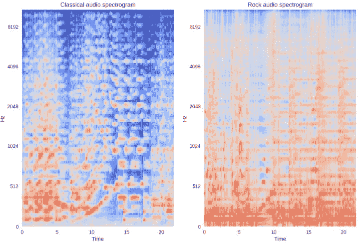
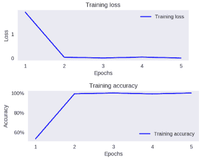
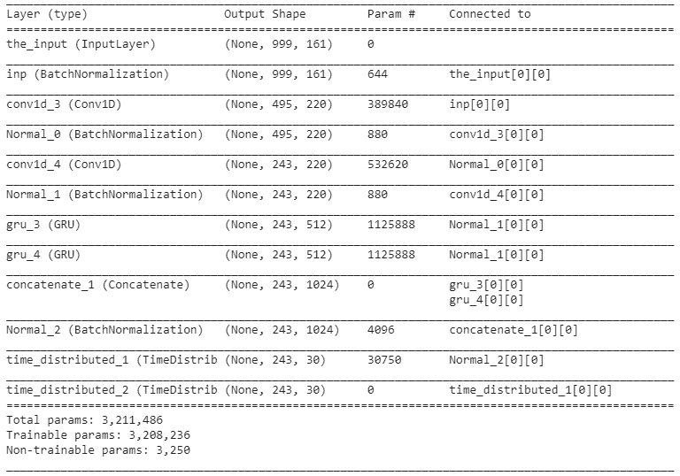

# 音频分析

在前几章中，我们学习了如何处理顺序文本数据。音频也可以看作是顺序数据，其振幅随时间变化。在这一章中，我们将学习以下内容：

+   按类型分类歌曲

+   使用深度学习生成音乐

+   音频转录为文本

# 按类型分类歌曲

在这个案例研究中，我们将把一首歌分类为 10 种可能的类型之一。想象一下一个场景：我们被要求自动分类一首歌的类型，而不需要手动听它。这样，我们就能尽可能减少操作负担。

# 准备工作

我们将采用的策略如下：

1.  下载一个包含各种音频录音及其对应类型的数据集。

1.  可视化并对比不同类型音频信号的频谱图。

1.  在频谱图上执行 CNN 操作：

    +   请注意，我们将在频谱图上执行 CNN 1D 操作，因为音频录音的情况下，翻译概念并不适用。

1.  从 CNN 中提取特征，经过多次卷积和池化操作后。

1.  展平输出并通过一个具有 10 个可能类别的输出层的密集层。

1.  最小化类别交叉熵，以将音频录音分类为 10 个可能类别之一。

一旦我们对音频进行分类，我们将绘制每个音频输入的嵌入图，以便将相似的音频录音归为一类。这样，我们就能在不听歌的情况下识别新歌的类型，从而自动将音频输入分类到一个类型中。

# 如何操作...

上述策略的代码如下（代码文件在 GitHub 中名为`Genre_classification.ipynb`）：

1.  下载数据集并导入相关包：

```py
import sys, re, numpy as np, pandas as pd, music21, IPython, pickle, librosa, librosa.dsiplay, os
from glob import glob
from tqdm import tqdm
from keras.utils import np_utils
```

1.  循环遍历音频文件，提取输入音频的`mel 频谱图`特征，并存储音频输入的输出类型：

```py
song_specs=[]
genres = []
for genre in os.listdir('...'): # Path to genres folder
  song_folder = '...' # Path to songs folder
  for song in os.listdir(song_folder):
    if song.endswith('.au'):
      signal, sr = librosa.load(os.path.join(song_folder, song), sr=16000)
      melspec = librosa.feature.melspectrogram(signal, sr=sr).T[:1280,]
      song_specs.append(melspec)
      genres.append(genre)
      print(song)
  print('Done with:', genre)
```

在上述代码中，我们加载音频文件并提取其特征。此外，我们还提取了信号的`mel 频谱图`特征。最后，我们将`mel`特征存储为输入数组，将类型存储为输出数组。

1.  可视化频谱图：

```py
plt.subplot(121)
librosa.display.specshow(librosa.power_to_db(song_specs[302].T),
 y_axis='mel',
 x_axis='time',)
plt.title('Classical audio spectrogram')
plt.subplot(122)
librosa.display.specshow(librosa.power_to_db(song_specs[402].T),
 y_axis='mel',
 x_axis='time',)
plt.title('Rock audio spectrogram')
```

以下是前述代码的输出：



你可以看到古典音频频谱图和摇滚音频频谱图之间有明显的区别。

1.  定义输入和输出数组：

```py
song_specs = np.array(song_specs)

song_specs2 = []
for i in range(len(song_specs)):
     tmp = song_specs[i]
     song_specs2.append(tmp[:900][:])
song_specs2 = np.array(song_specs2)
```

将输出类别转换为独热编码版本：

```py
genre_one_hot = pd.get_dummies(genres)
```

1.  创建训练和测试数据集：

```py
x_train, x_test, y_train, y_test = train_test_split(song_specs2, np.array(genre_one_hot),test_size=0.1,random_state = 42)
```

1.  构建并编译方法：

```py
input_shape = (1280, 128)
inputs = Input(input_shape)
x = inputs
levels = 64
for level in range(7):
     x = Conv1D(levels, 3, activation='relu')(x)
     x = BatchNormalization()(x)
     x = MaxPooling1D(pool_size=2, strides=2)(x)
     levels *= 2
     x = GlobalMaxPooling1D()(x)
for fc in range(2):
     x = Dense(256, activation='relu')(x)
     x = Dropout(0.5)(x)
labels = Dense(10, activation='softmax')(x)
```

请注意，前述代码中的`Conv1D`方法与`Conv2D`非常相似；然而，`Conv1D`是一个一维滤波器，而`Conv2D`是一个二维滤波器：

```py
model = Model(inputs=[inputs], outputs=[labels])
adam = keras.optimizers.Adam(lr=0.0001)
model.compile(loss='categorical_crossentropy',optimizer=adam,metrics=['accuracy'])
```

1.  拟合模型：

```py
history = model.fit(x_train, y_train,batch_size=128,epochs=100,verbose=1,validation_data=(x_test, y_test))
```

从前述代码中我们可以看到，模型在测试数据集上的分类准确率约为 60%。

1.  从模型的倒数第二层提取输出：

```py
from keras.models import Model
layer_name = 'dense_14'
intermediate_layer_model = Model(inputs=model.input,outputs=model.get_layer(layer_name).output)
intermediate_output = intermediate_layer_model.predict(song_specs2)
```

前面的代码在倒数第二层产生输出。

1.  使用`t-SNE`将嵌入的维度减少到 2，这样我们就可以在图表上绘制我们的工作：

```py
from sklearn.manifold import TSNE
tsne_model = TSNE(n_components=2, verbose=1, random_state=0)
tsne_img_label = tsne_model.fit_transform(intermediate_output)
tsne_df = pd.DataFrame(tsne_img_label, columns=['x', 'y'])
tsne_df['image_label'] = genres
```

1.  绘制`t-SNE`输出：

```py
from ggplot import *
chart = ggplot(tsne_df, aes(x='x', y='y', color='genres'))+ geom_point(size=70,alpha=0.5)
chart
```

以下是前面代码的图表：


从前面的图中，我们可以看到相似类型的音频记录聚集在一起。这样，我们现在可以自动地将一首新歌分类到可能的某个类型中，而无需人工检查。然而，如果音频属于某个类型的概率不高，它可能会被送去人工复审，以确保错误分类的可能性较小。

# 使用深度学习生成音乐

在前一章中，我们学习了通过阅读小说来生成文本。在本节中，我们将学习如何通过一系列音频音符生成音频。

# 准备工作

一个 MIDI 文件通常包含音频文件中音符和和弦的信息，而音符对象包含音符的音高、八度和偏移量的信息。和弦对象包含同时演奏的一组音符。

我们将采用的音乐生成策略如下：

+   提取音频文件中的音符

+   为每个音符分配一个唯一的 ID。

+   取 100 个历史音符的序列，第 101 个音符将是输出。

+   训练 LSTM 模型。

# 如何做...

上述讨论的策略编码如下（代码文件可以在 GitHub 上的`Music_generation.ipynb`中找到），并附带推荐的音频文件：

1.  导入相关的包和数据集：

```py
!pip install mido music21
import mido, glob, os
from mido import MidiFile, MidiTrack, Message
import numpy as np
from music21 import converter, instrument, note, chord
from keras.utils import np_utils
from keras.layers import Input, LSTM, Dropout, Dense, Activation
from keras.models import Model

fname = '/content/nintendo.mid'
```

1.  读取文件内容：

```py
midi = converter.parse(fname)
```

前面的代码读取了一个分数流。

1.  定义一个函数，读取分数流并提取其中的音符（如果音频文件中有静音，也会提取）：

```py
def parse_with_silence(midi=midi):
     notes = []
     notes_to_parse = None
     parts = instrument.partitionByInstrument(midi)
     if parts: # file has instrument parts
         notes_to_parse = parts.parts[0].recurse()
     else: # file has notes in a flat structure
         notes_to_parse = midi.flat.notes
     for ix, element in enumerate(notes_to_parse):
         if isinstance(element, note.Note):
             _note = str(element.pitch)
             notes.append(_note)
         elif isinstance(element, chord.Chord):
             _note = '.'.join(str(n) for n in element.normalOrder)
             notes.append(_note)
         elif isinstance(element, note.Rest):
             _note = '#'+str(element.seconds)
             notes.append(_note)
     return notes
```

在前面的代码中，我们通过遍历元素来获取音符，取决于元素是音符、和弦还是休止符（表示静音），我们提取相应的音符，附加它们，并返回附加后的列表。

1.  从输入音频文件的流中提取音符：

```py
notes = parse_with_silence()
```

一个示例音符输出如下：


请注意，值以`#`开头表示静音（持续时间与紧邻`#`的数字相同）。

1.  通过创建音符 ID 及其对应名称的字典，来创建输入和输出数据集：

```py
# get all unique values in notes
pitchnames = sorted(set(item for item in notes))
# create a dictionary to map pitches to integers
note_to_int = dict((note, number) for number, note in enumerate(pitchnames))
network_input = []
network_output = []
```

1.  1.  创建输入和输出数组的序列：

```py
sequence_length = 100
for i in range(0, len(notes) - sequence_length, 1):
     sequence_in = notes[i:i + sequence_length]
     sequence_out = notes[i + sequence_length]
     network_input.append([note_to_int[char] for char in sequence_in])
     network_output.append(note_to_int[sequence_out])
```

在前面的步骤中，我们将 100 个音符的序列作为输入，并提取第 101 个时间步的输出。

此外，我们还将音符转换为其对应的 ID：

```py
n_patterns = len(network_input)
# reshape the input into a format compatible with LSTM layers
network_input = np.reshape(network_input, (n_patterns, sequence_length, 1))
# normalize input
network_input = network_input / np.max(network_input)
network_output = np_utils.to_categorical(network_output)

N = 9 * len(network_input)//10
print(network_input.shape, network_output.shape)
# (36501, 100, 1) (36501, 50)
```

在前面的代码中，我们正在重新调整输入数据的形状，以便将其馈送到 LSTM 层（该层需要`batch_size`形状、时间步数和每个时间步的特征数）。

此外，我们正在对输入进行归一化，并将输出转换为一组独热编码的向量。

1.  拟合模型：

```py
model.fit(network_input, network_output, epochs=100, batch_size=32, verbose = 1)
```

以下是前述代码的输出：



1.  生成预测：

```py
from tqdm import trange
print('generating prediction stream...')
start = np.random.randint(0, len(network_input)-1)
int_to_note = dict((number, note) for number, note in enumerate(pitchnames))
pattern = network_input[start].tolist()
prediction_output = []
```

注意，在前面的代码中，我们选择了一个随机的音频位置，从那里我们将采样一个序列，用作未来时间步预测的种子。

1.  通过一次处理 100 个音符的序列，生成下一个预测，将其附加到输入序列中，再生成下一个预测（通过获取最后 100 个音符的最新序列）：

```py
for note_index in trange(500):
     prediction_input = np.reshape(pattern, (1, len(pattern), 1))
     prediction = model.predict(prediction_input, verbose=0)
     index = np.argmax(prediction)
     result = int_to_note[index]
     prediction_output.append(result)
     pattern.append([index/49])
     pattern = pattern[1:len(pattern)]
```

注意，我们将索引（即模型的预测输出）除以 49，就像在构建模型时一样（除以`np.max(network_input)`）。

上面的练习与文本生成练习略有不同，后者是基于输入词 ID 进行嵌入操作，而在这种情况下，我们没有进行嵌入。模型仍然在没有嵌入的情况下运行，可能是因为输入中唯一的值较少。

1.  根据模型生成的值创建音符值：

```py
offset = 0
output_notes = []

# create note and chord objects based on the values generated by the model
print('creating notes and chords')
for pattern in prediction_output:

    # pattern is a chord
    if (('.' in pattern) or pattern.isdigit()) and pattern[0]!='#':
        notes_in_chord = pattern.split('.')
        notes = []
        for current_note in notes_in_chord:
            new_note = note.Note(int(current_note))
            new_note.storedInstrument = instrument.Piano()
            notes.append(new_note)
        new_chord = chord.Chord(notes)
        new_chord.offset = offset
        output_notes.append(new_chord)

    # pattern is a note
    elif pattern[0]!='#':
        new_note = note.Note(pattern)
        new_note.offset = offset
        new_note.storedInstrument = instrument.Piano()
        output_notes.append(new_note)

    # pattern is silence
    else:
        new_note = note.Rest()
        new_note.offset = offset
        new_note.storedInstrument = instrument.Piano()
        new_note.quarterLength = float(pattern[1:])
        output_notes.append(new_note)
    # increase offset each iteration so that notes do not stack
    offset += 0.5
```

注意，在前面的代码中，我们将每个音符的时间偏移了 0.5 秒，这样在生成输出时音符不会重叠。

1.  将生成的预测写入音乐流：

```py
from music21 import stream
midi_stream = stream.Stream(output_notes)
midi_stream.write('midi', fp='OP.mid')
```

现在，你应该能够听到你的模型生成的音乐。

# 将音频转录为文本

在第十四章，*端到端学习*中，我们学习了如何将手写文本图像转录为文本。在这一部分，我们将利用类似的端到端模型将语音转录为文本。

# 准备中

我们将采用的语音转录策略如下：

+   下载一个包含音频文件及其对应转录（*实际结果*）的数据集。

+   在读取音频文件时指定采样率：

    +   如果采样率为 16,000，我们将从每秒音频中提取 16,000 个数据点。

+   提取音频数组的快速傅里叶变换：

    +   FFT 确保我们仅保留信号中最重要的特征。

    +   默认情况下，FFT 给我们提供*n/2*个数据点，其中*n*是整个音频录音中的数据点数量。

+   对音频进行 FFT 特征采样，每次提取 320 个数据点；也就是说，我们每次提取 20 毫秒（320/16000 = 1/50 秒）的音频数据。

+   此外，我们将在 10 毫秒间隔处每次采样 20 毫秒的数据。

+   在这个练习中，我们将处理一个音频录音，其最大时长为 10 秒。

+   我们将把 20 毫秒的音频数据存储到一个数组中：

    +   我们已经看到，每 10 毫秒采样 20 毫秒的数据。

    +   因此，对于一个一秒钟的音频片段，我们将有 100 x 320 个数据点，而对于一个 10 秒钟的音频片段，我们将有 1,000 x 320 = 320,000 个数据点。

+   我们将初始化一个 160,000 个数据点的空数组，并用 FFT 值覆盖这些值——因为我们已经知道 FFT 值是原始数据点数量的一半

+   对于每个 1,000 x 320 的数据点数组，我们将存储对应的转录文本

+   我们将为每个字符分配一个索引，然后将输出转换为索引列表

+   此外，我们还将存储输入长度（即预定义的时间步数）和标签长度（即输出中实际的字符数量）

+   此外，我们将定义基于实际输出、预测输出、时间步数（输入长度）和标签长度（输出字符数）的 CTC 损失函数

+   我们将定义一个模型，结合使用`conv1D`（因为这是音频数据）和 GRU

+   此外，我们将确保通过批量归一化来规范化数据，以防止梯度消失

+   我们将在数据批次上运行模型，在此过程中我们随机采样数据批次并将其输入模型，模型试图最小化 CTC 损失

+   最后，我们将通过使用`ctc_decode`方法解码模型在新数据点上的预测

# 如何做到...

上述策略的代码实现如下（代码文件可在 GitHub 的`Voice transcription.ipynb`中找到）：

1.  下载数据集并导入相关的包：

```py
$wget http://www.openslr.org/resources/12/train-clean-100.tar.gz
$tar xzvf train-clean-100.tar.gz

import librosa
import numpy as np
import pandas as pd
```

1.  读取所有文件名及其对应的转录文本，并将它们转换为单独的列表：

```py
import os, numpy as np
org_path = '/content/LibriSpeech/train-clean-100/'
count = 0
inp = []
k=0
audio_name = []
audio_trans = []
for dir1 in os.listdir(org_path):
     dir2_path = org_path+dir1+'/'
     for dir2 in os.listdir(dir2_path):
     dir3_path = dir2_path+dir2+'/'

     for audio in os.listdir(dir3_path):
         if audio.endswith('.txt'):
             k+=1
             file_path = dir3_path + audio
             with open(file_path) as f:
                 line = f.readlines()
                 for lines in line:
                     audio_name.append(dir3_path+lines.split()[0]+'.flac')
                     words2 = lines.split()[1:]
                     words4=' '.join(words2)
                     audio_trans.append(words4)
```

1.  将转录文本的长度存储到一个列表中，这样我们就能理解最大转录文本的长度：

```py
import re
len_audio_name=[]
for i in range(len(audio_name)):
     tmp = audio_trans[i]
     len_audio_name.append(len(tmp))
```

1.  对于本次练习，为了能够在单个 GPU 上训练模型，我们将对前 2,000 个音频文件进行操作，这些音频文件的转录文本长度少于 100 个字符：

```py
final_audio_name = []
final_audio_trans = []
for i in range(len(audio_name)):
     if(len_audio_name[i]<100):
         final_audio_name.append(audio_name[i])
         final_audio_trans.append(audio_trans[i])
```

在前面的代码中，我们仅为那些转录文本长度少于 100 个字符的音频录音存储音频名称和对应的转录文本

1.  将输入存储为二维数组，并仅对那些时长少于 10 秒的音频文件存储对应的输出：

```py
inp = []
inp2 = []
op = []
op2 = []
for j in range(len(final_audio_name)):
     t = librosa.core.load(final_audio_name[j],sr=16000, mono= True) 
     if(t[0].shape[0]<160000):
         t = np.fft.rfft(t[0])
         t2 = np.zeros(160000)
         t2[:len(t)] = t
         inp = []
         for i in range(t2.shape[0]//160):
             inp.append(t2[(i*160):((i*160)+320)])
             inp2.append(inp)
             op2.append(final_audio_trans[j])
```

1.  为数据中的每个唯一字符创建一个索引：

```py
import itertools
list2d = op2
charList = list(set(list(itertools.chain(*list2d))))
```

1.  创建输入和标签长度：

```py
num_audio = len(op2)
y2 = []
input_lengths = np.ones((num_audio,1))*243
label_lengths = np.zeros((num_audio,1))
for i in range(num_audio):
     val = list(map(lambda x: charList.index(x), op2[i]))
     while len(val)<243:
         val.append(29)
     y2.append(val)
     label_lengths[i] = len(op2[i])
     input_lengths[i] = 243
```

注意，我们正在创建一个 243 的输入长度，因为模型的输出（我们将在后续步骤中构建）具有 243 个时间步。

1.  定义 CTC 损失函数：

```py
import keras.backend as K
def ctc_loss(args):
    y_pred, labels, input_length, label_length = args
    return K.ctc_batch_cost(labels, y_pred, input_length, label_length
```

1.  定义模型：

```py
input_data = Input(name='the_input', shape = (999,161), dtype='float32')
inp = BatchNormalization(name="inp")(input_data)
conv= Conv1D(filters=220, kernel_size = 11,strides = 2, padding='valid',activation='relu')(inp)
conv = BatchNormalization(name="Normal0")(conv)
conv1= Conv1D(filters=220, kernel_size = 11,strides = 2, padding='valid',activation='relu')(conv)
conv1 = BatchNormalization(name="Normal1")(conv1)
gru_3 = GRU(512, return_sequences = True, name = 'gru_3')(conv1)
gru_4 = GRU(512, return_sequences = True, go_backwards = True, name = 'gru_4')(conv1)
merged = concatenate([gru_3, gru_4])
normalized = BatchNormalization(name="Normal")(merged)
dense = TimeDistributed(Dense(30))(normalized)
y_pred = TimeDistributed(Activation('softmax', name='softmax'))(dense)
Model(inputs = input_data, outputs = y_pred).summary()
```

1.  定义 CTC 损失函数的输入和输出参数：

```py
from keras.optimizers import Adam
Optimizer = Adam(lr = 0.001)
labels = Input(name = 'the_labels', shape=[243], dtype='float32')
input_length = Input(name='input_length', shape=[1],dtype='int64')
label_length = Input(name='label_length',shape=[1],dtype='int64')
output = Lambda(ctc_loss, output_shape=(1,),name='ctc')([y_pred, labels, input_length, label_length])
```

1.  构建并编译模型：

```py
model = Model(inputs = [input_data, labels, input_length, label_length], outputs= output)
model.compile(loss={'ctc': lambda y_true, y_pred: y_pred}, optimizer = Optimizer, metrics = ['accuracy'])
```

模型摘要如下：



1.  在从输入中采样的数据批次上拟合模型：

```py
for i in range(2500):
     samp=random.sample(range(x2.shape[0]-25),32)
     batch_input=[inp2[i] for i in samp]
     batch_input = np.array(batch_input)
     batch_input = batch_input/np.max(batch_input)
     batch_output = [y2[i] for i in samp]
     batch_output = np.array(batch_output)
     input_lengths2 = [input_lengths[i] for i in samp]
     label_lengths2 = [label_lengths[i] for i in samp]
     input_lengths2 = np.array(input_lengths2)
     label_lengths2 = np.array(label_lengths2)
     inputs = {'the_input': batch_input,
             'the_labels': batch_output,
             'input_length': input_lengths2,
             'label_length': label_lengths2}
     outputs = {'ctc': np.zeros([32])} 
     model.fit(inputs, outputs,batch_size = 32, epochs=1, verbose =1)
```

在前面的代码中，我们正在循环并提取 2,500 次数据批次，规范化输入数据，并拟合模型

此外，我们进行了大量的训练周期，因为对于这个特定的数据集和模型组合，CTC 损失下降得很慢。

1.  预测测试音频：

```py
model2 = Model(inputs = input_data, outputs = y_pred)

k=-12
pred= model2.predict(np.array(inp2[k]).reshape(1,999,161)/100)
```

在前面的代码中，我们指定了一个模型（`model2`），它接受输入的测试数组并提取每个 243 个时间步骤中的模型预测结果。

此外，我们从输入数组的最后提取了第 12^(th)个元素的预测（请注意，我们在训练模型时排除了最后 25 个输入数据点）。此外，我们还像之前一样对其进行了预处理，将输入数据传递给模型训练过程。

1.  解码新数据点上的预测：

```py
def decoder(pred):
     pred_ints = (K.eval(K.ctc_decode(pred,[243])[0][0])).flatten().tolist()
     out = ""
     for i in range(len(pred_ints)):
         if pred_ints[i]<28:
         out = out+charList[pred_ints[i]]
     print(out)
```

在前面的代码中，我们使用`ctc_decode`方法解码了预测结果。或者，我们也可以像提取手写图像转录中的预测那样解码预测。最后，我们打印出了预测结果。

我们将能够通过调用之前定义的函数来解码预测结果：

```py
decoder(pred)
```

其中一个预测的输出如下：


虽然前面的输出看起来像是胡言乱语，但它在语音上与实际的音频相似，具体如下：


# 还有更多……

我们可以进一步提高转录准确性的一些方法如下：

+   在更多数据点上进行训练

+   融入语言模型对输出进行模糊匹配，以便我们能纠正预测结果。
