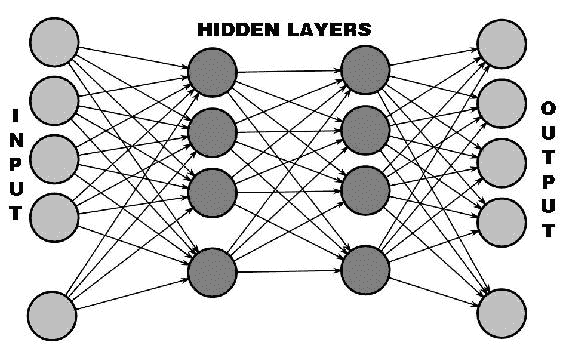
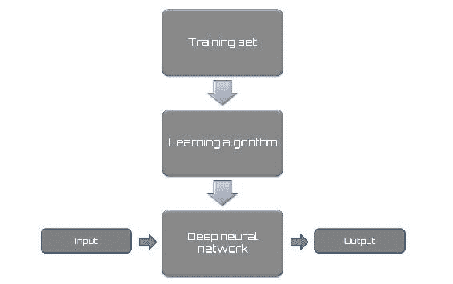
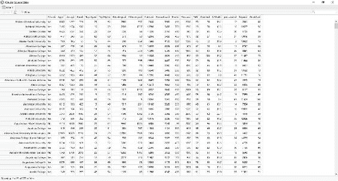
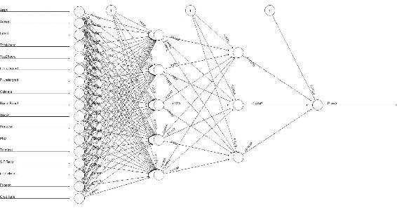
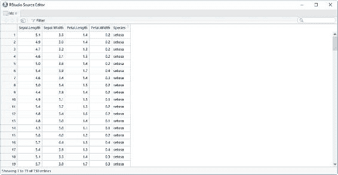
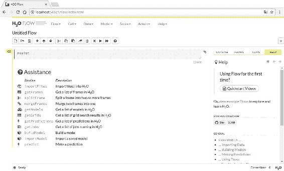
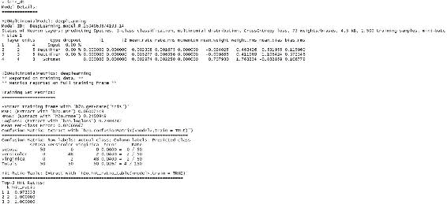
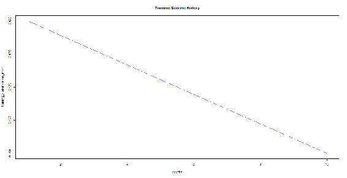
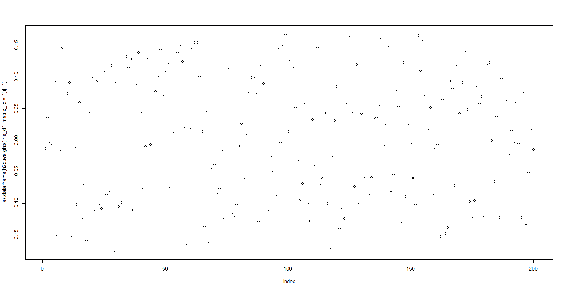
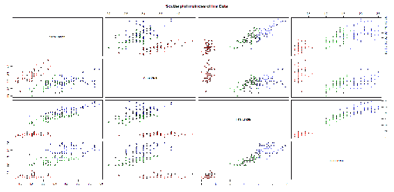

# 使用多层神经网络进行深度学习

深度学习是机器学习/人工智能领域的最新热门趋势。它的核心在于构建先进的神经网络。通过使多个隐藏层在神经网络模型中工作，我们可以处理复杂的非线性数据表示。我们通过基础神经网络创建深度学习。深度学习在现实生活中有许多应用案例，例如无人驾驶汽车、医学诊断、计算机视觉、语音识别、**自然语言处理**（**NLP**）、手写识别、语言翻译等多个领域。

在本章中，我们将讨论深度学习过程：如何训练、测试和部署**深度神经网络**（**DNN**）。我们将探讨 R 中可用于处理 DNN 的不同包。我们将了解如何使用`neuralnet`包构建和训练 DNN。最后，我们将分析一个使用 h2o 平台训练和建模 DNN 的例子，h2o 是一个可扩展的开源内存学习平台，用于在大数据集上创建模型并实施高精度的预测方法。

本章涵盖的主题如下：

+   DNN 的类型

+   深度学习的 R 包

+   使用`neuralnet`训练和建模 DNN

+   `h2o`库

在本章结束时，我们将理解深度学习的基本概念，以及如何在 R 环境中实现它。我们将了解不同类型的 DNN。我们将学习如何训练、测试和部署模型。我们将知道如何使用`h2o`训练和建模 DNN。

# 深度神经网络（DNN）介绍

随着大数据处理基础设施、GPU 和 GP-GPU 的出现，我们现在能够克服浅层神经网络的挑战，即过拟合和梯度消失问题，使用各种激活函数和 L1/L2 正则化技术。深度学习可以轻松高效地处理大量标注和未标注的数据。

如前所述，深度学习是机器学习中的一类，其中学习发生在多个神经网络层次上。标准的 DNN 图示如下所示：



从前面的图分析中，我们可以注意到与我们迄今为止研究的神经网络之间的显著相似性。然后，我们可以放心，尽管它看起来可能不一样，深度学习实际上只是神经网络的扩展。在这方面，我们在前几章中看到的大部分内容仍然适用。简而言之，DNN 是一个包含两个或更多隐藏层的多层神经网络。这里没有什么特别复杂的内容。通过添加更多层和每层更多神经元，我们增加了模型对训练数据的专门化，但却降低了其在测试数据上的性能。

正如我们所预期的，DNN 是 ANN 的衍生物。通过增加隐藏层的数量，我们构建了 DNN。DNN 有很多变种，以下列举了几个不同的术语：

+   **深度信念网络**（**DBN**）：它通常是一个前馈网络，数据从一层流向另一层，而没有回流。它至少有一层隐藏层，并且可以有多个隐藏层，从而增加复杂性。

+   **限制玻尔兹曼机**（**RBM**）：它只有一个隐藏层，且同一组内的节点之间没有连接。它是一个简单的多层感知器（MLP）神经网络模型。

+   **循环神经网络**（**RNN**）和**长短期记忆网络**（**LSTM**）：这些网络在组内和组间的数据流动是双向的。

与任何机器学习算法一样，DNN（深度神经网络）也需要构建、训练和评估的过程。以下图展示了深度学习的基本工作流程：



我们在前一图中看到的工作流程与典型的监督学习算法非常相似。但它与其他机器学习算法有何不同呢？

几乎所有的机器学习算法在识别原始输入数据的特征时都会显示出它们的局限性，尤其是在数据复杂且缺乏明显顺序的情况下，比如图像。通常，这种局限性是通过人类的帮助来突破的，人类负责识别机器无法做到的部分。深度学习则去除了这一环节，依赖于训练过程通过输入示例找到最有用的模型。在这种情况下，人类干预仍然是必要的，以便在开始训练之前做出选择，但自动发现特征大大简化了过程。与机器学习提供的其他解决方案相比，神经网络特别具有优势的地方在于其模型的强大泛化能力。

这些特性使得深度学习在几乎所有需要自动学习的任务中都非常有效，尤其是在复杂的层级数据情境下表现尤为突出。它的基础人工神经网络（ANN）形式表现为高度非线性的表示；这些表示通常由多个层以及非线性变换和定制的架构组成。

从本质上讲，深度学习在处理来自现实世界的杂乱数据时表现得非常出色，使其成为未来几年多个技术领域的关键工具。直到最近，它仍然是一个让人感到陌生且令人生畏的领域，但它的成功带来了许多极好的资源和项目，使得开始学习它比以往任何时候都更加容易。

现在我们了解了什么是 DNN，让我们看看 R 开发环境为我们处理这一特定主题提供了哪些工具。

# R for DNNs

在前一部分中，我们澄清了一些深度学习基础的关键概念。我们还了解了深度学习在应用时特别方便的特点。此外，它的快速普及也得益于各种编程语言中框架和库的广泛可用性。

R 编程语言因其极易使用而被科学家和程序员广泛采用。此外，R 还有丰富的库集合，能够进行专业的数据可视化和分析，使用最流行的算法。深度学习算法的快速扩散促使了越来越多的深度学习包的创建，甚至在 R 中也不例外。

以下表格展示了使用 R 进行深度学习的各种包/接口：

| **CRAN 包** | **支持的神经网络分类** | **基础语言/供应商** |
| --- | --- | --- |
| `MXNet` | 前馈神经网络，卷积神经网络（CNN） | C/C++/CUDA |
| `darch` | RBM，DBN | C/C++ |
| `deepnet` | 前馈神经网络，RBM，DBN，自编码器 | R |
| `h2o` | 前馈神经网络，自编码器 | Java |
| `nnet` 和 `neuralnet` | 前馈神经网络 | R |
| `Keras` | 多种深度神经网络（DNN） | Python/keras.io |
| `TensorFlow` | 多种深度神经网络（DNN） | C++、Python/Google |

`MXNet` 是一个现代的、可移植的深度学习库，支持多台机器。世界上最大的公司和大学都已将 `MXNet` 作为机器学习框架。这些公司包括亚马逊、英特尔、Data、百度、微软、Wolfram Research、卡内基梅隆大学、麻省理工学院、华盛顿大学和香港科技大学。

`MXNet` 是一个开源框架，支持快速建模，并在多种编程语言中支持灵活的编程模型（C++、Python、Julia、MATLAB、JavaScript、Go、R、Scala、Perl 和 Wolfram Language）。

`MXNet` 框架支持 R 编程语言。`MXNet` R 包提供灵活高效的 GPU 计算和最先进的 R 深度学习。它允许我们在 R 中使用多个 GPU 进行无缝的张量/矩阵计算。它还允许我们在 R 中构建和定制最先进的深度学习模型，并将其应用于图像分类、数据科学挑战等活动。

`darch` 框架基于 G. E. Hinton 和 R. R. Salakhutdinov 编写的代码，并在 MATLAB 环境中实现 DBN。该包能够生成多层神经网络（深度架构），并通过作者开发的创新方法对其进行构建。该方法提供了一种与 G. Hinton（2002）发布的对比发散法相结合的预形成方法，并通过常见的训练算法如反向传播或共轭梯度法进行微调。此外，微调监督可以通过 maxout 和 dropout 进行改善，这两种是近年来为提高深度学习微调效果而开发的技术。

`deepnet` 库是一个相对较小但功能强大的包，提供多种架构供选择。该库实现了一些深度学习架构和神经网络算法，包括反向传播、RBM、DBN、深度自编码器等。与我们分析的其他库不同，它是专为 R 编写的。它有几个功能，包括：

+   `nn.train`：用于通过 BP 训练单个或多个隐藏层的神经网络

+   `nn.predict`：用于通过训练好的神经网络预测新的样本

+   `dbn.dnn.train`：用于训练一个由 DBN 初始化权重的 DNN

+   `rbm.train`：用于训练一个 RBM

`h2o` R 包具有构建普通线性回归、K-means、朴素贝叶斯、**主成分分析** (**PCA**)、森林和深度学习（多层 `neuralnet` 模型）等功能。`h2o` 是一个外部包，不属于 CRAN，使用 Java 构建，支持多种平台。它是一个开源的大数据数学引擎，能够并行分布式计算机器学习算法。

在前几章中我们广泛讨论了 `nnet` 和 `neuralnet` 包。这是两个用于管理 R 中神经网络的包。它们还能够构建和训练多核神经网络，因此依赖于深度学习。

`Keras` 是一个用 Python 编写的开源神经网络库。它旨在支持快速实验，专注于最小化、模块化和可扩展性。该库包含许多常用神经网络构建块的实现，如层、目标、激活函数、优化器，以及一系列使得处理图像和文本数据更简单的工具。代码托管在 GitHub 上，社区支持论坛包括 GitHub 问题页面、Gitter 频道和 Slack 频道。

`TensorFlow` 是一个开源的机器学习软件库。它包含一个用于构建和训练神经网络的系统，用来检测和解码模式与关联，方法类似于人类学习采用的方式。它被用于搜索以及 Google 的生产环境中。

# 使用 neuralnet 训练多层神经网络

在理解了深度学习的基本原理后，是时候将所学技能应用到实际案例中了。我们在上一节中看到，两个我们熟悉的库已经列出在 *R for DNNs* 部分的可用包中。我指的是我们在前几章中通过实际示例学习使用的 `nnet` 和 `neuralnet` 包。由于我们已经对 `neuralnet` 库有了一些实践经验，我认为我们应该从这里开始，实际探索深度学习的精彩世界。

首先，我们介绍将用于构建和训练网络的数据集。它名为 `College` 数据集，包含大量美国大学的统计数据，数据来自 1995 年 *US News and World Report* 的刊物。该数据集来自由卡内基梅隆大学维护的 `StatLib` 库，并曾在 *ASA Section on Statistical Graphics* 中使用。

对我们来说，情况更加简化，因为我们不需要获取数据然后导入到 R 中，因为这些数据已包含在 R 包中。我指的是 `ISLR` 包。我们只需要安装包并加载相应的库。但我们稍后会看到，在详细解释代码时会提到这一点。现在，让我们仅仅查看数据集 `College` 的内容。它是一个包含 `777` 个观测值的 dataframe，包含以下 `18` 个变量：

+   `Private`：一个包含 `No` 和 `Yes` 两个级别的因子，表示私立或公立大学

+   `Apps`：收到的申请数量

+   `Accept`：被录取的申请数量

+   `Enroll`：新入学学生人数

+   `Top10perc`：来自高年级前 10%学生的新生比例

+   `Top25perc`：来自高年级前 25%学生的新生比例

+   `F.Undergrad`：全日制本科生人数

+   `P.Undergrad`：兼职本科生人数

+   `Outstate`：州外学费

+   `Room.Board`：住宿和餐饮费用

+   `Books`：预计书籍费用

+   `Personal`：预计个人开销

+   `PhD`：拥有博士学位的教师比例

+   `Terminal`：拥有终极学位的教师比例

+   `S.F.Ratio`：师生比

+   `perc.alumni`：捐赠校友的比例

+   `Expend`：每个学生的教学支出

+   `Grad.Rate`：毕业率

我们的目标是建立一个多层神经网络，能够根据其他 `17` 个变量的值预测学校是公立还是私立：

```py
###########################################################################
#############Chapter 3 - Deep Learning with neuralnet###################### ###########################################################################
library("neuralnet")
library(ISLR)

data = College
View(data)

max_data <- apply(data[,2:18], 2, max) 
min_data <- apply(data[,2:18], 2, min)
data_scaled <- scale(data[,2:18],center = min_data, scale = max_data - min_data) 

Private = as.numeric(College$Private)-1
data_scaled = cbind(Private,data_scaled)

index = sample(1:nrow(data),round(0.70*nrow(data)))
train_data <- as.data.frame(data_scaled[index,])
test_data <- as.data.frame(data_scaled[-index,])

n = names(train_data)
f <- as.formula(paste("Private ~", paste(n[!n %in% "Private"], collapse = " + ")))
deep_net = neuralnet(f,data=train_data,hidden=c(5,3),linear.output=F)
plot(deep_net)

predicted_data <- compute(deep_net,test_data[,2:18])
print(head(predicted_data$net.result))
predicted_data$net.result <- sapply(predicted_data$net.result,round,digits=0)

table(test_data$Private,predicted_data$net.result)
```

和往常一样，我们将逐行分析代码，详细解释所有用于捕获结果的功能。

```py
library("neuralnet")
library(ISLR)
```

和往常一样，初始代码的前两行用于加载运行分析所需的库。

请记住，要安装 R 初始分发版中没有的库，必须使用`install.package`函数。这是安装包的主要函数。它接收一个名称向量和一个目标库，从仓库下载包并进行安装。此函数应该仅使用一次，而不是每次运行代码时都使用。

```py
data = College
View(data)
```

该命令加载了 `College` 数据集，正如我们所预期，它包含在 `ISLR` 库中，并将其保存到一个给定的数据框中。使用 `View` 函数查看任意 R 对象的结构的简洁显示。以下图显示了 `College` 数据集中的部分数据：



每个大学都有一系列统计数据，如何表示；行表示观察，列则呈现所检测的特征：

```py
max_data <- apply(data[,2:18], 2, max) 
min_data <- apply(data[,2:18], 2, min)
data_scaled <- scale(data[,2:18],center = min_data, scale = max_data - min_data) 
```

在这段代码中，我们需要对数据进行归一化。

请记住，在训练神经网络之前进行数据归一化是良好的实践。通过归一化，数据单位被消除，允许你轻松比较来自不同地点的数据。

对于这个例子，我们将使用**最小-最大方法**（通常称为特征**缩放**）来将所有数据缩放到*【0,1】*的范围内。在应用所选择的归一化方法之前，必须计算每个数据库列的最小值和最大值。这个过程在我们分析的第二章《神经网络中的学习过程》示例中已经采用。

最后一行通过采用预期的归一化规则来缩放数据。请注意，我们仅对最后*17*行（从*2*到*18*）进行了归一化，排除了第一列`Private`，该列包含有`No`和`Yes`两个层次的因子，表示私立或公立大学。这个变量将是我们即将构建的网络中的目标。为了验证我们所说的内容，可以检查数据集中变量的类型。为此，我们将使用`str`函数，以紧凑的方式显示一个任意 R 对象的结构：

```py
> str(data)
'data.frame': 777 obs. of 18 variables:
 $ Private : Factor w/ 2 levels "No","Yes": 2 2 2 2 2 2 2 2 2 2 ...
 $ Apps : num 1660 2186 1428 417 193 ...
 $ Accept : num 1232 1924 1097 349 146 ...
 $ Enroll : num 721 512 336 137 55 158 103 489 227 172 ...
 $ Top10perc : num 23 16 22 60 16 38 17 37 30 21 ...
 $ Top25perc : num 52 29 50 89 44 62 45 68 63 44 ...
 $ F.Undergrad: num 2885 2683 1036 510 249 ...
 $ P.Undergrad: num 537 1227 99 63 869 ...
 $ Outstate : num 7440 12280 11250 12960 7560 ...
 $ Room.Board : num 3300 6450 3750 5450 4120 ...
 $ Books : num 450 750 400 450 800 500 500 450 300 660 ...
 $ Personal : num 2200 1500 1165 875 1500 ...
 $ PhD : num 70 29 53 92 76 67 90 89 79 40 ...
 $ Terminal : num 78 30 66 97 72 73 93 100 84 41 ...
 $ S.F.Ratio : num 18.1 12.2 12.9 7.7 11.9 9.4 11.5 13.7 11.3 11.5 ...
 $ perc.alumni: num 12 16 30 37 2 11 26 37 23 15 ...
 $ Expend : num 7041 10527 8735 19016 10922 ...
 $ Grad.Rate : num 60 56 54 59 15 55 63 73 80 52 ...
```

如预期的那样，第一个变量是`Factor`类型，具有两个`levels`：`No`和`Yes`。对于剩余的*17*个变量，它们是数值型的。正如在第一章《神经网络与人工智能概念》中预期的那样，只有数值数据可以用于模型，因为神经网络是一个具有逼近函数的数学模型。所以我们遇到了第一个变量`Private`的问题。别担心，这个问题可以很容易地解决；只需将其转换为数值变量即可：

```py
Private = as.numeric(College$Private)-1
data_scaled = cbind(Private,data_scaled)
```

在这方面，第一行将`Private`变量转换为数值型，而第二行代码则用于用该变量和剩余的*17*个适当归一化的变量重新构建数据集。为此，我们使用`cbind`函数，它接受一系列向量、矩阵或数据框作为参数，并按列或行分别组合：

```py
index = sample(1:nrow(data),round(0.70*nrow(data)))
train_data <- as.data.frame(data_scaled[index,])
test_data <- as.data.frame(data_scaled[-index,])
```

现在是时候将数据拆分用于网络的训练和测试了。在刚才建议的代码的第一行中，数据集被拆分为*70:30*，目的是将*70*%的数据用于训练网络，剩余的*30*%用于测试网络。在第三行中，名为 data 的数据框被细分为两个新的数据框，分别称为`train_data`和`test_data`：

```py
n = names(train_data)
f <- as.formula(paste("Private ~", paste(n[!n %in% "Private"], collapse = " + ")))
```

在这段代码中，我们首先使用`names`函数恢复所有变量名。该函数用于获取或设置对象的名称。接下来，我们构建将用于构建网络的公式，因此我们使用`neuralnet`函数来构建和训练网络。到目前为止，一切只是用于准备数据。现在是时候构建网络了：

```py
deep_net = neuralnet(f,data=train_data,hidden=c(5,3),linear.output=F)
```

这是代码中的关键行。这里，网络被构建并训练完成；让我们详细分析一下。我们曾预期使用`neuralnet`库来构建我们的 DNN。但与我们之前构建单隐层网络的情况相比，发生了什么变化呢？一切都发生在`hidden`参数的设置上。

记住，`hidden`参数必须包含一个整数向量，指定每一层中隐藏神经元（顶点）的数量。

在我们的案例中，我们将隐藏层设置为包含向量*(5,3)*，这对应于两个隐藏层，第一个隐藏层有五个神经元，第二个隐藏层有三个神经元。

```py
plot(deep_net)
```

前一行简单地绘制了网络图，如下图所示：



如我们所见，网络已经构建并训练完成，我们只需要验证其预测能力：

```py
predicted_data <- compute(deep_net,test_data[,2:18])
print(head(predicted_data$net.result))
```

为了预测保留用于测试的数据，我们可以使用`compute`方法。这是`nn`类对象的方法，通常由`neuralnet`函数生成。给定一个经过训练的神经网络，它计算所有神经元在特定自变量向量上的输出。确保新矩阵或数据框中的自变量顺序与原始神经网络中的一致是至关重要的。然后，为了可视化，使用`print`函数展示预测结果的前几行，如下所示：

```py
> print(head(predicted_data$net.result))
 [,1]
Abilene Christian University 0.1917109322
Adelphi University           1.0000000000
Adrian College               1.0000000000
Agnes Scott College          1.0000000000
Albertus Magnus College      1.0000000000
Albion College               1.0000000000
```

如所见，预测结果以小数形式提供，接近预期的两个类别的值（一和零），但并不完全等于这些值。我们需要精确假设这些值，以便与当前值进行比较。为此，我们将使用`sapply()`函数将这些结果四舍五入到零或一类别，从而与测试标签进行评估：

```py
predicted_data$net.result <- sapply(predicted_data$net.result,round,digits=0)
```

正如预期的那样，`sapply()`函数将两个可用类别的预测结果进行了四舍五入。现在我们拥有了进行比较所需的一切，以评估 DNN 作为预测工具的效果：

```py
table(test_data$Private,predicted_data$net.result)
```

为了进行比较，我们依赖于混淆矩阵。构建它时，只需使用`table`函数。实际上，`table`函数利用交叉分类因子来构建每个因子水平组合的计数列联表。

混淆矩阵是一种特定的表格布局，用于可视化算法的表现。每一行代表实际类别中的实例，而每一列代表预测类别中的实例。术语“混淆矩阵”源于它能清楚地显示系统是否将两个类别混淆。

那么，让我们看看得到的结果：

```py
> table(test_data$Private,predicted_data$net.result)

 0   1
 0 49   8
 1  9 167
```

让我们理解一下这些结果。首先，让我们记住，在混淆矩阵中，主对角线上的术语表示正确预测的数量，即预测类别与实际类别的实例相符的数量。看来在我们的模拟中，一切顺利。事实上，我们得到了`49`个类别`0`（`No`）的结果，和`167`个类别`1`（`Yes`）的结果。但现在让我们分析另外两个术语，它们表示模型犯的错误。

如第二章中定义的，*神经网络中的学习过程*，`8`是 FN，`9`是 FP。在这方面，我们回顾一下，FN 表示实际数据中为负的预测为正，而 FP 表示实际数据中为正的预测为负。我们可以通过再次使用`table`函数来检查这一点：

```py
> table(test_data$Private)
 0   1 
 57 176
```

这些表示实际结果，特别是，`57`个结果属于类别`0`，`176`个结果属于类别`1`。通过求和混淆矩阵中行的数据，我们实际上得到了这些值的实际结果：

```py
> 49 + 8
[1] 57
> 9 + 167
[1] 176
```

现在我们再次使用`table`函数来获取预测数据中的出现次数：

```py
> table(predicted_data$net.result)
 0   1 
 58 175
```

这些表示预测结果，特别是，`58`个结果属于类别`0`，`175`个结果属于类别`1`。通过求和混淆矩阵中列的数据，我们实际上得到了这些值的结果：

```py
> 49 + 9
[1] 58
> 8 + 167
[1] 175
```

在这一点上，我们通过使用混淆矩阵中的数据来计算模拟的准确率。让我们记住，准确率由以下公式定义：


这里：

*TP = 真阳性*

*TN = 真负性*

*FP = 假阳性*

*FN = 真负性*

让我们通过以下代码示例来看一下：

```py
> Acc = (49 + 167) / (49 + 167 + 9 + 8) 
> Acc
[1] 0.9270386266
```

我们得到了大约 93%的准确率，确认我们的模型能够很好地预测数据并取得良好结果。

# 使用 H2O 训练和建模 DNN

在本节中，我们将介绍使用`h2o`训练和建模 DNN 的示例。`h2o`是一个开源的内存中可扩展的机器学习和 AI 平台，用于构建大数据集的模型并实现高准确率的预测方法。`h2o`库在许多组织中被大规模应用，用于实现数据科学并提供构建数据产品的平台。`h2o`可以运行在单个笔记本电脑上，也可以在高性能可扩展服务器的集群上运行。它运行非常快，充分利用了机器架构的进展和 GPU 处理。它具有高准确度的深度学习、神经网络和其他机器学习算法的实现。

如前所述，`h2o` R 包包含用于构建一般线性回归、K 均值、朴素贝叶斯、PCA、森林和深度学习（多层`neuralnet`模型）等功能。`h2o`包是一个外部包，不属于 CRAN，使用 Java 构建。它适用于多种平台。

我们将通过以下代码在 R 中安装`h2o`：

```py
install.packages("h2o")
```

我们得到了以下结果：

```py
> install.packages("h2o")
Installing package into ‘C:/Users/Giuseppe/Documents/R/win-library/3.4’
(as ‘lib’ is unspecified)
trying URL 'https://cran.rstudio.com/bin/windows/contrib/3.4/h2o_3.10.5.3.zip'
Content type 'application/zip' length 73400625 bytes (70.0 MB)
downloaded 70.0 MB
package ‘h2o’ successfully unpacked and MD5 sums checked
The downloaded binary packages are in
 C:\Users\Giuseppe\AppData\Local\Temp\RtmpGEc5iI\downloaded_packages
```

为了测试这个包，让我们通过以下示例来使用流行的数据集 `Irisdataset`。我所指的是鸢尾花数据集，这是英国统计学家和生物学家 Ronald Fisher 在其 1936 年的论文《*多重测量在分类问题中的应用*》中引入的一个多变量数据集，用作线性判别分析的例子。

数据集包含来自三种鸢尾花（鸢尾花 `setosa`，鸢尾花 `virginica` 和鸢尾花 `versicolor`）的 *50* 个样本。每个样本测量了四个特征：花萼和花瓣的长度和宽度，单位是厘米。

包含以下变量：

+   `Sepal.Length` 单位：厘米

+   `Sepal.Width` 单位：厘米

+   `Petal.Length` 单位：厘米

+   `Petal.Width` 单位：厘米

+   类别：`setosa`，`versicolour`，`virginica`

下图紧凑地显示了 `iris` 数据集的结构：



我们希望构建一个分类器，能够根据花萼和花瓣的大小来对花的种类进行分类：

```py
##########################################################################
#################Chapter 3 - Deep Learning with H2O and R################# ##########################################################################

library(h2o)

c1=h2o.init(max_mem_size = "2G", 
 nthreads = 2, 
 ip = "localhost", 
 port = 54321)

data(iris)
summary(iris)

iris_d1 <- h2o.deeplearning(1:4,5,
 as.h2o(iris),hidden=c(5,5),
 export_weights_and_biases=T)
iris_d1
plot(iris_d1)

h2o.weights(iris_d1, matrix_id=1)
h2o.weights(iris_d1, matrix_id=2)
h2o.weights(iris_d1, matrix_id=3)
h2o.biases(iris_d1, vector_id=1)
h2o.biases(iris_d1, vector_id=2)
h2o.biases(iris_d1, vector_id=3)

#plot weights connecting `Sepal.Length` to first hidden neurons
plot(as.data.frame(h2o.weights(iris_d1, matrix_id=1))[,1])

##########################################################################
```

现在，让我们通过代码来了解如何应用 `h2o` 包解决模式识别问题。

在继续之前，必须说明的是，在 R 中运行 `h2o` 需要 Java 8 运行时。请提前验证您计算机上安装的 Java 版本，并最终从 [`www.java.com/en/download/win10.jsp`](https://www.java.com/en/download/win10.jsp) 下载 Java 8 版本。

下图展示了来自 Oracle 网站的 Java 下载页面：


此外，`h2o` 包是由一些必需的包构建的；因此，为了正确安装 `h2o` 包，请记得安装以下依赖项，所有这些都可以在 CRAN 中找到：

+   `RCurl`

+   `bitops`

+   `rjson`

+   `jsonlite`

+   `statmod`

+   `tools`

在成功安装 `h2o` 包后，我们可以继续加载库：

```py
library(h2o)
```

此命令将在 R 环境中加载该库。返回以下信息：

```py
Your next step is to start H2O:
 > h2o.init()
For H2O package documentation, ask for help:
 > ??h2o
After starting H2O, you can use the Web UI at http://localhost:54321
For more information visit http://docs.h2o.ai
c1=h2o.init(max_mem_size = "2G", 
 nthreads = 2, 
 ip = "localhost", 
 port = 54321)
```

我们按照 R 提示中的说明进行操作：

```py
c1=h2o.init(max_mem_size = "2G", 
 nthreads = 2, 
 ip = "localhost", 
 port = 54321)
```

`h20.init` 函数初始化 `h2o` 引擎，最大内存大小为 2 GB，并使用两个并行核心。初始化 `h2o` 控制台后，我们运行此脚本时会收到以下信息：

```py
> c1=h2o.init(max_mem_size = "2G", nthreads = 2)
H2O is not running yet, starting it now...

Note: In case of errors look at the following log files:
 C:\Users\Giuseppe\AppData\Local\Temp\RtmpU3xPvT/h2o_Giuseppe_started_from_r.out
 C:\Users\Giuseppe\AppData\Local\Temp\RtmpU3xPvT/h2o_Giuseppe_started_from_r.err

java version "1.8.0_144"
Java(TM) SE Runtime Environment (build 1.8.0_144-b01)
Java HotSpot(TM) 64-Bit Server VM (build 25.144-b01, mixed mode)

Starting H2O JVM and connecting: . Connection successful!

R is connected to the H2O cluster: 
 H2O cluster uptime: 6 seconds 912 milliseconds 
 H2O cluster version: 3.10.5.3 
 H2O cluster version age: 2 months and 9 days 
 H2O cluster name: H2O_started_from_R_Giuseppe_woc815 
 H2O cluster total nodes: 1 
 H2O cluster total memory: 1.78 GB 
 H2O cluster total cores: 4 
 H2O cluster allowed cores: 2 
 H2O cluster healthy: TRUE 
 H2O Connection ip: localhost 
 H2O Connection port: 54321 
 H2O Connection proxy: NA 
 H2O Internal Security: FALSE 
 R Version: R version 3.4.1 (2017-06-30)
```

一旦 `h2o` 被初始化，控制台可以通过任何浏览器访问，只需指向 `localhost:54321`。`h2o` 库运行在 JVM 上，控制台允许：



控制台直观易用，并提供与 h[2]o 引擎交互的界面。我们可以训练和测试模型，并基于这些模型进行预测。第一个文本框标记为 CS，允许我们输入要执行的例程。`assist` 命令会列出可用的例程。让我们继续分析以下示例代码。

```py
data(iris)
summary(iris)
```

第一个命令加载了 `iris` 数据集，该数据集包含在数据集库中，并将其保存在指定的数据框中。然后，我们使用 `summary` 函数来生成数据集结果的摘要。该函数调用依赖于第一个参数的类的特定方法。结果如下所示：

```py
> summary(iris)
 Sepal.Length    Sepal.Width     Petal.Length    Petal.Width 
 Min.   :4.300   Min.   :2.000   Min.   :1.000   Min.   :0.100 
 1st Qu.:5.100   1st Qu.:2.800   1st Qu.:1.600   1st Qu.:0.300
 Median :5.800   Median :3.000   Median :4.350   Median :1.300 
 Mean   :5.843   Mean   :3.057   Mean   :3.758   Mean   :1.199 
 3rd Qu.:6.400   3rd Qu.:3.300   3rd Qu.:5.100   3rd Qu.:1.800 
 Max.   :7.900   Max.   :4.400   Max.   :6.900   Max.   :2.500      Species
setosa    :50 
versicolor:50 
virginica :50 
```

让我们分析接下来的代码：

```py
iris_d1 <- h2o.deeplearning(1:4,5,
 as.h2o(iris),hidden=c(5,5),
 export_weights_and_biases=T)
```

`h2o.deeplearning` 函数是 `h2o` 中的一个重要函数，可用于多种操作。此函数使用 CPU 构建 DNN 模型，并在 `H2OFrame` 上构建一个前馈多层人工神经网络（ANN）。`hidden` 参数用于设置隐藏层的数量和每个隐藏层的神经元数量。在我们的例子中，我们设置了一个具有两个隐藏层的 DNN，每个隐藏层有 `5` 个神经元。最后，参数 `export_weights_and_biases` 告诉我们，权重和偏置可以存储在 `H2OFrame` 中，并可以像其他数据框一样访问以进行进一步处理。

在继续代码分析之前，需要做一个澄清。细心的读者可能会问，基于什么评估我们选择了每个隐藏层的隐藏层数量和神经元数量。不幸的是，没有一个精确的规则，甚至没有一个数学公式可以帮助我们确定哪些数字适合特定问题。这是因为每个问题都不同，每个网络对系统的近似方式也不同。那么，是什么使得一个模型和另一个模型之间有所不同呢？答案显而易见，而且非常清楚：那就是研究者的经验。

我能给出的建议，来源于我在数据分析方面的丰富经验，就是尝试，尝试，再尝试。实验活动的秘密就在于此。在神经网络的情况下，这意味着要尝试搭建不同的网络，然后验证它们的性能。例如，在我们的例子中，我们可以从一个包含两个隐藏层且每个隐藏层有 *100* 个神经元的网络开始，然后逐渐减少这些值，最终达到我在示例中提出的值。这个过程可以通过 R 所拥有的迭代结构来自动化。

然而，有些事情可以说，例如，对于神经元数量的最佳选择，我们需要知道：

+   神经元数量过少会导致系统误差较大，因为预测因子可能过于复杂，难以为少量神经元所捕捉。

+   神经元数量过多会导致训练数据过拟合，且泛化效果差。

+   每个隐藏层的神经元数量应介于输入层和输出层的大小之间，可能是其均值。

+   每个隐藏层的神经元数量不应超过输入神经元数量的两倍，否则你可能会严重过拟合。

话虽如此，我们回到代码：

```py
iris_d1
```

在 R 提示符下，此命令打印出我们刚创建的模型的简要描述，如下图所示：

****

通过仔细分析前面的图，我们可以清晰地区分模型的细节以及混淆矩阵。现在让我们看看训练过程是如何进行的：

```py
plot(iris_d1)
```

`plot`方法会根据 h2o 模型的类型来选择正确的评分历史记录。参数仅限于特定模型类型的评分历史记录中可用的内容，如下图所示：



在此图中，展示了训练分类误差与迭代次数（epochs）的关系，我们可以看到梯度下降过程以及误差随着迭代次数的增加而减少。数据集的迭代次数（流式处理）可以是小数，默认值为`10`：

```py
h2o.weights(iris_d1, matrix_id=1)
h2o.weights(iris_d1, matrix_id=2)
h2o.weights(iris_d1, matrix_id=3)
h2o.biases(iris_d1, vector_id=1)
h2o.biases(iris_d1, vector_id=2)
h2o.biases(iris_d1, vector_id=3)
```

代码的最后六行简单地打印出三种鸢尾花物种的权重和偏差的简要总结，如下所示：

```py
> h2o.weights(iris_d1, matrix_id=1) 
 Sepal.Length Sepal.Width Petal.Length  Petal.Width
1 -0.013207575 -0.06818321  -0.02756812  0.092810206
2  0.036195096  0.02568028   0.05634377  0.035429616
3 -0.002411760 -0.11541270   0.08219513  0.001957144
4  0.091338813 -0.03271343  -0.25603485 -0.205898494
6 -0.151234403  0.01785624  -0.11815275 -0.110585481 
[200 rows x 4 columns] 

> h2o.biases(iris_d1, vector_id=1) 
C11 0.48224932 0.47699773 0.48994124 0.49552965 0.48991496 0.4739439 
[200 rows x 1 column] 
```

出于空间原因，我们将自己限制只查看`setosa`物种的权重和偏差。在以下代码中，我们再次使用了绘图函数：

```py
plot(as.data.frame(h2o.weights(iris_d1, matrix_id=1))[,1])
```

此命令绘制了第一隐藏层神经元的权重与花萼长度的关系，如下图所示：



现在，让我们花点时间分析结果；特别是，我们恢复了刚才在模型摘要屏幕上看到的混淆矩阵。要调用混淆矩阵，我们可以使用`h2o.confusionMatrix`函数，如下代码示例所示，它从`h2o`对象中获取单个或多个混淆矩阵。

```py
> h2o.confusionMatrix(iris_d1)
Confusion Matrix: Row labels: Actual class; Column labels: Predicted class 
 setosa versicolor virginica  Error      Rate
setosa         50          0         0 0.0000 =  0 / 50
versicolor      0         48         2 0.0400 =  2 / 50
virginica       0          2        48 0.0400 =  2 / 50
Totals         50         50        50 0.0267 = 4 / 150
```

从混淆矩阵的分析中可以看出，模型能够正确地分类三种花卉物种，只犯了四个错误。这些错误相当分布在两个物种中：`versicolor`和`virginica`。然而，`setosa`物种在所有`50`次出现中都被正确分类。那么，为什么会这样呢？为了理解这一点，我们来看一下原始数据。在多维数据的情况下，最好的方法是绘制数据集中选定变量的散点图矩阵：

```py
> pairs(iris[1:4], main = "Scatterplot matrices of Iris Data", pch = 21, bg = c("red", "green3", "blue")[unclass(iris$Species)])
```

结果如下图所示：



让我们详细分析一下刚才提出的图表。变量沿着从左上到右下的对角线排列。然后，每个变量都会与其他变量进行绘制。例如，第一列第二个框是`Sepal.Length`与`Sepal.Width`的单独散点图，`Sepal.Length`作为*X*轴，`Sepal.Width`作为*Y*轴。这个图在第二列的第一个图中得到了复制。从本质上讲，整个散点图右上角的框是左下角图的镜像。

从刚刚看到的图表分析中，可以看出`versicolor`和`virginica`物种的边界重叠。这使我们明白，当模型在这些区域进行分类时，可能会出现错误。我们可以看到`setosa`物种的情况，它的边界与其他花卉物种相距甚远，且没有任何分类错误。

也就是说，我们根据花瓣和萼片的大小来评估模型在分类花卉物种方面的准确性：

```py
> h2o.hit_ratio_table(iris_d1)
Top-3 Hit Ratios: 
 k hit_ratio
1 1 0.973333
2 2 1.000000
3 3 1.000000
```

结果表明，基于第一个假设的模拟将物种的分类准确率排到了*97*百分比。我认为这是一个不错的结果；模型拟合数据非常好。但我们如何衡量这个特性呢？找到更好拟合的方法之一是计算决定系数（R-squared）。在`h2o`中计算 R-squared 的方法是使用`h2o.r2`方法：

```py
> h2o.r2(iris_d1)
[1] 0.9596034
```

现在让我们理解一下我们所计算的内容以及如何解读结果。决定系数（R-squared）衡量模型预测数据的能力，其值介于零和一之间。决定系数的值越高，模型预测数据的能力越强。

我们得到了*0.96*的值，所以根据我们之前所说的，这是一个很棒的结果。为了确认这一点，我们需要将其与另一个模拟模型的结果进行比较。因此，我们基于相同的数据构建了一个线性回归模型，即`iris`数据集。

要构建线性回归模型，我们可以使用`glm`函数。该函数用于拟合广义线性模型，通过给出线性预测符号描述和误差分布描述来指定：

```py
m=iris.lm <- h2o.glm(x=2:5,y=1,training_frame=as.h2o(iris))
```

现在我们计算模型的决定系数：

```py
> h2o.r2(m)
[1] 0.8667852
```

现在我们可以比较基于 DNN 的模型和线性回归模型。DNN 提供的 R-squared 值为*0.96*，而回归模型的 R-squared 值为*0.87*。显然，DNN 提供了更好的性能。

最后，分析神经网络专家认为重要的参数可能会很有用，如下表所示：

| **Argument** | **Description** |
| --- | --- |
| `x` | 包含用于构建模型的预测变量名称或索引的向量。如果`x`缺失，则使用除`y`外的所有列。 |
| `y` | 模型中响应变量的名称。如果数据没有包含表头，则这是第一列的索引，从左到右递增（响应变量必须是整数或类别变量）。 |
| `model_id` | 这是模型的目标`id`；如果没有指定，则会自动生成。 |
| `standardize` | 这是一个逻辑函数。如果启用，它会自动标准化数据。如果禁用，用户必须提供适当缩放的输入数据。默认值为`TRUE`。 |
| `activation` | 这是一个激活函数。它必须是`Tanh`、`TanhWithDropout`、`Rectifier`、`RectifierWithDropout`、`Maxout`或`MaxoutWithDropout`之一。默认值为`Rectifier`。 |
| `hidden` | 该参数指定隐藏层的大小（例如，`[100, 100]`）。默认值为`[200, 200]`。 |
| `epochs` | 数据集应被迭代（流式处理）的次数，可以是小数。默认值为`10`。 |
| `adaptive_rate` | 这是一个逻辑参数，用于指定自适应学习率。默认值为`TRUE`。 |
| `rho` | 这是描述自适应学习率时间衰减因子的参数（类似于先前的更新）。默认值为`0.99`。 |
| `rate_annealing` | 学习率退火由`rate/(1 + rate_annealing * samples)`给出。默认值为`1e-06`。 |
| `rate_decay` | 这是层之间的学习率衰减因子（*N^(th)*层: `rate * rate_decay ^ (n - 1)`）。默认值为`1`。 |
| `input_dropout_ratio` | 输入层的 dropout 比率（可以提高泛化能力，尝试`0.1`或`0.2`）。默认值为`0`。 |
| `hidden_dropout_ratios` | 隐藏层的 dropout 比率可以提高泛化能力。每个隐藏层指定一个值。默认值为`0.5`。 |
| `l1` | L1 正则化可以增加稳定性并提高泛化能力，它使得许多权重变为`0`。默认值为`0`。 |
| `l2` | L2 正则化可以增加稳定性并提高泛化能力，它使得许多权重变得很小。默认值为`0`。 |
| `initial_weights` | 这是一个`H2OFrame` ID 的列表，用于初始化模型的权重矩阵。 |
| `initial_biases` | 这是一个`H2OFrame` ID 的列表，用于初始化模型的偏置向量。 |
| `loss` | 损失函数必须是`Automatic`、`CrossEntropy`、`Quadratic`、`Huber`、`Absolute`或`Quantile`之一。默认值为`Automatic`。 |
| `distribution` | 分布函数必须是`AUTO`、`bernoulli`、`multinomial`、`gaussian`、`poisson`、`gamma`、`tweedie`、`laplace`、`quantile`或`huber`之一。默认值为`AUTO`。 |
| `score_training_samples` | 它是用于评分的训练集样本数量（0 表示所有样本）。默认值为`10000`。 |
| `score_validation_samples` | 它是用于评分的验证集样本数量（0 表示所有样本）。默认值为`0`。 |
| `classification_stop` | 分类误差比例的停止准则，针对训练数据（`-1`表示禁用）。默认值为`0`。 |
| `regression_stop` | 这是回归误差（均方误差）在训练数据上的停止准则（`-1`表示禁用）。默认值为`1e-06`。 |
| `stopping_rounds` | 基于`stopping_metric`收敛情况的早期停止。如果`stopping_metric`的长度为`k`的简单移动平均值在`k:=stopping_rounds`次评分事件中没有改善，则停止训练（`0`表示禁用）。默认值为`5`。 |
| `max_runtime_secs` | 这是模型训练的最大允许运行时间，单位为秒。使用`0`可以禁用该设置。默认值为`0`。 |
| `diagnostics` | 启用隐藏层的诊断。默认值为`TRUE`。 |
| `fast_mode` | 启用快速模式（反向传播时的微小近似）。默认值为`TRUE`。 |
| `replicate_training_data` | 在每个节点上复制整个训练数据集，以加快小数据集上的训练。默认值为`TRUE`。 |
| `single_node_mode` | 在单个节点上运行，用于微调模型参数。默认值为`FALSE`。 |
| `shuffle_training_data` | 启用训练数据的随机打乱（如果训练数据被复制且`train_samples_per_iteration`接近`#nodes` `x` `#rows`，或者如果使用`balance_classes`，建议启用）。默认值为`FALSE`。 |
| `missing_values_handling` | 处理缺失值时，必须选择`MeanImputation`或`Skip`。默认值为`MeanImputation`。 |
| `quiet_mode` | 启用安静模式，减少标准输出的内容。默认值为`FALSE`。 |
| `verbose` | 将评分历史打印到控制台（对于 GBM、DRF 和 XGBoost，每棵树的指标；对于深度学习，每个 epoch 的指标）。默认值为`False` |
| `autoencoder` | 逻辑自编码器，默认值为`FALSE` |
| `export_weights_and_biases` | 是否将神经网络的权重和偏差导出到`H2OFrame`。默认值为`FALSE`。 |
| `mini_batch_size` | 小批量大小（较小的值有助于更好地拟合，而较大的值可以加速并更好地泛化）。默认值为`1`。 |

有一些与 R 和`h2o`相关的深度学习函数。以下列出了一些有用的函数：

| **函数** | **描述** |
| --- | --- |
| `predict.H2Omodel` | 返回一个包含概率和默认预测的`H2OFrame`对象。 |
| `h2o.deepwater` | 使用多个本地 GPU 后端构建深度学习模型。在包含各种数据源的`H2OFrame`上构建 DNN。 |
| `as.data.frame.H2OFrame` | 将`H2OFrame`转换为数据框。 |
| `h2o.confusionMatrix` | 显示分类模型的混淆矩阵。 |
| `print.H2OFrame` | 打印`H2OFrame`。 |
| `h2o.saveModel` | 将一个`h2o`模型对象保存到磁盘。 |
| `h2o.importFile` | 将文件导入到 h2o 中。 |

# 使用 H2O 的深度自编码器

自编码器是神经网络中的无监督学习方法。在第七章，*神经网络的应用案例 – 高级主题*中，我们将进一步了解这些内容。`h2o`可以通过使用深度自编码器来检测异常。要训练这样的模型，使用相同的函数`h2o.deeplearning()`，只需要对参数进行一些更改：

```py
anomaly_model <- h2o.deeplearning(1:4,
 training_frame = as.h2o(iris),
 activation = "Tanh",
 autoencoder = TRUE,
 hidden = c(50,20,50),
 sparse = TRUE,
 l1 = 1e-4,
 epochs = 100)
```

`autoencoder=TRUE`将`deeplearning`方法设置为使用自编码器技术的无监督学习方法。我们仅使用训练数据，而没有测试集和标签。需要使用深度`autoencoder`而不是前馈网络的事实是由`autoencoder`参数指定的。

我们可以选择不同层中要包含的隐藏单元的数量。如果选择一个整数值，得到的模型被称为**朴素自编码器**。

# 总结

深度学习是一个非常重要的学科，涉及从图像识别到语音识别及 AI 相关活动。市场上有许多深度学习的产品和包，其中包括`Keras`、`TensorFlow`、`h2o`以及其他许多。

在这一章，我们学习了深度学习的基础知识、DNN 的许多变种、最重要的深度学习算法以及深度学习的基本工作流程。我们探索了 R 中处理 DNN 的不同包。

为了了解如何构建和训练 DNN，我们分析了一个使用`neuralnet`包实现的 DNN 实践示例。我们学习了如何通过各种现有的技术对数据进行归一化，以去除数据单位，从而便于比较来自不同位置的数据。我们还了解了如何将数据拆分用于网络的训练和测试。我们学会了使用`neuralnet`函数来构建和训练多层神经网络。因此，我们理解了如何使用训练好的网络进行预测，并学会了使用混淆矩阵来评估模型性能。

我们了解了`h2o`包的一些基础知识。总体而言，`h2o`包是一个非常用户友好的包，可以用来训练前馈网络或深度自编码器。它支持分布式计算，并提供了一个 web 界面。通过像使用其他包一样引入`h2o`包，我们可以进行各种类型的 DNN 模型构建和处理。`h2o`的强大功能可以通过包中提供的多种特性来充分利用。

在下一章，我们将了解什么是感知机，以及可以使用基本感知机构建的应用程序。我们将学习在 R 环境中实现简单感知机的函数。我们还将学习如何训练和建模一个 MLP。我们将探索线性可分的分类器。
