# 在 R 中训练和可视化神经网络

如在第一章《神经网络与人工智能概念》、第二章《神经网络中的学习过程》中所见，训练神经网络模型为构建神经网络奠定了基础。

前馈和反向传播是用于确定模型权重和偏置的技术。权重不能为零，但偏置可以为零。首先，权重会被初始化为一个随机数，通过梯度下降法，误差最小化；我们获得一组最佳的权重和偏置值。

一旦模型使用任何 R 函数训练完成，我们可以将独立变量传递给模型，以预测目标或未知变量。在本章中，我们将使用一个公开可用的数据集来训练、测试并可视化一个神经网络模型。以下内容将被涵盖：

+   使用神经网络模型训练、测试和评估数据集

+   可视化神经网络模型

+   提前停止

+   避免过拟合

+   神经网络的泛化

+   神经网络参数的缩放

+   集成模型

本章结束时，我们将理解如何使用神经网络模型训练、测试和评估数据集。我们将学习如何在 R 环境中可视化神经网络模型。我们将讨论如提前停止、避免过拟合、神经网络泛化和神经网络参数缩放等概念。

# 使用神经网络进行数据拟合

数据拟合是构建一条与一组先前收集的数据点最匹配的曲线或数学函数的过程。曲线拟合可以涉及插值，即要求精确的数据点，也可以是平滑拟合，即构建一个平坦的函数来近似数据。通过数据拟合获得的近似曲线可以帮助展示数据、预测没有数据的函数值，并总结两个或多个变量之间的关系。下图展示了收集数据的线性插值：

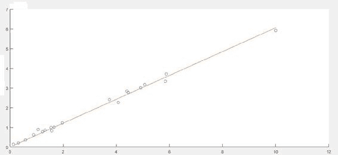

数据拟合是将一组输入数据训练神经网络，以产生相关的目标输出数据的过程。一旦神经网络完成数据拟合，它就形成了输入输出关系的泛化，并可以用于生成未曾训练过的输入数据的输出。

车辆的燃油消耗一直是全球主要制造商研究的课题。在一个以石油补给问题和更严重的空气污染问题为特征的时代，车辆的燃油消耗已成为一个关键因素。在本例中，我们将构建一个神经网络，目的是根据某些特征预测车辆的燃油消耗。

为此，使用我们在第三章的示例中已经使用过的 `ISLR` 包中的 `Auto` 数据集，*使用多层神经网络进行深度学习*。`Auto` 数据集包含 392 辆车的油耗、马力和其他信息。它是一个数据框，包含 392 个观测值，涉及以下九个变量：

+   `mpg`：每加仑英里数

+   `cylinders`：气缸数量（4 到 8 个之间）

+   `displacement`：发动机排量（立方英寸）

+   `horsepower`：发动机马力

+   `weight`：车辆重量（磅）

+   `acceleration`：从 0 加速到 60 英里每小时的时间（秒）

+   `year`：型号年份（模 100）

+   `origin`：汽车的来源（美国、欧洲、日本）

+   `name`：车辆名称

以下是我们将在本示例中使用的代码：

```py
###########################################################################
########Chapter 5 - Introduction to Neural Networks - using R############## 
##########R program to build, train and test neural networks############### 
###########################################################################
library("neuralnet")
library("ISLR")

data = Auto
View(data)

plot(data$weight, data$mpg, pch=data$origin,cex=2)
par(mfrow=c(2,2))
plot(data$cylinders, data$mpg, pch=data$origin,cex=1)
plot(data$displacement, data$mpg, pch=data$origin,cex=1)
plot(data$horsepower, data$mpg, pch=data$origin,cex=1)
plot(data$acceleration, data$mpg, pch=data$origin,cex=1)

mean_data <- apply(data[1:6], 2, mean)
sd_data <- apply(data[1:6], 2, sd)

data_scaled <- as.data.frame(scale(data[,1:6],center = mean_data, scale = sd_data))
head(data_scaled, n=20)

index = sample(1:nrow(data),round(0.70*nrow(data)))
train_data <- as.data.frame(data_scaled[index,])
test_data <- as.data.frame(data_scaled[-index,])

n = names(data_scaled)
f = as.formula(paste("mpg ~", paste(n[!n %in% "mpg"], collapse = " + ")))

net = neuralnet(f,data=train_data,hidden=3,linear.output=TRUE)
plot(net)

predict_net_test <- compute(net,test_data[,2:6])
MSE.net <- sum((test_data$mpg - predict_net_test$net.result)²)/nrow(test_data)

Lm_Mod <- lm(mpg~., data=train_data)
summary(Lm_Mod)
predict_lm <- predict(Lm_Mod,test_data)
MSE.lm <- sum((predict_lm - test_data$mpg)²)/nrow(test_data)

par(mfrow=c(1,2))
plot(test_data$mpg,predict_net_test$net.result,col='black',main='Real vs predicted for neural network',pch=18,cex=4)
abline(0,1,lwd=5)
plot(test_data$mpg,predict_lm,col='black',main='Real vs predicted for linear regression',pch=18,cex=4)
abline(0,1,lwd=5)
###########################################################################
```

正如以往一样，我们将逐行分析代码，详细解释应用于捕捉结果的所有特性。

```py
library("neuralnet")
library("ISLR")
```

初始代码的前两行用于加载运行分析所需的库。

请记住，要安装在 R 的初始发行版中没有的库，必须使用`install.package`函数。这是安装包的主要函数。它接受一个名称向量和一个目标库，从仓库中下载包并进行安装。这个函数只需要使用一次，而不是每次运行代码时都调用。

`neuralnet` 库用于通过反向传播、**弹性反向传播** (**RPROP**)（带或不带权重回溯）或修改后的**全局收敛版本** (**GRPROP**)训练神经网络。该函数允许通过自定义选择误差和激活函数来灵活设置。此外，还实现了广义权重的计算。

`ISLR` 库包含了一组可以自由使用的数据集，供我们在示例中使用。这是一系列在研究中心进行的重要研究中收集的数据。

```py
data = Auto
View(data)
```

此命令加载`Auto`数据集，正如我们预期的那样，它包含在`ISLR`库中，并将其保存到给定的数据框中。使用`View`函数查看任意 R 对象的结构的紧凑显示。以下截图显示了`Auto`数据集中的一些数据：

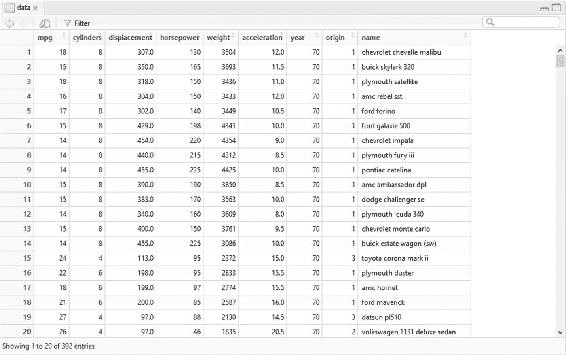

如你所见，该数据库由 392 行和 9 列组成。行表示从 1970 到 1982 年期间的 392 辆商用车。列则表示为每辆车收集的 9 个特征，依次为：`mpg`、`cylinders`、`displacement`、`horsepower`、`weight`、`acceleration`、`year`、`origin`和`name`。

# 探索性分析

在开始通过构建和训练神经网络进行数据分析之前，我们进行探索性分析，以了解数据如何分布，并提取初步知识。

我们可以通过绘制预测因子与目标变量之间的图表来开始我们的探索性分析。在这方面，我们回顾一下我们的分析中的预测因子变量包括：`cylinders`、`displacement`、`horsepower`、`weight`、`acceleration`、`year`、`origin`和`name`。目标变量是`mpg`，它包含 392 辆样本车的每加仑英里数数据。

假设我们想要检查来自三个不同地区的汽车的重量和油耗，如下图所示，并使用以下代码：

```py
plot(data$weight, data$mpg, pch=data$origin,cex=2)
```

为了绘制图表，我们使用了`plot()`函数，指定* x *轴（`weight`）、* y *轴（`mpg`），并最终基于哪个变量对数据进行分组（`origin`），如下面的图表所示：

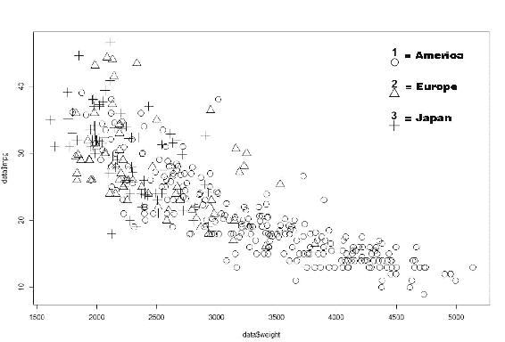

记住，`origin`列中的数字对应以下地区：1=美国，2=欧洲，3=日本）。通过对前述图表的分析，我们发现油耗随着重量的增加而增加。我们要记住，目标变量衡量的是每加仑油行驶的英里数，即多少英里可以行驶一加仑的油。因此，mpg 值（每加仑英里数）越大，油耗越低。

另一个来自图表分析的观察是，美国生产的汽车较重。事实上，在图表的右侧（对应较高的重量值）只出现了该地区生产的汽车。

最后，如果我们将分析集中在图表的左侧，即对应最低油耗的上部，我们会发现大多数情况下是日本和欧洲的汽车。总之，我们可以得出结论，油耗最低的汽车是日本制造的。

现在，让我们看看其他的图表，即如果我们将剩余的数值型预测因子（`cylinders`、`displacement`、`horsepower`和`acceleration`）与目标（`mpg`）进行比较，我们得到什么结果。

```py
par(mfrow=c(2,2))
plot(data$cylinders, data$mpg, pch=data$origin,cex=1)
plot(data$displacement, data$mpg, pch=data$origin,cex=1)
plot(data$horsepower, data$mpg, pch=data$origin,cex=1)
plot(data$acceleration, data$mpg, pch=data$origin,cex=1)
```

出于空间考虑，我们决定将四个图表合并为一个图表。R 语言使得将多个图表组合成一个总图变得简单，使用`par()`函数即可。通过使用`par()`函数，我们可以选择 mfrow=c(nrows, ncols)来创建一个 nrows x ncols 的图表矩阵，按行填充。例如，mfrow=c(3,2)选项创建一个 3 行 2 列的矩阵图表。此外，mfcol=c(nrows, ncols)选项则是按列填充矩阵。

在下图中显示了 4 个图表，排列成 2 行 2 列的矩阵：

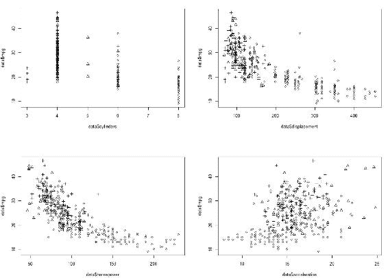

从前图的分析中，我们确认了之前提到的内容。我们可以注意到，马力较大的汽车油耗更高。同样的结论也适用于发动机排量；在这种情况下，排量较大的汽车油耗更高。再次强调，马力和排量较大的汽车多为美国生产。

相反，加速值较高的汽车通常有更低的油耗。这是因为这类车的重量较轻。通常来说，重型汽车加速较慢。

# 神经网络模型

在第二章，*神经网络中的学习过程*中，我们在构建网络之前进行了数据缩放。当时我们提到，训练神经网络之前对数据进行标准化是一个良好的实践。通过标准化，可以消除数据的单位，使得来自不同位置的数据能够轻松进行比较。

并非所有情况下都需要对数值数据进行标准化。然而，研究表明，当数值数据经过标准化时，神经网络的构建通常更高效，并且能够获得更好的预测效果。事实上，如果数值数据没有标准化，而两个预测变量的规模差异非常大，那么神经网络权重的变化对较大值的影响将更为显著。

有几种标准化技术；在第二章，*神经网络中的学习过程*中，我们采用了最小-最大标准化。在本章中，我们将采用 *Z* 分数标准化。该技术包括从每一列的每个值中减去该列的均值，然后将结果除以该列的标准差。实现这一点的公式如下：

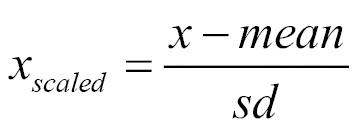

总结来说，*Z* 分数（也称为标准分数）表示观察值或数据相对于所观察或测量的平均值的标准差个数。大于均值的值有正的 *Z* 分数，而小于均值的值有负的 *Z* 分数。*Z* 分数是一个无单位的量，通过从单个粗略分数中减去总体均值，然后将差值除以总体的标准差得到。

在应用选择的标准化方法之前，你必须计算每个数据库列的均值和标准差。为此，我们使用 `apply` 函数。该函数返回一个向量、数组或列表，通过将函数应用于数组或矩阵的维度来获取值。让我们来理解所使用的参数的含义。

```py
mean_data <- apply(data[1:6], 2, mean)
sd_data <- apply(data[1:6], 2, sd)
```

第一行代码可以让我们计算每个变量的均值，然后进入第二行，计算每个变量的标准差。让我们看看如何使用`apply()`函数。`apply`函数的第一个参数指定了数据集，表示应用该函数的目标数据集，在我们的案例中是名为 data 的数据集。具体来说，我们只考虑了前六个数值型变量，其他变量将用于其他目的。第二个参数必须包含一个向量，给出应用函数时的下标。在我们的案例中，1 表示行，2 表示列。第三个参数必须包含要应用的函数；在我们的案例中，第一行是`mean()`函数，第二行是`sd()`函数。结果如下所示：

```py
> mean_data
 mpg    cylinders displacement   horsepower       weight 
 23.445918     5.471939   194.411990   104.469388  2977.584184 
acceleration
 15.541327
```

```py
> sd_data
 mpg    cylinders displacement    horsepower       weight 
 7.805007     1.705783    04.644004     38.491160   849.402560 
acceleration
 2.758864
```

为了规范化数据，我们使用`scale()`函数，这是一种通用函数，其默认方法会对数字矩阵的列进行居中和/或缩放：

```py
data_scaled <- as.data.frame(scale(data[,1:6],center = mean_data, scale = sd_data))
```

让我们来看一下经过规范化处理的数据：

```py
head(data_scaled, n=20)
```

结果如下：

```py
> head(data_scaled, n=20)
 mpg  cylinders displacement horsepower     weight acceleration
1  -0.69774672  1.4820530   1.07591459  0.6632851  0.6197483  -1.28361760
2  -1.08211534  1.4820530   1.48683159  1.5725848  0.8422577  -1.46485160
3  -0.69774672  1.4820530   1.18103289  1.1828849  0.5396921  -1.64608561
4  -0.95399247  1.4820530   1.04724596  1.1828849  0.5361602  -1.28361760
5  -0.82586959  1.4820530   1.02813354  0.9230850  0.5549969  -1.82731962
6  -1.08211534  1.4820530   2.24177212  2.4299245  1.6051468  -2.00855363
7  -1.21023822  1.4820530   2.48067735  3.0014843  1.6204517  -2.37102164
8  -1.21023822  1.4820530   2.34689042  2.8715843  1.5710052  -2.55225565
9  -1.21023822  1.4820530   2.49023356  3.1313843  1.7040399  -2.00855363
10 -1.08211534  1.4820530   1.86907996  2.2220846  1.0270935  -2.55225565
11 -1.08211534  1.4820530   1.80218649  1.7024847  0.6892089  -2.00855363
12 -1.21023822  1.4820530   1.39126949  1.4426848  0.7433646  -2.73348966
13 -1.08211534  1.4820530   1.96464205  1.1828849  0.9223139  -2.18978763
14 -1.21023822  1.4820530   2.49023356  3.1313843  0.1276377  -2.00855363
15  0.07099053 -0.8629108  -0.77799001 -0.2460146 -0.7129531  -0.19621355
16 -0.18525522  0.3095711   0.03428778 -0.2460146 -0.1702187  -0.01497955
17 -0.69774672  0.3095711   0.04384399 -0.1940546 -0.2396793  -0.01497955
18 -0.31337809  0.3095711   0.05340019 -0.5058145 -0.4598340   0.16625446
19  0.45535916 -0.8629108  -0.93088936 -0.4278746 -0.9978592  -0.37744756
20  0.32723628 -0.8629108  -0.93088936 -1.5190342 -1.3451622   1.79736053
```

现在我们来将数据分割为训练集和测试集：

```py
index = sample(1:nrow(data),round(0.70*nrow(data)))
train_data <- as.data.frame(data_scaled[index,])
test_data <- as.data.frame(data_scaled[-index,])
```

在刚才建议的第一行代码中，数据集被按 70:30 的比例拆分，目的是使用 70%的数据训练网络，剩下的 30%用于测试网络。在第二行和第三行中，名为 data 的数据框被细分为两个新的数据框，分别叫做`train_data`和`test_data`。现在，我们需要构建提交给网络的函数：

```py
n = names(data_scaled)
f = as.formula(paste("mpg ~", paste(n[!n %in% "mpg"], collapse = " + ")))
```

在第一行，我们通过使用`names()`函数来恢复`data_scaled`数据框中的所有变量名。在第二行，我们构建了一个公式，用于训练神经网络。这个公式代表了什么？

使用`neuralnet()`函数拟合的模型以紧凑的符号形式表示。~运算符是构建这类模型的基础。像*y* ~ model 这样的表达式表示响应*y*是通过符号表示的预测变量 model 进行建模的。这样的模型由一系列通过+运算符分隔的项组成。每一项由变量和因子名通过:运算符分隔。这样的项表示出现在该项中的所有变量和因子的交互作用。让我们来看一下我们设置的公式：

```py
> f
mpg ~ cylinders + displacement + horsepower + weight + acceleration
```

现在我们可以构建并训练神经网络了。

在第三章，*使用多层神经网络进行深度学习*中，我们提到，为了选择最佳的神经元数量，我们需要知道：

+   神经元数量过少会导致系统误差较大，因为预测因子可能对较少的神经元来说过于复杂，无法捕捉。

+   神经元数量过多会导致过拟合训练数据，且无法很好地泛化。

+   每个隐藏层中的神经元数量应该介于输入层和输出层的大小之间，可能是它们的均值。

+   每个隐藏层中的神经元数量不应超过输入神经元数量的两倍，因为此时你可能已经严重过拟合。

在此情况下，我们有五个输入变量（`cylinders`、`displacement`、`horsepower`、`weight` 和 `acceleration`），以及一个输出变量（`mpg`）。我们选择在隐藏层设置三个神经元。

```py
net = neuralnet(f,data=train_data,hidden=3,linear.output=TRUE)
```

hidden 参数接受一个包含每个隐藏层神经元数量的向量，而 `linear.output` 参数用于指定我们是进行回归（`linear.output=TRUE`）还是分类（`linear.output=FALSE`）。

`neuralnet()` 中使用的算法默认基于弹性反向传播算法，不包括权重回溯，并且额外修改了一个学习率，即与最小绝对梯度（`sag`）相关的学习率或最小学习率（`slr`）本身。`neuralnet()` 函数返回一个 `nn` 类的对象。`nn` 类的对象是一个列表，最多包含以下表格中显示的组件：

| **组件** | **描述** |
| --- | --- |
| `call` | 匹配的调用。 |
| `response` | 从 `data` 参数中提取。 |
| `covariate` | 从数据参数中提取的变量。 |
| `model.list` | 一个列表，包含从 `formula` 参数中提取的协变量和 `response` 变量。 |
| `err.fct` | 错误函数。 |
| `act.fct` | 激活函数。 |
| `data` | 数据参数。 |
| `net.result` | 一个列表，包含每次重复的神经网络整体结果。 |
| `weights` | 一个列表，包含每次重复的神经网络拟合权重。 |
| `generalized.weights` | 一个列表，包含每次重复神经网络的广义权重。 |
| `result.matrix` | 一个矩阵，包含每次重复所达到的阈值、所需步骤、误差、AIC 和 BIC（如果已计算），以及权重。每一列表示一次重复。 |
| `startweights` | 一个列表，包含每次重复神经网络的起始权重。 |

要生成模型结果的摘要，我们使用 `summary()` 函数：

```py
> summary(net)
 Length Class      Mode 
call                   5   -none-     call 
response             274   -none-     numeric
covariate           1370   -none-     numeric
model.list             2   -none-     list 
err.fct                1   -none-     function
act.fct                1   -none-     function
linear.output          1   -none-     logical
data                   6   data.frame list 
net.result             1   -none-     list 
weights                1   -none-     list 
startweights           1   -none-     list 
generalized.weights    1   -none-     list 
result.matrix         25   -none-     numeric 
```

对于神经网络模型的每个组件，显示了三个特征：

+   **长度**：这是组件的长度，即其中包含多少个此类型的元素。

+   **类别**：此项包含组件类别的具体说明。

+   **模式**：这是组件的类型（数值、列表、函数、逻辑等）。

要绘制带有每个连接权重的模型的图形表示，我们可以使用`plot()`函数。`plot()`函数是 R 中用于表示对象的通用函数。通用函数意味着它适用于不同类型的对象，从变量到表格，再到复杂的函数输出，产生不同的结果。应用于名义变量时，它将生成条形图；应用于序数变量时，它将生成散点图；如果是相同的变量，但经过制表，即频率分布，它将生成直方图。最后，应用于两个变量，一个名义变量和一个序数变量，它将生成箱线图。

```py
plot(net)
```

神经网络图显示在下图中：

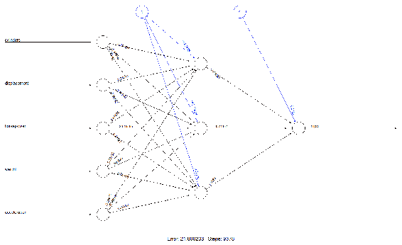

在前面的图中，黑色线条（这些线条从输入节点开始）显示了每一层之间的连接以及每个连接上的权重，而蓝色线条（这些线条从偏置节点开始，偏置节点通过数字 1 来区分）则显示了在每一步中添加的偏置项。可以把偏置看作是线性模型的截距。

尽管随着时间的推移我们已经了解了许多神经网络基础的机制，但在许多方面，我们构建和训练的模型仍然是一个“黑箱”。拟合、权重和模型本身并不够清晰。我们可以满意地认为训练算法是收敛的，然后模型就可以开始使用了。

我们可以在视频中打印权重和偏置：

```py
> net$result.matrix
 1
error                      21.800203210980
reached.threshold           0.009985137179
steps                    9378.000000000000
Intercept.to.1layhid1      -1.324633695625
cylinders.to.1layhid1       0.291091600669
displacement.to.1layhid1   -2.243406161080
horsepower.to.1layhid1      0.616083122568
weight.to.1layhid1          1.292334492287
acceleration.to.1layhid1   -0.286145921068
Intercept.to.1layhid2     -41.734205163355
cylinders.to.1layhid2      -5.574494023650
displacement.to.1layhid2   33.629686446649
horsepower.to.1layhid2    -28.185856598271
weight.to.1layhid2        -50.822997942647
acceleration.to.1layhid2   -5.865256284330
Intercept.to.1layhid3       0.297173606203
cylinders.to.1layhid3       0.306910802417
displacement.to.1layhid3   -5.897977831914
horsepower.to.1layhid3      0.379215333054
weight.to.1layhid3          2.651777936654
acceleration.to.1layhid3   -1.035618563747
Intercept.to.mpg           -0.578197055155
1layhid.1.to.mpg           -3.190914666614
1layhid.2.to.mpg            0.714673177354
1layhid.3.to.mpg            1.958297807266
```

如图所示，这些值与我们在网络图中看到的值相同。例如，`cylinders.to.1layhid1 = 0.291091600669`是输入“气缸数”与隐层第一个节点之间连接的权重。

现在我们可以使用网络进行预测。为此，我们已将`test_data`数据框中的 30%的数据预留出来。现在是使用它的时候了。

```py
predict_net_test <- compute(net,test_data[,2:6])
```

在我们的例子中，我们将这个函数应用于`test_data`数据集，仅使用`2`到`6`列，代表网络的输入变量。为了评估网络的性能，我们可以使用**均方误差**（**MSE**）作为衡量我们的预测与实际数据之间差距的标准。

```py
MSE.net <- sum((test_data$mpg - predict_net_test$net.result)²)/nrow(test_data)
```

这里`test_data$mpg`是实际数据，`predict_net_test$net.result`是分析目标的预测数据。以下是结果：

```py
> MSE.net
[1] 0.2591064572
```

看起来结果不错，但我们应该与什么进行比较呢？为了了解网络预测的准确性，我们可以构建一个线性回归模型：

```py
Lm_Mod <- lm(mpg~., data=train_data)
summary(Lm_Mod)
```

我们使用`lm`函数构建了一个线性回归模型。这个函数用于拟合线性模型。它可以用于执行回归、单层方差分析和协方差分析。为了生成模型拟合结果的摘要，我们使用了`summary()`函数，返回以下结果：

```py
> summary(Lm_Mod)
Call:
lm(formula = mpg ~ ., data = train_data)
Residuals:
 Min          1Q      Median          3Q         Max
-1.48013031 -0.34128989 -0.04310873  0.27697893  1.77674878
Coefficients:
 Estimate  Std. Error  t value        Pr(>|t|) 
(Intercept)   0.01457260  0.03268643  0.44583        0.656080 
cylinders    -0.14056198  0.10067461 -1.39620        0.163809 
displacement  0.06316568  0.13405986  0.47118        0.637899 
horsepower   -0.16993594  0.09180870 -1.85098        0.065273 . 
weight       -0.59531412  0.09982123 -5.96380 0.0000000077563 ***
acceleration  0.03096675  0.05166132  0.59942        0.549400 
---
Signif. codes:  0 ‘***’ 0.001 ‘**’ 0.01 ‘*’ 0.05 ‘.’ 0.1 ‘ ’ 1
Residual standard error: 0.5392526 on 268 degrees of freedom
Multiple R-squared:  0.7183376, Adjusted R-squared:  0.7130827
F-statistic: 136.6987 on 5 and 268 DF,  p-value: < 0.00000000000000022204
```

现在我们使用`test_data`数据框中的数据来进行线性回归模型的预测：

```py
predict_lm <- predict(Lm_Mod,test_data)
```

最后，我们计算回归模型的均方误差（MSE）：

```py
MSE.lm <- sum((predict_lm - test_data$mpg)²)/nrow(test_data)
```

以下是结果：

```py
> MSE.lm
[1] 0.3124200509
```

从两种模型（神经网络模型与线性回归模型）之间的比较中可以看出，神经网络再次获胜（0.26 与 0.31）。

现在，我们通过绘制图形进行视觉对比，先是神经网络的实际值与预测值，然后是线性回归模型的：

```py
par(mfrow=c(1,2))

plot(test_data$mpg,predict_net_test$net.result,col='black',main='Real vs predicted for neural network',pch=18,cex=4)
abline(0,1,lwd=5)

plot(test_data$mpg,predict_lm,col='black',main='Real vs predicted for linear regression',pch=18,cex=4)
abline(0,1,lwd=5)
```

神经网络模型（左侧）与线性回归模型（右侧）在测试集上的表现对比如下图所示：

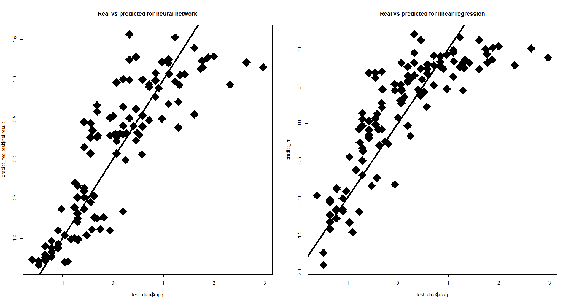

如我们所见，神经网络的预测值比线性回归模型的更集中在直线周围，尽管你可能没有注意到很大差异。

# 使用神经网络分类乳腺癌

乳房由一组腺体和脂肪组织组成，位于皮肤和胸壁之间。实际上，它不是一个单一的腺体，而是一组叫做小叶的腺体结构组合而成的一个叶。在每个乳房中，有 15 到 20 个小叶。乳汁通过小管道（称为乳管）从小叶流向乳头。

乳腺癌是一个潜在的严重疾病，如果长时间没有被发现并治疗。它是由乳腺中一些细胞的失控增殖所引起，这些细胞转化为恶性细胞。这意味着它们有能力从生成它们的组织中脱离，侵入周围组织，最终扩散到身体的其他器官。理论上，癌症可以从所有类型的乳腺组织中形成，但最常见的类型是来自腺体细胞或形成导管壁的细胞。

本例的目标是识别一系列良性或恶性类别中的每一个。为此，我们将使用名为`BreastCancer`的数据集（威斯康星乳腺癌数据库），该数据集包含在`mlbench`包中。这些数据来源于 UCI 机器学习数据库，在 DNA 样本定期到达时，沃尔伯格博士会报告他的临床案例。因此，数据库反映了这些数据的时间顺序分组。这个分组信息已经被从数据本身中移除。每个变量（除了第一个）被转换成了 11 个基本的数值属性，取值范围从 0 到 10。有 16 个缺失值。

数据框包含 699 个观察值，涉及 11 个变量——其中 1 个是字符变量，9 个是有序或名义变量，1 个是目标类别：

+   `Id`: 样本编码号

+   `Cl.thickness`: 聚集厚度

+   `Cell.size`: 细胞大小均匀性

+   `Cell.shape`: 细胞形态均匀性

+   `Marg.adhesion`: 边缘粘附

+   `Epith.c.size`: 单一上皮细胞大小

+   `Bare.nuclei`: 光核

+   `Bl.cromatin`: 平淡染色质

+   `Normal.nucleoli`: 正常核仁

+   `Mitoses`: 有丝分裂

+   `Class`: 类别

如前所述，此示例的目标是识别一系列良性或恶性类别中的每一个。以下是我们将在此示例中使用的代码：

```py
###########################################################################
########Chapter 5 - Introduction to Neural Networks - using R############## 
####################Classifing breast cancer with R######################## 
########################################################################### 
library("mlbench")
library(neuralnet)

data(BreastCancer)
summary(BreastCancer)

mvindex = unique (unlist (lapply (BreastCancer, function (x) which (is.na (x)))))
data_cleaned <- na.omit(BreastCancer) 
summary(data_cleaned)

boxplot(data_cleaned[,2:10])
hist(as.numeric(data_cleaned$Mitoses))

par(mfrow=c(3, 3))
hist(as.numeric(data_cleaned$Cl.thickness))
hist(as.numeric(data_cleaned$Cell.size))
hist(as.numeric(data_cleaned$Cell.shape))
hist(as.numeric(data_cleaned$Marg.adhesion))
hist(as.numeric(data_cleaned$Epith.c.size))
hist(as.numeric(data_cleaned$Bare.nuclei))
hist(as.numeric(data_cleaned$Bl.cromatin))
hist(as.numeric(data_cleaned$Normal.nucleoli))
hist(as.numeric(data_cleaned$Mitoses))

str(data_cleaned)
input<-data_cleaned[,2:10]
indx <- sapply(input, is.factor)
input <- as.data.frame(lapply(input, function(x) as.numeric(as.character(x))))

max_data <- apply(input, 2, max)
min_data <- apply(input, 2, min)
input_scaled <- as.data.frame(scale(input,center = min_data, scale = max_data - min_data))
View(input_scaled)

Cancer<-data_cleaned$Class
Cancer<-as.data.frame(Cancer)
Cancer<-with(Cancer, data.frame(model.matrix(~Cancer+0)))

final_data<-as.data.frame(cbind(input_scaled,Cancer))

index = sample(1:nrow(final_data),round(0.70*nrow(final_data)))
train_data <- as.data.frame(final_data[index,])
test_data <- as.data.frame(final_data[-index,])

n = names(final_data[1:9])
f = as.formula(paste("Cancerbenign + Cancermalignant ~", paste(n, collapse = " + ")))

net = neuralnet(f,data=train_data,hidden=5,linear.output=FALSE)
plot(net)

predict_net_test <- compute(net,test_data[,1:9])
predict_result<-round(predict_net_test$net.result, digits = 0)
net.prediction = c("benign", "malignant")[apply(predict_result, 1, which.max)]
predict.table = table(data_cleaned$Class[-index], net.prediction)
predict.table

library(gmodels)
CrossTable(x = data_cleaned$Class[-index], y = net.prediction,
 prop.chisq=FALSE)
###########################################################################
```

我们开始逐行分析代码，详细解释捕获结果所应用的所有特性。

```py
library("mlbench")
library("neuralnet")
```

初始代码的前两行用于加载运行分析所需的库。

请记住，要安装 R 的初始分布中没有的库，您必须使用 `install.package` 函数。这是安装包的主要函数。它接受名称向量和目标库，从存储库下载包并安装它们。此函数应仅使用一次，而不是每次运行代码时都使用。

`mlbench` 库包含一系列人工和真实世界的机器学习基准问题，包括来自 UCI 仓库的几个数据集。

`neuralnet` 库用于使用反向传播、带或不带权重回溯的 RPROP，或修改后的 GRPROP 训练神经网络。该函数通过自定义选择误差和激活函数实现灵活设置。此外，实现了广义权重的计算。从官方文档中提取的 nnet 包简要描述显示在以下表格中：

| `neuralnet`：神经网络的训练 |
| --- |
| **描述**： |
| 使用反向传播、弹性反向传播（Riedmiller, 1994），或不带权重回溯（Riedmiller and Braun, 1993），或由 Anastasiadis 等人修改的全局收敛版本（2005）训练神经网络。该包允许通过自定义选择误差和激活函数进行灵活设置。 |
| **细节**： |

| 包：`neuralnet` 类型：包

版本：1.33

日期：2016-08-05

许可证：GPL-2 |

| **作者**： |
| --- |

| Stefan Fritsch Frauke Guenther

Marc Suling

Sebastian M. Mueller |

回到代码，此时我们需要加载要分析的数据：

```py
data(BreastCancer)
```

使用此命令，我们上传名为 `BreastCancer` 的数据集，如前所述，在 `mlbench` 库中。

# 探索性分析

在通过构建和训练神经网络进行数据分析之前，我们进行探索性分析，以了解数据如何分布并提取初步知识。

```py
summary(BreastCancer)
```

使用 `summary()` 函数，我们将看到一个简要的摘要。

请记住，`summary()` 函数是用于生成各种模型拟合函数结果摘要的通用函数。该函数调用依赖于第一个参数的类别的特定方法。

在这种情况下，该函数被应用于数据框架，并且结果显示在以下截图中：

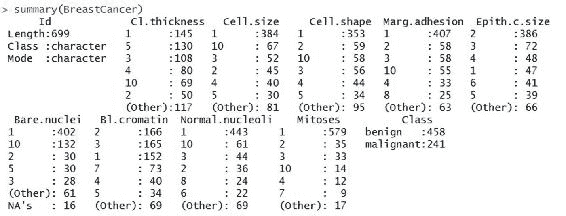

`summary()` 函数返回每个变量的统计信息。特别地，它对于突出显示 `class` 变量的结果非常有用，该变量包含肿瘤的诊断信息。在此案例中，检测到 458 个良性 `class` 和 241 个恶性 `class`。另一个值得注意的特征是 Bare.nuclei 变量。对于该变量，检测到 16 个缺失值。

缺失值是指其值未知的值。缺失值在 R 中由 `NA` 符号表示。`NA` 是一个特殊的值，其属性不同于其他值。`NA` 是 R 中少数几个保留字之一；你不能将其他任何事物命名为 `NA`。例如，当你读取包含空单元格的 Excel 表格时，`NA` 可能会出现。当你尝试进行某些非法或无意义的操作时，也会看到 `NA`。缺失值不一定是错误的结果；在现实生活中，缺失值通常是由于未检测到某些数据。

一个问题自然而然地出现了：我们需要担心缺失值的存在吗？不幸的是，答案是肯定的，这主要是因为几乎在对 `NA` 进行的每个操作中，都会产生一个 `NA`。因此，数据集中缺失值的存在可能会导致我们后续计算中出现错误。这就是为什么我们必须删除缺失值的原因。

要删除缺失值，我们必须先识别它们。`is.na()` 函数可以帮助我们找到缺失值；该函数返回一个与其参数长度相同的逻辑向量，对于缺失值为*T*，对于非缺失值为*F*。通常我们希望知道缺失值的索引，`which()` 函数可以帮助我们实现这一点。要找到数据框中所有包含至少一个 `NA` 的行，可以尝试以下方法：

```py
mvindex = unique (unlist (lapply (BreastCancer, function (x) which (is.na (x)))))
```

`lapply()` 函数对每一列应用指定的函数，并返回一个列表，其中的第 *i* 个元素是包含第 *i* 列缺失值元素索引的向量。`unlist()` 函数将该列表转换为向量，而 `unique()` 函数则去除重复项。

现在我们知道了缺失值（`NA`）出现的行数，正如我们接下来看到的：

```py
> mvindex
 [1] 24 41 140 146 159 165 236 250 276 293 295 298 316 322 412 618
```

现在我们知道数据库中有缺失值，并且知道它们的位置。接下来，我们只需将这些行从原始数据集中删除。为此，我们可以使用以下函数：

+   `na.omit`：删除所有包含缺失值的行，并将其永久遗忘。

+   `na.exclude`：删除包含缺失值的行，但会记录这些行的位置，以便在进行预测时，得到一个与原始响应长度相同的向量。

我们将使用第一种方法，以便将缺失值永久删除：

```py
data_cleaned <- na.omit(BreastCancer) 
```

为了确认已经删除了缺失值所在的行，再次应用 `summary()` 函数：

```py
summary(data_cleaned)
```

结果显示在以下截图中：

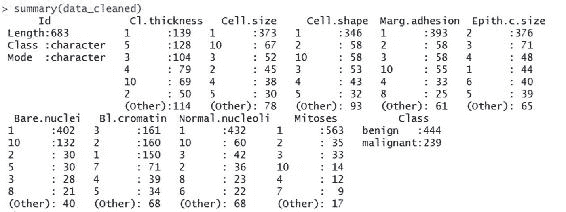

如你所见，现在已经没有缺失值了。

现在，让我们进入探索性分析。我们可以做的第一件事是绘制变量的箱线图。通过查看`summary()`函数的结果，已经初步了解了一些情况。自然地，我们将只关注数值型变量。

```py
boxplot(data_cleaned[,2:10])
```

在下图中，展示了清洗过的数据集（`data_cleaned`）中数值变量（从第 2 个到第 10 个）的箱线图：

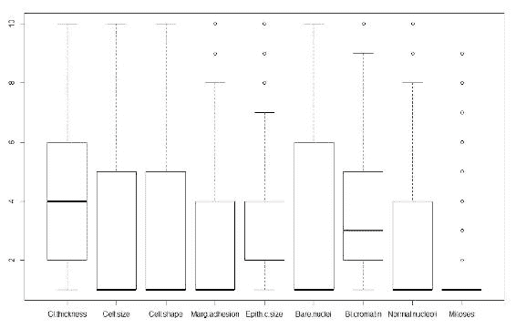

从前一个图形的分析中，我们可以注意到几个变量有异常值，其中`Mitoses`变量的异常值数量最多。

异常值在数值上与其余数据显著不同。包含异常值的样本数据所得出的统计结果可能会产生误导。

为了更好地识别异常值，我们可以绘制数据库中各变量的直方图。直方图是数值数据分布的准确图形表示。它是连续变量概率分布的估计。构建直方图的第一步是指定值的范围（即将整个值域划分为一系列区间），然后统计每个区间内有多少值。直方图的区间通常是连续的、互不重叠的变量区间。区间必须是相邻的，且通常大小相等。通过直方图，我们可以看到数据分布的中心在哪里，数据如何围绕这个中心分布，以及可能存在的异常值位置。

在 R 环境中，我们可以简单地使用`hist()`函数绘制直方图，该函数计算给定数据值的直方图。我们必须将数据集的名称放在该函数的括号内。为了在同一窗口绘制多个图形，我们将使用在前面的示例中已经使用过的`par()`函数：

```py
par(mfrow=c(3, 3))
hist(as.numeric(data_cleaned$Cl.thickness))
hist(as.numeric(data_cleaned$Cell.size))
hist(as.numeric(data_cleaned$Cell.shape))
hist(as.numeric(data_cleaned$Marg.adhesion))
hist(as.numeric(data_cleaned$Epith.c.size))
hist(as.numeric(data_cleaned$Bare.nuclei))
hist(as.numeric(data_cleaned$Bl.cromatin))
hist(as.numeric(data_cleaned$Normal.nucleoli))
hist(as.numeric(data_cleaned$Mitoses))
```

由于`hist()`函数需要一个向量作为参数，因此我们使用`as.numeric()`函数将数据集列中的值转换为数值型向量。该函数创建或强制转换为`numeric`类型的对象。在接下来的图形中，展示了清洗过的数据集（`data_cleaned`）中数值变量（从第 2 个到第 10 个）的直方图：

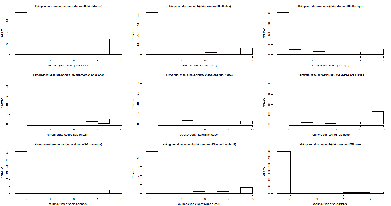

从直方图的分析中，可以注意到一些变量存在异常值。

# 神经网络模型

和之前的示例一样，在构建和训练网络之前，我们必须先进行数据标准化。在本例中，我们将采用最小-最大标准化方法。

请记住，在训练神经网络之前，进行数据标准化是良好的实践。通过标准化，可以消除数据的单位，使来自不同位置的数据可以轻松进行比较。

在我们开始之前，使用`str()`函数做一个进一步的检查。这个函数提供了对象内部结构的紧凑显示，是一种诊断功能，并且是`summary()`函数的替代方法。理想情况下，每个基本结构仅显示一行。它特别适合紧凑地显示（可能嵌套的）列表的（简化）内容。其目的是为任何 R 对象提供合理的输出。

```py
str(data_cleaned)
```

结果显示在以下截图中：


正如可以注意到的，变量作为因子存在。我们需要对其进行转换以便于计算。

```py
input<-data_cleaned[,2:10]
indx <- sapply(input, is.factor)
input <- as.data.frame(lapply(input, function(x) as.numeric(as.character(x))))
```

我们首先识别了因子类型的变量，然后将它们转换为数值类型。现在我们可以进行标准化。

在本示例中，我们将使用最小-最大方法（通常称为特征缩放）将所有数据缩放到* [0, 1] * 范围内。实现此目的的公式如下：


在应用选择的标准化方法之前，您必须计算每个数据库列的最小值和最大值。为此，我们使用`apply()`函数。此函数返回一个向量、数组或值的列表，通过将函数应用于数组或矩阵的边界来获得这些值。让我们来理解所使用参数的含义。

```py
max_data <- apply(data_cleaned[,2:10], 2, max)
```

`apply`函数的第一个参数指定了要应用函数的数据集，在我们的案例中是名为`data`的数据集。第二个参数必须包含一个向量，指定函数将应用于的子脚标。在我们的案例中，1 表示行，2 表示列。第三个参数必须包含要应用的函数；在我们的案例中是`max`函数。接下来，我们将计算每一列的最小值：

```py
min_data <- apply(data_cleaned[,2:10], 2, min)
```

最后，为了对数据进行标准化，我们使用`scale()`函数，这是一个通用函数，其默认方法会对数值矩阵的列进行居中和/或缩放，代码如下所示：

```py
data_scaled <- scale(data_cleaned[,2:10],center = min_data, scale = max_data - min_data)
```

为了确认数据的标准化，我们来看一下我们创建的新矩阵的前 20 行。为此，我们将使用`View()`函数：

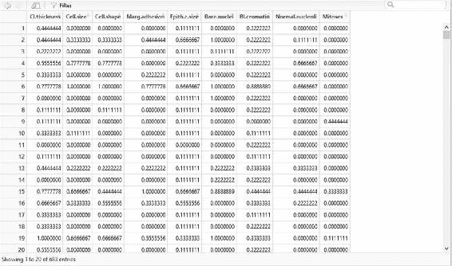

如您所见，现在数据在零和一之间。此时，我们重新构建数据集，加入我们的目标变量（即`class`变量），它表示癌症的诊断结果（`良性`或`恶性`）。这个话题需要我们的关注：正如我们之前所看到的，这个变量（`class`）是类别型的，特别是在数据框中它作为因子存在，因此为了正确地在网络中使用它，我们必须对其进行转换。我们的目标是一个二分类变量（只有两个值：`良性`和`恶性`），因此它可以轻松地转换为两个哑变量。

哑变量是取值为`0`或`1`的变量，用来指示某些类别效应的缺失或存在，这些效应可能会影响结果。

我们将做的是创建两个新的变量（`Cancerbenign`和`Cancermalignant`），从表示目标的`Class`变量开始。`Cancerbenign`变量将在`Class`变量中每次出现`benign`值时赋值为 1，而在其他情况下赋值为 0。相反，`Cancermalignant`变量将在`Class`变量中每次出现`malignant`值时赋值为 1，而在其他情况下赋值为 0。

```py
Cancer<-data_cleaned$Class
Cancer<-as.data.frame(Cancer)
Cancer<-with(Cancer, data.frame(model.matrix(~Cancer+0)))
```

为了获得两个新的虚拟变量，我们使用了`model.matrix()`函数。该函数通过扩展因子为一组虚拟变量（根据对比方式），并类似地扩展交互作用，来创建一个模型矩阵。最后，我们将新变量添加到数据集中：

```py
final_data<-as.data.frame(cbind(input_scaled,Cancer))
```

训练网络的时刻已经到来。

# 网络训练阶段

人工神经网络由并行运行的简单元素组成。网络元素之间的连接至关重要，因为它们决定了网络的功能。这些连接通过其权重影响结果，而权重是在神经网络训练阶段调节的。下图展示了串行和并行处理的比较：

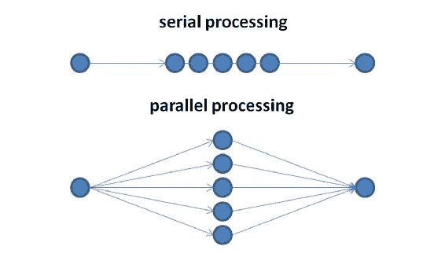

然后，在训练阶段，通过更改连接权重来调节网络，使得特定的输入能引导到特定的输出。例如，通过比较输出（我们实际计算的结果）和目标（我们希望得到的结果），直到网络输出与目标匹配，从而调整网络。为了获得足够可靠的结果，需要许多输入/目标对来形成网络。下图展示了训练阶段的简单流程图：


这些权重调整的方式由我们采用的具体算法决定。在强调算法在网络训练中的重要性后，必须特别关注提供给网络的数据准备。

在网络训练过程中，必须调整权重和偏置，以优化网络的性能。这是整个过程中的最重要阶段，因为网络越好，通用化能力在处理新的、未知的数据时表现越好。在这个阶段，随机抽取一部分收集到的数据（通常是 70%的可用数据）。

在神经网络训练后，我们可以使用该网络，在这一阶段，随机抽取一部分收集到的数据（通常是 30%的可用数据）传递给网络进行测试。然后，神经网络对象可以保存，并且在任何新数据上多次使用。下图展示了原始数据集是如何被划分的：

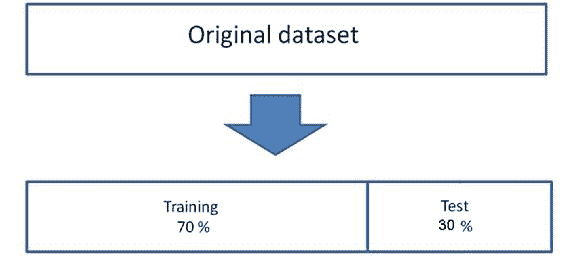

这段代码中的数据划分如下：

```py
index = sample(1:nrow(final_data),round(0.70*nrow(final_data)))
train_data <- as.data.frame(final_data[index,])
test_data <- as.data.frame(final_data[-index,])
```

在刚刚提到的代码的第一行中，数据集被分割为 70:30，目的是使用 70%的数据来训练网络，剩余的 30%用于测试网络。在第二行和第三行中，名为`data`的数据框被细分为两个新的数据框，分别称为`train_data`和`test_data`。现在我们需要构建要提交给网络的函数：

```py
n = names(final_data[1:9])
f = as.formula(paste("Cancerbenign + Cancermalignant ~", paste(n, collapse = " + ")))
```

在第一行中，我们使用`names()`函数恢复`data_scaled`数据框中前九个变量的名称。在第二行中，我们构建了将用于训练网络的公式。这个公式代表了什么？

`neuralnet()`函数拟合的模型以紧凑的符号形式表示。~ 运算符在这种模型的构建中是基础。形式为 *y* ~ model 的表达式被解释为响应 *y* 是通过符号上指定的预测因子 model 建模的。这样的模型由一系列通过 + 运算符分隔的项组成。各项本身由变量和因子名称组成，这些名称通过 : 运算符分隔。这样的项被解释为项中所有变量和因子的交互。让我们来看一下我们设置的公式：

```py
> f
Cancerbenign + Cancermalignant ~ Cl.thickness + Cell.size + Cell.shape + 
 Marg.adhesion + Epith.c.size + Bare.nuclei + Bl.cromatin + 
 Normal.nucleoli + Mitoses
```

现在我们已经具备了所需的所有内容，可以创建并训练网络。我们回顾一下在前一个示例中关于隐藏层神经元数目选择的建议。我们有八个输入变量（`Cl.thickness`、`Cell.size`、`Cell.shape`、`Marg.adhesion`、`Epith.c.size`、`Bare.nuclei`、`Bl.cromatin`、`Normal.nucleoli`和`Mitoses`）和一个输出变量（`Cancer`）。然后我们选择在隐藏层设置五个神经元：

```py
net = neuralnet(f,data=train_data,hidden=5,linear.output=FALSE)
```

`hidden`参数接受一个向量，指定每个隐藏层的神经元数，而`linear.output`参数用于指定我们是做回归（`linear.output=TRUE`）还是分类（`linear.output=FALSE`，在我们的例子中是分类）。

`neuralnet()`中使用的算法默认基于弹性反向传播，且不进行权重回溯，另外还会修改一个学习率，学习率可能是与最小绝对梯度相关的学习率（`sag`），或者是最小学习率（`slr`）本身。

为了绘制带有每个连接权重的模型图形表示，我们可以使用`plot()`函数，前一部分已经对此进行了广泛的解释：

```py
plot(net)
```

神经网络的图示如下所示：

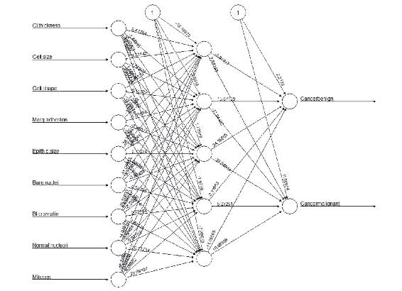

在之前的图中，黑色的线（这些线从输入节点开始）显示了各层之间的连接以及每个连接上的权重，而蓝色的线（这些线从偏置节点开始，偏置节点由数字一区分）显示了每一步中添加的偏置项。可以把偏置看作线性模型的截距。

# 测试网络

我们终于训练好了网络并准备好使用它了。现在，我们可以使用它来进行预测。记住，我们已经将 30%的可用数据保留出来，用它来测试网络。是时候使用它了。

```py
predict_net_test <- compute(net,test_data[,1:9])
```

为了预测数据，我们使用了计算函数，它在给定训练好的神经网络的情况下，计算所有神经元对于特定任意协变量向量的输出。让我们通过打印前十行来查看结果：

```py
> head(predict_net_test$net.result,n=10)
 [,1]                       [,2]
1  0.9999999935589190 0.000000003587253510720848
2  0.0000011083596034 0.999999376764558189911725
4  0.9792070465712006 0.017164709664531079685856
5  0.9999999746453074 0.000000021909385204003642
9  0.9999993390597798 0.000000327298596658228207
14 0.9999999999953126 0.000000000000889095157872
17 0.9999999999989946 0.000000000000442776879837
19 0.0000001409393993 0.999999920006766185309743
21 0.0000024771345578 0.999998553964539960148272
23 0.9999999999999967 0.000000000000001305142352
```

如我们所见，这些是带有若干小数的实数。为了与数据集中包含的数据进行比较，我们必须将它们四舍五入到最接近的整数。为此，我们将使用`round()`函数，它将第一个参数中的值四舍五入到指定的小数位数（默认为零）。

```py
predict_result<-round(predict_net_test$net.result, digits = 0)
```

现在，我们重新构建初始变量。我们不再需要那两个虚拟变量；它们已经完成了它们的任务，但现在我们不再需要它们了。

```py
net.prediction = c("benign", "malignant")[apply(predict_result, 1, which.max)]
```

现在，我们可以构建混淆矩阵来检查分类器的性能。

```py
predict.table = table(data_cleaned$Class[-index], net.prediction)
```

混淆矩阵如下所示：

```py
> predict.table
 net.prediction
 benign malignant
 benign       132         5
 malignant      3        65
```

尽管简单地讲，矩阵告诉我们我们只犯了 8 个错误。有关混淆矩阵的更多信息，我们可以使用`gmodels`包中的`CrossTable()`函数。和往常一样，在加载该包之前，你需要先安装它。

```py
library(gmodels)
CrossTable(x = data_cleaned$Class[-index], y = net.prediction,
 prop.chisq=FALSE)
```

使用`CrossTable()`函数得到的混淆矩阵如下所示：


主对角线上的单元格包含分类器正确分类的样本计数。在左上角的单元格中，标记为`TN`，表示真正负例。205 个值中的 132 个表示癌症为`良性`，且算法正确识别为良性。右下角的单元格，标记为`TP`，表示真正正例，分类器与临床确定的标签一致，认为肿块是`恶性`的。在 205 个预测中，共有 65 个是真正正例。

另一对角线上的单元格包含分类器错误分类的样本计数。左下角的`FN`单元格中的三个例子是伪阴性结果；在这种情况下，预测值为`良性`，但实际上癌症是`恶性`的。这类错误可能非常昂贵，因为它可能会导致患者误以为自己没有癌症，而实际上疾病可能继续扩散。标记为`FP`的单元格将包含伪阳性结果（如果有的话）。这些值出现于模型将癌症错误分类为恶性，而实际上它是良性的时候。虽然这种错误比伪阴性错误危险性较小，但也应避免，因为它可能导致医疗系统的额外财务负担，或者给患者带来额外的压力，因为可能需要额外的检测或治疗。

# 神经网络训练中的早停

训练周期（epoch）是每次从正向传播训练到反向传播更新权重和偏置的过程的度量。训练的往返过程必须在收敛（最小误差项）或预设的迭代次数后停止。

提前停止是一种用于处理模型过拟合的技术（在接下来的几页中会详细讨论过拟合）。训练集被分为两部分：一部分用于训练，另一部分用于验证。我们将`IRIS`数据集分成了两部分：一部分占 75%，另一部分占 25%。

使用训练数据，我们计算梯度并更新网络权重和偏置。第二组数据，即测试或验证数据，用于验证模型的过拟合。如果验证过程中的误差在指定次数的迭代后增加（`nnet.abstol`/`reltol`），则停止训练，并且此时的权重和偏置将被模型使用。这种方法称为*提前停止*。

使用提前停止的神经网络集成泛化误差与通过传统算法训练的最优架构的单一神经网络相当。单个神经网络需要复杂且完美的调优才能在没有提前停止的情况下实现这种泛化。

# 避免模型过拟合

训练数据的拟合使得模型确定权重、偏置以及激活函数值。当算法在某些训练数据集上表现过好时，就说它与该特定数据集过于契合。这会导致当测试数据与训练数据差异较大时，输出值的方差很高。这个高估计方差被称为**过拟合**。预测会受到训练数据影响。

处理神经网络中过拟合的方式有很多种。第一种是正则化，类似于回归。正则化有两种类型：

+   L1 或 Lasso 正则化

+   L2 或岭正则化

+   最大范数约束

+   神经网络中的丢弃法

正则化引入了一个成本项来影响激活函数。它通过引入更多特征到目标函数中来尝试改变大部分系数。因此，它试图将许多变量的系数推向零，并减少成本项。

+   **Lasso 或 L1 正则化或 L1 惩罚**：这有一个惩罚项，使用权重的绝对值之和，使得权重得到优化以减少过拟合。**最小绝对收缩与选择算子**（**LASSO**）引入了惩罚权重，将网络权重压缩到接近零。

+   **L2 惩罚或岭回归**：这与 L1 类似，但惩罚是基于权重的平方，而不是绝对权重之和。较大的权重会受到更多的惩罚。

对于这两种情况，只考虑权重进行优化，偏置（或偏移量或截距）被排除在外。

+   **最大范数约束**：这是一种正则化技术，通过对每个神经元的输入权重向量施加绝对上限，使得投影梯度下降无法修改权重。这意味着参数向量不能失控（即使学习率过高），因为权重的更新始终受到限制。

+   **Dropout**：这是一种防止过拟合的技术。在训练过程中，dropout 通过以某个概率 *p*（一个超参数）保持神经元激活，否则将其设置为零。这意味着在训练过程中某些神经元可能不被激活，因此被丢弃。即便某些信息缺失，网络仍不受影响，并且变得更加准确。这防止了网络过度依赖任何单一神经元或任何小组合的神经元。以下图示说明了 dropout 过程。红色（或深色）神经元为被丢弃的神经元，而神经网络模型在没有这些神经元的情况下依然能够生存，表现出较少的过拟合和更高的准确性：

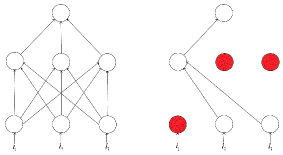

# 神经网络的泛化

泛化的目标是使模型能够拟合训练数据。这是我们在神经网络模型上进行训练的扩展。其目标是最小化模型在训练数据上的平方误差和（例如使用普通最小二乘法），并减少模型的复杂度。

以下是列出的泛化方法：

+   提前停止训练

+   使用不同训练数据重新训练神经网络

    +   使用随机抽样、分层抽样或任何有效的目标数据组合

+   训练多个神经网络并对它们的输出进行平均

# 神经网络模型中的数据缩放

数据缩放或归一化是将模型数据转换为标准格式的过程，从而提高训练的效果、准确性和速度。神经网络中数据缩放的方法类似于任何机器学习问题中的数据归一化方法。

一些简单的数据归一化方法列举如下：

+   **Z-score 归一化**：如前所述，首先计算给定数据的算术平均值和标准差。然后按以下方式计算标准化得分或*Z*得分：


这里，*X* 是数据元素的值，μ 是均值，σ 是标准差。*Z* 得分或标准得分表示数据元素距离均值的标准差数目。由于均值和标准差对异常值敏感，因此此标准化方法对异常值也很敏感。

+   **最小-最大归一化**：此方法为每个数据元素计算以下内容：

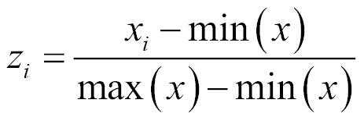

这里，*x*[*i*] 是数据元素，*min(x)* 是所有数据值中的最小值，*max(x)* 是所有数据值中的最大值。此方法将所有分数转换到一个共同的范围 [0, 1]。然而，它对异常值比较敏感。

+   **中位数和 MAD**：中位数和中位数绝对偏差（MAD）归一化通过以下公式计算归一化数据值：

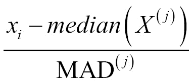

在这里，*x[i]*表示每个数据值。这种方法对离群值和分布极端尾部的点不敏感，因此它是健壮的。然而，这种技术不会保留输入分布，也不会将分数转换为通用的数值范围。

# 使用神经网络的集成预测

另一种正则化方法是结合神经网络模型并对结果进行平均。最终的模型是最准确的。

神经网络集成是通过平均各个模型的结果来做决策的一组神经网络模型。集成技术是一种简单的提高泛化能力的方法，特别是在噪声数据或小数据集导致的情况下。我们训练多个神经网络，并平均它们的输出。

作为示例，我们采用 20 个神经网络解决相同的学习问题，我们调整训练过程中的各种参数，然后将均方误差与它们平均的均方误差进行比较。

以下是遵循的步骤：

1.  数据集已加载并分为训练集和测试集。不同神经网络模型可以使用不同的百分比划分。

1.  通过调整`nnet()`函数中的参数，使用不同的训练集创建多个模型。

1.  所有模型都已训练完毕，并将每个模型中的错误列出。

1.  对测试数据中的每一行计算平均误差，并为每个模型计算均方误差。

1.  将均方误差与均方误差的平均值进行比较。

1.  最佳模型是通过比较选择的，并进一步用于预测。

这种方法允许我们通过调整数据和函数参数来得到模型的最佳设置。我们可以选择集成中的任意数量的模型，并使用 R 进行模型的并行处理。

高度减少过拟合，并在此处得出模型的最佳参数。

# 总结

在本章中，我们介绍了使用 R 训练和可视化一个简单的神经网络。在这里，我们可以改变神经元的数量、隐藏层的数量、激活函数等，以确定模型的训练方式。

在处理回归问题时，最后一层是一个单元，它将给出连续值；对于分类问题，有 n 个终端单元，每个单元表示输出类别及其概率。乳腺癌示例有两个输出神经元，表示神经网络输出的两类值。

我们已经学会了如何使用神经网络模型训练、测试和评估数据集。我们还学会了如何在 R 环境中可视化神经网络模型。我们涵盖了早停、避免过拟合、神经网络的泛化以及神经网络参数的缩放等概念。
