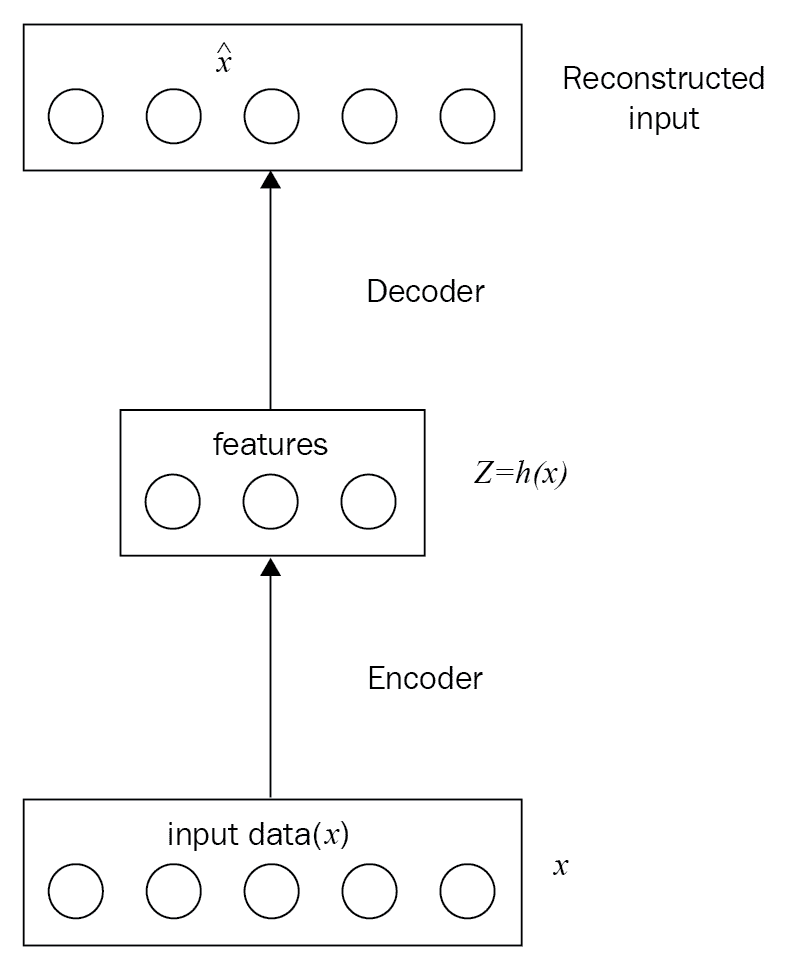
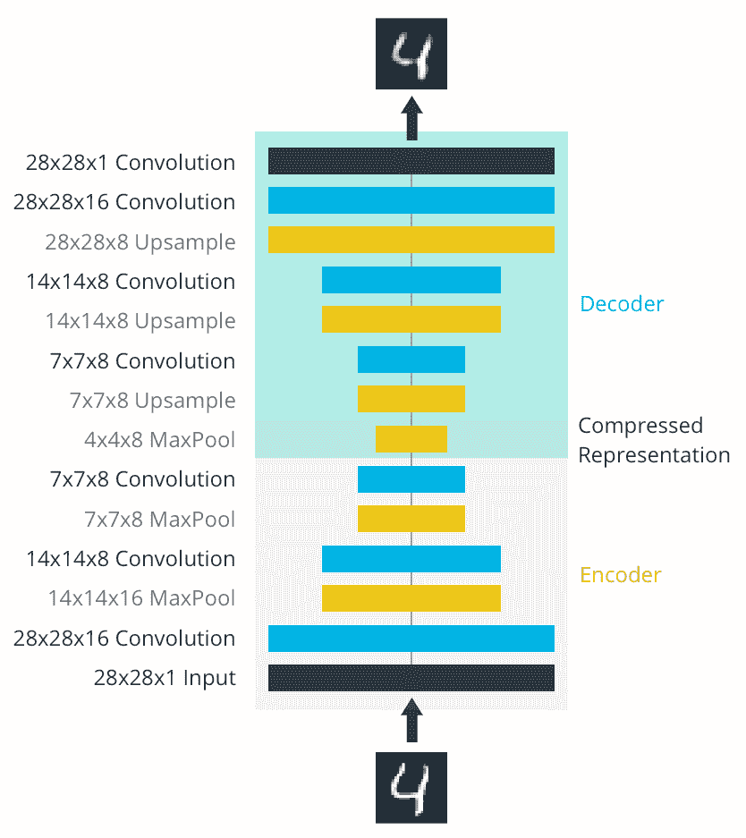

# 自编码器在卷积神经网络（CNN）中的应用

在本章中，我们将覆盖以下主题：

+   自编码器介绍

+   卷积自编码器

+   自编码器的应用

+   一个压缩的例子

# 自编码器介绍

自编码器是一个普通的神经网络，是一种无监督学习模型，它接受输入并在输出层产生相同的输入。因此，训练数据中没有相关标签。一般来说，自编码器由两个部分组成：

+   编码器网络

+   解码器网络

它从无标签的训练数据中学习所有必需的特征，这被称为低维特征表示。在下图中，输入数据（*x*）通过编码器传递，编码器生成输入数据的压缩表示。从数学角度来看，在方程式中，*z = h(x)*，*z*是特征向量，通常比*x*的维度更小。

然后，我们将从输入数据中生成的特征传递通过解码器网络，以重建原始数据。

编码器可以是一个全连接神经网络，也可以是一个**卷积神经网络**（**CNN**）。解码器也使用与编码器相同类型的网络。在这里，我们通过卷积神经网络（ConvNet）解释并实现了编码器和解码器功能：

损失函数：*||x - x||²*

在这个网络中，输入层和输出层的尺寸相同。

# 卷积自编码器

卷积自编码器是一个神经网络（无监督学习模型的特殊情况），经过训练后能够在输出层重建输入图像。图像通过编码器传递，编码器是一个卷积神经网络（ConvNet），它生成图像的低维表示。解码器是另一个样本卷积神经网络，它接收这个压缩后的图像并重建原始图像。

编码器用于压缩数据，解码器用于重建原始图像。因此，自编码器可以用于数据压缩。压缩逻辑是特定于数据的，这意味着它是从数据中学习的，而不是预定义的压缩算法，如 JPEG、MP3 等。自编码器的其他应用包括图像去噪（从损坏的图像中生成更清晰的图像）、降维和图像搜索：

这与普通的卷积神经网络（ConvNets）或神经网络的不同之处在于，输入尺寸和目标尺寸必须相同。

# 应用

自编码器用于降维或数据压缩，以及图像去噪。降维反过来有助于提高运行时性能并减少内存消耗。图像搜索在低维空间中可以变得非常高效。

# 一个压缩的例子

网络架构包括一个编码器网络，这是一个典型的卷积金字塔。每个卷积层后面跟着一个最大池化层；这减少了层的维度。

解码器将输入从稀疏表示转换为宽度较大的重建图像。网络的示意图如下所示：

编码器层的输出图像大小为 4 x 4 x 8 = 128。原始图像大小为 28 x 28 x 1 = 784，因此压缩后的图像向量大约是原始图像大小的 16%。

通常，你会看到使用反卷积（transposed convolution）层来增加层的宽度和高度。它们的工作方式与卷积层几乎完全相同，只不过是反向的。输入层的步幅（stride）在反卷积层中会变得更大。例如，如果你有一个 3 x 3 的卷积核，输入层的 3 x 3 区域在卷积层中将被缩小为一个单位。相比之下，输入层的一个单位在反卷积层中将被扩展成一个 3 x 3 的区域。TensorFlow API 为我们提供了一个简单的方式来创建这些层：`tf.nn.conv2d_transpose`，点击这里，[`www.tensorflow.org/api_docs/python/tf/nn/conv2d_transpose`](https://www.tensorflow.org/api_docs/python/tf/nn/conv2d_transpose)。

# 总结

我们以简短的自编码器介绍开始了本章，并在卷积神经网络（ConvNets）的帮助下实现了编码器和解码器功能。

然后，我们转向卷积自编码器，并学习它们与常规卷积神经网络和神经网络的不同之处。

我们通过一个例子详细讲解了自编码器的不同应用，并展示了自编码器如何提高低维空间中图像搜索的效率。

在下一章中，我们将研究使用卷积神经网络（CNNs）进行物体检测，并了解物体检测与物体分类的区别。
