# 使用随机森林进行预测

在本章中，我们将讨论使用随机森林的分类技术。我们将像上一章那样使用 scikit-learn。我们将展示如何使用描述性属性预测鸟类物种，并在其上应用混淆矩阵。

以下是详细的主题列表：

+   分类与评估技术

+   使用随机森林预测鸟类物种

+   混淆矩阵

# 随机森林

随机森林是决策树的扩展，是一种集成方法。

集成方法通过构建多个分类器并独立运行每个分类器来实现高准确性。当一个分类器做出决策时，可以利用最常见的决策和平均决策。如果我们使用最常见的方法，这称为**投票**。

这是一个描述集成方法的图示：

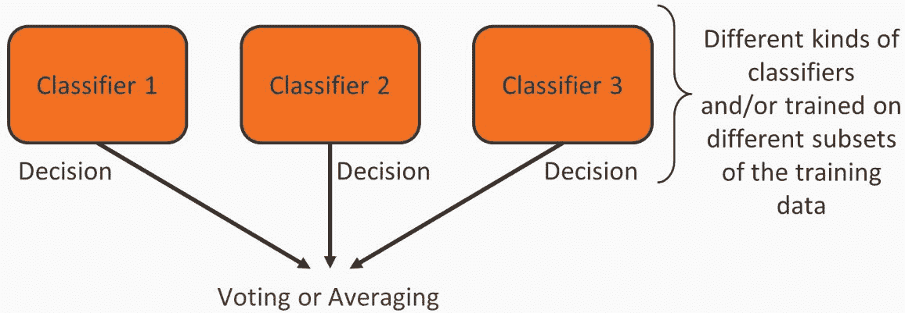

你可以把每个分类器看作是专门针对数据的独特视角。每个分类器可能是不同类型的。例如，你可以将决策树、逻辑回归和神经网络结合起来，或者分类器可能是相同类型的，但训练于不同的训练数据部分或子集。

随机森林是决策树的集合或集成。每棵树都在属性的随机子集上进行训练，如下图所示：

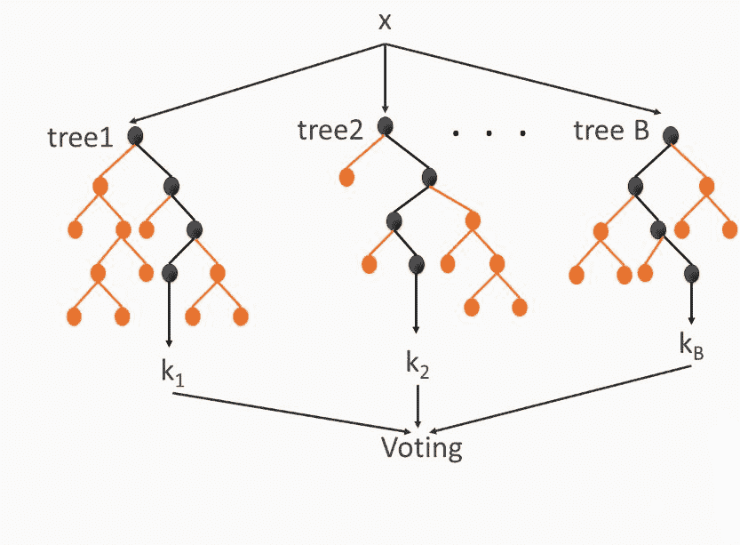

这些决策树是典型的决策树，但它们有很多棵。与单棵决策树相比，特别是在随机森林中，区别在于每棵树仅允许查看一些属性，通常这些属性的数量相对于可用的总属性数量较少。每棵树都专门针对这些属性。这些专门化的树被收集起来，每棵树都会为其预测投票。获得最多投票的结果就是最终的随机森林预测结果。

# 随机森林的使用

当属性足够多以构建树且准确性至关重要时，我们应该考虑使用随机森林。当树的数量较少时，与单一决策树相比，模型的可解释性较差。如果可解释性很重要，应该避免使用随机森林，因为如果树的数量过多，模型会非常庞大，并且在训练和预测过程中可能需要大量内存。因此，资源有限的环境可能无法使用随机森林。接下来的部分将解释如何使用随机森林预测鸟类物种。

# 使用随机森林预测鸟类物种

在这里，我们将使用随机森林来预测鸟类的物种。我们将使用加州理工学院和加州大学圣地亚哥分校的数据集（[`www.vision.caltech.edu/visipedia/CUB-200-2011.html`](http://www.vision.caltech.edu/visipedia/CUB-200-2011.html)），其中包含来自 200 种不同鸟类的大约 12,000 张照片。在这里，我们不会查看图片，因为那需要用到**卷积神经网络**（**CNN**），这将在后续章节中讲解。CNN 可以比随机森林更好地处理图片。相反，我们将使用鸟类的属性，如大小、形状和颜色。

这里是数据集中的一些物种：

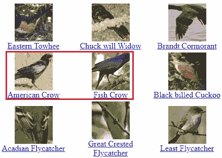

一些鸟类，例如**美洲乌鸦**和**鱼乌鸦**，几乎无法区分，至少从视觉上看是这样的。每张照片的属性，如颜色和大小，实际上是由人类标注的。加州理工学院和加州大学圣地亚哥分校使用了亚马逊机械土耳其平台的人工劳动力来标注这个数据集。研究人员通常使用机械土耳其平台，这是一个网站服务，用户每标注一张照片就能获得少量报酬，用以通过人类的直觉而非机器预测来改善数据集。

如果你有自己的数据集，需要大量人工标注，或许可以考虑花钱通过机械土耳其平台来完成这个任务。

这是单张照片及其标签的示例：

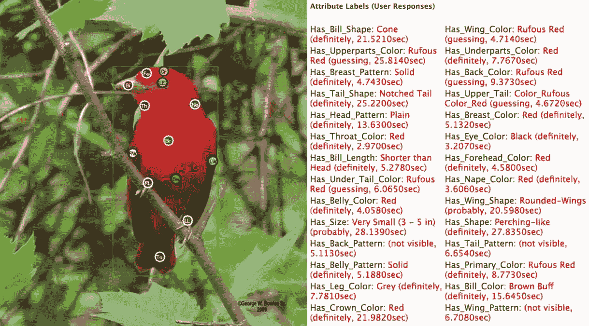

[夏季山雀的页面](http://www.vision.caltech.edu/visipedia-data/CUB-200-2011/browse/Summer_Tanager.html)

我们可以看到，夏季山雀被标记为拥有红色喉部、固态腹部花纹、栖息形态等特征。数据集还包括每个人决定标签所花的时间以及他们对标签决定的信心，但我们暂时不打算使用这些信息。

数据被分割成多个文件。在进入代码之前，我们将讨论这些文件：

`classes.txt`文件显示了带有鸟类物种名称的类 ID。`images.txt`文件显示了图像 ID 和文件名。每张照片的物种信息存储在`image_class_labels.txt`文件中，该文件将类 ID 与图像 ID 关联。

`attributes.txt`文件列出了每个属性的名称，这对于我们来说最终并不是很重要。我们只需要属性的 ID：

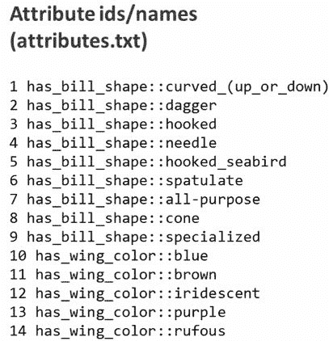

最重要的文件是`image_attribute_labels.txt`：

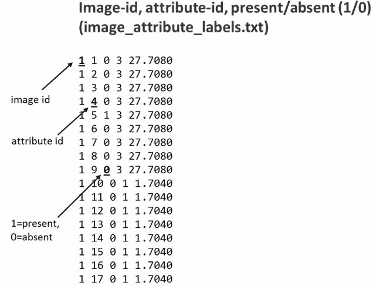

它通过二进制值将每个图像与其属性连接起来，该值表示该属性是否存在。每行数据由机械土耳其平台的用户生成。

现在，让我们看一下代码：

我们将首先加载包含所有图像属性标签的 CSV 文件。

需要注意以下几点：

+   所有值都以空格分隔

+   没有标题列或行

+   忽略诸如`error_bad_lines= False`和`warn_bad_lines= False`的消息或警告。

+   使用列`0`、`1`和`2`，它们分别是图像 ID、属性 ID，以及存在或不存在的值。

你不需要担心选择属性的过程和所花费的时间。

在数据集的顶部是这样的：

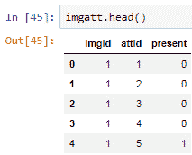

图像 ID 为 1 的图像没有属性 1、2、3 或 4，但它有属性 5。

形状将告诉我们有多少行和列：

它有 370 万行和三列。这不是你想要的实际公式。你希望属性是列，而不是行。

因此，我们必须使用透视操作，就像 Excel 中的透视方法一样：

1.  对图像 ID 进行透视操作，为每个图像 ID 创建一行。图像 1 将只有一行数据。

1.  将属性转化为独立的列，值将是 1 或 2。

现在我们可以看到每个图像 ID 只有一行，每个属性都有一个单独的列，值为 1 和 2：

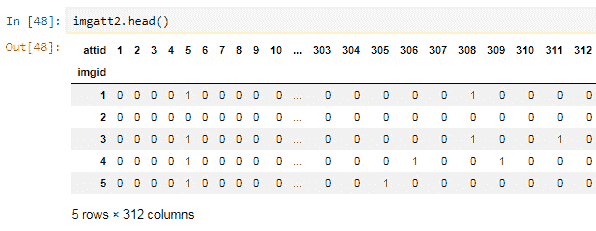

让我们将这些数据输入到随机森林中。在之前的示例中，我们有 312 列和 312 个属性，最终大约有 12,000 张图像或 12,000 个不同的鸟类示例：

现在，我们需要加载答案，比如它是否是鸟类，属于哪个物种。由于这是一个图像分类标签文件，分隔符是空格。没有标题行，两个列分别是`imgid`和`label`。我们将使用`set_index('imgid')`，以便产生与`imgatt2.head()`相同的结果，其中行由图像 ID 标识：

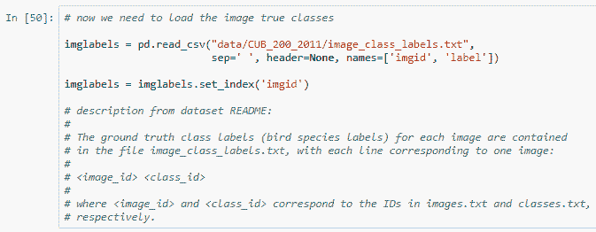

它的样子如下：

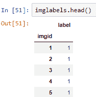

`imgid`列的值为`1`、`2`、`3`、`4`和`5`，它们都标记为`1`。它们都位于文件的顶部。如所见，大约有 12,000 行数据，这样的规模非常合适：

这与属性数据的数量相同。我们将使用连接操作。

在连接过程中，我们将使用图像 ID 的索引来连接两个数据框。实际上，我们将获得的是标签被附加为最后一列。

我们现在将进行洗牌，然后分离出属性。换句话说，我们想从标签中去除标签。所以，这里是属性，前 312 列和最后一列是标签：

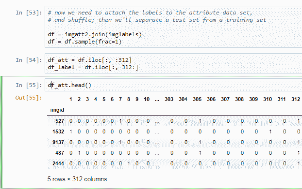

洗牌后，第一行是图像 527，第二行是图像 1532，以此类推。标签数据中的属性一致。在第一行，它是图像 527，对应的是编号 10。你不知道它是哪种鸟，但它属于某个类别，并且有这些属性。最终，它已经是正确的格式。我们需要进行训练和测试集划分。

总共有 12,000 行数据，所以我们取前 8,000 行作为训练集，剩下的 4,000 行作为测试集。我们将使用`RandomForestClassifier`来获取答案：

最大特征显示每棵树可以查看的不同列的数量。

比如说，*看两个属性*，这可能不足以真正搞清楚是哪只鸟。有些鸟类是独特的，因此可能需要更多的属性。稍后如果我们设置`max_features=50`，而估算器的数量表示创建的树的数量。实际的拟合过程会建立它。

让我们预测几个案例。我们将使用训练集前五行的属性，预测物种编号 10、28、156、10 和 43。经过测试，我们得到了 44%的准确率：

即使是 44%的准确率也不是最好的结果。毕竟有 200 个物种，因此 0.5%的准确率比随便猜测要好得多。

# 为数据制作混淆矩阵

让我们制作一个混淆矩阵，看看数据集混淆了哪些鸟类。来自 scikit-learn 的`confusion_matrix`函数将生成矩阵，但它是一个相当大的矩阵：

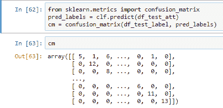

200 乘 200 这种数字形式不太容易理解。

这里有一些来自 scikit-learn 文档的代码，它可以帮助我们绘制矩阵并在矩阵中加上颜色：

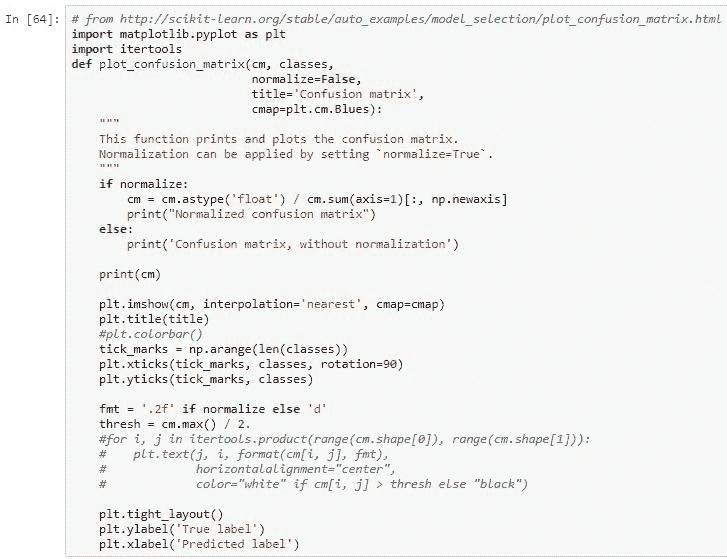

我们需要矩阵中鸟类的实际名称，以便知道哪些物种彼此之间产生了混淆。因此，让我们加载类别文件：

绘制矩阵。这是该数据集的混淆矩阵：

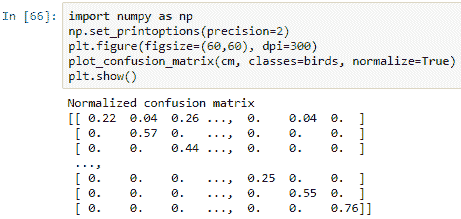

输出如下所示：

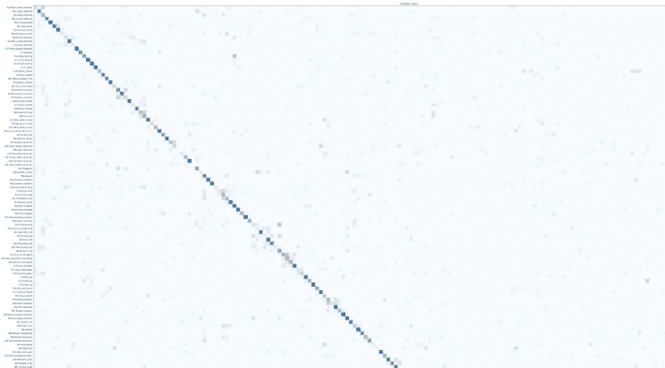

输出是不可读的，因为有 200 行和 200 列。但如果我们单独打开它并开始放大，在*y*轴上你会看到实际的鸟类，在*x*轴上，你会看到预测的鸟类：

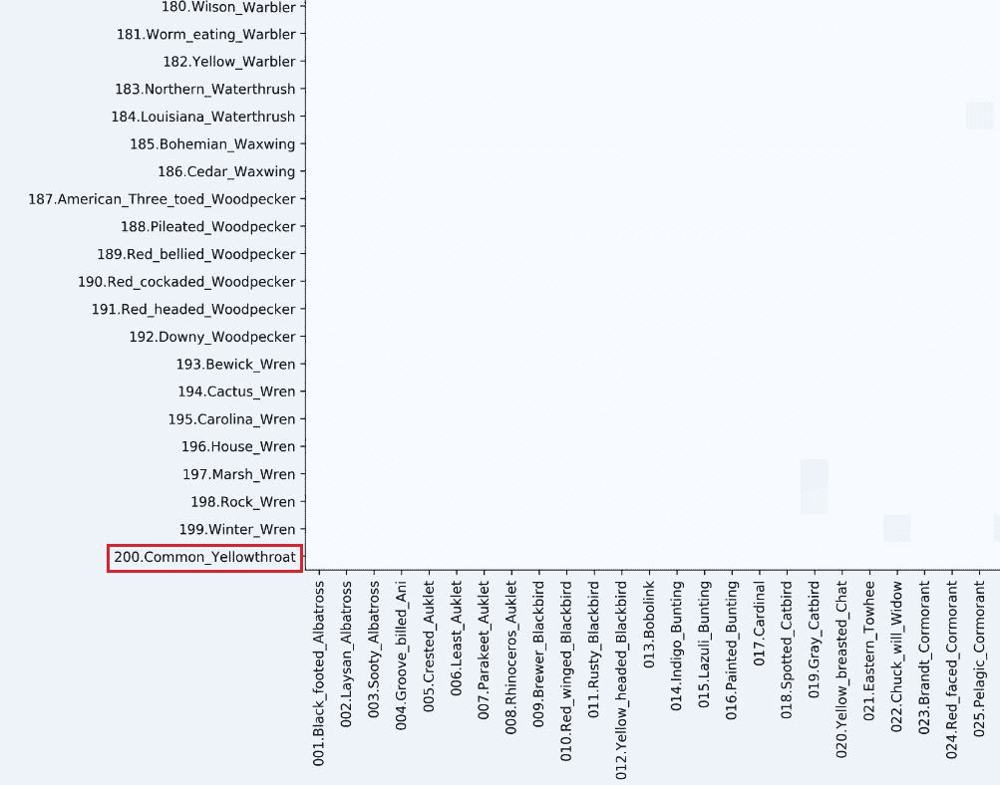

例如，常见的黄喉是正确的。从下图可以看出，常见黄喉与黑脚信天翁被混淆。当我们放大时，可以看到这种混淆：

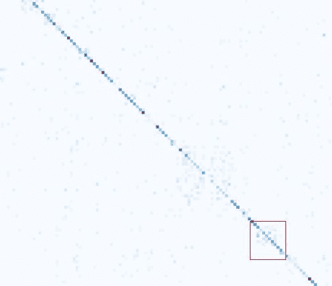

这就像是常见的黄喉和黑脚信天翁之间的混淆方块。有些特征是海鸥，例如北极海鸥、黑海鸥、里海海鸥和普通海鸥。海鸥显然很容易混淆，因为它们看起来相似。

这个集数据也有些混淆：

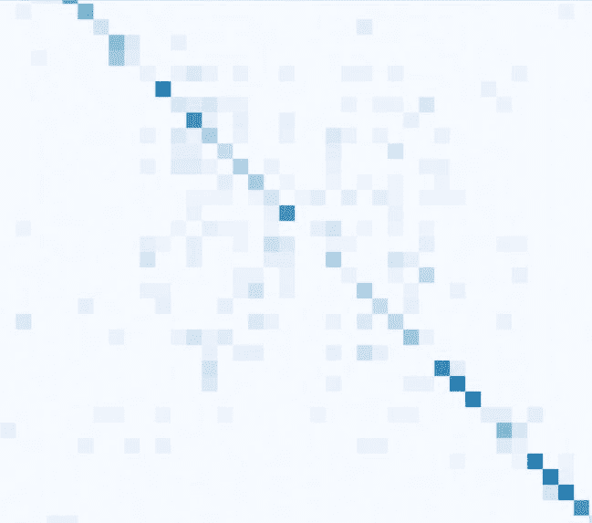

这是关于麻雀的数据集。混淆矩阵告诉我们我们预期的结果，即，看起来相似的鸟类会互相混淆。正如之前的截图所见，这里有一些混淆的小方块。

在大多数情况下，你不希望把信天翁和常见黄喉混淆，因为这意味着数据集根本不知道自己在做什么。

由于鸟类的名称已经排序，混淆的方块就较少。我们可以将其与简单的决策树进行比较：

这里的准确率是 27%，低于之前 44%的准确率。因此，决策树效果较差。如果我们使用**支持向量机**（**SVM**），也就是神经网络方法，输出为 29%：

随机森林仍然更好。

我们进行交叉验证，以确保我们以不同的方式划分训练集和测试集。输出结果仍然是随机森林为 44%，决策树为 25%，SVM 为 27%，如下图所示：

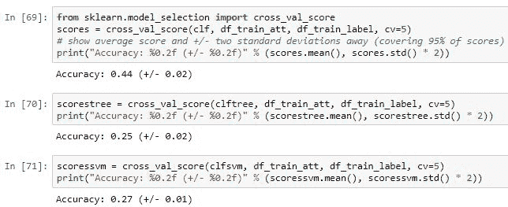

随机森林表现最优，因为我们在随机森林中有一些选项和问题。

例如，每棵树能问多少个不同的问题？它查看多少个属性，又有多少棵树？嗯，有很多参数需要查看，所以我们不妨做个循环，把它们都试一遍：

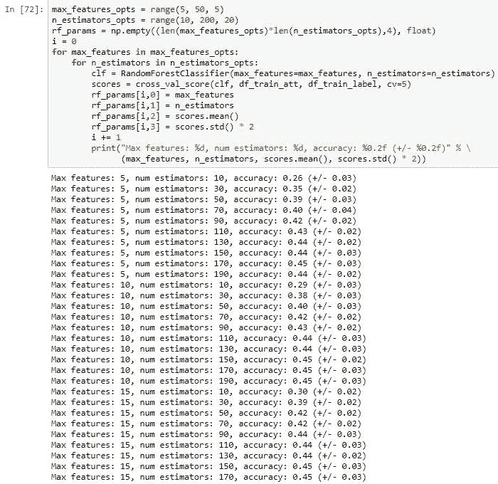

这些是所有的准确率，但最好通过图表来可视化，如下所示：

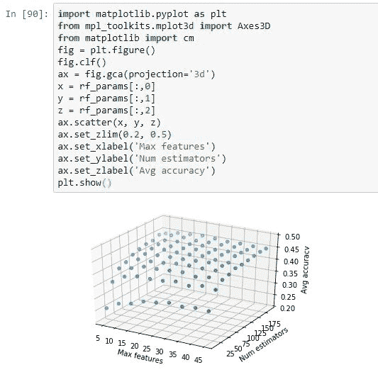

我们可以看到，增加树的数量可以得到更好的结果。此外，如果能够查看更多的特征，增加特征数量也能带来更好的结果，但最终，如果特征数量大约在 20 到 30 之间，树的数量在 75 到 100 棵之间，那时准确率大约能达到 45%，这是你能得到的最佳结果。

# 总结

在本章中，我们学习了随机森林并对鸟类物种进行了分类。接着，我们讨论了混淆矩阵和不同的图表，这些图表基于随机树、决策树和 SVM 给出了结果。

在下一章中，我们将探讨使用词袋模型和 Word2Vec 模型进行评论分类。
